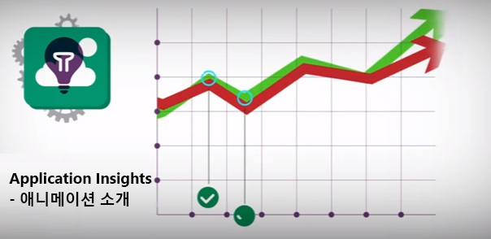

<properties 
	pageTitle="Application Insights 자습서 | Microsoft Azure" 
	description="라이브 웹 응용 프로그램의 사용 현황 및 성능을 추적합니다. 문제를 감지, 심사 및 진단합니다. 지속적인 모니터링을 통해 사용자와 더불어 성공할 수 있도록 개선합니다." 
	services="application-insights" 
    documentationCenter=""
	authors="alancameronwills" 
	manager="douge"/>

<tags 
	ms.service="application-insights" 
	ms.workload="tbd" 
	ms.tgt_pltfrm="ibiza" 
	ms.devlang="na" 
	ms.topic="article" 
	ms.date="07/11/2016" 
	ms.author="awills"/>
 
# Application Insights - 자습서

[Visual Studio Application Insights](app-insights-get-started.md)는 라이브 웹 응용 프로그램을 모니터링하는 확장 가능한 분석 서비스입니다. 이 서비스를 사용하면 성능 문제를 감지 및 진단하고 실제로 앱을 사용하여 작업하는 사용자를 이해할 수 있습니다. 개발자가 성능 및 가용성을 지속적으로 향상시킬 수 있도록 설계되었습니다. .NET, Node.js 및 J2EE, 호스팅된 온-프레미스 또는 클라우드의 다양한 플랫폼에서 앱과 함께 사용합니다.

[개발하는 동안 코드에 SDK를 추가](app-insights-asp-net.md)하여 시작하거나 [런타임 시 앱을 계측](app-insights-monitor-performance-live-website-now.md)할 수 있습니다.

응용 프로그램에서 수집된 원격 분석 데이터는 빠른 진단과 분석을 위한 강력한 도구와 직관적인 보기가 가능한 [Azure 포털](https://portal.azure.com/)에 저장되고 분석됩니다.

[소개 애니메이션을 살펴보겠습니다](https://www.youtube.com/watch?v=fX2NtGrh-Y0).

## 작동 방법

응용 프로그램에 작은 계측 패키지를 설치하고 Microsoft Azure 포털에서 Application Insights 리소스를 설정합니다. 이 계측 기능이 앱을 모니터링하여 포털에 원격 분석 데이터를 보냅니다. 포털에서 통계 차트를 표시하고 모든 문제를 진단하는 데 도움이 되는 강력한 검색 도구를 제공합니다.

Application Insights에는 다양한 유형의 원격 분석 데이터를 수집하는 여러 개의 [표준 계측 모듈](app-insights-configuration-with-applicationinsights-config.md)이 있습니다. 예를 들어 HTTP 요청에 대한 웹앱 응답을 모니터링하는 모듈, 모니터 예외를 모니터링하는 모듈, 종속성, 성능 카운터 등을 위한 모듈이 있습니다.

개발 시에 코드를 계층하는 경우 포털에 원격 분석 데이터를 보내도록 [사용자 지정 코드를 작성](app-insights-api-custom-events-metrics.md)할 수도 있습니다. 사용자 지정 원격 분석은 사용자 스토리를 추적할 때 특히 유용합니다. 문의, 판매량 또는 특정 목표 달성 등의 이벤트를 계산할 수 있습니다.

### 클라이언트 쪽 모니터링

그뿐 아니라 각 웹 페이지에 삽입되는 작은 스크립트 형태를 사용하는 [클라이언트 쪽 계측](app-insights-javascript.md)이 있습니다. 원격 분석은 최종 사용자의 브라우저에서 Azure 포털로 직접 전송됩니다. 이 기능은 페이지 로드 시간, AJAX 호출 및 스크립트 예외를 모니터링합니다. 또한 단추 클릭 또는 기타 이벤트와 같은 사용자 동작을 추적하는 사용자 지정 코드를 작성할 수도 있습니다.

클라이언트 쪽 모니터링은 서버 쪽 모니터링과 함께 또는 별도로 사용될 수 있습니다.

### 오버헤드는 무엇입니까?

앱 성능에 미치는 영향을 매우 작습니다. 추적 호출은 차단되지 않으며, 별도의 스레드로 일괄 처리 및 전송합니다.

## Azure 구독 가져오기

Application Insights는 Microsoft Azure에서 호스트되는 다양한 서비스 중 하나이며, 원격 분석이 분석 및 프레젠테이션을 위해 이 서비스로 전송됩니다. 따라서 다른 작업을 수행하기 전에 [Microsoft Azure](http://azure.com)을 구독해야 합니다. Application Insights의 무료 [가격 책정 계층](https://azure.microsoft.com/pricing/details/application-insights/)을 선택하여 무료로 등록할 수 있습니다.

## 시작

웹앱 모니터링을 시작하는 방법에는 두 가지 있습니다. 본인에게 적합한 방법으로 시작합니다.

|디렉터리 계층 구조에|방법|결과
|---|---|---
| 개발 |코드에 SDK 추가(서버 및/또는 클라이언트)| 개발, 테스트 및 프로덕션 중에 앱 응답 시간 및 실패 비율을 모니터링하고 문제를 진단합니다. 사용자 지정 추적 및 진단 기능을 추가하는 코드를 작성합니다. 
|런타임 |호스트에서 에이전트 실행(온-프레미스 또는 Azure에서. J2EE 또는 ASP.NET) | 응답 시간 및 실패 비율을 모니터링하고 런타임 시 문제를 진단합니다.  코드에 액세스할 필요는 없습니다.

두 가지 방식은 상호 보완적입니다. 최고 수준의 원격 분석을 위해서는 두 방법을 모두 사용하는 것이 좋습니다.

### 런타임에 시작

여러 가지 측면에서 런타임에 앱을 계측하는 것은 가장 간단한 옵션입니다. 코드는 수정하지 않으며, 앱이 배포된 이후에도 설정할 수 있습니다. 원하는 경우 나중에 개발 타임 옵션으로 전환할 수 있습니다.

이 옵션은 다음 측면에서 매우 유용합니다.

* 사용자 지정 원격 분석이 전혀 필요하지 않은 앱. 표준 요청 및 종속성 응답 시간, 실패율, 예외 보고서 및 성능 카운터가 만족스러울 것입니다.
* 몇 가지 문제가 있는 실행 중인 앱 - 몇 가지 빠른 진단 데이터를 입수해야 합니다.

**앱 실행은 어떤 서버에서 실행해야 하나요?**

* **온-프레미스 또는 VM의 IIS**: 서버에 [Application Insights 상태 모니터를 설치](app-insights-monitor-performance-live-website-now.md)합니다. 관리자 액세스 권한이 필요합니다.
* **Azure 웹앱 또는 VM**: 앱 제어판에서 [Application Insights 성능 모니터링을 선택](app-insights-monitor-performance-live-website-now.md#if-your-app-runs-as-an-azure-web-app)합니다.
* **Java**: 서버에 [Java 에이전트를 설치](app-insights-java-live.md)합니다.

Java 옵션을 제외하고, 이러한 도구는 원격 분석을 보려는 위치에서 필요한 Application Insights 리소스를 자동으로 설정합니다.

[Azure 포털](https://portal.azure.com)에 로그인하고 앱에 대한 Application Insights 개요로 이동하면 데이터가 도착하는 것을 확인할 수 있습니다.

나중에 [사용자 지정 원격 분석](app-insights-api-custom-events-metrics.md)을 추가하려는 경우 '개발 중 시작' 경로를 문제 없이 진행할 수 있습니다.

### 개발 중 시작

Application Insights의 모든 기능을 최대한 활용하려면 개발 중에 코드에 적절한 Application Insights SDK를 추가합니다.

SDK를 추가하여 다음을 수행할 수 있습니다.

* 개발 및 테스트 중에 진단 가져오기
* 예외 보고서에 스택 추적 가져오기
* 원격 분석 사용자 지정: 업무 및 진단 목적으로 이벤트 및 메트릭을 계산하고 추적하는 사용자 고유의 코드를 작성합니다.

**어떤 개발 도구를 사용하고 있나요?**

* **Visual Studio 2013 업데이트 2 이상의 ASP.NET** - 메뉴 명령 [웹 프로젝트에 Application Insights 추가](app-insights-asp-net.md)를 사용하거나, 새 프로젝트를 만드는 경우에는 Application Insights 옵션을 선택합니다.
* **Eclipse의 Java** - [Eclipse 추가 기능 사용](app-insights-java-eclipse.md)
* **Java** 및 다른 도구 - [Java SDK 설치](app-insights-java-get-started.md)
* **기타 플랫폼** - [적절한 SDK 설치](app-insights-platforms.md)

대부분의 경우 이 도구는 프로젝트에 SDK를 추가하고 Application Insights 포털에서 리소스를 만든 후 이들을 함께 연결합니다. 그러나 필요한 경우 [Azure에서 새 리소스를 수동으로 만들](app-insights-create-new-resource.md) 수 있습니다.

### 웹 페이지 옵션

서버 코드를 계측할 수 없는 경우에도 웹 페이지는 항상 계측할 수 있습니다.

따라서 사용자는 세션 및 페이지 보기 수, 페이지 로드 성능 데이터, AJAX 호출 응답 시간 및 실패율을 알 수 있습니다. 또한 단추 클릭 또는 선택과 같은 기타 이벤트를 추적하는 코드를 작성할 수도 있습니다. 이러한 기능은 단일 페이지 웹앱에 특히 유용합니다.

* **웹 페이지** - [웹 페이지에 코드 조각을 추가합니다.](app-insights-javascript.md)

## 메트릭 탐색

앱 실행 - 개발 컴퓨터에서 디버그 모드를 사용하거나 서버에 배포한 후 잠시 동안 사용해 봅니다. 그런 후 [Azure 포털](https://portal.azure.com)에 로그인합니다.

앱의 Application Insights 개요 블레이드로 이동합니다.

개요에서는 앱의 작동 상태를 즉시 볼 수 있습니다. 로드(요청 속도 관련)와 앱이 요청에 응답하는 시간을 비교할 수 있습니다. 부하가 높아질 때 응답 시간이 균형에 맞지 않게 증가하면 앱에 더 많은 리소스를 할당할 수 있습니다. 새 빌드를 배포한 후 실패한 응답이 늘어나면 롤백할 수 있습니다.

#### 자세한 정보 얻기

차트를 클릭하여 더 자세한 차트를 표시할 수 있습니다. 예를 들어 서버 응답 시간 차트를 클릭하면 요청 속도, 응답 시간 및 종속 관계 항목(즉, 앱이 호출하는 서비스)의 응답 시간을 보여 주는 차트가 표시됩니다.

종속성 차트는 앱이 사용하는 데이터베이스 및 REST API가 잘 응답하는지 또는 지연을 유발하지 않는지를 확인하는 데 도움이 되기 때문에 유용합니다.

#### 차트 사용자 지정

다음 차트 중 하나를 편집해 보세요. 예를 들어 서버 인스턴스 컬렉션에서 웹앱을 실행하는 경우 여러 다양한 서버 인스턴스에서의 응답 시간을 비교할 수 있습니다.

1. 차트 위로 마우스를 가져간 후 편집을 클릭합니다.
2. 메트릭을 선택합니다. 하나의 차트에 여러 메트릭이 표시될 수 있지만 특정 조합인 경우에만 가능합니다. 따라서 원하는 메트릭을 선택하기 전에 다른 메트릭을 선택 취소해야 할 수 있습니다.
3. Group-By를 사용하여 속성에 따라 메트릭을 분할합니다. 이 예제에서는 다른 응답 시간을 별도의 줄에 표시합니다.

    메트릭에 대해 올바른 속성을 선택해야 합니다. 그러지 않으면 차트에 데이터가 표시되지 않습니다.
4. 차트 종류를 선택합니다. 영역형 및 가로 막대형 차트에는 집계 유형이 '합계'일 때 적합한 누적형 디스플레이가 표시됩니다.

[메트릭 탐색에 대한 자세한 정보](app-insights-metrics-explorer.md).

## 인스턴스 데이터 검색

문제를 조사하려면 특정 이벤트 인스턴스를 검사하는 것이 유용합니다.

메트릭 차트를 클릭하면 관련 필터 및 시간 범위를 사용하여 인스턴스 데이터를 검색할 수 있습니다. 예를 들어, 서버 요청 개수를 클릭하면 개별 요청 보고서가 표시됩니다.

또는 개요 페이지의 검색에서 인스턴스 데이터로 직접 이동할 수도 있습니다.

필터를 사용하여 특정 유형의 이벤트 또는 선택한 속성 값만 나타낼 수 있습니다.

"..."를 클릭하여 속성의 전체 목록을 보거나, 동일한 요청과 관련된 다른 이벤트를 엽니다. 이 예제에서는 실패한 요청에 예외 보고서가 연결되어 있습니다.

이벤트(이 예제에서는 관련된 예외)를 열고 작업 항목을 만들 수 있습니다(Visual Studio Team Services를 사용하여 작업을 추적하는 경우).
 

## 분석

[분석](app-insights-analytics.md)은 특정 문제를 확인하거나 통계 정보를 수집하기 위해 원격 분석 데이터에 대해 SQL과 유사한 쿼리를 작성할 수 있는 훨씬 더 강력한 검색 및 분석 기능입니다.

자습서 창을 열어 쿼리 예제를 보고 데이터에 대해 실행해볼 수도 있고 좀 더 자세한 [자습서 연습](app-insights-analytics-tour.md) 내용을 읽어볼 수도 있습니다. Intellisense는 사용할 수 있는 쿼리를 표시합니다. 또한 [전체 언어 참조](app-insights-analytics-reference.md)를 제공합니다.

쿼리는 일반적으로 요청, 예외, 종속성 등의 원격 분석 스트림 이름으로 시작합니다. 왼쪽의 스키마를 열면 사용 가능한 원격 분석 스트림 목록이 표시됩니다. 쿼리는 `where`(부울 필터) 또는 `project`(새 속성 계산)와 같은 [쿼리 작업](app-insights-analytics-reference.md#queries-and-operators) 파이프라인입니다. `summarize` [는 인스턴스를 집계](app-insights-analytics-tour.md#aggregate-groups-of-rows)하고, 사용자가 정의한 함수별로 그룹화한 다음 그룹화된 데이터에 대해 집계 함수를 적용합니다.

결과는 [테이블 또는 다양한 종류의 차트로 렌더링](app-insights-analytics-tour.md#charting-the-results)될 수 있습니다.

## 사용자 지정 원격 분석

Application Insights를 설치하여 얻을 수 있는 기본 제공 원격 분석을 사용하여 앱 및 종속 관계 항목(즉, SQL, REST API에 대한 앱 호출)에 대한 요청 둘 다에 대한 개수, 성공률, 응답 시간을 분석할 수 있습니다. 예외 추적 및(서버의 상태 모니터 사용) 시스템 성능 카운터도 얻을 수 있습니다. 웹 페이지에 클라이언트 조각을 추가하면 페이지 보기 수 및 로드 시간, 클라이언트 예외, AJAX 호출 성공, 응답 속도를 얻게 됩니다.

이러한 모든 원격 분석을 수행하면 앱의 성능 및 사용에 대한 많은 정보를 얻을 수 있습니다. 그렇지만 이것으로 충분하지 않은 경우가 있습니다. 성능을 조정할 수 있도록 큐의 길이를 모니터링하거나, 매출을 계산하고 위치별로 분할하려고 할 수도 있습니다. 클라이언트 쪽에서는 사용자 환경을 조정할 수 있도록 사용자가 특정 단추를 클릭하는 빈도를 확인하려고 할 수도 있습니다.

[Application Insights API](app-insights-api-custom-events-metrics.md)는 고유의 사용자 지정 이벤트 및 메트릭을 보낼 수 있도록 `TrackEvent(name)` 및 `TrackMetric(name, value)` 호출을 제공합니다. 클라이언트 쪽에도 동일한 호출이 있습니다.

예를 들어 웹 페이지가 단일 페이지 게임 앱인 경우 사용자가 게임에서 이기거나 질 때 기록할 수 있는 줄을 적합한 위치에 삽입할 수 있습니다.

    
    appInsights.trackEvent("WinGame");
    ...
    appInsights.trackEvent("LoseGame");

그런 후 사용자 지정 이벤트 수가 차트로 만든 후 이벤트 이름별로 분할할 수 있습니다.

### 로그 추적

진단 용도로 실행 추적에 사용할 수 있는 사용자 지정 이벤트 `TrackTrace(message)`가 있습니다. 검색 및 분석 기능에서 이벤트 이름보다 길 수 있는 메시지 내용을 검색할 수 있습니다.

이미 Log4Net, NLog, Log4J 또는 System.Diagnostic.Trace 같은 로깅 프레임워크를 사용하고 있는 경우 Application Insights에서 해당 추적 호출이 캡처된 후 다른 원격 분석 데이터와 함께 표시됩니다. Visual Studio 도구는 해당 SDK 모듈을 자동으로 추가합니다.

## 대시보드

많은 응용 프로그램이 웹 서비스 및 하나 이상의 백 엔드 프로세서와 같은 여러 구성 요소로 이루어져 있습니다. 각 구성 요소는 별도의 Application Insights 리소스에 의해 모니터링됩니다. 시스템이 Azure에서 실행되는 경우 이러한 이벤트 허브 및 기계 학습과 같은 서비스도 사용하고 모니터링할 수 있습니다.

전체 시스템을 모니터링하려면 다른 앱에서 가장 흥미로운 차트를 선택한 후 Azure [대시보드](app-insights-dashboards.md)에 고정하여 전체 시스템을 계속 주시할 수 있습니다.

실제로 여러 대시보드를 만들 수 있습니다. 예를 들어 일반 시스템 상태 모니터링을 위한 팀룸 대시보드, 다양한 기능 사용에 중점을 두는 디자인 대시보드, 테스트 중인 구성 요소를 위한 별도 대시보드 등을 둘 수 있습니다.

리소스와 마찬가지로 대시보드도 팀 구성원 간에 공유할 수 있습니다.

## Visual Studio에서 개발

Visual Studio를 사용하여 앱을 개발하는 경우 기본 제공되는 몇 가지 Application Insights 도구를 찾을 수 있습니다.

### 진단 검색

검색 창에서는 기록된 이벤트를 보여줍니다. (Azure에 로그인한 경우 Application Insights를 설정할 때 포털에서 동일한 이벤트를 검색할 수 있습니다.)

자유 텍스트 검색은 이벤트의 필드에서 작동합니다. 예를 들어 페이지의 URL의 일부 또는 클라이언트 시티와 같은 속성의 값 또는 추적 로그에서 특정 단어를 검색합니다.

이벤트를 클릭하여 자세한 속성을 확인합니다.

또한 관련된 항목 탭을 열어 실패한 요청 또는 예외를 진단할 수 있습니다.

### 진단 허브

진단 허브(Visual Studio 2015 이상)는 Application Insights 서버 원격 분석을 생성되는 대로 보여줍니다. Azure 포털에서 리소스에 연결하지 않고 SDK를 설치하도록 선택한 경우 작동합니다.

### 예외

[예외 모니터링을 설정](app-insights-asp-net-exceptions.md)한 경우 예외 보고서는 검색 창에 표시됩니다.

예외를 클릭하여 스택 추적을 가져옵니다. 앱의 코드가 Visual Studio에서 열린 경우 스택 추적에서 코드의 관련된 줄까지 클릭할 수 있습니다.

또한 각 메서드의 코드 렌즈 줄에 지난 24시간 동안 Application Insights에 의해 기록된 예외 수를 표시합니다.

### 로컬 모니터링

(Visual Studio 2015 업데이트 2에서) Application Insights 포털에 원격 분석을 보내도록 SDK를 구성하지 않은 경우(따라서 ApplicationInsights.config에 계측 키가 없음) 최신 디버깅 세션의 원격 분석이 진단 창에 표시됩니다.

이전 버전의 앱을 이미 게시한 경우에 바람직합니다. 게시된 앱의 Application Insights 포털에서 원격 분석과 디버깅 세션의 원격 분석을 혼합하려 하지 않습니다.

포털에 원격 분석을 보내기 전에 디버깅하려는 [사용자 지정 원격 분석](app-insights-api-custom-events-metrics.md)이 있는 경우에도 유용합니다.

* *우선 Application Insights를 완전히 구성하여 포털에 원격 분석을 전송했습니다. 하지만 이제 Visual Studio에서만 원격 분석을 확인하려 합니다.*

 * 검색 창 설정에서 앱이 포털에 원격 분석을 전송하는 경우 로컬 진단을 검색하는 옵션이 있습니다.
 * 포털에 전송되는 원격 분석을 중지하려면 ApplicationInsights.config에서 `<instrumentationkey>...` 줄을 주석으로 처리합니다. 원격 분석을 포털에 다시 보낼 준비가 되면 주석 처리를 제거합니다.

## 추세

추세는 시간이 지남에 따라 앱의 동작 방식을 시각화하는 도구입니다.

Application Insights 도구 모음 단추 또는 Application Insights 검색 창에서 **원격 분석 추세 탐색**을 선택합니다. 시작하려면 일반적인 5개의 쿼리 중 하나를 선택합니다. 원격 분석 유형, 시간 범위 및 기타 속성에 따라 서로 다른 데이터 집합을 분석할 수 있습니다.

데이터에서 잘못된 부분을 찾으려면 "유형 보기" 드롭다운에서 비정상 옵션 중 하나를 선택합니다. 창의 아래쪽에서 필터링 옵션을 사용하면 쉽게 원격 분석의 특정 하위 집합을 쉽게 찾을 수 있습니다.

## 새 빌드 해제

### 라이브 메트릭 스트림

라이브 메트릭 스트림은 거의 실시간에 가까운 1초의 대기 시간으로 응용 프로그램 메트릭을 바로 표시합니다. 이 기능은 새 빌드를 해제하고 예상한 대로 작동하는지 확인하려고 할 때 또는 실시간으로 인시던트를 조사할 때 특히 유용합니다.

메트릭 탐색기와 달리, 라이브 메트릭 스트림은 고정된 메트릭 집합을 표시합니다. 해당 데이터는 차트에 있는 동안만 지속된 후 삭제됩니다.

### 주석

메트릭 차트의 [릴리스 주석](app-insights-annotations.md)은 새 빌드를 배포한 위치를 표시합니다. 릴리스 주석으로 변경 내용이 응용 프로그램의 성능에 영향을 주는지 여부를 쉽게 확인할 수 있습니다. [Visual Studio Team Services 빌드 시스템](https://www.visualstudio.com/ko-KR/get-started/build/build-your-app-vs)에서 자동으로 만들 수 있고 사용자가 [PowerShell에서 직접 만들 수도](#create-annotations-from-powershell) 있습니다.

릴리스 주석은 클라우드 기반 빌드 기능 및 Visual Studio Team Services 릴리스 서비스입니다.

## 경고

앱에 오류가 있는 경우 즉시 알고 싶을 것입니다.

Application Insights는 전자 메일을 통해 전달되는 세 가지 유형의 경고를 제공합니다.

### 사전 진단 

[사전 진단](app-insights-nrt-proactive-diagnostics.md)**은 자동으로 설정되므로 구성할 필요가 없습니다. 사이트에 충분한 트래픽의 있는 경우, 하루 중에 특정 시간 동안 실패한 요청 수가 이상하게 증가하거나 요청 속도가 증가하는 경우 전자 메일을 받게 됩니다. 이러한 경고에는 진단 정보가 포함됩니다.

샘플 경고는 다음과 같습니다.

또 다른 유형의 사전 검색 기능은 위치, 클라이언트 운영 체제 또는 브라우저 유형과 같은 요소와 실패 간의 상관 관계를 찾아냅니다.

### 메트릭 경고

어떤 메트릭이 실패 수, 메모리, 페이지 보기 등의 임계값을 일정 기간 동안 초과하면 그 사실을 알려주도록 [메트릭 경고](app-insights-alerts.md)를 구성할 수 있습니다.

### Availability

[가용성 웹 테스트](app-insights-monitor-web-app-availability.md)는 전 세계 다양한 위치에 있는 서버에서 사용자 사이트로 요청을 전송합니다. 이 테스트는 인터넷에서 사이트를 사용할 수 없거나 응답 속도가 느려지면 그 사실을 알려줍니다.

## 내보내기

여러 가지 방법으로 Application Insights 포털에서 원격 분석 데이터를 가져올 수 있습니다.

* [연속 내보내기](app-insights-export-telemetry.md)는 표준 보존 기간보다 오랫동안 많은 원격 분석 데이터를 유지하려는 경우에 적합합니다.
* 메트릭 또는 검색 블레이드 맨 위에 있는 [내보내기 단추](app-insights-metrics-explorer.md#export-to-excel)를 사용하면 테이블 및 차트를 Excel 스프레드시트에 전송할 수 있습니다.
* [분석](app-insights-analytics.md)은 원격 분석을 위한 강력한 쿼리 언어를 제공하고 또한 결과를 내보낼 수 있습니다.
* 데이터 액세스 REST API를 사용하여 데이터를 검색하고 추출할 수 있습니다. 분석 쿼리를 실행할 수 있습니다.
* [Power BI에서 데이터를 탐색](http://blogs.msdn.com/b/powerbi/archive/2015/11/04/explore-your-application-insights-data-with-power-bi.aspx)하려는 경우 연속 내보내기를 사용하지 않고 탐색할 수 있습니다.
 
## 데이터 관리

사용자가 선택한 가격 체계에 따라, Application Insights의 사용량이 제한됩니다. 기본 제한은 다음과 같습니다.

* 분당 원격 분석 속도
* 월별 데이터 포인트 수
* 데이터의 보존 기간

[샘플링](app-insights-sampling.md)은 비용을 절감하고 제한을 피하기 위한 메커니즘입니다. 원격 분석 데이터를 일부 삭제하고 대표적인 샘플을 유지합니다. 관련 항목(예: 예외 및 예외를 일으킨 요청)은 유지되거나 함께 삭제됩니다. ASP.NET 응용 프로그램의 경우 샘플링이 자동으로 수행된 후 앱에 적용됩니다. 그렇지 않으면 수집 시 포털에 적용되도록 설정할 수 있습니다.

## 다음 단계

다음을 사용하여 런타임에 시작하세요.

* [IIS 서버](app-insights-monitor-performance-live-website-now.md)
* [J2EE 서버](app-insights-java-live.md)

다음을 사용하여 개발을 시작하세요.

* [ASP.NET](app-insights-asp-net.md)
* [Java](app-insights-java-get-started.md)
* [Node.JS](app-insights-nodejs.md)

## 지원 및 피드백

* 질문 및 문제:
 * [문제 해결][qna]
 * [MSDN 포럼](https://social.msdn.microsoft.com/Forums/vstudio/home?forum=ApplicationInsights)
 * [StackOverflow](http://stackoverflow.com/questions/tagged/ms-application-insights)
* 제안:
 * [UserVoice](https://visualstudio.uservoice.com/forums/357324)
* 블로그:
 * [Application Insights 블로그](https://azure.microsoft.com/blog/tag/application-insights)

## 비디오

로 바꿉니다.

> [AZURE.VIDEO 218]

> [AZURE.VIDEO usage-monitoring-application-insights]

> [AZURE.VIDEO performance-monitoring-application-insights]

> [소개 애니메이션](https://www.youtube.com/watch?v=fX2NtGrh-Y0)

<!--Link references-->

[android]: https://github.com/Microsoft/ApplicationInsights-Android
[azure]: ../insights-perf-analytics.md
[client]: app-insights-javascript.md
[desktop]: app-insights-windows-desktop.md
[detect]: app-insights-detect-triage-diagnose.md
[greenbrown]: app-insights-asp-net.md
[ios]: https://github.com/Microsoft/ApplicationInsights-iOS
[java]: app-insights-java-get-started.md
[knowUsers]: app-insights-overview-usage.md
[platforms]: app-insights-platforms.md
[portal]: http://portal.azure.com/
[qna]: app-insights-troubleshoot-faq.md
[redfield]: app-insights-monitor-performance-live-website-now.md
[windows]: app-insights-windows-get-started.md

 

<!---HONumber=AcomDC_0713_2016-->