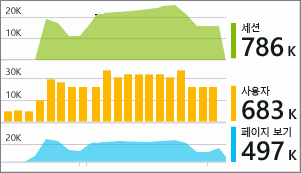

# Visual Studio Online에서 Application Insights로 작업
Visual Studio(2015 이상)에서 [Visual Studio Application Insights](app-insights-overview.md)의 원격 분석을 사용하여 디버깅 및 프로덕션의 성능을 분석하고 문제를 진단할 수 있습니다.

[앱에 Application Insights를 아직 설치](app-insights-asp-net.md)하지 않은 경우 지금 수행합니다.

##  프로젝트 디버깅
F5 키를 사용하여 응용 프로그램을 실행하고 여러 페이지를 열어 원격 분석을 생성해 봅니다.

Visual Studio에 로그된 이벤트 수가 표시됩니다.

이 단추를 클릭하여 진단 검색을 엽니다. 

## 진단 검색
검색 창에서는 기록된 이벤트를 보여줍니다. (Azure에 로그인한 경우 Application Insights를 설정할 때 포털에서 동일한 이벤트를 검색할 수 있습니다.)

자유 텍스트 검색은 이벤트의 필드에서 작동합니다. 예를 들어 페이지의 URL의 일부 또는 클라이언트 시티와 같은 속성의 값 또는 추적 로그에서 특정 단어를 검색합니다.

이벤트를 클릭하여 자세한 속성을 확인합니다.

또한 관련된 항목 탭을 열어 실패한 요청 또는 예외를 진단할 수 있습니다.

## 진단 허브
진단 허브(Visual Studio 2015 이상)는 Application Insights 서버 원격 분석을 생성되는 대로 보여줍니다. Azure 포털에서 리소스에 연결하지 않고 SDK를 설치하도록 선택한 경우 작동합니다.

## 예외
[예외 모니터링을 설정](app-insights-asp-net-exceptions.md)한 경우 예외 보고서는 검색 창에 표시됩니다. 

예외를 클릭하여 스택 추적을 가져옵니다. 앱의 코드가 Visual Studio에서 열린 경우 스택 추적에서 코드의 관련된 줄까지 클릭할 수 있습니다.

또한 각 메서드의 코드 렌즈 줄에 지난 24시간 동안 Application Insights에 의해 기록된 예외 수를 표시합니다.

## 로컬 모니터링
(Visual Studio 2015 업데이트 2에서) Application Insights 포털에 원격 분석을 보내도록 SDK를 구성하지 않은 경우(따라서 ApplicationInsights.config에 계측 키가 없음) 최신 디버깅 세션의 원격 분석이 진단 창에 표시됩니다. 

이전 버전의 앱을 이미 게시한 경우에 바람직합니다. 게시된 앱의 Application Insights 포털에서 원격 분석과 디버깅 세션의 원격 분석을 혼합하려 하지 않습니다.

포털에 원격 분석을 보내기 전에 디버깅하려는 [사용자 지정 원격 분석](app-insights-api-custom-events-metrics.md) 이 있는 경우에도 유용합니다.

* *우선 Application Insights를 완전히 구성하여 포털에 원격 분석을 전송했습니다. 하지만 이제 Visual Studio에서만 원격 분석을 확인하려 합니다.*
  
  * 검색 창 설정에서 앱이 포털에 원격 분석을 전송하는 경우 로컬 진단을 검색하는 옵션이 있습니다.
  * 포털에 전송되는 원격 분석을 중지하려면 ApplicationInsights.config에서 `<instrumentationkey>...` 줄을 주석으로 처리합니다. 원격 분석을 포털에 다시 보낼 준비가 되면 주석 처리를 제거합니다.

## 추세
추세는 시간이 지남에 따라 앱의 동작 방식을 시각화하는 도구입니다. 

Application Insights 도구 모음 단추 또는 Application Insights 검색 창에서 **원격 분석 추세 탐색** 을 선택합니다. 시작하려면 일반적인 5개의 쿼리 중 하나를 선택합니다. 원격 분석 유형, 시간 범위 및 기타 속성에 따라 서로 다른 데이터 집합을 분석할 수 있습니다. 

데이터에서 잘못된 부분을 찾으려면 "유형 보기" 드롭다운에서 비정상 옵션 중 하나를 선택합니다. 창의 아래쪽에서 필터링 옵션을 사용하면 쉽게 원격 분석의 특정 하위 집합을 쉽게 찾을 수 있습니다.

[추세 자세히 알아보기](app-insights-visual-studio-trends.md).

## 다음 작업
|  |  |
| --- | --- |
| **[더 많은 데이터 추가](app-insights-asp-net-more.md)** 사용량, 가용성, 종속성, 예외를 모니터링합니다. 로깅 프레임 워크의 추적을 통합합니다. 사용자 지정 원격 분석을 작성합니다. | |
| **[Application Insights 포털 사용](app-insights-dashboards.md)** 대시보드, 강력한 분석 및 진단 도구, 경고, 응용 프로그램의 라이브 종속성 맵 및 원격 분석 내보내기입니다. | |

<!--HONumber=Nov16_HO2-->

