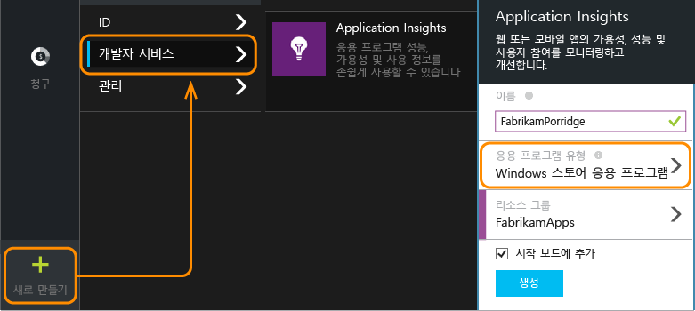
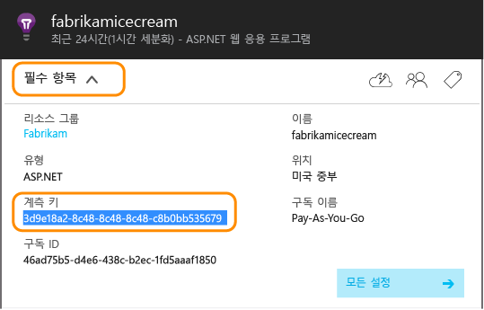
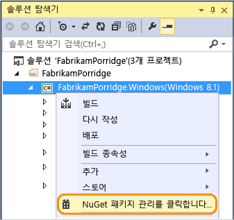
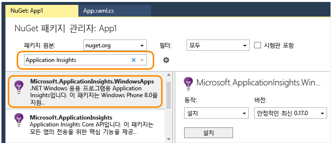
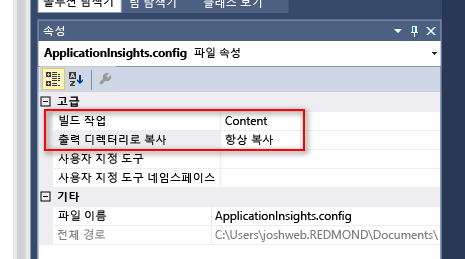
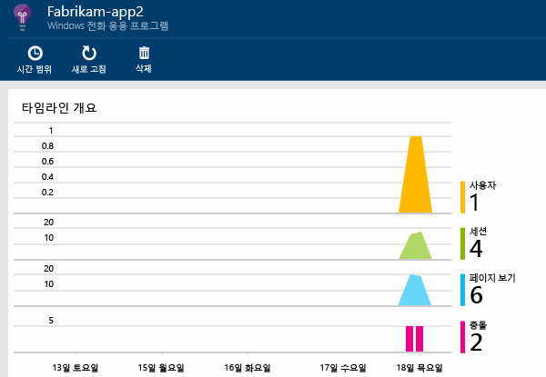
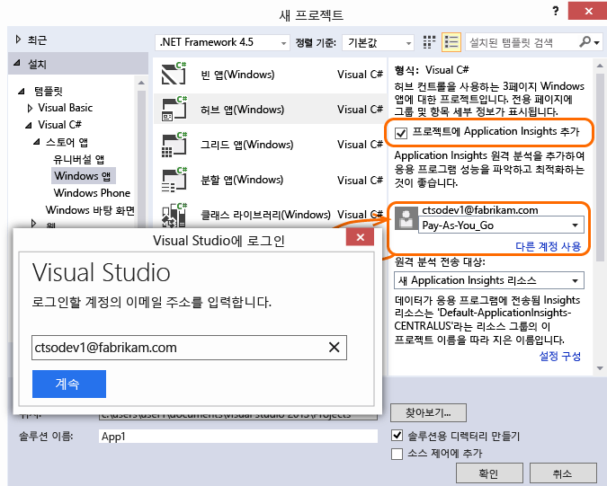
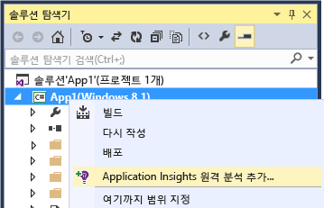

<properties
	pageTitle="Windows Phone 및 스토어 앱용 Application Insights | Microsoft Azure"
	description="Application Insights를 사용하여 Windows 장치 앱의 사용량 및 성능을 분석합니다."
	services="application-insights"
    documentationCenter="windows"
	authors="alancameronwills"
	manager="douge"/>

<tags
	ms.service="application-insights"
	ms.workload="tbd"
	ms.tgt_pltfrm="ibiza"
	ms.devlang="na"
	ms.topic="get-started-article"
	ms.date="10/16/2015"
	ms.author="awills"/>

# Windows Phone 및 스토어 앱용 Application Insights

*Application Insights는 미리 보기 상태입니다.*

[AZURE.INCLUDE [app-insights-selector-get-started](../../includes/app-insights-selector-get-started.md)]

Visual Studio Application Insights를 사용하면 다음을 위해 게시된 응용 프로그램을 모니터링할 수 있습니다.

* [**사용량**][windowsUsage]&#151;사용자 수 및 사용자가 무엇에 앱을 사용하는지 알아봅니다.
* [**충돌**][windowsCrash]&#151;충돌에 대한 진단 보고서를 가져오고 사용자에 대한 영향을 알아봅니다.


많은 응용 프로그램의 경우 대부분 공지 없이 [Visual Studio가 앱에 Application Insights를 추가할 수 있습니다](#ide). 하지만 무슨 일인지 더 잘 이해하기 위해 본 문서를 읽어 보면 수동으로 단계가 안내됩니다.

필요한 사항:

* [Microsoft Azure][azure] 구독.
* Visual Studio 2013 이상.

## 1\. Application Insights 리소스 만들기

[Azure 포털][portal]에서 새 Application Insights 리소스를 만듭니다.



Azure에서 [리소스][roles]는 서비스의 인스턴스입니다. 이 리소스는 사용자에게 분석 및 제공되는 앱의 원격 분석을 하는 곳입니다.

#### 계측 키 복사

키는 리소스를 식별합니다. 리소스에 데이터를 보내도록 SDK를 구성하려면 키가 필요합니다.




## 2\. 앱에 Application Insights SDK 추가

Visual Studio에서 프로젝트에 적합한 SDK를 추가합니다.

Windows 유니버설 앱인 경우 Windows Phone 및 Windows 프로젝트 모두에 대해 단계를 반복합니다.

1. 솔루션 탐색기에서 프로젝트를 마우스 오른쪽 단추로 클릭하고 **NuGet 패키지 관리**를 선택합니다.

    

2. "Application Insights"를 검색합니다.

    

3. **Windows 응용 프로그램용 Application Insights**를 선택합니다.

4. ApplicationInsights.config 파일을 프로젝트의 루트에 추가하고 포털에서 복사한 계측 키를 삽입합니다. 이 구성파일에 대한 샘플 xml는 아래와 같습니다.

	```xml

		<?xml version="1.0" encoding="utf-8" ?>
		<ApplicationInsights xmlns="http://schemas.microsoft.com/ApplicationInsights/2013/Settings>
			<InstrumentationKey>YOUR COPIED INSTRUMENTATION KEY</InstrumentationKey>
		</ApplicationInsights>
	```

    ApplicationInsights.config 파일의 속성 설정: **빌드 작업** == **콘텐츠** 및 **출력 디렉터리로 복사** == **항상 복사**

	

5. 다음 초기화 코드를 추가합니다. 이 코드를 `App()` 생성자에 추가하는 것이 좋습니다. 다른 곳에서 추가하면 첫번째 pageviews의 자동 컬렉션을 누락할 수 있습니다.

```C#

    using Microsoft.ApplicationInsights;
    ...

	public App()
	{
	   // Add this initilization line.
	   WindowsAppInitializer.InitializeAsync();

	   this.InitializeComponent();
	   this.Suspending += OnSuspending;
	}  
```

**Windows 유니버설 앱**: Phone 및 스토어 프로젝트 모두에 대해 단계를 반복합니다. [Windows 8.1 유니버설 앱의 예](https://github.com/Microsoft/ApplicationInsights-Home/tree/master/Samples/Windows%208.1%20Universal).

## <a name="network"></a>3. 앱에 대한 네트워크 액세스 설정

앱이 아직 [인터넷 액세스를 요청](https://msdn.microsoft.com/library/windows/apps/hh452752.aspx)하지 않은 경우 해당 매니페스트에 [필요한 기능](https://msdn.microsoft.com/library/windows/apps/br211477.aspx)으로 추가해야 합니다.

## <a name="run"></a>4. 프로젝트 실행

[F5를 사용하여 응용 프로그램을 실행](http://msdn.microsoft.com/library/windows/apps/bg161304.aspx)하고 이를 사용하여 일부 원격 분석을 생성합니다.

Visual Studio에 수신된 이벤트의 수가 표시됩니다.


디버그 모드에서 원격 분석은 생성되는 즉시 보내집니다. 릴리스 모드에서 원격 분석은 장치에 저장되며 앱이 다시 시작하는 경우에만 보내집니다.


## <a name="monitor"></a>5. 모니터 데이터 보기

[Azure 포털](https://portal.azure.com)에서 이전에 만든 Application Insights 리소스를 엽니다.

처음에는 요소가 1~2개만 표시됩니다. 예:



더 많은 데이터를 원하는 경우 몇 초 후에 **새로고침**을 클릭합니다.

보다 자세한 정보를 확인하려면 원하는 차트를 클릭합니다.


## <a name="deploy"></a>5. 스토어에 응용 프로그램 게시

[응용 프로그램을 게시](http://dev.windows.com/publish)하고 사용자가 다운로드하고 사용함에 따른 데이터 누적을 관찰합니다.

## 원격 분석을 사용자 지정

#### 수집기 선택

Application Insights SDK는 앱의 서로 다른 유형의 데이터를 자동으로 수집하는 여러 수집기를 포함합니다. 기본적으로, 모두 활성화되어있습니다. 하지만 앱 생성자에서 초기화에 사용할 수집기를 선택할 수 있습니다.

    WindowsAppInitializer.InitializeAsync( "00000000-0000-0000-0000-000000000000",
       WindowsCollectors.Metadata
       | WindowsCollectors.PageView
       | WindowsCollectors.Session
       | WindowsCollectors.UnhandledException);

#### 사용자 고유의 원격 분석 데이터 전송

[API][api]를 사용하여 Application Insights에 이벤트, 메트릭 및 진단 데이터를 보냅니다. 요약하면 다음과 같습니다:

```C#

 var tc = new TelemetryClient(); // Call once per thread

 // Send a user action or goal:
 tc.TrackEvent("Win Game");

 // Send a metric:
 tc.TrackMetric("Queue Length", q.Length);

 // Provide properties by which you can filter events:
 var properties = new Dictionary{"game", game.Name};

 // Provide metrics associated with an event:
 var measurements = new Dictionary{"score", game.score};

 tc.TrackEvent("Win Game", properties, measurements);

```

자세한 내용은 [API 개요: 사용자 지정 이벤트 및 메트릭][api]을 참조하세요.

## 다음 작업

* [앱에서 충돌 감지 및 진단][windowsCrash]
* [매트릭에 대해 알아보기][metrics]
* [진단 검색에 대해 알아보기][diagnostic]


## <a name="ide"></a>자동화된 설치

Visual Studio를 사용하여 설치 단계를 수행하려면 Windows Phone, Windows 스토어 및 기타 다양한 앱을 사용할 수 있습니다.

### <a name="new"></a>새 Windows 앱 프로젝트를 만드는 경우...

**새 프로젝트** 대화 상자에서 **Application Insights**를 선택합니다.

로그인이 요청되면 자신의 Azure 계정에 대한 자격 증명을 사용합니다.




### <a name="existing"></a>또는 기존 프로젝트의 경우...

솔루션 탐색기에서 Application Insights를 추가합니다.




## SDK의 새 릴리스로 업그레이드

[새 SDK 버전이 출시](app-insights-release-notes-windows.md)될 때:

* 프로젝트를 마우스 오른쪽 단추로 클릭하고 NuGet 패키지 관리를 선택합니다.
* 설치된 Application Insights 패키지를 선택하고 **작업: 업그레이드**를 선택합니다.


## <a name="usage"></a>다음 단계


[앱에서 충돌 감지 및 진단][windowsCrash]

[진단 로그 캡처 및 검색][diagnostic]


[앱 사용량 추적][windowsUsage]

[사용자 지정 원격 분석 전송에 API 사용][api]

[문제 해결][qna]


<!--Link references-->

[api]: app-insights-api-custom-events-metrics.md
[azure]: ../insights-perf-analytics.md
[diagnostic]: app-insights-diagnostic-search.md
[metrics]: app-insights-metrics-explorer.md
[portal]: http://portal.azure.com/
[qna]: app-insights-troubleshoot-faq.md
[roles]: app-insights-resources-roles-access-control.md
[windowsCrash]: app-insights-windows-crashes.md
[windowsUsage]: app-insights-windows-usage.md

<!---HONumber=Oct15_HO4-->