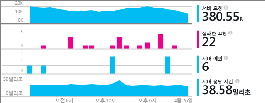
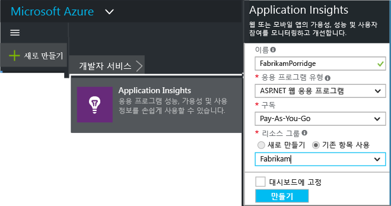
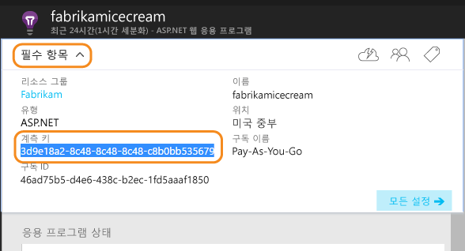
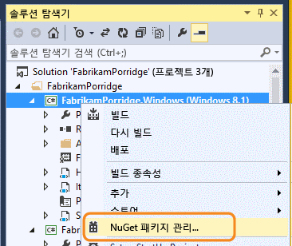
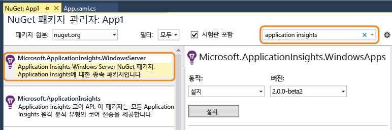
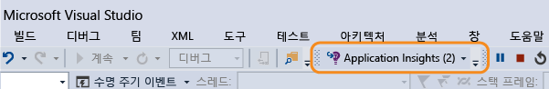
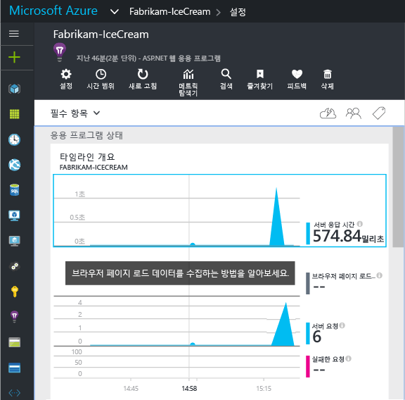
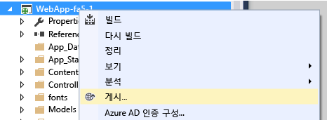

# ASP.NET 4 응용 프로그램에 대한 Application Insights를 수동으로 구성
[Application Insights](app-insights-overview.md)는 웹 개발자가 라이브 응용 프로그램의 성능 및 사용을 모니터링할 수 있도록 하는 확장 가능한 도구입니다. 이를 수동으로 구성하여 Windows 서비스, 작업자 역할 및 다른 ASP.NET 응용 프로그램을 모니터링할 수 있습니다. 웹앱의 경우 수동 구성은 Visual Studio에서 제공되는 [자동 설치](app-insights-asp-net.md) 에 대한 대안입니다.

#### 시작하기 전에
다음 작업을 수행해야 합니다.

* [Microsoft Azure](http://azure.com)구독. 팀 또는 조직에 Azure 구독이 있는 경우 소유자가 [Microsoft 계정](http://live.com)을 사용하여 사용자를 추가할 수 있습니다.
* Visual Studio 2013 이상.

## 1. Application Insights 리소스 만들기
[Azure 포털](https://portal.azure.com/)에 로그인한 다음 새 Application Insights 리소스를 만듭니다. 응용 프로그램 유형으로 ASP.NET을 선택합니다.

Azure에서 [리소스](app-insights-resources-roles-access-control.md) 는 서비스의 인스턴스입니다. 이 리소스는 사용자에게 분석 및 제공되는 앱의 원격 분석을 하는 곳입니다.

선택하는 응용 프로그램 유형에 따라 [메트릭 탐색기](app-insights-metrics-explorer.md)에 표시되는 리소스 블레이드 및 속성의 기본 콘텐츠가 설정됩니다.

#### 계측 키 복사
키는 리소스를 식별하며, 데이터를 리소스로 보내기 위해 SDK에서 곧 설치합니다.

새 리소스르 만들기 위해 방금 수행한 단계는 모든 응용 프로그램을 모니터링하는 좋은 방법입니다. 이제 데이터를 보낼 수 있습니다.

## 2. 응용 프로그램에 SDK 설치
Application Insights SDK의 설치 및 구성은 작업하는 플랫폼에 따라 달라 집니다. ASP.NET 앱의 경우, 쉽습니다.

1. Visual Studio에서 웹앱 프로젝트의 NuGet 패키지를 편집합니다.
   
    
2. 웹앱용 Application Insights SDK를 설치합니다.
   
    
   
    *다른 패키지를 사용할 수 있나요?*
   
    예. API만 사용하여 사용자 고유의 원격 분석을 보내려는 경우 코어 API(Microsoft.ApplicationInsights)를 선택합니다. Windows Server 패키지에는 코어 API와 성능 카운터 수집 및 종속성 모니터링과 같은 다양한 다른 패키지가 자동으로 포함됩니다. 

#### SDK의 나중 버전으로 업그레이드하려면
종종 새 버전의 SDK가 릴리스됩니다.

[SDK의 새 릴리스](https://github.com/Microsoft/ApplicationInsights-dotnet-server/releases/)로 업그레이드하려면, NuGet 패키지 관리자를 다시 열고 설치된 패키지를 필터링합니다. **Microsoft.ApplicationInsights.Web**을 선택하고 **업그레이드**를 선택합니다.

ApplicationInsights.config에 대한 사용자 지정을 변경한 경우, 업그레이드 전에 복사본을 저장하고 나중에 변경 내용을 새 버전에 병합합니다.

## 3. 원격 분석 전송
**핵심 API 패키지에만 설치한 경우:**

* 코드(예: `main()`)에서 계측 키를 설정합니다. 
  
    `TelemetryConfiguration.Active.InstrumentationKey = "` *키* `";` 
* [API를 사용하여 고유한 원격 분석을 작성 합니다](app-insights-api-custom-events-metrics.md#ikey).

**다른 Application Insights 패키지를 설치한 경우** 원하는 경우 .config 파일을 사용하여 계측 키를 설정할 수 있습니다.

* ApplicationInsights.config(NuGet 설치에 의해 추가됨)를 편집합니다. 닫는 태그 바로 전에 삽입합니다.
  
    `<InstrumentationKey>` *복사한 계측 키* `</InstrumentationKey>`
* 솔루션 탐색기에서 ApplicationInsights.config라는 속성이 **빌드 작업 = 콘텐츠, 출력 디렉터리로 복사 = 복사**로 설정되도록 합니다.

[다양한 빌드 구성을 위해 키를 전환](app-insights-separate-resources.md)하려면 계측 키를 코드로 설정하는 것이 유용합니다. 키를 코드로 설정하면 `.config` 파일에서 설정할 필요가 없습니다.

##  프로젝트 실행
**F5** 키를 사용하여 응용 프로그램을 실행하고 여러 페이지를 열어 원격 분석을 생성해 봅니다.

Visual Studio에 전송한 이벤트 수가 표시됩니다.

##  원격 분석 보기
[Azure 포털](https://portal.azure.com/) 로 돌아가서 Application Insights 리소스를 찾습니다.

개요 차트에서 데이터를 찾습니다. 처음에는 요소가 1~2개만 표시됩니다. 예:

차트를 클릭하면 더 자세한 메트릭을 볼 수 있습니다. [메트릭에 대해 자세히 알아봅니다.](app-insights-web-monitor-performance.md)

#### 데이터가 없나요?
* 응용 프로그램을 사용하여 여러 페이지를 열어 원격 분석을 생성해 봅니다.
* [검색](app-insights-diagnostic-search.md) 타일을 열고 개별 이벤트를 봅니다. 경우에 따라 메트릭 파이프라인을 통해 들어오려면 이벤트가 약간 더 걸립니다.
* 몇 초 정도 기다렸다가 **새로고침**을 클릭합니다. 차트는 주기적으로 새로 고쳐지지만 일부 데이터가 표시되기를 기다리는 경우에는 수동으로 새로 고칠 수 있습니다.
* [문제 해결](app-insights-troubleshoot-faq.md)을 참조하세요.

## 앱 게시
이제 응용 프로그램을 서버 또는 Azure에 배포하고 누적되는 데이터를 관찰합니다.

디버그 모드에서 실행할 때는 파이프라인을 통해 원격 분석이 신속하게 수행되므로 데이터가 몇 초 내에 표시됩니다. 릴리스 구성에서 앱을 배포할 때는 데이터가 더 천천히 누적됩니다.

#### 서버에 게시한 후 데이터가 없나요?
서버 방화벽에서 나가는 트래픽에 대해 다음 포트를 엽니다.

* `dc.services.visualstudio.com:443`
* `f5.services.visualstudio.com:443`

#### 빌드 서버에 문제가 있나요?
[이 문제 해결 항목](app-insights-asp-net-troubleshoot-no-data.md#NuGetBuild)을 참조하세요.

> [!NOTE]
> 앱에서 다양한 원격 분석을 생성하는 경우(ASP.NET SDK 버전 2.0.0-beta3 이상 사용), 적응 샘플링 모듈 이벤트의 대표적인 일부만 전송하여 포털에 전송되는 볼륨이 자동으로 줄어듭니다. 그러나, 동일한 요청과 관련된 이벤트가 그룹으로 선택되거나 선택 취소되므로 관련 이벤트 간을 이동할 수 있습니다. 
> [샘플링에 대해 알아봅니다](app-insights-sampling.md).
> 
> 

## 다음 단계
* [원격 분석 더 추가](app-insights-asp-net-more.md) 합니다.

<!--HONumber=Nov16_HO3-->

