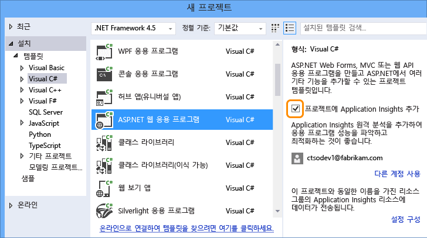
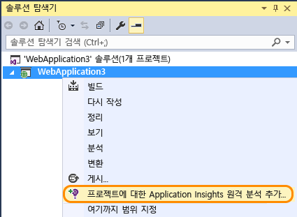
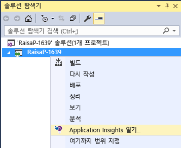
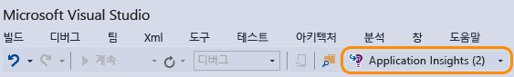

<properties 
	pageTitle="Application Insights로 앱 상태 및 사용량 모니터링" 
	description="Application Insights를 사용하여 온-프레미스 또는 Microsoft Azure 웹 응용 프로그램의 사용량, 가용성 및 성능을 분석합니다." 
	services="application-insights" 
    documentationCenter=""
	authors="alancameronwills" 
	manager="ronmart"/>

<tags 
	ms.service="application-insights" 
	ms.workload="tbd" 
	ms.tgt_pltfrm="ibiza" 
	ms.devlang="na" 
	ms.topic="article" 
	ms.date="04/26/2015" 
	ms.author="awills"/>

# Application Insights로 앱 상태 및 사용량 모니터링

*Application Insights는 미리 보기 상태입니다.*

Visual Studio Application Insights는 실시간 응용 프로그램을 모니터링하여 [성능 문제 및 예외 사항을 감지 및 진단][detect]하고 [앱이 어떻게 사용되는지 검색][knowUsers]할 수 있도록 돕습니다. ASP.NET 및 Java 웹 앱, iOS, Android, Windows 및 기타 장치 앱, HTML+JavaScript 앱과 같이 다양한 종류의 응용 프로그램을 사용할 수 있습니다.

이 기사에서는 Visual Studio에서 개발된 앱의 종류에 대해 초점을 맞추겠습니다. 기타 IDE에 대해서는 Application Insights 확장 프로그램도 있습니다.

[Visual Studio 2013 Update 3](http://go.microsoft.com/fwlink/?linkid=397827&clcid=0x409) 이상 및 [Microsoft Azure](http://azure.com) 계정이 필요합니다.

##  프로젝트에 Application Insights 추가

#### 새 프로젝트의 경우

Visual Studio에서 새 프로젝트를 만들 때 Application Insights를 선택해야 합니다.

Visual Studio는 Application Insights에서 리소스를 만들고, SDK를 프로젝트에 추가하고, `.config` 파일에 키를 배치합니다.

프로젝트에 웹 페이지가 있는 경우에도 [JavaScript SDK][client]를 마스터 웹 페이지에 추가합니다.

#### ...기존 프로젝트의 경우

솔루션 탐색기에서 프로젝트를 마우스 오른쪽 단추로 클릭하고 Application Insights 추가를 선택합니다.

Visual Studio는 Application Insights에서 리소스를 만들고, SDK를 프로젝트에 추가하고, `.config` 파일에 키를 배치합니다.

이 경우에 [JavaScript SDK][client]는 웹 페이지에 추가하지 않습니다. 이는 다음 단계에서 수행하는 것이 좋습니다.

#### 설치 옵션

프로젝트를 처음 만드는 경우 Microsoft Azure 미리 보기에 로그인하거나 등록하라는 메시지가 표시됩니다. 해당 계정은 Visual Studio Online 계정과는 별개입니다.

이 앱이 더 큰 응용 프로그램의 일부인 경우, **구성 설정**을 사용하여 다른 구성 요소와 동일한 리스소 그룹에 넣고자 할 수 있습니다.

*Application Insights 옵션이 표시되지 않는 경우 일부 유형의 프로젝트의 경우 [SDK를 수동으로 추가][windows]하여 Application Insights를 사용할 수 있습니다.*

#### 프로젝트에서 Application Insights를 엽니다.

##  3. 프로젝트 실행

F5 키를 사용하여 응용 프로그램을 실행하고 여러 페이지를 열어 원격 분석을 생성해 봅니다.

Visual Studio에 전송한 이벤트 수가 표시됩니다.

##  4. 원격 분석 보기

[Azure 포털][portal]로 돌아가 Application Insights 리소스를 찾습니다.

개요 차트에서 데이터를 찾습니다. 처음에는 요소가 1\~2개만 표시됩니다. 예:

차트를 클릭하면 더 자세한 메트릭을 볼 수 있습니다. [메트릭에 대해 자세히 알아봅니다.][perf]

이제 응용 프로그램을 배포하고 누적되는 데이터를 관찰합니다.

디버그 모드에서 실행할 때는 파이프라인을 통해 원격 분석이 신속하게 수행되므로 데이터가 몇 초 내에 표시됩니다. 앱을 배포할 때는 데이터가 더 천천히 누적됩니다.

#### 데이터가 없나요?

* [진단 검색][diagnostic] 타일을 열고 개별 이벤트를 봅니다.
* 응용 프로그램을 사용하여 여러 페이지를 열어 원격 분석을 생성해 봅니다.
* 몇 초 정도 기다렸다가 새로고침을 클릭합니다.
* [문제 해결][qna]을 참조하세요.

## 다음 단계

이제 앱의 서버측에서 데이터를 보냈으며 다음은 360도로 볼 수 있는 일부 단계입니다.

* [웹 테스트를 설정][availability]하여 응용 프로그램이 라이브 상태로 유지되며 응답하는지 확인할 수 있습니다.
* [JavaScript SDK를 웹 페이지에 추가][client]하여 페이지 보기 수, 페이지 로드 시간, 스크립트 예외 사항과 같은 브라우저 기반 원격 분석을 가져오고 페이지 스크립트에서 사용자 지정 원격 분석을 작성합니다.
* 데이터베이스 또는 앱에서 사용 하는 다른 구성 요소에 따른 문제를 진단하는 종속성 추적 추가 
 * [IIS 서버에서 종속성 추적 추가][redfield]
 * [Azure 웹 앱에서 종속성 추적 추가][azure]
* 즐겨찾는 로깅 프레임워크에서 [로그 추적 캡처][netlogs]
* [사용자 지정 이벤트 및 메트릭을 추적][api]하여 클라이언트나 서버 또는 둘 다에서 응용 프로그램이 어떻게 사용되는지 알아볼 수 있습니다.

<!--Link references-->

[api]: app-insights-api-custom-events-metrics.md
[availability]: app-insights-monitor-web-app-availability.md
[azure]: ../insights-perf-analytics.md
[client]: app-insights-javascript.md
[detect]: app-insights-detect-triage-diagnose.md
[diagnostic]: app-insights-diagnostic-search.md
[knowUsers]: app-insights-overview-usage.md
[netlogs]: app-insights-asp-net-trace-logs.md
[perf]: app-insights-web-monitor-performance.md
[portal]: http://portal.azure.com/
[qna]: app-insights-troubleshoot-faq.md
[redfield]: app-insights-monitor-performance-live-website-now.md
[windows]: app-insights-windows-get-started.md

<!--HONumber=54--> 