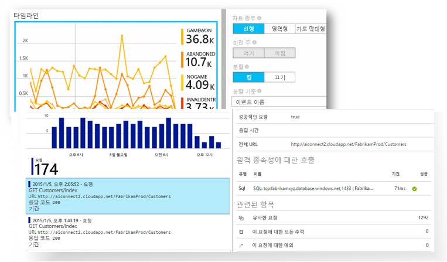
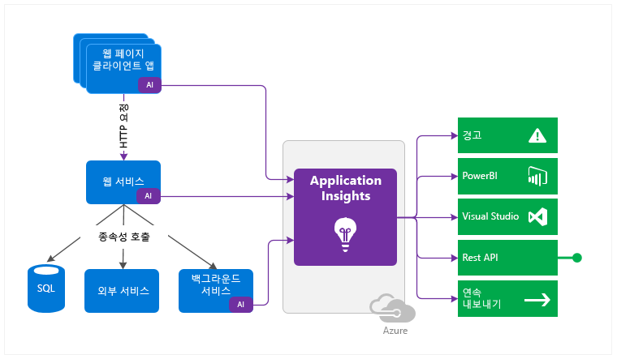

<properties 
	pageTitle="Microsoft Azure의 Application Insights" 
	description="라이브 웹 또는 장치 응용 프로그램의 문제를 검색, 심사 및 진단합니다. 지속적인 모니터링을 통해 사용자와 더불어 성공할 수 있도록 개선합니다." 
	services="application-insights" 
    documentationCenter=""
	authors="alancameronwills" 
	manager="douge"/>

<tags 
	ms.service="application-insights" 
	ms.workload="tbd" 
	ms.tgt_pltfrm="ibiza" 
	ms.devlang="na" 
	ms.topic="article" 
	ms.date="11/17/2015" 
	ms.author="awills"/>
 
# Visual Studio Application Insights

Application Insights는 라이브 응용 프로그램을 모니터링하는 확장 가능한 분석 서비스입니다. 성능 문제를 감지 및 진단하고 실제로 앱을 사용하여 작업하는 사용자를 이해하는데 도움이 됩니다. 개발자가 성능 및 응용 프로그램의 가용성을 지속적으로 향상 시킬 수 있도록 설계 되었습니다.

NET 또는 J2EE, 호스팅된 온-프레미스 또는 클라우드의 다양한 플랫폼에서 웹과 독립 실행형 앱과 함께 사용합니다.

Application Insights는 개발팀을 목표로 합니다. 함께 다음을 수행할 수 있습니다.

* [사용 패턴을 분석][knowUsers]은 사용자에게 응용 프로그램을 지속적이고 보다 낫게 향상을 이해시킵니다. 
 * 페이지 보기 수, 신규 및 복귀 사용자, 지리적 위치, 플랫폼 및 기타 핵심 사용량 통계
 * 각 기능의 성공을 평가하는 사용 현황 경로를 추적합니다.
* 성능 문제를 [감지, 심사 및 진단][detect]하여 대부분의 사용자가 인식하기 전에 해결합니다.
 *  성능 변화 또는 충돌에 대한 경고
 *  응답 시간, CPU 사용량, 종속성 추적 등의 성능 문제 진단에 도움을 주는 메트릭
 *  웹앱의 가용성 테스트
 *  충돌 및 예외에 대한 보고서 및 경고
 *  강력한 진단 로그 검색(선호하는 로깅 프레임워크의 로그 추적 포함)

상자에서 꺼낸 앱을 모니터링하는 모듈의 범위를 포함하는 각 플랫폼에 대한 SDK. 또한 고유 원격 분석을 보다 자세하고 맞춤형 분석으로 코딩할 수 있습니다.

응용 프로그램에서 수집된 원격 분석 데이터는 빠른 진단과 분석을 위한 강력한 도구와 직관적인 보기가 가능한 Azure 포털에 저장되고 분석됩니다.

훨씬 긴밀한 수준의 분석이 필요합니까? 데이터를 [SQL](app-insights-code-sample-export-telemetry-sql-database.md), [Power BI](app-insights-export-power-bi.md) 또는 자체 도구로 [내보내기](app-insights-export-telemetry.md)합니다.

## 플랫폼 및 언어

플랫폼의 증가하는 범위에 대한 SDKrk 있습니다. 현재 목록에 포함 됩니다.

 * Azure 또는 IIS 서버의 [ASP.NET 서버][greenbrown]
 * [Azure 클라우드 서비스](app-insights-cloudservices.md)
 * [J2EE 서버][java]
 * [웹 페이지][client]\: HTML + JavaScript
 * [Windows 서비스, 작업자 역할 및 데스크톱 앱][desktop]
 * [다른 플랫폼][platforms] - Node.js, PHP, Python, Ruby, Joomla, SharePoint, WordPress

Application Insights 다시 작성하지 않는 IIS상의 기존 ASP.NET 웹앱으로부터 원격 분석을 가져올 수 있습니다.

앱이 클라이언트, 서버 및 다른 구성 요소가 있다면 모두를 계측할 수 있습니다. Application Insights 포털에서 데이터를 통합할 수 있습니다. 예를 들면, 서버의 이벤트와 함게 클라이언트에서 이벤트를 상호 연결할 수 있습니다.

## 작동 방법

응용 프로그램에 작은 SDK를 설치하고 Application Insights 포털에서 계정을 설정합니다. SDK에서 앱을 모니터링하여 포털에 원격 분석 데이터를 보냅니다. 포털에서 통계 차트를 표시하고 모든 문제를 진단하는 데 도움이 되는 강력한 검색 도구를 제공합니다.

SDK에는 사용자, 세션 및 성능을 계산하는 모듈을 비롯하여 원격 분석을 수집하는 여러 모듈이 있습니다. 또한 포털에 원격 분석 데이터를 보내도록 사용자 지정 코드를 작성할 수도 있습니다. 사용자 지정 원격 분석은 사용자 스토리를 추적할 때 특히 유용합니다. 단추 클릭, 특정 목표 달성, 사용자 실수 등의 이벤트를 계산할 수 있습니다.

ASP.NET 서버 및 Azure 웹 앱의 경우 두 가지 용도로 사용되는 [상태 모니터][redfield]도 설치할 수 있습니다. 상태 모니터의 기능은 다음과 같습니다.

* 웹앱을 다시 작성하거나 다시 설치하지 않고 모니터링합니다.
* 종속 모듈에 대한 호출을 추적합니다.

### 오버헤드는 무엇입니까?

성능에 미치는 영향을 매우 작습니다. 추적은 비 중단을 호출하고 별도의 스레드로 일괄 처리 및 전송합니다.

## 시작하기:

1. [Microsoft Azure](http://azure.com)를 구독해야 합니다. Application Insights의 무료 [가격 책정 계층](https://azure.microsoft.com/pricing/details/application-insights/)을 선택하여 무료로 등록할 수 있습니다.

2. Visual Studio를 사용하는 경우:

 * 새 프로젝트: **Application Insights 추가** 상자의 선택을 취소합니다.
 * 기존 프로젝트: 프로젝트를 마우스 오른쪽 단추로 클릭하고 **Application Insights 추가**를 선택합니다.

Visual Studio를 사용하지 않거나 프로젝트에서 이러한 옵션을 사용할 수 없는 경우 [여기에서 플랫폼을 조회](app-insights-platforms.md)합니다.

3. 앱을 실행(개발 모드에서 또는 게시)하고 [Azure 포털](https://portal.azure.com)에 누적되는 데이터를 조사합니다.

## 코드

[샘플 및 연습](app-insights-code-samples.md)

[SDK 랩](https://www.myget.org/gallery/applicationinsights-sdk-labs) - Application Insights SDK 외에 설치(및 제거)할 수 있는 NuGet 패키지입니다. 직접 사용해보고 의견을 보내주세요.

## 지원 및 피드백

* 질문 및 문제:
 * [문제 해결][qna]
 * [MSDN 포럼](https://social.msdn.microsoft.com/Forums/vstudio/ko-KR/home?forum=ApplicationInsights)
 * [StackOverflow](http://stackoverflow.com/questions/tagged/ms-application-insights)
* 버그:
 * [연결](https://connect.microsoft.com/VisualStudio/Feedback/LoadSubmitFeedbackForm?FormID=6076)
* 제안:
 * [사용자 음성](http://visualstudio.uservoice.com/forums/121579-visual-studio/category/77108-application-insights)

## 비디오

> [AZURE.VIDEO 218]

> [AZURE.VIDEO usage-monitoring-application-insights]

> [AZURE.VIDEO performance-monitoring-application-insights]

<!--Link references-->

[android]: https://github.com/Microsoft/ApplicationInsights-Android
[azure]: ../insights-perf-analytics.md
[client]: app-insights-javascript.md
[desktop]: app-insights-windows-desktop.md
[detect]: app-insights-detect-triage-diagnose.md
[greenbrown]: app-insights-start-monitoring-app-health-usage.md
[ios]: https://github.com/Microsoft/ApplicationInsights-iOS
[java]: app-insights-java-get-started.md
[knowUsers]: app-insights-overview-usage.md
[platforms]: app-insights-platforms.md
[portal]: http://portal.azure.com/
[qna]: app-insights-troubleshoot-faq.md
[redfield]: app-insights-monitor-performance-live-website-now.md
[windows]: app-insights-windows-get-started.md

 

<!---HONumber=AcomDC_1125_2015-->