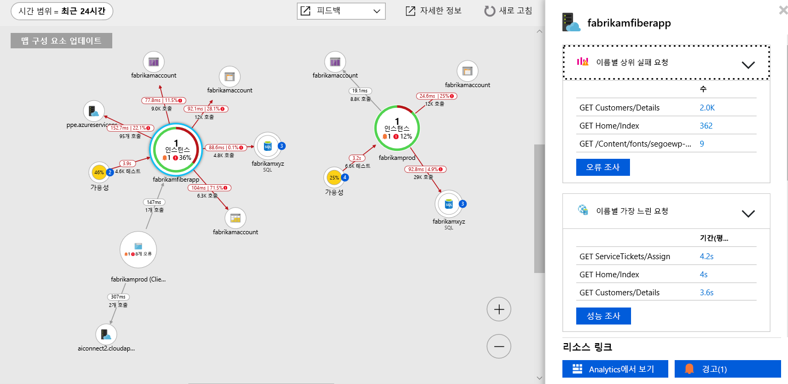

# <a name="collect-distributed-traces-from-go-preview"></a>Go(미리 보기)에서 분산 추적 수집

이제 Application Insights는 [OpenCensus](https://opencensus.io) 및 새로운 [로컬 전달자](./opencensus-local-forwarder.md)와의 통합을 통해 Go 응용 프로그램의 분산 추적을 지원합니다. 이 문서에서는 Go에 대해 OpenCensus를 설정하고 추적 데이터를 Application Insights로 가져오는 프로세스를 단계별로 안내합니다.

## <a name="prerequisites"></a>필수 조건

- Azure 구독이 필요합니다.
- Go를 설치해야 합니다. 이 문서에서는 버전 1.11 [Go 다운로드](https://golang.org/dl/)를 사용합니다.
- 지침에 따라 [로컬 전달자를 Windows 서비스로](./opencensus-local-forwarder.md#windows-service) 설치합니다.

Azure 구독이 아직 없는 경우 시작하기 전에 [체험](https://azure.microsoft.com/free/) 계정을 만듭니다.

## <a name="sign-in-to-the-azure-portal"></a>Azure Portal에 로그인

[Azure 포털](https://portal.azure.com/)에 로그인합니다.

## <a name="create-application-insights-resource"></a>Application Insights 리소스 만들기

먼저 계측 키(ikey)를 생성할 Application Insights 리소스를 만들어야 합니다. 그런 다음, ikey를 사용하여 OpenCensus 계측 응용 프로그램에서 Application Insights로 분산 추적을 보내도록 로컬 전달자를 구성합니다.   

1. **리소스 만들기** > **개발자 도구** > **Application Insights**를 선택합니다.

   

   구성 상자가 표시되면 다음 표를 사용하여 입력 필드를 채웁니다.

    | 설정        | 값           | 설명  |
   | ------------- |:-------------|:-----|
   | **Name**      | 전역적으로 고유한 값 | 모니터링하는 응용 프로그램을 식별하는 이름입니다. |
   | **응용 프로그램 유형** | 일반 | 모니터링하는 응용 프로그램의 유형입니다. |
   | **리소스 그룹**     | myResourceGroup      | Application Insights 데이터를 호스팅할 새 리소스 그룹의 이름입니다. |
   | **위치**: | 미국 동부 | 가까운 위치 또는 응용 프로그램이 호스팅되는 위치 근처를 선택합니다. |

2. **만들기**를 클릭합니다.

## <a name="configure-local-forwarder"></a>로컬 전달자 구성

1. **개요** > **기본 정보**를 차례로 선택하고, 응용 프로그램의 **계측 키**를 복사합니다.

   

2. `LocalForwarder.config` 파일을 편집하고 계측 키를 추가합니다. [필수 조건](./opencensus-local-forwarder.md#windows-service)의 지침을 따른 경우 이 파일은 `C:\LF-WindowsServiceHost`에 있습니다.

    ```xml
      <OpenCensusToApplicationInsights>
        <!--
          Instrumentation key to track telemetry to.
          -->
        <InstrumentationKey>{enter-instrumentation-key}</InstrumentationKey>
      </OpenCensusToApplicationInsights>
    
      <!-- Describes aspects of processing Application Insights telemetry-->
      <ApplicationInsights>
        <LiveMetricsStreamInstrumentationKey>{enter-instrumentation-key}</LiveMetricsStreamInstrumentationKey>
      </ApplicationInsights>
    </LocalForwarderConfiguration>
    ```

3. 응용 프로그램 **로컬 전달자** 서비스를 다시 시작합니다.

## <a name="opencensus-go-packages"></a>OpenCensus Go 패키지

1. 명령줄에서 Go용 OpenCensus 패키지를 설치합니다.

    ```go
    go get -u go.opencensus.io
    go get -u contrib.go.opencensus.io/exporter/ocagent
    ```

2. 다음 코드를 .go 파일에 추가하고 빌드한 후 실행합니다. 이 예제는 로컬 전달자와의 통합을 지원하는 코드를 추가하여 공식 OpenCensus 지침에서 파생된 것입니다.

     ```go
        // Copyright 2018, OpenCensus Authors
        //
        // Licensed under the Apache License, Version 2.0 (the "License");
        // you may not use this file except in compliance with the License.
        // You may obtain a copy of the License at
        //
        //     http://www.apache.org/licenses/LICENSE-2.0
        //
        // Unless required by applicable law or agreed to in writing, software
        // distributed under the License is distributed on an "AS IS" BASIS,
        // WITHOUT WARRANTIES OR CONDITIONS OF ANY KIND, either express or implied.
        // See the License for the specific language governing permissions and
        // limitations under the License.
        package main
        
        import (
        
            "bytes"
            "fmt"
            "log"
            "net/http"
            os "os"
            
            ocagent "contrib.go.opencensus.io/exporter/ocagent"
            "go.opencensus.io/plugin/ochttp"
            "go.opencensus.io/plugin/ochttp/propagation/tracecontext"
            "go.opencensus.io/trace"
        
        )
        
        func main() {
            // Register stats and trace exporters to export the collected data.
            serviceName := os.Getenv("SERVICE_NAME")
            if len(serviceName) == 0 {
                serviceName = "go-app"
            }
            fmt.Printf(serviceName)
            agentEndpoint := os.Getenv("OCAGENT_TRACE_EXPORTER_ENDPOINT")

            if len(agentEndpoint) == 0 {
                agentEndpoint = fmt.Sprintf("%s:%d", ocagent.DefaultAgentHost, ocagent.DefaultAgentPort)
            }
        
            fmt.Printf(agentEndpoint)
            exporter, err := ocagent.NewExporter(ocagent.WithInsecure(), ocagent.WithServiceName(serviceName), ocagent.WithAddress(agentEndpoint))
        
            if err != nil {
                log.Printf("Failed to create the agent exporter: %v", err)
            }
        
            trace.RegisterExporter(exporter)
        
            trace.ApplyConfig(trace.Config{DefaultSampler: trace.AlwaysSample()})
        
            client := &http.Client{Transport: &ochttp.Transport{Propagation: &tracecontext.HTTPFormat{}}}
        
            http.HandleFunc("/", func(w http.ResponseWriter, req *http.Request) {
                fmt.Fprintf(w, "hello world")
        
                var jsonStr = []byte(`[ { "url": "http://blank.org", "arguments": [] } ]`)
                r, _ := http.NewRequest("POST", "http://blank.org", bytes.NewBuffer(jsonStr))
                r.Header.Set("Content-Type", "application/json")
        
                // Propagate the trace header info in the outgoing requests.
                r = r.WithContext(req.Context())
                resp, err := client.Do(r)
                if err != nil {
                    log.Println(err)
                } else {
                    // TODO: handle response
                    resp.Body.Close()
                }
            })
        
            http.HandleFunc("/call_blank", func(w http.ResponseWriter, req *http.Request) {
                fmt.Fprintf(w, "hello world")
        
                r, _ := http.NewRequest("GET", "http://blank.org", nil)

                // Propagate the trace header info in the outgoing requests.
                r = r.WithContext(req.Context())
                resp, err := client.Do(r)
        
                if err != nil {
                    log.Println(err)
                } else {
                    // TODO: handle response
                    resp.Body.Close()
                }        
            })
        
            log.Fatal(http.ListenAndServe(":50030", &ochttp.Handler{Propagation: &tracecontext.HTTPFormat{}}))
        
        }
        ```

3. Once the simple go app is running navigate to `http://localhost:50030`. Each refresh of the browser will generate the text "hello world" accompanied by corresponding span data that is picked up by the local forwarder.

4. To confirm that the **local forwarder** is picking up the traces check the `LocalForwarder.config` file. If you followed the steps in the [prerequisite](https://docs.microsoft.com/azure/application-insights/local-forwarder#windows-service), it will be located in `C:\LF-WindowsServiceHost`.

    In the image below of the log file, you can see that prior to running the second script where we added an exporter `OpenCensus input BatchesReceived` was 0. Once we started running the updated script `BatchesReceived` incremented equal to the number of values we entered:
    
    

## Start monitoring in the Azure portal

1. You can now reopen the Application Insights **Overview** page in the Azure portal, to view details about your currently running application. Select **Live Metric Stream**.

   

2. If you run the second Go app again and start refreshing the browser for `http://localhost:50030`, you will see live trace data as it arrives in Application Insights from the local forwarder service.

   

3. Navigate back to the **Overview** page and select **Application Map** for a visual layout of the dependency relationships and call timing between your application components.

    

    Since we were only tracing one method call, our application map isn't as interesting. But application map can scale to visualize far more distributed applications:

   

4. Select **Investigate Performance** to perform detailed performance analysis and determine the root cause of slow performance.

    

5. Selecting **Samples** and then clicking on any of the samples that appear in the right-hand pane will launch the end-to-end transaction details experience. While our sample app will just show us a single event, a more complex application would allow you to explore the end-to-end transaction down to level of an individual event's call stack.

     

## OpenCensus trace for Go

We only covered the basics of integrating OpenCensus for Go with the local forwarder and Application Insights. The [official OpenCensus Go usage guidance](https://godoc.org/go.opencensus.io) covers more advanced topics.

## Next steps

* [Application map](./app-insights-app-map.md)
* [End-to-end performance monitoring](./app-insights-tutorial-performance.md)