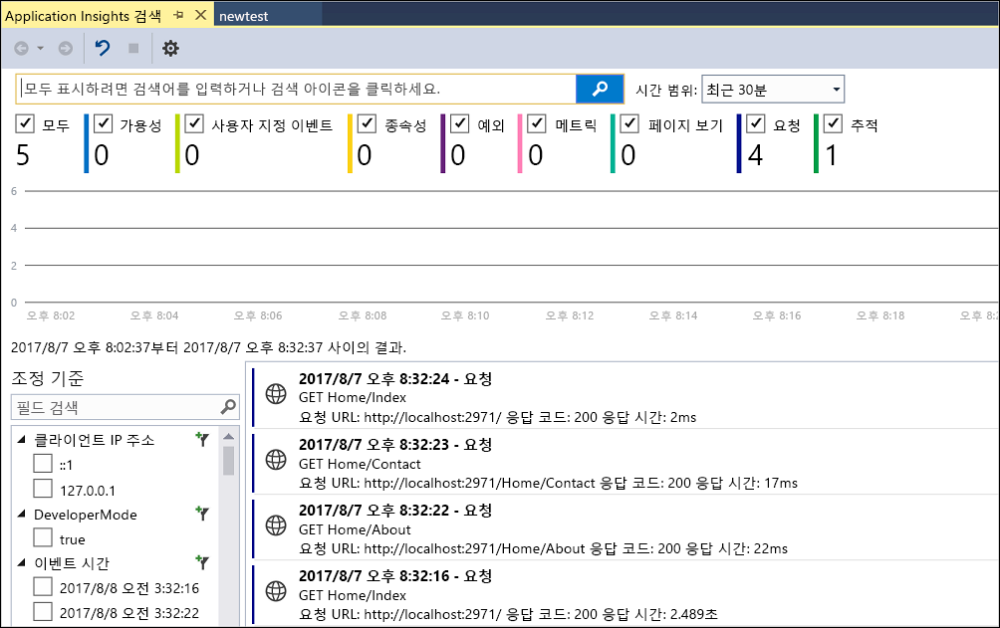
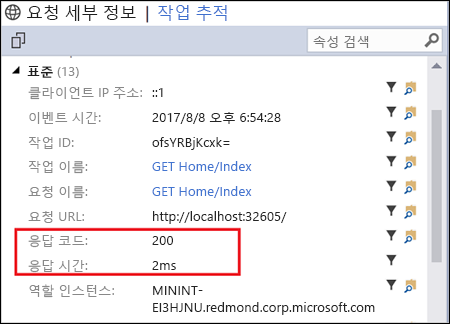
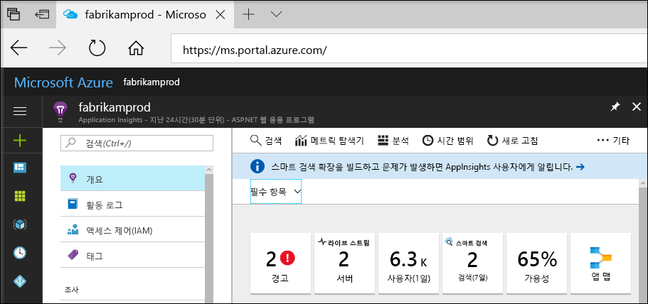
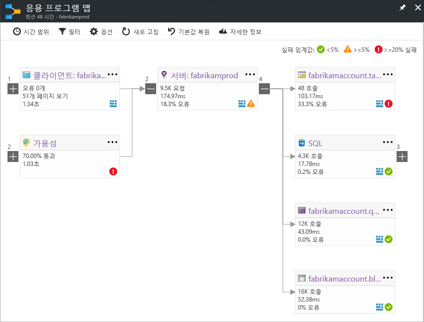
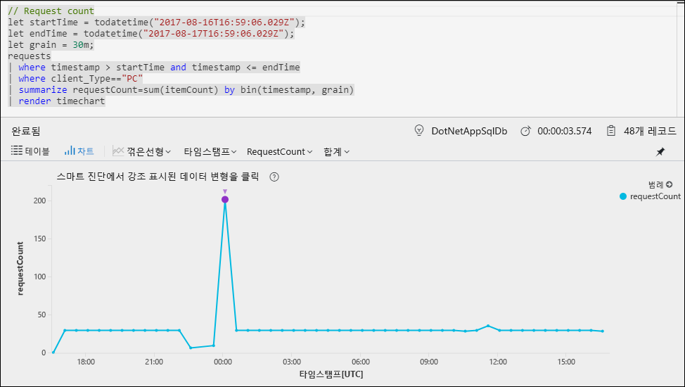
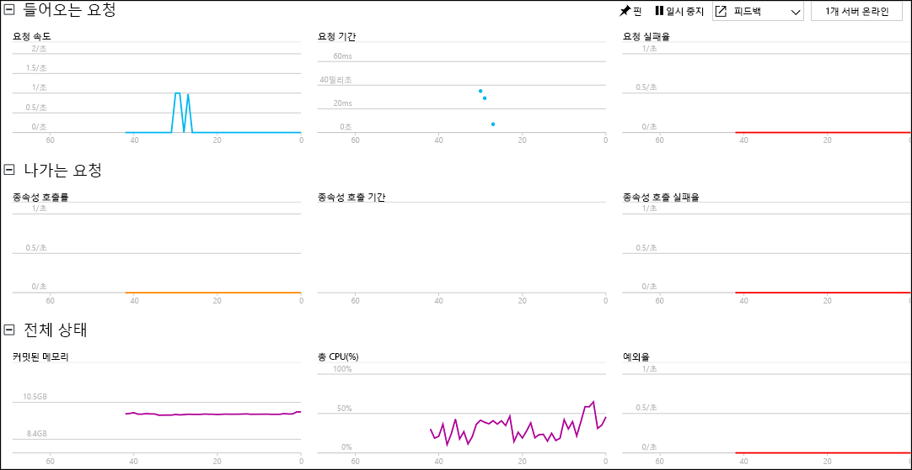

# ASP.NET 웹 응용 프로그램 모니터링 시작

Azure Application Insights를 사용하면 웹 응용 프로그램의 가용성, 성능 및 사용량을 손쉽게 모니터링할 수 있습니다.  또한 사용자 보고를 기다리지 않고 응용 프로그램에서 오류를 신속하게 식별하고 진단할 수 있습니다.  앱의 성능 및 효율성에 대한 Application Insights에서 수집하는 정보를 사용하면 응용 프로그램을 유지 관리하고 개선하는 데 더 많은 정보를 갖고 선택할 수 있습니다.

이 빠른 시작에서는 응용 프로그램을 분석하는 데 사용할 수 있는 다양한 방법 중 하나인 기존 ASP.NET 웹 응용 프로그램에 Application Insights를 추가하고 실시간 통계 분석을 시작하는 방법을 보여 줍니다. ASP.NET 웹 응용 프로그램이 없는 경우 [ASP.NET 웹앱 빠른 시작 만들기](../app-service/app-service-web-get-started-dotnet.md)에 따라 하나 만들 수 있습니다.

## 필수 조건
이 빠른 시작을 완료하려면 다음이 필요합니다.

- 다음 워크로드와 함께 [Visual Studio 2017](https://www.visualstudio.com/downloads/)을 설치합니다.
    - ASP.NET 및 웹 개발
    - Azure 개발

Azure 구독이 아직 없는 경우 시작하기 전에 [체험](https://azure.microsoft.com/free/) 계정을 만듭니다.

## Application Insights 사용

1. Visual Studio 2017에서 프로젝트를 엽니다.
2. 프로젝트 메뉴에서 **Application Insights 구성**을 선택합니다. Visual Studio는 응용 프로그램에 Application Insights SDK를 추가합니다.
3. **체험하기**를 클릭하고 기본 청구 계획을 선택하고 **등록**을 클릭합니다.

    

4. **디버그** 메뉴에서 **디버깅 시작**을 선택하거나 F5 키를 눌러서 응용 프로그램을 실행합니다.

## 앱 구성 확인

Application Insights는 실행 중인 위치에 관계 없이 응용 프로그램에 대한 원격 분석 데이터를 수집합니다. 이 데이터를 보기 시작하려면 다음 단계를 사용합니다.

1. **프로젝트** -> **Application Insights** -> **디버그 세션 원격 분석 검색**을 클릭하여 Application Insights를 엽니다.  현재 세션에서 원격 분석이 표시됩니다.  

2. 목록(이 예에서 홈/인덱스 가져오기)에서 첫 번째 요청을 클릭하여 요청 정보를 확인합니다. 요청에 관한 다른 중요한 정보와 함께 상태 코드 및 응답 시간이 모두 포함됩니다.  

## Azure Portal에서 모니터링 시작

이제 Azure Portal에서 Application Insights를 열어 실행 중인 응용 프로그램에 대한 다양한 세부 정보를 볼 수 있습니다.

1. 솔루션 탐색기에서 **연결된 서비스 Application Insights** 폴더를 마우스 오른쪽 단추로 클릭하고 **Application Insights 포털 열기**를 클릭합니다.  응용 프로그램에 대한 몇 가지 정보와 다양한 옵션이 표시됩니다.

    

2. **앱 맵**을 클릭하여 응용 프로그램 구성 요소 간의 종속 관계에 대한 시각적 레이아웃을 봅니다.  각 구성 요소에는 로드, 성능, 오류 및 경고와 같은 KPI가 표시됩니다.

    

3. 응용 프로그램 구성 요소 중 하나에서 **앱 분석** 아이콘 을 클릭합니다.  그러면 Application Insights에 의해 수집된 모든 데이터를 분석하기 위한 풍부한 쿼리 언어를 제공하는 **Application Insights Analytics**가 열립니다.  이 경우 요청 수를 차트로 렌더링하는 쿼리가 생성됩니다.  사용자 고유의 쿼리를 작성하여 다른 데이터를 분석할 수 있습니다.

    

4. **개요** 페이지로 돌아와서 **라이브 스트림**을 클릭합니다.  그러면 응용 프로그램이 실행될 때 이에 대한 실시간 통계가 표시됩니다.  여기에는 들어오는 요청 수, 그러한 요청의 기간 및 발생하는 모든 오류와 같은 정보가 포함됩니다.  또한 프로세서 및 메모리와 같은 중요한 성능 메트릭을 검사할 수 있습니다.

    

Azure에서 응용 프로그램을 호스팅할 준비가 되었으면 이제 게시할 수 있습니다. [ASP.NET 웹앱 빠른 시작 만들기](../app-service/app-service-web-get-started-dotnet.md#update-the-app-and-redeploy)에 설명된 단계를 따릅니다.

## 다음 단계
이 빠른 시작에서는 Azure Application Insights로 모니터링하기 위해 응용 프로그램을 활성화했습니다.  응용 프로그램에서 통계를 모니터링하고 문제를 감지하는 방법을 알아보려면 이 자습서를 계속합니다.

> [!div class="nextstepaction"]
> [Azure Application Insights 자습서](app-insights-tutorial-runtime-exceptions.md)