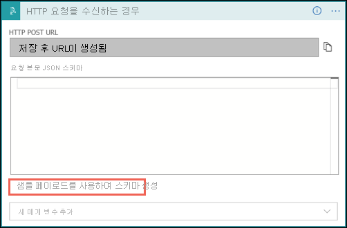
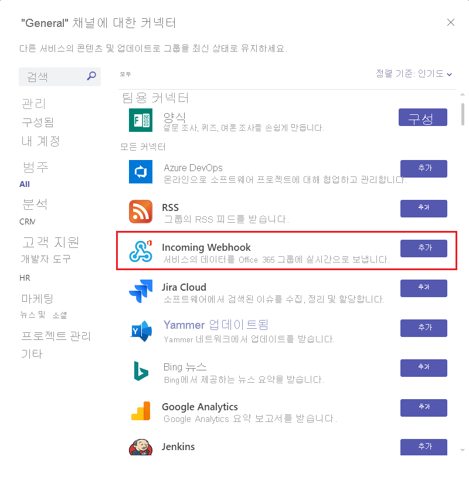
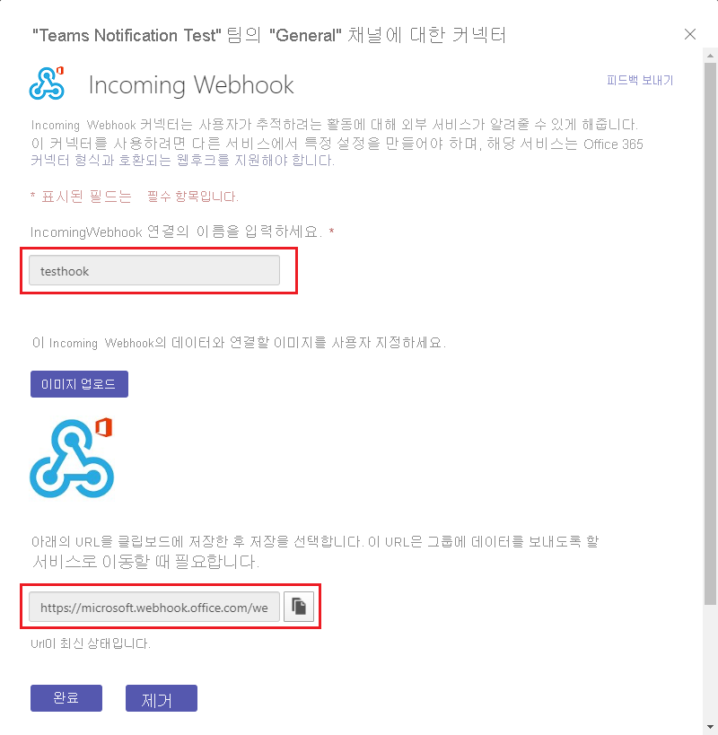
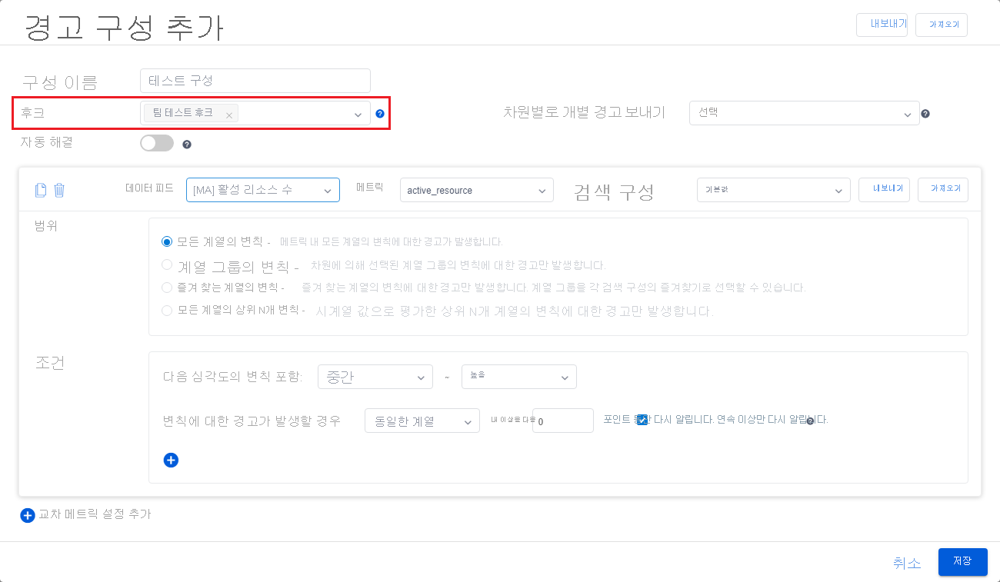

# <a name="tutorial-enable-anomaly-notification-in-metrics-advisor"></a>자습서: Metrics Advisor에서 변칙 알림 사용 

<!-- 2. Introductory paragraph 
Required. Lead with a light intro that describes, in customer-friendly language, 
what the customer will learn, or do, or accomplish. Answer the fundamental “why 
would I want to do this?” question. Keep it short.
-->


<!-- 3. Tutorial outline 
Required. Use the format provided in the list below.
-->

이 자습서에서는 다음과 같은 작업을 수행하는 방법을 살펴봅니다.

> [!div class="checklist"]
> * Metrics Advisor에서 후크 만들기
> * Azure Logic Apps를 사용하여 알림 보내기
> * Microsoft Teams에 알림 보내기
> * SMTP 서버를 통해 알림 보내기

<!-- 4. Prerequisites 
Required. First prerequisite is a link to a free trial account if one exists. If there 
are no prerequisites, state that no prerequisites are needed for this tutorial.
-->

## <a name="prerequisites"></a>필수 조건
### <a name="create-a-metrics-advisor-resource"></a>Metrics Advisor 리소스 만들기

Metrics Advisor 기능을 살펴보려면 Azure Portal에서 <a href="https://go.microsoft.com/fwlink/?linkid=2142156"  title="Metrics Advisor 리소스 만들기"  target="_blank">Metrics Advisor 리소스를 만들어</a> Metrics Advisor 인스턴스를 배포해야 할 수 있습니다.

### <a name="create-a-hook-in-metrics-advisor"></a>Metrics Advisor에서 후크 만들기
Metrics Advisor의 후크는 고객이 메트릭 변칙을 구독하고 다양한 채널을 통해 알림을 보낼 수 있는 브리지입니다. Metrics Advisor의 후크에는 다음 4개 형식이 있습니다. 
    
- 이메일 후크
- 웹후크
- Teams 후크
- Azure DevOps hook

각 후크 형식은 변칙 알림에 사용할 특정 채널에 해당합니다. 

<!-- 5. H2s
Required. Give each H2 a heading that sets expectations for the content that follows. 
Follow the H2 headings with a sentence about how the section contributes to the whole.
-->

## <a name="send-notifications-with-logic-apps-teams-and-smtp"></a>Logic Apps, Teams 및 SMTP를 사용하여 알림 보내기

#### <a name="logic-apps"></a>[Logic Apps](#tab/logic)

### <a name="send-email-notification-by-using-azure-logic-apps"></a>Azure Logic Apps를 사용하여 메일 알림 보내기

<!-- Introduction paragraph -->
Metrics Advisor에서 지원되는 메일 알림을 보내는 일반적인 옵션에는 두 가지가 있습니다. 한 옵션은 웹후크 및 Azure Logic Apps를 사용하여 메일 경고를 보내는 것이고, 다른 옵션은 SMTP 서버를 설정하고 이를 사용하여 메일 경고를 직접 보내는 것입니다. 이 섹션에서는 사용 가능한 SMTP 서버가 없는 고객이 더 쉽게 사용할 수 있는 첫 번째 옵션에 중점을 둡니다.

**1단계.** Metrics Advisor에서 웹후크 만들기

웹후크는 Metrics Advisor 서비스에서 사용할 수 있는 모든 정보의 진입점으로, 경고가 트리거될 때 사용자가 제공한 API를 호출합니다. 모든 경고는 웹후크를 통해 보낼 수 있습니다.

Metrics Advisor 작업 영역에서 **후크** 탭을 선택하고 **후크 만들기** 단추를 선택합니다. **웹후크** 의 후크 형식을 선택합니다. 필수 매개 변수를 입력하고 **확인** 을 선택합니다. 자세한 단계는 [웹후크 만들기](../how-tos/alerts.md#web-hook)를 참조하세요.

작성해야 하는 **엔드포인트** 의 추가 매개 변수가 하나 있습니다. 이 작업은 아래 3단계를 완료한 후 수행할 수 있습니다. 


**2단계.** 논리 앱 리소스 만들기

[Azure Portal](https://portal.azure.com)에서 [논리 앱 만들기](../../../logic-apps/quickstart-create-first-logic-app-workflow.md)의 지침에 따라 빈 논리 앱을 만듭니다. **Logic Apps 디자이너** 가 표시되면 이 자습서로 돌아갑니다.


**3단계.** **HTTP 요청을 수신한 경우** 의 트리거를 추가합니다.

- Azure Logic Apps는 다양한 작업을 사용하여 정의된 워크플로를 트리거합니다. 이 사용 사례의 경우 **HTTP 요청을 수신한 경우** 의 트리거를 사용합니다. 

- **HTTP 요청을 수신한 경우** 대화 상자에서 **샘플 페이로드를 사용하여 스키마 생성** 을 선택합니다.

    

    다음 샘플 JSON을 텍스트 상자에 복사하고, **완료** 를 선택합니다.

    ```json
    {
    "properties": {
        "value": {
            "items": {
                "properties": {
                    "alertInfo": {
                        "properties": {
                            "alertId": {
                                "type": "string"
                            },
                            "anomalyAlertingConfigurationId": {
                                "type": "string"
                            },
                            "createdTime": {
                                "type": "string"
                            },
                            "modifiedTime": {
                                "type": "string"
                            },
                            "timestamp": {
                                "type": "string"
                            }
                        },
                        "type": "object"
                    },
                    "alertType": {
                        "type": "string"
                    },
                    "callBackUrl": {
                        "type": "string"
                    },
                    "hookId": {
                        "type": "string"
                    }
                },
                "required": [
                    "hookId",
                    "alertType",
                    "alertInfo",
                    "callBackUrl"
                ],
                "type": "object"
            },
            "type": "array"
        }
    },
    "type": "object"
     }
    ```

- 메서드를 ‘POST’로 선택하고 **저장** 을 선택합니다. 이제 HTTP 요청 트리거의 URL을 볼 수 있습니다. 복사 아이콘을 선택하여 복사하고 1단계의 **엔드포인트** 에서 다시 입력합니다. 

    

**4단계.** ‘HTTP’ 작업을 사용하여 다음 단계 추가

웹후크를 통해 푸시되는 신호에는 timestamp, alertID, configurationID 등의 제한된 정보만 포함됩니다. 신호에 제공된 콜백 URL을 사용하여 자세한 정보를 쿼리해야 합니다. 이 단계는 자세한 경고 정보를 쿼리하는 것입니다.  

- ‘GET’의 메서드 선택
- ‘URI’의 ‘동적 콘텐츠’ 목록에서 ‘callBackURL’을 선택합니다.
- ‘헤더’에 ‘Content-Type’ 키를 입력하고 ‘application/json’ 값을 입력합니다.
- ‘헤더’에 ‘x-api-key’ 키를 입력하고 Metrics Advisor 작업 영역에서 **‘API 키’** 탭을 클릭하여 이 키를 가져옵니다. 이 단계는 워크플로에 API 호출에 대한 충분한 권한이 있는지 확인하는 것입니다.

    

**5단계** ‘JSON 구문 분석’에 다음 단계 추가 

메일 콘텐츠의 형식을 더 쉽게 지정하려면 API의 응답을 구문 분석해야 합니다. 
 
> [!NOTE] 
> 이 자습서에서는 빠른 예제만 공유합니다. 최종 메일 형식을 추가로 디자인해야 합니다. 

- ‘콘텐츠’의 ‘동적 콘텐츠’ 목록에서 ‘Body’를 선택합니다.
- **샘플 페이로드를 사용하여 스키마 생성** 을 선택합니다. 다음 샘플 JSON을 텍스트 상자에 복사하고, **완료** 를 선택합니다.

```json
{
    "properties": {
        "@@nextLink": {},
        "value": {
            "items": {
                "properties": {
                    "properties": {
                        "properties": {
                            "IncidentSeverity": {
                                "type": "string"
                            },
                            "IncidentStatus": {
                                "type": "string"
                            }
                        },
                        "type": "object"
                    },
                    "rootNode": {
                        "properties": {
                            "createdTime": {
                                "type": "string"
                            },
                            "detectConfigGuid": {
                                "type": "string"
                            },
                            "dimensions": {
                                "properties": {
                                },
                                "type": "object"
                            },
                            "metricGuid": {
                                "type": "string"
                            },
                            "modifiedTime": {
                                "type": "string"
                            },
                            "properties": {
                                "properties": {
                                    "AnomalySeverity": {
                                        "type": "string"
                                    },
                                    "ExpectedValue": {}
                                },
                                "type": "object"
                            },
                            "seriesId": {
                                "type": "string"
                            },
                            "timestamp": {
                                "type": "string"
                            },
                            "value": {
                                "type": "number"
                            }
                        },
                        "type": "object"
                    }
                },
                "required": [
                    "rootNode",
                    "properties"
                ],
                "type": "object"
            },
            "type": "array"
        }
    },
    "type": "object"
}
```

**6단계.** ‘HTML 테이블 만들기’에 다음 단계 추가

많은 정보가 API 호출에서 반환되었지만 시나리오에 따라 일부 정보는 유용하지 않을 수 있습니다. 관심을 가지고 경고 메일에 포함하려는 항목을 선택합니다. 

다음은 경고 메일에 포함할 ‘timestamp’, ‘metricGUID’ 및 ‘dimension’을 선택하는 HTML 테이블 예제입니다.


**7단계** ‘메일 보내기’에 마지막 단계 추가

Microsoft 호스팅 제품과 타사 제품에 관한 메일을 둘 다 보내는 여러 가지 옵션이 있습니다. 고객은 선택한 옵션에 대한 테넌트/계정이 있어야 할 수 있습니다. 예를 들어, 서버로 ‘Office 365 Outlook’을 선택하는 경우입니다. 연결 및 권한 부여를 빌드하기 위해 로그인 프로세스가 펌프됩니다. 메일 서버를 사용하여 경고를 보내도록 API 연결이 설정됩니다. 

메일에 ‘본문’, ‘제목’에 포함하려는 콘텐츠를 입력하고 ‘받는 사람’에 메일 주소를 입력합니다. 


                                                                   
#### <a name="teams-channel"></a>[Teams 채널](#tab/teams)
                                           
### <a name="send-anomaly-notification-through-a-microsoft-teams-channel"></a>Microsoft Teams 채널을 통해 변칙 알림 보내기                            
이 섹션에서는 Microsoft Teams 채널을 통해 변칙 알림을 보내는 사례를 안내합니다. 이를 통해 팀 멤버가 Metrics Advisor에서 검색한 변칙을 분석하기 위해 협업하는 시나리오를 사용할 수 있습니다. 워크플로는 구성하기 쉬우며 필수 조건이 많지 않습니다. 
                                               


**1단계.** Teams 채널에 ‘들어오는 웹후크’ 커넥터 추가

- 알림을 보내려는 Teams 채널로 이동하고 ‘•••’(추가 옵션)를 선택합니다. 
- 드롭다운 목록에서 ‘커넥터’를 선택합니다. 새 대화 상자에서 ‘들어오는 웹후크’를 검색하고 ‘추가’를 클릭합니다.

        

- ‘커넥터’ 옵션을 볼 수 없는 경우 Teams 그룹 소유자에게 문의하세요. ‘팀 관리’를 선택한 다음, 위쪽에서 ‘설정’ 탭을 선택하고, ‘멤버가 커넥터를 만들고, 업데이트하고, 제거하도록 허용’ 설정이 선택되어 있는지 확인합니다.

        

- 커넥터의 이름을 입력하고 이미지를 업로드하여 아바타로 설정할 수도 있습니다. ‘만들기’를 선택하면 들어오는 웹후크 커넥터가 채널에 성공적으로 추가됩니다. URL이 대화 상자 아래쪽에 생성됩니다. **‘복사’를 선택** 한 다음, ‘완료’를 선택해야 합니다. 

     

**2단계.** Metrics Advisor에서 새 ‘Teams 후크’ 만들기

- 왼쪽 탐색 모음에서 ‘후크’ 탭을 선택하고 페이지의 오른쪽 위에서 ‘후크 만들기’ 단추를 선택합니다. 
- ‘Teams’의 후크 형식을 선택한 다음, 이름을 입력하고, 위 단계에서 복사한 URL을 붙여넣습니다. 
- '저장'을 선택합니다. 

     

**3단계.** 경고 구성에 Teams 후크 적용

이동하고 온보딩한 데이터 피드 중 하나를 선택합니다. 피드 내에서 메트릭을 선택하고 메트릭 세부 정보 페이지를 엽니다. ‘경고 구성’을 만들어 검색되는 변칙을 구독하고 Teams 채널을 통해 알립니다. 

‘+’ 단추를 선택하고, 직접 만든 후크를 선택하고, 다른 필드를 입력하고, ‘저장’을 선택합니다. 그러면 경고 구성에 Teams 후크를 적용할 수 있습니다. 모든 새 변칙은 Teams 채널을 통해 알립니다.




#### <a name="smtp-e-mail"></a>[SMTP 전자 메일](#tab/smtp)

### <a name="send-email-notification-by-configuring-an-smtp-server"></a>SMTP 서버를 구성하여 메일 알림 보내기

이 섹션에서는 SMTP 서버를 사용하여 검색된 변칙에 관한 메일 알림을 보내는 사례를 공유합니다. 사용할 수 있는 SMTP 서버가 있고 계정 이름 및 암호 같은 매개 변수를 가져올 충분한 권한이 있는지 확인합니다.

**1단계.** 계정을 ‘Cognitive Services Metrics Advisor 관리자’ 역할로 할당합니다.  

- 구독 관리자 또는 리소스 그룹 관리자 권한이 있는 사용자는 Azure Portal에서 만든 Metrics Advisor 리소스로 이동하고 액세스 제어(IAM) 탭을 선택해야 합니다.
- ‘역할 할당 추가’를 선택합니다.
- ‘Cognitive Services Metrics Advisor 관리자’ 역할을 선택하고 아래 이미지와 같이 계정을 선택합니다.
- ‘저장’ 단추를 선택하면 Metrics Advisor 리소스의 관리자로 추가됩니다. 위 모든 작업은 구독 관리자나 리소스 그룹 관리자가 수행해야 합니다. 권한을 전파하는 데 최대 1분 정도 걸릴 수 있습니다. 


**2단계.** Metrics Advisor 작업 영역에서 SMTP 서버 구성

위 단계를 완료한 후 Metrics Advisor 리소스의 관리자로 성공적으로 추가되었습니다. 권한이 전파될 때까지 몇 분 정도 기다립니다. 그런 다음, Metrics Advisor 작업 영역에 로그인하면 왼쪽 탐색 패널에서 ‘메일 설정’이라는 새 탭을 볼 수 있습니다. 이 탭을 선택하고 구성을 계속합니다. 

작성할 매개 변수: 

- SMTP 서버 이름(**필수**): SMTP 서버 공급자의 이름을 입력합니다. 대부분의 서버 이름은 “smtp.domain.com” 또는 “mail.domain.com” 형식으로 작성됩니다. 예를 들어, Office365에서는 ‘smtp.office365.com’으로 설정되어야 합니다. 
- SMTP 서버 포트(**필수**): 포트 587은 최신 웹에서 SMTP 제출을 위한 기본 포트입니다. 제출에 다른 포트를 사용할 수 있지만(다음에 자세히 설명), 항상 기본값인 포트 587로 시작하고 상황이 허용되는 경우에만(예: 어떤 이유로 포트 587을 차단하는 호스트) 다른 포트를 사용해야 합니다.
- 메일 보낸 사람(**필수**): 메일을 보내야 하는 실제 메일 계정입니다. 보낸 사람의 계정 이름과 암호를 입력해야 할 수 있습니다. 한 계정에 대해 1분 내에 보낼 최대 경고 메일 수의 할당량 임계값을 설정할 수 있습니다. 1분 내에 많은 경고를 보낼 가능성이 있는 경우 여러 보낸 사람을 설정할 수 있지만 하나 이상의 계정을 설정해야 합니다. 
- 대신 보내기(선택 사항): 여러 보낸 사람을 구성했지만 경고 메일을 한 계정에서 보내는 것처럼 표시하려는 경우입니다. 이 필드를 사용하여 경고 메일을 정렬할 수 있습니다. 그러나 계정을 대신하여 메일을 보내도록 허용하려면 보낸 사람에게 권한을 부여해야 할 수 있습니다.  
- 기본 참조(선택 사항): 모든 메일 경고에서 참조가 될 기본 메일 주소를 설정합니다. 

구성된 SMTP 서버의 예제는 다음과 같습니다.


**3단계.** Metrics Advisor에서 메일 후크 만들기

SMTP 서버를 성공적으로 구성한 후에는 Metrics Advisor의 ‘후크’ 탭에서 ‘메일 후크’를 만들 수 있습니다. ‘메일 후크’를 만드는 방법에 관한 자세한 내용은 [경고 관련 문서](../how-tos/alerts.md#email-hook)를 참조하고 완료까지 단계를 수행합니다.

**4단계.** 경고 구성에 메일 후크 적용

 이동하여 온보딩한 데이터 피드 중 하나를 선택하고, 피드 내에서 메트릭을 선택하고, 메트릭 세부 정보 페이지를 엽니다. ‘경고 구성’을 만들어 메일을 통해 검색되고 전송된 변칙을 구독할 수 있습니다. 

‘+’ 단추를 선택하고, 직접 만든 후크를 선택하고, 다른 필드를 입력하고, ‘저장’을 선택합니다. 이제 사용자 지정 경고 구성을 사용하여 메일 후크를 설정했으므로 새 변칙은 SMTP 서버를 사용하여 후크를 통해 에스컬레이션됩니다. 


---

## <a name="next-steps"></a>다음 단계

다음 문서로 이동하여 만드는 방법을 알아봅니다.
> [!div class="nextstepaction"]
> [유효한 쿼리 작성](write-a-valid-query.md)

<!--
Remove all the comments in this template before you sign-off or merge to the 
main branch.
-->
