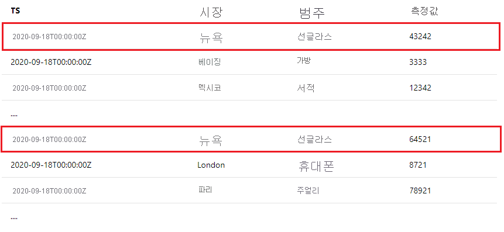

<!--
Remove all the comments in this template before you sign-off or merge to the 
main branch.
-->

<!--
This template provides the basic structure of a tutorial article.
See the [tutorial guidance](contribute-how-to-mvc-tutorial.md) in the contributor guide.

To provide feedback on this template contact 
[the templates workgroup](mailto:templateswg@microsoft.com).
-->

<!-- 1. H1 
Required. Start with "Tutorial: ". Make the first word following "Tutorial: " a 
verb.
-->

# <a name="tutorial-write-a-valid-query-to-onboard-metrics-data"></a>자습서: 메트릭 데이터를 온보딩하는 유효한 쿼리 작성

<!-- 2. Introductory paragraph 
Required. Lead with a light intro that describes, in customer-friendly language, 
what the customer will learn, or do, or accomplish. Answer the fundamental “why 
would I want to do this?” question. Keep it short.
-->


<!-- 3. Tutorial outline 
Required. Use the format provided in the list below.
-->

이 자습서에서는 다음과 같은 작업을 수행하는 방법을 살펴봅니다.

> [!div class="checklist"]
> * 유효한 데이터 온보딩 쿼리를 작성하는 방법
> * 일반적인 실수 및 방지 방법

<!-- 4. Prerequisites 
Required. First prerequisite is a link to a free trial account if one exists. If there 
are no prerequisites, state that no prerequisites are needed for this tutorial.
-->

## <a name="prerequisites"></a>필수 조건

### <a name="create-a-metrics-advisor-resource"></a>Metrics Advisor 리소스 만들기

Metrics Advisor 기능을 탐색하려면 Azure Portal에서 <a href="https://go.microsoft.com/fwlink/?linkid=2142156"  title="Create a Metrics Advisor resource"  target="_blank">Metrics Advisor 리소스를 만들어</a> Metrics Advisor 인스턴스를 배포해야 할 수 있습니다.

<!-- 5. H2s
Required. Give each H2 a heading that sets expectations for the content that follows. 
Follow the H2 headings with a sentence about how the section contributes to the whole.
-->

## <a name="data-schema-requirements"></a>데이터 스키마 요구 사항
<!-- Introduction paragraph -->

[!INCLUDE [data schema requirements](../includes/data-schema-requirements.md)]


## <a name="span-idingestion-workhow-does-data-ingestion-work-in-metrics-advisorspan"></a><span id="ingestion-work">Metrics Advisor에서 데이터 수집은 어떻게 작동하나요?</span>

Metrics Advisor로 메트릭을 온보딩하는 경우 일반적으로 두 가지 방법이 있습니다.
<!-- Introduction paragraph -->
- 메트릭을 예상 스키마에 미리 집계하고 데이터를 특정 파일에 저장합니다. 온보딩하는 동안 경로 템플릿을 입력하면 Metrics Advisor가 지속적으로 경로에서 새 파일을 가져오고 메트릭에서 검색을 수행합니다. 이는 Azure Data Lake 및 Azure Blob Storage 같은 데이터 원본에 대한 일반적인 사례입니다.
- Azure SQL Server, Azure Data Explorer와 같은 데이터 원본 또는 쿼리 스크립트 사용을 지원하는 기타 원본에서 데이터를 수집할 경우 쿼리를 올바르게 생성해야 합니다. 이 문서에서는 메트릭 데이터를 예상대로 온보딩하는 유효한 쿼리를 작성하는 방법을 알아봅니다. 


### <a name="what-is-an-interval"></a>간격이란?

메트릭은 비즈니스 요구 사항에 따라 특정 세분성으로 모니터링해야 합니다. 예를 들어 비즈니스 KPI(핵심 성과 지표)는 일별 세분성으로 모니터링됩니다. 그러나 서비스 성능 메트릭은 분/시간 세분성으로 모니터링되는 경우가 많습니다. 따라서 원본에서 메트릭 데이터를 수집하는 빈도가 다릅니다. 

Metrics Advisor는 시간 간격마다 메트릭 데이터를 지속적으로 가져오기 때문에 **간격은 메트릭의 세분성과 같습니다.** Metrics Advisor는 매번 사용자가 작성한 쿼리를 실행하여 이 특정 간격으로 데이터를 수집합니다. 이 데이터 수집 메커니즘에 따라 쿼리 스크립트는 **데이터베이스에 있는 모든 메트릭 데이터를 반환하지 않지만 결과를 단일 간격으로 제한해야 합니다.**


## <a name="how-to-write-a-valid-query"></a>유효한 쿼리를 작성하는 방법
<!-- Introduction paragraph -->
### <a name="span-iduse-parameters-use-intervalstart-and-intervalend-to-limit-query-resultsspan"></a><span id="use-parameters"> @IntervalStart 및 @IntervalEnd를 사용하여 쿼리 결과 제한</span>

 이를 위해 쿼리에서 사용할 두 개의 매개 변수 **@IntervalStart** 및 **@IntervalEnd** 가 제공되었습니다. 

쿼리가 실행될 때마다 @IntervalStart 및 @IntervalEnd는 자동으로 최신 간격 타임스탬프로 업데이트되고 해당 메트릭 데이터를 가져옵니다. @IntervalEnd는 항상 @IntervalStart + 1 세분성으로 할당됩니다. 

다음은 Azure SQL Server에서 이 두 매개 변수를 적절히 사용하는 예입니다. 

```SQL
SELECT [timestampColumnName] AS timestamp, [dimensionColumnName], [metricColumnName] FROM [sampleTable] WHERE [timestampColumnName] >= @IntervalStart and [timestampColumnName] < @IntervalEnd;
```

이러한 방식으로 쿼리 스크립트를 작성하면 메트릭의 타임스탬프가 각 쿼리 결과에 대해 동일한 간격으로 떨어집니다. Metrics Advisor는 자동으로 타임스탬프를 메트릭의 세분성에 맞춥니다. 

### <a name="span-iduse-aggregation-use-aggregation-functions-to-aggregate-metricsspan"></a><span id="use-aggregation"> 집계 함수를 사용하여 메트릭 집계</span>

고객 데이터 원본 내에 많은 열이 있는 경우가 일반적이지만, 모든 열을 모니터링하거나 차원으로 포함하는 것이 타당한 것은 아닙니다. 고객은 집계 함수를 사용하여 메트릭을 집계하고 의미 있는 열만 차원으로 포함할 수 있습니다.

다음은 고객의 데이터 원본에 10개 이상의 열이 있지만 그 중 일부만 의미가 있으며 모니터링할 메트릭에 포함 및 집계해야 하는 예입니다. 

| TS | 시장 | 디바이스 OS | 범주 | ... | Measure1 | Measure2 | Measure3 |
| ----------|--------|-----------|----------|-----|----------|----------|----------|
| 2020-09-18T12:23:22Z | 뉴욕 | iOS | 선글라스 | ...| 43242 | 322 | 54546|
| 2020-09-18T12:27:34Z | 베이징 | Android | 가방 | ...| 3333 | 126 | 67677 |
| ...

고객이 **'Measure1'** 을 **시간별 세분성** 으로 모니터링하고 **'Market'** 및 **'Category'** 를 차원으로 선택하려는 경우 집계 함수를 올바르게 사용하여 이를 달성하는 방법의 예는 다음과 같습니다. 

- SQL 샘플:  

    ```sql
        SELECT dateadd(hour, datediff(hour, 0, TS),0) as NewTS
        ,Market
        ,Category
        ,sum(Measure1) as M1
        FROM [dbo].[SampleTable] where TS >= @IntervalStart and TS < @IntervalEnd
        group by Market, Category, dateadd(hour, datediff(hour, 0, TS),0)
    ```
- Azure Data Explorer 샘플:

    ```kusto
        SampleTable
        | where TS >= @IntervalStart and TS < @IntervalEnd
        | summarize M1 = sum(Measure1) by Market, Category, NewTS = startofhour(TS)
    ```    

> [!Note]
> 위의 경우 고객은 시간별 세분성으로 메트릭을 모니터링하려고 하지만 원시 TS(타임스탬프)가 정렬되지 않습니다. 집계 문 내에서 **타임스탬프에 대한 프로세스** 는 시간에 정렬되고 'NewTS'라는 새 타임스탬프 열을 생성해야 합니다. 


## <a name="common-errors-during-onboarding"></a>온보딩 중 일반적인 오류

- **오류:** 쿼리 결과에 여러 타임스탬프 값이 있습니다.

    쿼리 결과를 한 간격 이내로 제한하지 않은 경우의 일반적인 오류입니다. 예를 들어 일별 세분성으로 메트릭을 모니터링하는 경우 쿼리에서 다음과 같은 결과를 반환하면 이 오류가 발생합니다. 

    
    
    타임스탬프 값이 여러 개 있으며 동일한 메트릭 간격(1일)에 있지 않습니다. [Metrics Advisor에서 데이터 수집은 어떻게 작동하나요?](#ingestion-work)를 확인하고 Metrics Advisor가 각 메트릭 간격에서 메트릭 데이터를 가져온다는 것을 이해하세요. 그런 다음 쿼리에서 **@IntervalStart** 및 **@IntervalEnd** 를 사용하여 쿼리 결과를 한 간격 이내로 제한해야 합니다. 자세한 지침 및 샘플은 [@IntervalStart 및 @IntervalEnd를 사용하여 쿼리 결과 제한](#use-parameters)을 확인하세요. 


- **오류:** 하나의 메트릭 간격 내에서 동일한 차원 조합에 대해 중복 메트릭 값이 발견되었습니다.
    
    한 간격 내에서 Metrics Advisor는 동일한 차원 조합에 대해 하나의 메트릭 값만 예상합니다. 예를 들어 일별 세분성으로 메트릭을 모니터링하는 경우 쿼리에서 다음과 같은 결과를 반환하면 이 오류가 발생합니다.

    

    자세한 지침 및 샘플은 [집계 함수를 사용하여 메트릭 집계](#use-aggregation)를 참조하세요. 

<!-- 7. Next steps
Required: A single link in the blue box format. Point to the next logical tutorial 
in a series, or, if there are no other tutorials, to some other cool thing the 
customer can do. 
-->

## <a name="next-steps"></a>다음 단계

만드는 방법을 알아보려면 다음 문서를 진행하세요.
> [!div class="nextstepaction"]
> [변칙 알림 사용](enable-anomaly-notification.md)

<!--
Remove all the comments in this template before you sign-off or merge to the 
main branch.
