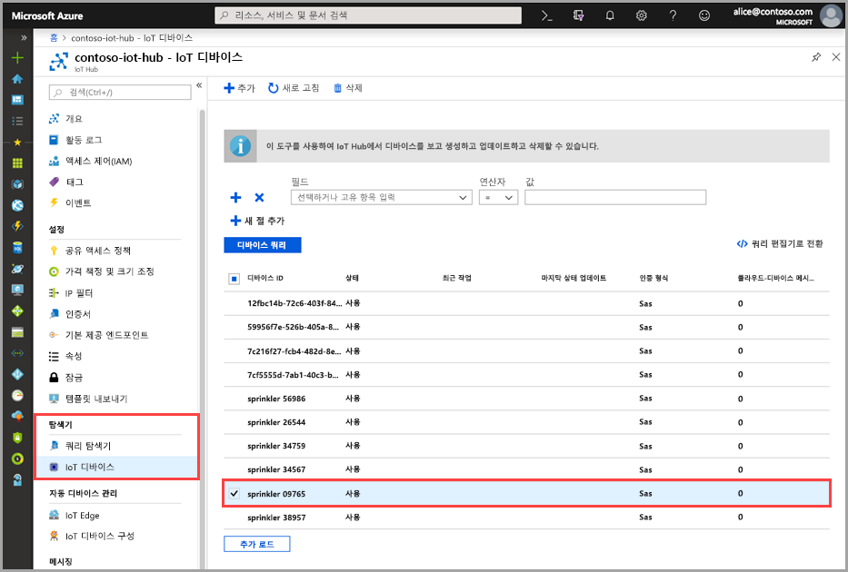
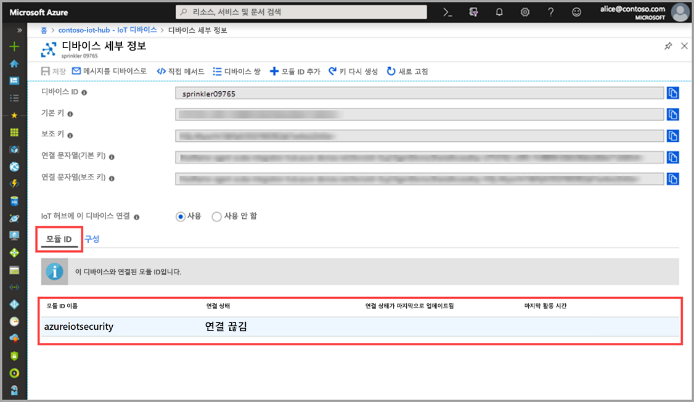

# 빠른 시작: azureiotsecurity 모듈 쌍 만들기

> [!IMPORTANT]
> IoT용 Azure Security Center는 현재 공개 미리 보기 상태입니다. 이 미리 보기 버전은 서비스 수준 계약 없이 제공되며 프로덕션 워크로드에는 사용하지 않는 것이 좋습니다. 특정 기능이 지원되지 않거나 기능이 제한될 수 있습니다. 자세한 내용은 [Microsoft Azure Preview에 대한 추가 사용 약관](https://azure.microsoft.com/support/legal/preview-supplemental-terms/)을 참조하세요.

이 빠른 시작에서는 새 디바이스에 대한 개별 _azureiotsecurity_ 모듈 쌍을 만들거나 IoT Hub의 모든 디바이스에 대한 모듈 쌍을 일괄 처리 방식으로 만드는 방법에 대해 설명합니다.  

## azureiotsecurity 모듈 쌍 이해 

Azure에 구축된 IoT 솔루션의 경우 디바이스 쌍은 디바이스 관리와 프로세스 자동화 모두에서 중요한 역할을 수행합니다. 

IoT용 Azure Security Center(ASC)는 기존 IoT 디바이스 관리 플랫폼과 완벽하게 통합되어 디바이스 보안 상태를 관리하고 기존 디바이스 제어 기능을 활용할 수 있도록 지원합니다.
IoT용 ASC 통합은 IoT Hub 쌍 메커니즘을 활용함으로써 달성됩니다.  

Azure IoT Hub에 있는 모듈 쌍의 일반적인 개념에 대한 자세한 내용은 [IoT Hub 모듈 쌍](https://docs.microsoft.com/azure/iot-hub/iot-hub-devguide-module-twins)을 참조하세요. 
 
IoT용 ASC는 모듈 쌍 메커니즘을 사용하고 각 디바이스에 대한 _azureiotsecurity_라는 보안 모듈 쌍을 유지 관리합니다.
보안 모듈 쌍에는 각 디바이스에 대한 디바이스 보안과 관련된 모든 정보가 포함되어 있습니다. 
 
IoT용 ASC 기능을 최대한 활용하려면 서비스 내 모든 디바이스에 대해 이러한 보안 모듈 쌍을 만들고, 구성하고, 사용해야 합니다.  

## azureiotsecurity 모듈 쌍 만들기 

_azureiotsecurity_ 모듈 쌍은 두 가지 방법으로 만들 수 있습니다.
1. [모듈 배치 스크립트](https://aka.ms/iot-security-github-create-module) - 기본 구성을 사용하는 모듈 쌍이 없는 디바이스 또는 새 디바이스의 모듈 쌍을 자동으로 만듭니다.
2. 각 디바이스별로 특정 구성을 사용하여 각 모듈 쌍을 개별적으로 수동 편집합니다.

>[!NOTE] 
> 일괄 처리 메서드를 사용해도 기존의 azureiotsecurity 모듈 쌍은 덮어써지지 않습니다. 일괄 처리 메서드를 사용하면 모듈 쌍이 아직 없는 디바이스에 대한 새 보안 모듈 쌍만 만들어집니다. 

기존 모듈 쌍의 구성을 수정하거나 변경하는 방법에 대한 자세한 내용은 [에이전트 구성](how-to-agent-configuration.md)을 참조하세요. 

디바이스의 새 _azureiotsecurity_ 모듈 쌍을 수동으로 만들려면 다음 지침을 사용합니다. 

1. IoT Hub에서 IoT Hub에 사용할 보안 모듈 쌍을 만들려는 디바이스를 찾아서 선택합니다.
1. 디바이스를 클릭한 후 **모듈 ID 추가**를 클릭합니다.
1. **모듈 ID 이름** 필드에 **azureiotsecurity**를 입력합니다.

1. **저장**을 클릭합니다. 

## 만든 모듈 쌍 확인

특정 디바이스에 대한 보안 모듈 쌍이 있는지 확인하려면 다음을 수행합니다.

1. Azure IoT Hub의 **탐색기** 메뉴에서 **IoT 디바이스**를 선택합니다.    
1. **디바이스 쿼리 필드**에서 디바이스 ID를 입력하거나 옵션을 선택하고, **디바이스 쿼리**를 클릭합니다. 
    
1. 디바이스를 선택하거나 두 번 클릭하여 디바이스 세부 정보 페이지를 엽니다. 
1. **모듈 ID** 메뉴를 선택하고, 디바이스와 연결된 모듈 ID 목록에서 **azureiotsecurity** 모듈이 있는지 확인합니다. 
    

IoT용 ASC 모듈 쌍의 속성을 사용자 지정하는 방법에 대한 자세한 내용은 [에이전트 구성](how-to-agent-configuration.md)을 참조하세요.

## 다음 단계

사용자 지정 경고를 구성하는 방법을 알아보려면 다음 문서로 계속 진행하세요.

> [!div class="nextstepaction"]
> [사용자 지정 경고 구성](quickstart-create-custom-alerts.md)
