<properties
	pageTitle="Azure 자동화 시작 | Microsoft Azure"
	description="Azure에서 자동화 작업을 가져오고 실행하는 방법에 대해 알아봅니다."
	services="automation"
	documentationCenter=""
	authors="bwren"
	manager="stevenka"
	editor=""/>

<tags
	ms.service="automation"
	ms.workload="tbd"
	ms.tgt_pltfrm="na"
	ms.devlang="na"
	ms.topic="hero-article" 
	ms.date="09/08/2015"
	ms.author="bwren"/>

# Azure 자동화 시작

## Azure 자동화 정의

Microsoft Azure 자동화를 통해 사용자는 일반적으로 클라우드 환경에서 장시간 동안 수동으로 실행되며 오류가 발생하기 쉬운 자주 반복되는 작업을 자동화할 수 있습니다. 실제로 Windows PowerShell 워크플로를 기반으로 하는 Runbook을 사용하여 Azure 환경에서 리소스를 만들고, 모니터링하고, 관리하고, 배포할 수 있습니다. 이 문서에서는 간단한 예제 Runbook을 실행하는 자습서를 살펴봅니다. 그런 다음 서비스의 고급 기능을 탐색할 수 있는 리소스를 확인합니다.

## 자습서
이 자습서에서는 자동화 계정을 만들고 샘플 "Hello World" Runbook을 Azure 자동화로 가져오고 Runbook을 실행한 후 출력을 확인하는 작업을 단계별로 안내합니다.

이 자습서를 완료하려면 Azure 구독이 필요합니다. 계정이 아직 없는 경우 [MSDN 구독자 혜택을 활성화](../pricing/member-offers/msdn-benefits-details/)하거나 [무료 평가판에 등록](../pricing/free-trial.md)</a>할 수 있습니다.

[AZURE.INCLUDE [automation-note-authentication](../../includes/automation-note-authentication.md)]

## 연습 동영상

이 자습서의 연습은 다음과 같습니다.

[AZURE.VIDEO get-started-with-azure-automation]

## 자동화 계정 만들기

자동화 계정은 Azure 자동화 리소스에 대한 컨테이너입니다. 환경을 분리하거나 워크플로를 추가로 구성하는 방법을 제공합니다. 자세한 내용은 자동화 라이브러리에서 [자동화 계정](http://aka.ms/runbookauthor/azure/automationaccounts)을 참조하세요. 자동화 계정을 이미 만든 경우 이 단계를 건너뛸 수 있습니다.

1.	[Azure 포털](http://manage.windowsazure.com)에 로그인합니다.

2.	Azure 포털에서 **자동화 계정 만들기**를 클릭합니다.

	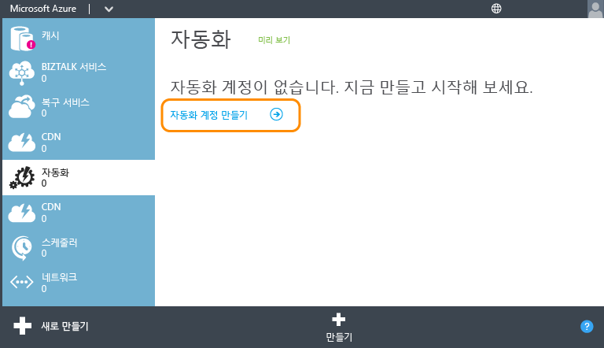

3.	**새 자동화 계정 추가** 페이지에서 계정의 이름을 입력하고 지역을 선택합니다. 지역은 계정의 자동화 리소스가 저장되는 위치를 지정합니다. 계정의 기능에는 영향을 주지 않지만 계정 지역이 다른 Azure 리소스가 저장되는 곳과 가까이 있는 경우 Runbook을 더 빠르게 실행할 수 있습니다. 준비가 되면 확인 표시를 클릭합니다.

	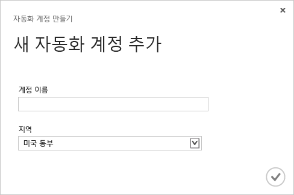

## Runbook 갤러리에서 Runbook 가져오기

[Runbook 갤러리](http://aka.ms/runbookgallery)에는 다른 Azure 자동화 및 PowerShell 사용자의 작업을 활용할 수 있도록 Azure 자동화 계정으로 직접 가져올 수 있는 샘플 Runbook이 포함되어 있습니다. 이 단계에서는 갤러리를 사용하여 "Hello World" 샘플 Runbook을 가져옵니다.

4.	**자동화** 페이지에서 방금 만든 새 계정을 클릭합니다.

	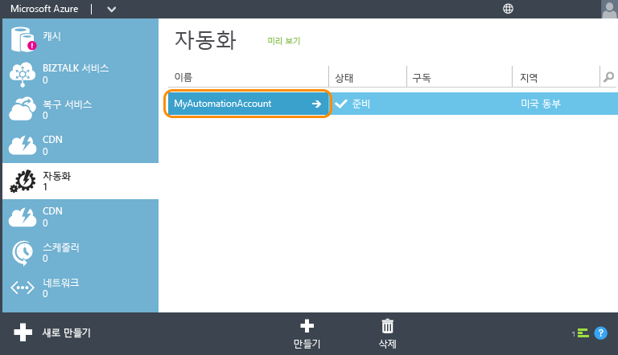

5.	**Runbook**을 클릭합니다.

	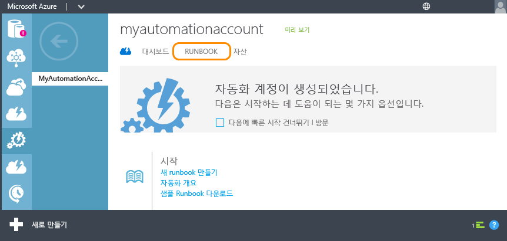

6.	**새로 만들기** > **Runbook** > **갤러리에서**를 클릭합니다.

	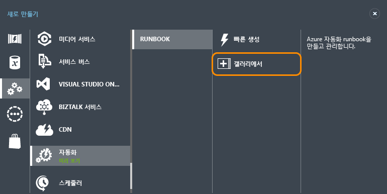

7.  **자습서** 범주를 선택하고 **Hello World for Azure Automation**을 선택합니다. 오른쪽 화살표 단추를 클릭합니다.

	

8.  Runbook의 내용을 검토하고 오른쪽 화살표 단추를 클릭합니다.

	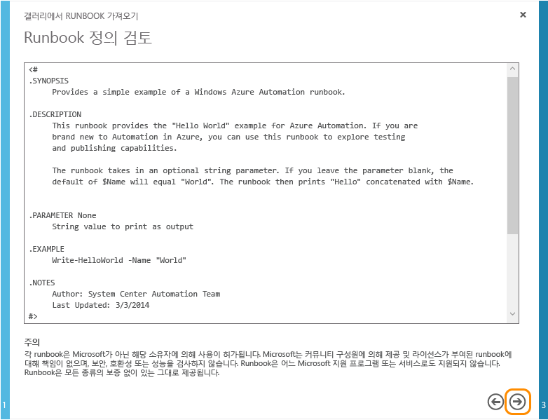

8.	Runbook의 세부 정보를 검토하고 확인 표시 단추를 클릭합니다.

	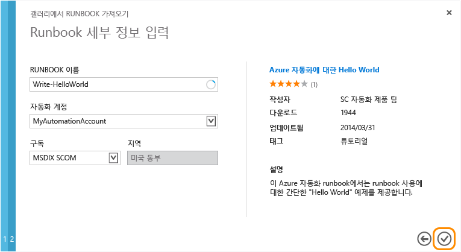

## Runbook 게시

처음에는 초안 모드로 Runbook을 가져옵니다. 따라서 실행할 수 있는 새 버전으로 권한을 부여하기 전에 작업을 계속 수행할 수 있습니다. 이 샘플 Runbook에는 추가 구성이 필요 없으므로 지금 있는 그대로 게시합니다. 자세한 내용은 [Runbook 게시](http://aka.ms/runbookauthor/azure/publishrunbook)를 참조하세요.

9.	Runbook 가져오기가 완료되면 **Write-HelloWorld**를 클릭합니다.

	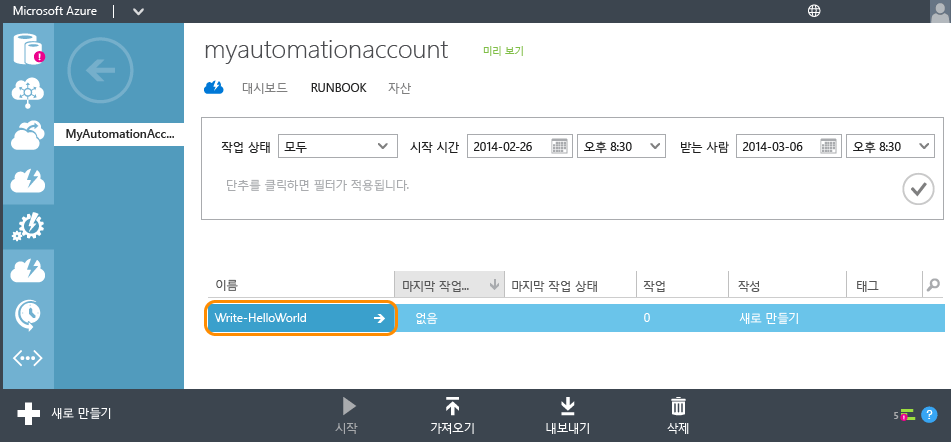

9.	**만든 이**를 클릭한 후 **초안**을 클릭합니다.

	초안 모드에서 Runbook의 콘텐츠를 수정할 수 있습니다. 이 Runbook의 경우에는 수정할 필요가 없습니다.

	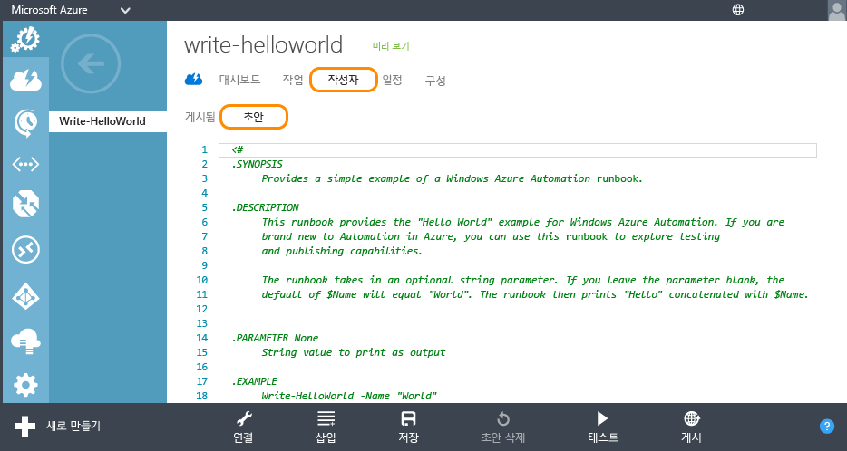

10.	**게시**를 클릭하여 프로덕션에 사용할 수 있도록 Runbook의 수준을 올립니다.

	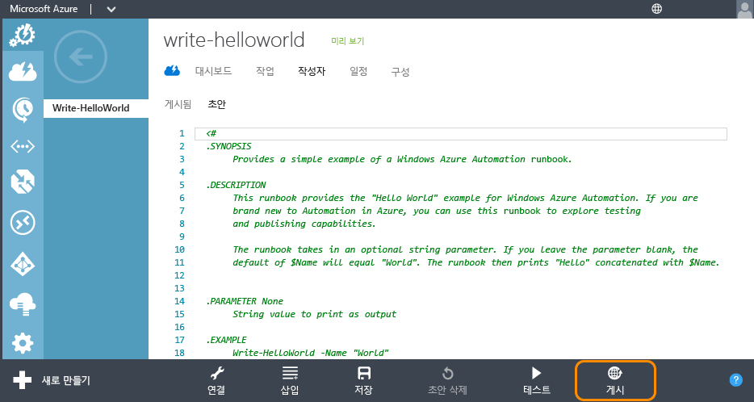

11.	확인하라는 메시지가 표시되면 **예**를 클릭합니다.

	

## Runbook 시작

Runbook을 가져오고 게시했으면 이제 Runbook을 실행하고 출력을 검사할 수 있습니다. 자세한 내용은 [Runbook 시작](http://aka.ms/runbookauthor/azure/startrunbook) 및 [Runbook 출력 및 메시지](http://aka.ms/runbookauthor/azure/runbookoutput)를 참조하세요.

12.	**Write-HelloWorld** Runbook을 열어 두고 **시작**을 클릭합니다.

	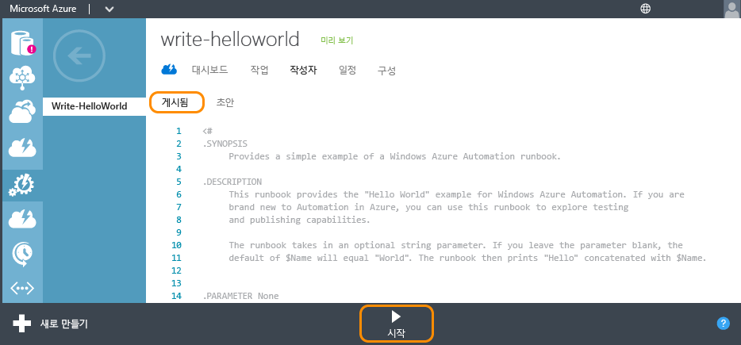

13.	**Specify the runbook parameter values** 페이지에서 Write-HelloWorld.ps1 스크립트의 입력 매개 변수로 사용할 **이름**을 입력한 후 확인 표시를 클릭합니다.

	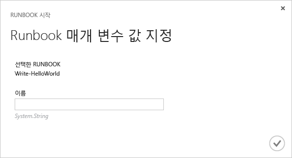

14.	**작업**을 클릭하여 방금 시작한 Runbook 작업의 상태를 확인한 후 **JOB START** 열의 타임스탬프를 클릭하여 작업 요약을 봅니다.

	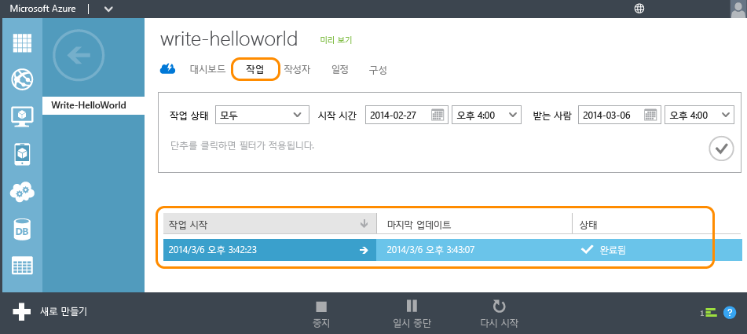

15.	**요약** 페이지에서 작업의 요약, 입력 매개 변수 및 출력을 볼 수 있습니다.

	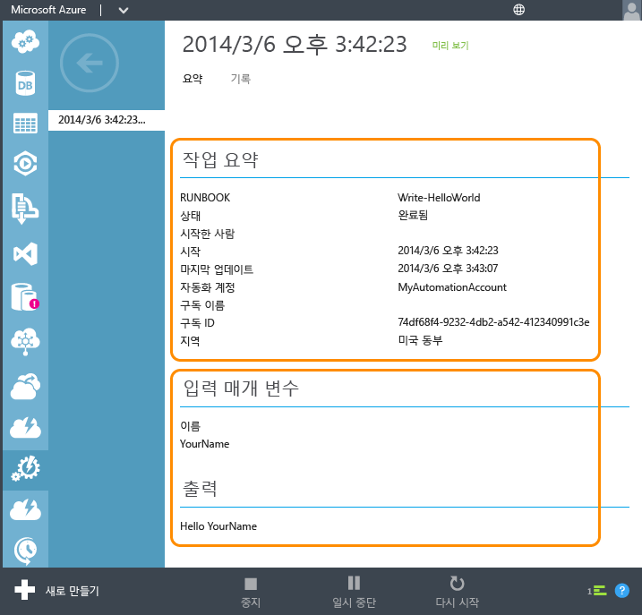

축하합니다. 이 자습서를 완료했습니다.

## 다음 단계
1. 이 자습서의 간단한 Runbook에서는 *Azure 서비스를 관리 하지 않습니다*. 대부분 Runbook은 [Azure cmdlet](http://msdn.microsoft.com/library/jj156055.aspx)을 사용하여 이 작업을 수행하며, 이를 위해 Azure 구독에 대한 인증이 필요합니다. 이러한 cmdlet으로 작업하도록 Azure 구독을 구성하려면 [Runbook을 통해 관리하도록 Azure 구성](http://aka.ms/azureautomationauthentication)의 지침을 따르세요.  
2. Azure 자동화 기능에 대한 자세한 내용은 아래에 나열된 [리소스](#resources)를 참조하세요.
3. Azure 자동화 팀에서 제공하는 최신 정보를 받으려면 [Azure 자동화 블로그](http://azure.microsoft.com/blog/tag/azure-automation)를 구독하세요.

## 리소스

다양한 리소스를 통해 Azure 자동화 및 고유한 Runbook 만들기에 대한 자세한 내용을 확인할 수 있습니다.

- [Azure 자동화 라이브러리](http://go.microsoft.com/fwlink/p/?LinkId=392860)에서는 Azure 자동화를 구성 및 관리하고 사용자 고유의 Runbook을 만드는 방법에 대한 전체 설명서를 제공합니다.
- [Azure PowerShell cmdlet](http://msdn.microsoft.com/library/jj156055.aspx)에서는 Windows PowerShell을 사용하여 Azure 작업을 자동화하는 방법에 대한 정보를 제공합니다. Runbook에서는 이러한 cmdlet을 사용하여 Azure 리소스로 작업합니다.
- [Azure 자동화 블로그](http://azure.microsoft.com/blog/tag/azure-automation)에서는 Microsoft에서 제공하는 Azure 자동화에 대한 최신 정보를 제공합니다.
- [자동화 포럼](http://go.microsoft.com/fwlink/p/?LinkId=390561)에서는 Microsoft 및 자동화 커뮤니티에서 다루는 Azure 자동화에 대한 질문을 게시할 수 있습니다.

## 샘플 및 유틸리티 Runbook

Microsoft 및 Azure 자동화 커뮤니티에서는 사용자 고유의 솔루션 만들기를 시작하는 데 도움이 되는 샘플 Runbook 및 대규모 자동화 작업을 위한 구성 요소로 사용할 수 있는 유틸리티 Runbook을 제공합니다. 이러한 Runbook을 [스크립트 센터](http://azure.microsoft.com/documentation/scripts/)에서 다운로드하거나 [Runbook 갤러리](http://aka.ms/runbookgallery)를 사용하여 Azure 자동화로 직접 가져올 수 있습니다.

## 사용자 의견

**피드백 보내기** Azure 자동화 Runbook 솔루션 또는 통합 모듈을 찾고 있는 경우 스크립트 센터에 스크립트 요청을 게시하세요. Azure 자동화에 대한 의견이나 기능 요청이 있는 경우 [사용자 음성](http://feedback.windowsazure.com/forums/34192--general-feedback)에 게시하세요. 감사합니다.

<!---HONumber=Sept15_HO4-->