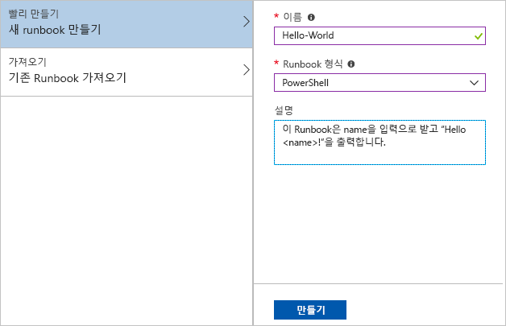
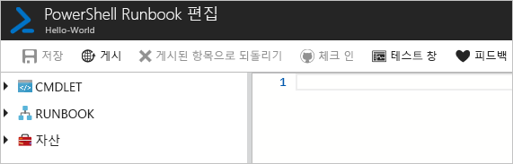
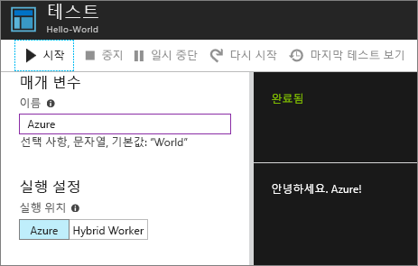
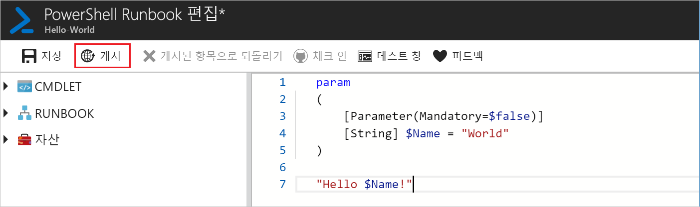
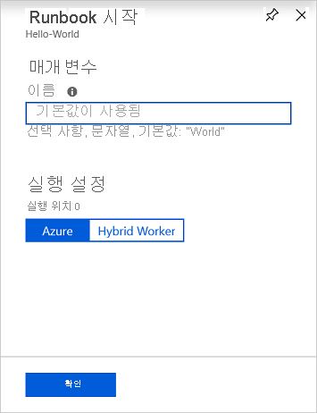
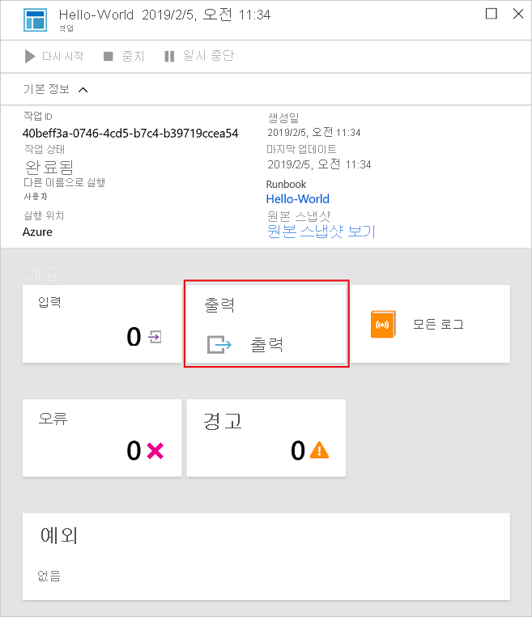
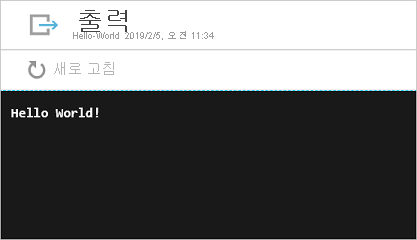

# <a name="create-an-azure-automation-runbook"></a>Azure Automation Runbook 만들기

Azure Automation Runbook은 Azure를 통해 만들 수 있습니다. 이 방법은 Automation Runbook을 만들기 위한 브라우저 기반 사용자 인터페이스를 제공합니다. 이 빠른 시작에서는 Automation PowerShell Runbook을 작성, 편집, 테스트 및 게시하는 방법을 안내합니다.

Azure 구독이 아직 없는 경우 시작하기 전에 [Azure 체험 계정](https://azure.microsoft.com/free/?WT.mc_id=A261C142F)을 만듭니다.

## <a name="log-in-to-azure"></a>Azure에 로그인

https://portal.azure.com에서 Azure에 로그인

## <a name="create-runbook"></a>runbook 만들기

먼저 Runbook을 만듭니다. 이 빠른 시작에서 만든 샘플 Runbook은 기본적으로 `Hello World`를 출력합니다.

1. Automation 계정을 엽니다.

1. **프로세스 자동화** 아래에서 **Runbook**을 클릭합니다. Runbook 목록이 표시됩니다.

1. 목록 위쪽의 **Runbook 추가** 단추를 클릭합니다. **Runbook 추가** 페이지에서 **빨리 만들기**를 선택합니다.

1. Runbook **이름**으로 "Hello-World"를 입력하고, **Runbook 형식**으로 **PowerShell**을 선택합니다. **만들기**를 클릭합니다.

   

1. Runbook이 만들어지고 **PowerShell Runbook 편집** 페이지가 열립니다.

    

1. 편집 창에 다음 코드를 입력하거나 복사하여 붙여넣습니다. 기본값인 "World"가 포함된 "Name"이라는 선택적 입력 매개 변수를 만들고, 이 입력 값을 사용하는 문자열을 출력합니다.
   
   ```powershell-interactive
   param
   (
       [Parameter(Mandatory=$false)]
       [String] $Name = "World"
   )

   "Hello $Name!"
   ```

1. **저장**을 클릭하여 Runbook의 초안 복사본을 저장합니다.

    

## <a name="test-the-runbook"></a>Runbook 테스트

Runbook이 만들어지면 이 Runbook을 테스트하여 작동하는지 확인합니다.

1. **테스트 창**을 클릭하여 **테스트** 페이지를 엽니다.

1. **이름**에 대한 값을 입력하고 **시작**을 클릭합니다. 테스트 작업이 시작되고 작업 상태와 출력이 표시됩니다.

    

1. 오른쪽 위 모서리에서 **X**를 클릭하여 **테스트** 페이지를 닫습니다. 나타나는 팝업에서 **확인**을 선택합니다.

1. **PowerShell Runbook 편집** 페이지에서 **게시**를 클릭하여 이 Runbook을 계정의 공식적인 Runbook 버전으로 게시합니다.

   

## <a name="run-the-runbook"></a>Runbook 실행

Runbook이 게시되면 개요 페이지가 표시됩니다.

1. Runbook 개요 페이지에서 **시작**을 클릭하여 이 Runbook에 대한 **Runbook 시작** 구성 페이지를 엽니다.

   

1. 기본값이 사용되도록 **이름**은 비워 두고, **확인**을 클릭합니다. Runbook 작업이 제출되고 작업 페이지가 표시됩니다.

   

1. **작업 상태**가 **실행 중** 또는 **완료됨**이면 **출력**을 클릭하여 **출력** 창을 열고 Runbook 출력을 봅니다.

   

## <a name="clean-up-resources"></a>리소스 정리

더 이상 필요하지 않은 경우 Runbook을 삭제합니다. 이렇게 하려면 Runbook 목록에서 Runbook을 선택하고 **삭제**를 클릭합니다.

## <a name="next-steps"></a>다음 단계

이 빠른 시작에서는 Runbook을 작성, 편집, 테스트 및 게시하고 Runbook 작업을 시작했습니다. Automation Runbook에 대해 자세히 일아보려면 Automation에서 만들고 사용할 수 있는 다양한 Runbook 형식에 대한 문서로 계속 진행하세요.

> [!div class="nextstepaction"]
> [Automation 방법 - Runbook 형식](./automation-runbook-types.md)
