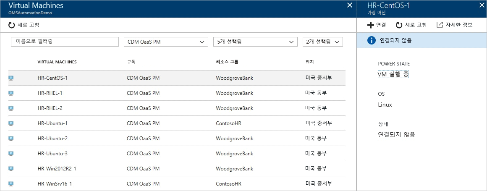
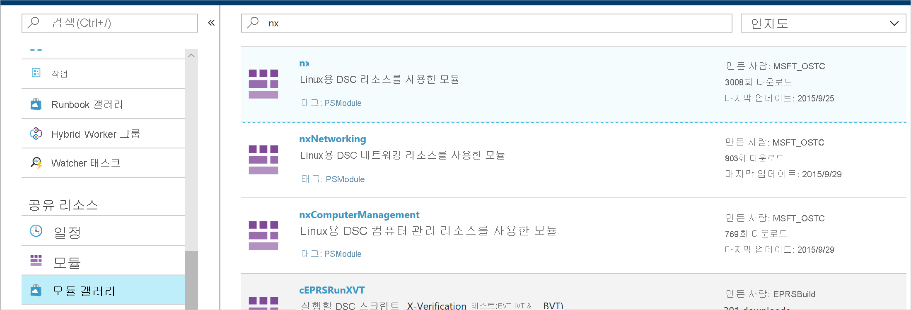
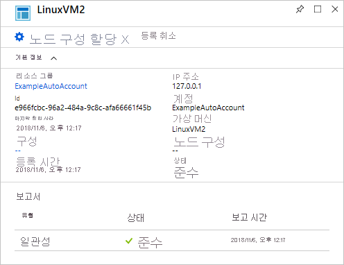
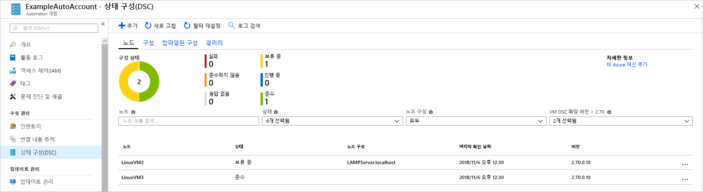

# <a name="configure-a-linux-virtual-machine-with-desired-state-configuration"></a>DSC를 사용한 Linux 가상 머신 구성

DSC(Desired State Configuration)를 사용하면 Windows 및 Linux 서버의 구성을 관리하고 모니터링할 수 있습니다. 필요한 구성에서 벗어나는 구성을 식별하거나 자동으로 수정할 수 있습니다. 이 빠른 시작에서는 Linux VM을 등록하고 DSC로 LAMP 스택을 배포하는 방법을 안내합니다.

## <a name="prerequisites"></a>필수 조건

이 빠른 시작을 완료하려면 다음이 필요합니다.

* Azure 구독. Azure 구독이 아직 없는 경우 [무료 계정을 만듭니다](https://azure.microsoft.com/free/).
* Azure Automation 계정. Azure Automation 실행 계정 만들기에 대한 지침은 [Azure 실행 계정](automation-sec-configure-azure-runas-account.md)을 참조하세요.
* Red Hat Enterprise Linux, CentOS 또는 Oracle Linux를 실행하는 Azure Resource Manager VM(클래식이 아님). VM 만들기에 대한 지침은 [Azure Portal에서 Linux 가상 머신 만들기](../virtual-machines/linux/quick-create-portal.md)를 참조하세요.

## <a name="sign-in-to-azure"></a>Azure에 로그인
https://portal.azure.com에서 Azure에 로그인

## <a name="onboard-a-virtual-machine"></a>가상 머신 등록
여러 가지 방법으로 컴퓨터를 등록하고 DSC를 사용하도록 설정할 수 있습니다. 이 빠른 시작에서는 Automation 계정을 통한 등록에 대해 설명합니다. [등록](https://docs.microsoft.com/azure/automation/automation-dsc-onboarding) 문서를 참조하여 컴퓨터를 DSC에 등록하는 방법에 대해 자세히 알아볼 수 있습니다.

1. Azure Portal의 왼쪽 창에서 **Automation 계정**을 선택합니다. 왼쪽 창에 표시되지 않으면 **모든 서비스**를 클릭하고 결과 보기에서 검색합니다.
2. 목록에서 Automation 계정을 선택합니다.
3. Automation 계정의 왼쪽 창에서 **상태 구성(DSC)** 을 선택합니다.
4. **추가**를 클릭하여 [VM 선택] 페이지를 엽니다.
5. DSC를 사용하도록 설정하려는 가상 머신을 찾습니다. 검색 필드와 필터 옵션을 사용하여 특정 가상 머신을 찾을 수 있습니다.
6. 가상 머신을 클릭한 다음 **연결**을 선택합니다.
7. 가상 머신에 적합한 DSC 설정을 선택합니다. 이미 구성을 준비한 경우 해당 구성을 *노드 구성 이름*으로 지정할 수 있습니다. [구성 모드](https://docs.microsoft.com/powershell/dsc/metaconfig)를 설정하여 컴퓨터의 구성 동작을 제어할 수 있습니다.
8. **확인**



가상 머신에 DSC 확장을 배포하는 동안에는 *연결 중*이 표시됩니다.

## <a name="import-modules"></a>모듈 가져오기

모듈에는 DSC 리소스가 포함되어 있으며, [PowerShell 갤러리](https://www.powershellgallery.com)에서 많은 모듈을 찾을 수 있습니다. 컴파일하기 전에 구성에 사용된 모든 리소스는 Automation 계정으로 가져와야 합니다. 이 자습서에서는 **nx**라는 모듈이 필요합니다.

1. Automation 계정의 왼쪽 창에서 **모듈 갤러리**(공유 리소스 아래)를 선택합니다.
2. 이름의 일부(*nx*)를 입력하여 가져오려는 모듈을 검색합니다.
3. 가져오려는 모듈을 클릭합니다.
4. **가져오기**를 클릭합니다.



## <a name="import-the-configuration"></a>구성 가져오기

이 빠른 시작에서는 컴퓨터에서 Apache HTTP Server, MySQL 및 PHP를 구성하는 DSC 구성을 사용합니다.

DSC 구성에 대한 자세한 내용은 [DSC 구성](https://docs.microsoft.com/powershell/dsc/configurations)을 참조하세요.

텍스트 편집기에서 다음을 입력하고 로컬에서 `LAMPServer.ps1`로 저장합니다.

```powershell-interactive
configuration LAMPServer {
   Import-DSCResource -module "nx"

   Node localhost {

        $requiredPackages = @("httpd","mod_ssl","php","php-mysql","mariadb","mariadb-server")
        $enabledServices = @("httpd","mariadb")

        #Ensure packages are installed
        ForEach ($package in $requiredPackages){
            nxPackage $Package{
                Ensure = "Present"
                Name = $Package
                PackageManager = "yum"
            }
        }

        #Ensure daemons are enabled
        ForEach ($service in $enabledServices){
            nxService $service{
                Enabled = $true
                Name = $service
                Controller = "SystemD"
                State = "running"
            }
        }
   }
}
```

구성을 가져오려면:

1. Automation 계정의 왼쪽 창에서 **상태 구성(DSC)** 을 선택하고 **구성** 탭을 클릭합니다.
2. **+ 추가**를 클릭합니다.
3. 이전 단계에서 저장한 *구성 파일*을 선택합니다.
4. **확인**

## <a name="compile-a-configuration"></a>구성 컴파일

DSC 구성은 노드에 할당하기 전에 먼저 노드 구성(MOF 문서)으로 컴파일해야 합니다. 컴파일은 구성에 대한 유효성을 검사하고 매개 변수 값의 입력을 허용합니다. 구성 컴파일에 대한 자세한 내용은 [Azure 자동화 DSC에서 구성 컴파일](https://docs.microsoft.com/azure/automation/automation-dsc-compile)을 참조하세요.

구성을 컴파일하려면:

1. Automation 계정의 왼쪽 창에서 **상태 구성(DSC)** 을 선택하고 **구성** 탭을 클릭합니다.
2. 이전 단계에서 가져온 구성("LAMPServer")을 선택합니다.
3. 메뉴 옵션에서 **컴파일**, **예**를 차례로 클릭합니다.
4. 구성 보기에서 새 *컴파일 작업*이 큐에서 대기 중인지 확인합니다. 작업이 성공하면 다음 단계로 이동할 수 있습니다. 오류가 있으면 컴파일 작업을 클릭하여 세부 정보를 확인할 수 있습니다.

## <a name="assign-a-node-configuration"></a>노드 구성 할당

컴파일된 *노드 구성*은 DSC 노드에 할당할 수 있습니다. 할당은 컴퓨터에 구성을 적용하고, 해당 구성에서 벗어나는 구성을 모니터링하거나 자동으로 수정합니다.

1. Automation 계정의 왼쪽 창에서 **상태 구성(DSC)을 선택하고 **노드** 탭을 클릭합니다.
2. 구성을 할당하려는 노드를 선택합니다.
3. **노드 구성 할당**을 클릭합니다.
4. 할당할 *노드 구성* - **LAMPServer.localhost**을 선택하고 **확인**을 클릭합니다.
5. 이제 컴파일된 구성이 노드에 할당되고, 노드 상태가 *보류 중*으로 변경됩니다. 다음 정기적 검사에서 노드는 구성을 검색하여 적용하고, 상태를 다시 보고합니다. 노드 설정에 따라 노드에서 구성을 검색하는 데 최대 30분이 걸릴 수 있습니다. 즉시 강제로 검사를 수행하려면 Linux 가상 머신에서 `sudo /opt/microsoft/dsc/Scripts/PerformRequiredConfigurationChecks.py` 명령을 로컬로 실행할 수 있습니다.



## <a name="viewing-node-status"></a>노드 상태 보기

모든 관리 노드의 상태는 Automation 계정의 **상태 구성(DSC)** 을 선택한 뒤 **노드** 탭에서 확인할 수 있습니다. 표시 항목은 상태, 노드 구성 또는 이름 검색을 기준으로 필터링할 수 있습니다.



## <a name="next-steps"></a>다음 단계

이 빠른 시작에서는 Linux VM을 DSC에 등록하고, LAMP 스택에 대한 구성을 만들어, 이 구성을 VM에 배포했습니다. 자동화 DSC를 사용하여 지속적인 배포를 사용하도록 설정하는 방법을 알아보려면 다음 문서로 계속 진행하세요.

> [!div class="nextstepaction"]
> [DSC 및 Chocolatey를 사용하여 VM에 지속적으로 배포](./automation-dsc-cd-chocolatey.md)

* PowerShell DSC에 대한 자세한 내용은 [Windows PowerShell DSC(필요한 상태 구성) 개요](https://docs.microsoft.com/powershell/dsc/overview)를 참조하세요.
* PowerShell에서 자동화 DSC를 관리하는 방법에 대한 자세한 내용은 [Azure PowerShell](https://docs.microsoft.com/powershell/module/azurerm.automation/?view=azurermps-5.0.0)을 참조하세요.
* 보고 및 경고를 위해 Log Analytics에 DSC 보고서를 전달하는 방법에 대한 자세한 내용은 [Log Analytics에 DSC 보고서 전달](https://docs.microsoft.com/azure/automation/automation-dsc-diagnostics)을 참조하세요. 
