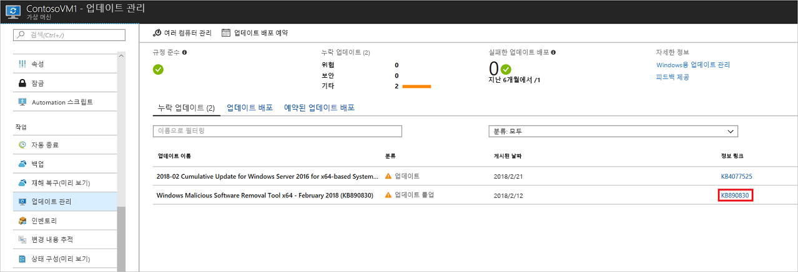
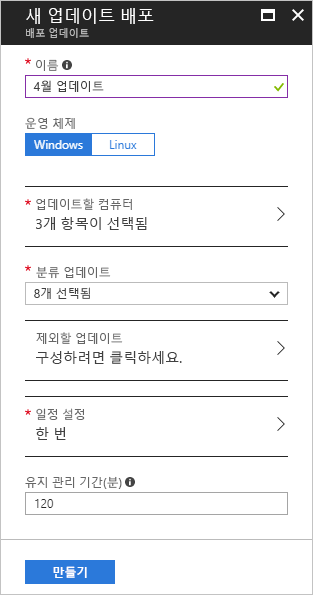
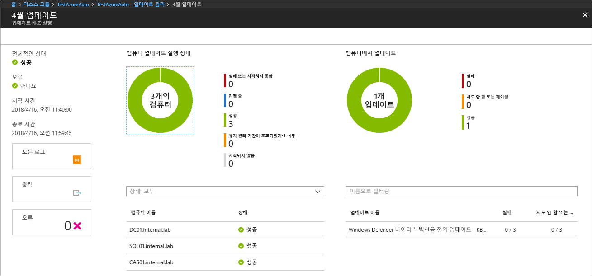

# <a name="manage-windows-updates-with-azure-automation"></a>Azure Automation을 사용하여 Windows 업데이트 관리

업데이트 관리를 사용하면 가상 머신에 대한 업데이트 및 패치를 관리할 수 있습니다.
이 자습서에서는 사용 가능한 업데이트의 상태를 빠르게 평가하고, 필수 업데이트의 설치를 예약하고, 배포 결과를 검토하고, 업데이트가 성공적으로 적용되었는지 확인하는 경고를 만듭니다.

가격 책정 정보에 대해서는 [업데이트 관리를 위한 Automation 가격 책정](https://azure.microsoft.com/pricing/details/automation/)을 참조하세요.

이 자습서에서는 다음 방법에 대해 알아봅니다.

> [!div class="checklist"]
> * 업데이트 관리를 위한 VM 등록
> * 업데이트 평가 보기
> * 경고 구성
> * 업데이트 배포 예약
> * 배포 결과 보기

## <a name="prerequisites"></a>필수 조건

이 자습서를 완료하려면 다음이 필요합니다.

* Azure 구독. 구독이 아직 없는 경우 [Visual Studio 구독자를 위한 월간 Azure 크레딧을 활성화](https://azure.microsoft.com/pricing/member-offers/msdn-benefits-details/)하거나 [무료 계정](https://azure.microsoft.com/free/?WT.mc_id=A261C142F)을 등록할 수 있습니다.
* 감시자, 작업 Runbook 및 감시자 태스크를 보관할 [Automation 계정](automation-offering-get-started.md)
* 등록할 [가상 머신](../virtual-machines/windows/quick-create-portal.md)

## <a name="log-in-to-azure"></a>Azure에 로그인

Azure Portal ( https://portal.azure.com ) 에 로그인합니다.

## <a name="enable-update-management"></a>업데이트 관리 사용

먼저 이 자습서에 사용할 VM에서 업데이트 관리를 설정해야 합니다.

1. Azure Portal의 왼쪽 메뉴에서 **가상 머신**을 선택하고 목록에서 VM을 선택합니다.
2. VM 페이지의 **작업** 섹션 아래에서 **업데이트 관리**를 클릭합니다. **업데이트 관리 사용** 페이지가 열립니다.

이 VM에 대해 업데이트 관리가 사용되도록 설정되어 있는지를 확인하기 위해 유효성 검사가 수행됩니다. 이 유효성 검사에는 Log Analytics 작업 영역 및 연결된 Automation 계정 검사와 업데이트 관리 솔루션이 작업 영역에 있는지 확인하는 검사가 포함됩니다.

[Log Analytics](../log-analytics/log-analytics-overview.md?toc=%2fazure%2fautomation%2ftoc.json) 작업 영역은 기능 및 서비스(예: 업데이트 관리)에서 생성된 데이터를 수집하는 데 사용됩니다. 이 작업 영역은 여러 원본의 데이터를 검토 및 분석하는 단일 위치를 제공합니다.

또한 유효성 검사 프로세스는 VM이 MMA 및 Automation 하이브리드 Runbook 작업자를 통해 프로비전되는지 확인합니다.
이 에이전트는 Azure Automation과 통신하고 업데이트 상태에 대한 정보를 얻는 데 사용됩니다. 이 에이전트를 사용하려면 Azure Automation 서비스와 통신하고 업데이트를 다운로드하기 위한 443 포트가 필요합니다.

등록 중에 다음 필수 구성 요소 중 하나가 누락된 것으로 확인되면 자동으로 추가됩니다.

* [Log Analytics](../log-analytics/log-analytics-overview.md?toc=%2fazure%2fautomation%2ftoc.json) 작업 영역
* [Automation 계정](./automation-offering-get-started.md)
* [Hybrid Runbook Worker](./automation-hybrid-runbook-worker.md)가 VM에서 사용되도록 설정됩니다.

**업데이트 관리** 화면이 열립니다. 사용할 위치, Log Analytics 작업 영역 및 Automation 계정을 구성하고 **사용**을 클릭합니다. 필드가 회색으로 표시되면 해당 VM에 대해 다른 자동화 솔루션을 사용하도록 설정하고 동일한 작업 영역과 Automation 계정을 사용해야 함을 의미합니다.


솔루션을 사용하도록 설정하는 데 몇 분이 걸릴 수 있습니다. 이 시간 동안에는 브라우저 창을 닫으면 안됩니다.
솔루션이 사용되도록 설정되면 VM의 누락된 업데이트에 대한 정보가 Log Analytics로 이동됩니다.
이 데이터를 분석에 사용할 수 있게 되는 데 30분에서 6시간까지 걸릴 수 있습니다.

## <a name="view-update-assessment"></a>업데이트 평가 보기

**업데이트 관리**를 사용하도록 설정하면 **업데이트 관리** 화면이 나타납니다.
누락된 업데이트가 있으면 **누락 업데이트** 탭에 누락된 업데이트 목록이 표시됩니다.

업데이트에 대한 **정보 링크**를 선택하여 새 창에서 업데이트에 대한 지원 문서를 엽니다. 여기서는 업데이트와 관련된 중요한 정보를 알아볼 수 있습니다.



업데이트의 다른 위치를 클릭하면 선택한 업데이트에 대한 **로그 검색** 창이 열립니다. 로그 검색에 대한 쿼리는 해당 특정 업데이트에 대해 미리 정의되어 있습니다. 이 쿼리를 수정하거나 사용자 고유의 쿼리를 만들어 환경에서 배포되었거나 누락된 업데이트에 대한 자세한 정보를 볼 수 있습니다.


## <a name="configure-alerting"></a>경고 구성

이 단계에서는 업데이트가 성공적으로 배포되면 그 사실을 알려주는 경고를 구성합니다. 여기서 만드는 경고는 Log Analytics 쿼리를 기반으로 합니다. 추가 경고가 다양한 시나리오를 포함하도록 사용자 지정 쿼리를 작성할 수 있습니다. Azure Portal에서 **모니터**로 이동하여 **경고 만들기**를 클릭합니다. 그러면 **규칙 만들기** 페이지가 열립니다.

**1. 경고 조건 정의**에서 **+ 대상 선택**을 클릭합니다. **리소스 종류별로 필터링**에서 **Log Analytics**를 선택합니다. Log Analytics 작업 영역을 선택하고 **완료**를 클릭합니다.


**+ 조건 추가** 단추를 클릭하여 **신호 논리 구성** 페이지를 엽니다. 표에서 **사용자 지정 로그 검색**을 선택합니다. **검색 쿼리** 텍스트 상자에 다음 쿼리를 입력합니다. 이 쿼리는 지정된 시간 프레임에 완료된 컴퓨터 및 업데이트 실행 이름을 반환합니다.

```loganalytics
UpdateRunProgress
| where InstallationStatus == 'Succeeded'
| where TimeGenerated > now(-10m)
| summarize by UpdateRunName, Computer
```

경고 논리의 **임계값**으로 **1**을 입력합니다. 여기까지 마쳤으면 **완료**를 클릭합니다.


**2. 경고 세부 정보 정의**에서 경고의 표시 이름과 설명을 입력합니다. 실행 성공에 대한 경고이므로 **심각도**를 **정보(심각도 2)** 로 설정합니다.


**3. 작업 그룹 정의**에서 **+ 새 작업 그룹**을 클릭합니다. 작업 그룹은 여러 경고에서 사용할 수 있는 작업의 그룹입니다. 여기에는 이메일 알림, Runbook, 웹후크 등이 포함되며 이에 국한되지 않습니다. 작업 그룹에 대해 자세히 알아보려면 [작업 그룹 만들기 및 관리](../monitoring-and-diagnostics/monitoring-action-groups.md)를 참조하세요.

**작업 그룹 이름** 상자에 표시 이름과 약식 이름을 입력합니다. 약식 이름은 이 그룹을 사용하여 알림을 보내는 경우 전체 작업 그룹 이름 대신 사용됩니다.

**작업**의 **작업 유형** 아래에 있는 **이메일 알림**에서 **이메일/SMS/푸시/음성**을 선택합니다. **세부 정보**에서 **세부 정보 편집**을 선택합니다.

**이메일/SMS/푸시/음성** 페이지에서 이름을 지정합니다. **이메일** 확인란을 선택하고 사용할 유효한 이메일 주소를 입력합니다.


**이메일/SMS/푸시/음성** 페이지에서 **확인**을 클릭하여 페이지를 닫고, **확인**을 클릭하여 **작업 그룹 추가** 페이지를 닫습니다.

**규칙 만들기** 페이지의 **동작 사용자 지정** 아래에서 **이메일 제목**을 클릭하여 이메일 제목을 사용자 지정할 수 있습니다. 완료되면 **경고 규칙 만들기**를 클릭합니다. 이렇게 하면 언제 업데이트 배포가 성공하고 해당 업데이트 배포 실행에 어떤 컴퓨터가 사용되었는지 알려주는 규칙이 만들어집니다.

## <a name="schedule-an-update-deployment"></a>업데이트 배포 예약

경고를 구성했으니, 릴리스 일정 및 서비스 기간에 따라 업데이트를 설치하는 배포를 예약합니다.
배포에 포함할 업데이트 형식을 선택할 수 있습니다.
예를 들어 중요 업데이트나 보안 업데이트를 포함하고 업데이트 롤업은 제외할 수 있습니다.

> [!WARNING]
> 업데이트로 인해 다시 부팅해야 하는 경우 VM이 자동으로 다시 시작됩니다.

**업데이트 관리**로 다시 이동하고 화면 위쪽에서 **업데이트 배포 예약**을 선택하여 VM에 대한 새 업데이트 배포를 예약합니다.

**새 배포 업데이트** 화면에서 다음 정보를 지정합니다.

* **이름** - 업데이트 배포에 대한 고유한 이름을 제공합니다.

* **운영 체제** - 업데이트 배포의 대상 OS를 선택합니다.

* **업데이트 분류** - 배포에 포함되는 업데이트 배포 소프트웨어의 종류를 선택합니다. 이 자습서에서는 모든 종류가 선택된 상태로 둡니다.

  분류 형식은 다음과 같습니다.

   |OS  |type  |
   |---------|---------|
   |Windows     | 중요 업데이트</br>보안 업데이트</br>업데이트 롤업</br>기능 팩</br>서비스 팩</br>정의 업데이트</br>도구</br>업데이트        |
   |Linux     | 중요 업데이트 및 보안 업데이트</br>다른 업데이트       |

   분류 형식에 대한 설명은 [업데이트 분류](automation-update-management.md#update-classifications)를 참조하세요.

* **일정 설정** - 일정 설정 페이지가 열립니다. 기본 시작 시간은 현재 시간으로부터 30분 후입니다. 10분 후부터 원하는 시간으로 설정할 수 있습니다.

   배포가 한 번만 수행될지 여부를 지정하거나 되풀이 일정을 설정할 수도 있습니다.
   **되풀이**에서 **한 번**을 선택합니다. 기본값인 1일을 그대로 적용하고 **확인**을 클릭합니다. 이렇게 하면 되풀이 일정이 설정됩니다.

* **유지 관리 기간(분)** - 기본값으로 그대로 둡니다. 업데이트 배포를 수행할 기간을 지정할 수 있습니다. 이 설정을 사용하면 정의된 서비스 창 내에서 변경이 수행되도록 보장할 수 있습니다.



일정 구성이 완료되면 **만들기** 단추를 클릭합니다. 상태 대시보드로 돌아갑니다. **예약된 업데이트 배포**를 선택하여 만든 배포 일정을 표시합니다.

## <a name="view-results-of-an-update-deployment"></a>업데이트 배포의 결과 보기

예약된 배포가 시작되면 **업데이트 관리** 화면의 **업데이트 배포** 탭에서 해당 배포에 대한 상태를 볼 수 있습니다.
현재 실행 중인 경우 상태는 **진행 중**으로 표시됩니다.
성공적으로 완료되면 **성공**으로 바뀝니다.
배포에서 하나 이상의 업데이트에 오류가 발생하는 경우 상태는 **부분적으로 실패**입니다.
완료된 배포 업데이트를 클릭하여 해당 업데이트 배포에 대한 대시보드를 확인합니다.



**업데이트 결과** 타일에서 요약은 VM에 대한 총 업데이트 수 및 배포 결과를 제공합니다.
오른쪽 테이블에는 각 업데이트에 대한 자세한 분석 및 설치 결과가 표시됩니다.
다음 목록에서는 사용 가능한 값을 보여 줍니다.

* **시도 안 함** - 정의된 유지 관리 기간에 따라 사용할 수 있는 시간이 충분하지 않기 때문에 업데이트가 설치되지 않았습니다.
* **성공** - 업데이트했습니다.
* **실패** -업데이트하지 못했습니다.

배포를 통해 생성된 항목에 대한 모든 로그를 보려면 **모든 로그**를 클릭합니다.

**출력** 타일을 클릭하여 대상 VM의 업데이트 배포를 관리하는 runbook의 작업 스트림을 확인합니다.

배포의 모든 오류에 대한 자세한 정보를 보려면 **오류**를 클릭합니다.

업데이트 배포가 성공하면 배포 성공을 보여주기 위해 다음 이미지와 비슷한 이메일이 전송됩니다.


## <a name="next-steps"></a>다음 단계

이 자습서에서는 다음 방법에 대해 알아보았습니다.

> [!div class="checklist"]
> * 업데이트 관리를 위한 VM 등록
> * 업데이트 평가 보기
> * 경고 구성
> * 업데이트 배포 예약
> * 배포 결과 보기

업데이트 관리 솔루션에 대한 개요로 계속 진행하세요.

> [!div class="nextstepaction"]
> [업데이트 관리 솔루션](../operations-management-suite/oms-solution-update-management.md?toc=%2fazure%2fautomation%2ftoc.json)
