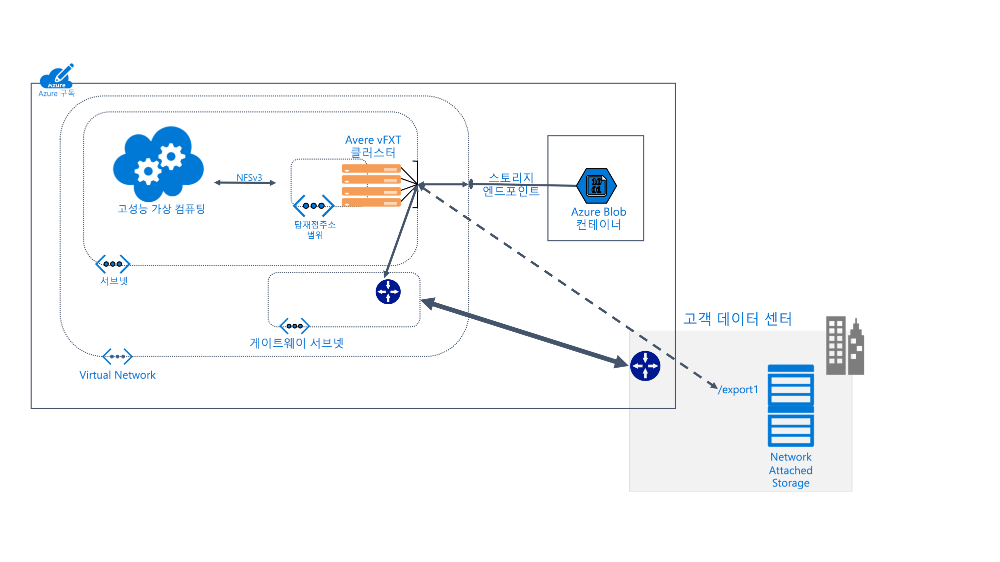

# Avere vFXT for Azure란? 

Avere vFXT for Azure는 데이터 집약적인 HPC(고성능 컴퓨팅) 작업을 위한 파일 시스템 캐싱 솔루션입니다. 이 솔루션은 클라우드 컴퓨팅의 확장성을 활용하여 온-프레미스 하드웨어에 저장된 데이터까지도 필요할 때 아무 위치에서 데이터에 액세스할 수 있게 해줍니다.

Avere vFXT는 다음과 같은 일반적인 컴퓨팅 시나리오를 지원합니다. 

* 하이브리드 클라우드 아키텍처: Avere vFXT for Azure는 하드웨어 저장소 시스템과 함께 작동하며, 따라서 파일을 이동할 필요가 없는 클라우드 컴퓨팅의 이점을 제공합니다. 
* 클라우드 버스팅: Avere vFXT for Azure를 사용하여 단일 프로젝트에 대한 클라우드로 데이터를 이동하거나 전체 워크플로를 영구적으로 "리프트 앤 시프트"할 수 있습니다. 

Avere vFXT for Azure는 다음과 같은 상황에 가장 적합합니다. 

* HPC 워크로드에 대한 읽기 워크로드가 많은 작업
* 일반적인 NFS 프로토콜을 사용하는 응용 프로그램
* CPU 코어가 1000-40,000개인 계산 팜
* 온-프레미스 하드웨어 NAS, Azure Blob 저장소 또는 둘 모두와 통합

자세한 내용은 <https://azure.microsoft.com/services/storage/avere-vfxt/>을 참조하세요.

## 누가 Avere vFXT for Azure를 사용하나요? 

Avere vFXT는 모든 종류의 읽기 집약적인 컴퓨팅 작업에 도움이 됩니다.

### 시각 효과 렌더링 

미디어 및 엔터테인먼트에서, Avere vFXT 클러스터는 시간이 중요한 렌더링 프로젝트의 데이터 액세스 속도를 높일 수 있습니다. Azure에서 더 많은 캐시 공간과 더 많은 계산 노드를 추가할 수 있기 때문에 대규모 프로젝트를 효율적으로 처리할 수 있는 유연성이 확보됩니다. 

### 생명 과학 

Avere vFXT를 사용하면 연구원이 Azure Compute에서 보조 분석 워크플로를 실행하고, 위치에 관계없이 게놈 데이터에 액세스할 수 있습니다.

제약 연구에서는 Avere vFXT 클러스터를 사용하여 연구원의 약품-대상 상호 작용을 예측하고 연구 데이터를 분석하는 작업을 지원하여 신약 개발 시간을 단축할 수 있습니다.

### 금융 서비스 분석

Avere vFXT 클러스터는 정량적 분석 계산 속도를 높일 수 있으며, 금융 서비스 회사에 전략적 의사 결정을 내리기 위한 보다 나은 인사이트를 제공합니다. 

## 기능 및 사양

Avere vFXT 시스템은 클러스터에 구성된 3개 이상의 가상 에지 필터 노드로 이루어져 있습니다. 클라이언트 머신 가까이에 배치할 수 있으며, 저장소를 직접 탑재하는 대신 클러스터를 탑재합니다. 

Avere vFXT 클러스터는 요청이 오면 파일을 캐시합니다. 반복되는 요청을 캐시에서 80%를 초과하여 처리할 수 있습니다.

### 호환성 

* NetApp 또는 Dell EMC Isilon의 하드웨어 NAS 시스템과 호환
* Azure Blob과 호환
* NFSv3 또는 SMB2 프로토콜 사용

Avere vFXT는 다음과 같은 Azure 리소스를 사용합니다. 

|Azure 구성 요소|   |
|----------|-----------|
|가상 머신|D16s_v3 또는 E32s_v3 3개 이상|
|프리미엄 SSD 저장소|노드당 200GB OS 공간 + 1TB-4TB 캐시 공간 |
|저장소 계정(선택 사항) |v2|
|데이터 백 엔드 저장소(선택 사항) | 빈 LRS Blob 컨테이너 1개 |

## 다음 단계

다음은 사용자 고유의 Avere vFXT 배포 만들기를 시작할 수 있는 링크입니다. 

* [시스템 계획](avere-vfxt-deploy-plan.md)
* [배포 개요](avere-vfxt-deploy-overview.md)
* [vFXT 만들기](avere-vfxt-deploy.md)
