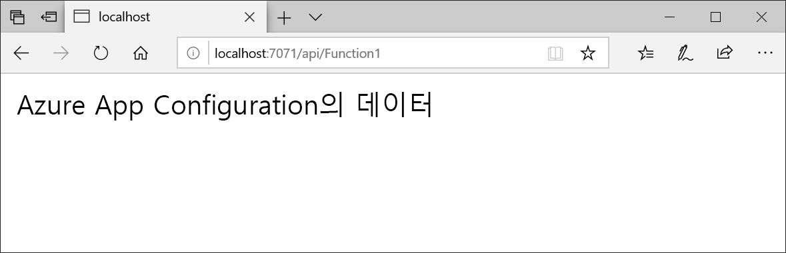

# <a name="quickstart-create-an-azure-function-with-app-configuration"></a>빠른 시작: App Configuration으로 Azure 함수 만들기

Azure App Configuration은 Azure의 관리형 구성 서비스로서, 코드와 구분하여 한 곳에서 모든 애플리케이션 설정을 쉽게 저장하고 관리할 수 있습니다. 이 빠른 시작은 서비스를 Azure 함수로 통합하는 방법을 보여줍니다. 

이 빠른 시작의 단계를 완료하려면 아무 코드 편집기나 사용할 수 있습니다. 그러나 [Visual Studio Code](https://code.visualstudio.com/)는 Windows, macOS 및 Linux 플랫폼에서 사용할 수 있는 뛰어난 옵션입니다.



## <a name="prerequisites"></a>필수 조건

이 빠른 시작을 완료하려면 [Visual Studio 2017](https://visualstudio.microsoft.com/vs)(**Azure 개발** 워크로드로 설치되어 있어야 함)과 [최신 Azure Functions 도구](../azure-functions/functions-develop-vs.md#check-your-tools-version)를 설치하세요.

[!INCLUDE [quickstarts-free-trial-note](../../includes/quickstarts-free-trial-note.md)]

## <a name="create-an-app-configuration-store"></a>앱 구성 저장소 만들기

[!INCLUDE [azure-app-configuration-create](../../includes/azure-app-configuration-create.md)]

## <a name="create-a-function-app"></a>함수 앱 만들기

[!INCLUDE [Create a project using the Azure Functions template](../../includes/functions-vstools-create.md)]

## <a name="connect-to-app-configuration-store"></a>앱 구성 저장소에 연결

1. *Function1.cs*를 열고 App Configuration .NET Core 구성 공급자에 대한 참조를 추가합니다.

    ```csharp
    using Microsoft.Extensions.Configuration.AzureAppConfiguration;
    ```

2. `builder.AddAzureAppConfiguration()`을 호출하여 App Configuration을 사용하도록 `Run` 메서드를 업데이트합니다.

    ```csharp
    public static async Task<IActionResult> Run(
        [HttpTrigger(AuthorizationLevel.Anonymous, "get", "post", Route = null)] HttpRequest req, ILogger log)
    {
        log.LogInformation("C# HTTP trigger function processed a request.");

        var builder = new ConfigurationBuilder();
        builder.AddAzureAppConfiguration(Environment.GetEnvironmentVariable("ConnectionString"));
        var config = builder.Build();
        string message = config["TestApp:Settings:Message"];
        message = message ?? req.Query["message"];

        string requestBody = await new StreamReader(req.Body).ReadToEndAsync();
        dynamic data = JsonConvert.DeserializeObject(requestBody);
        message = message ?? data?.message;

        return message != null
            ? (ActionResult) new OkObjectResult(message)
            : new BadRequestObjectResult("Please pass a message from a configuration store, on the query string or in the request body");
    }
    ```

## <a name="test-the-function-locally"></a>로컬에서 함수 테스트

1. **ConnectionString**이라는 환경 변수를 설정하고 앱 구성 저장소에 대한 액세스 키로 설정합니다. Windows 명령 프롬프트를 사용하는 경우 다음 명령을 실행하고 명령 프롬프트를 다시 시작하여 변경 사항을 적용합니다.

        setx ConnectionString "connection-string-of-your-app-configuration-store"

    Windows PowerShell을 사용하는 경우 다음 명령을 실행합니다.

        $Env:ConnectionString = "connection-string-of-your-app-configuration-store"

    macOS 또는 Linux를 사용하는 경우 다음 명령을 실행합니다.

        export ConnectionString='connection-string-of-your-app-configuration-store'

2. 함수를 테스트하려면 **F5** 키를 누릅니다. 메시지가 표시되면 Visual Studio에서 **Azure Functions Core(CLI)** 도구를 다운로드하여 설치하도록 요구하는 요청을 수락합니다. 또한 도구에서 HTTP 요청을 처리할 수 있도록 방화벽 예외를 사용하도록 설정해야 합니다.

3. Azure Functions 런타임 출력에서 함수의 URL을 복사합니다.

    

4. HTTP 요청에 대한 URL을 브라우저의 주소 표시줄에 붙여 넣습니다. 다음은 함수에서 반환된 로컬 GET 요청에 대한 브라우저의 응답을 보여 줍니다.

    

## <a name="clean-up-resources"></a>리소스 정리

[!INCLUDE [azure-app-configuration-cleanup](../../includes/azure-app-configuration-cleanup.md)]

## <a name="next-steps"></a>다음 단계

이 빠른 시작에서는 새 앱 구성 저장소를 만들고 Azure 함수에 사용해봤습니다. App Configuration 사용법에 대해 자세히 알아보려면 인증 방법을 보여주는 다음 자습서를 계속 진행하세요.

> [!div class="nextstepaction"]
> [Azure 리소스 통합을 위한 관리형 ID](./integrate-azure-managed-service-identity.md)
