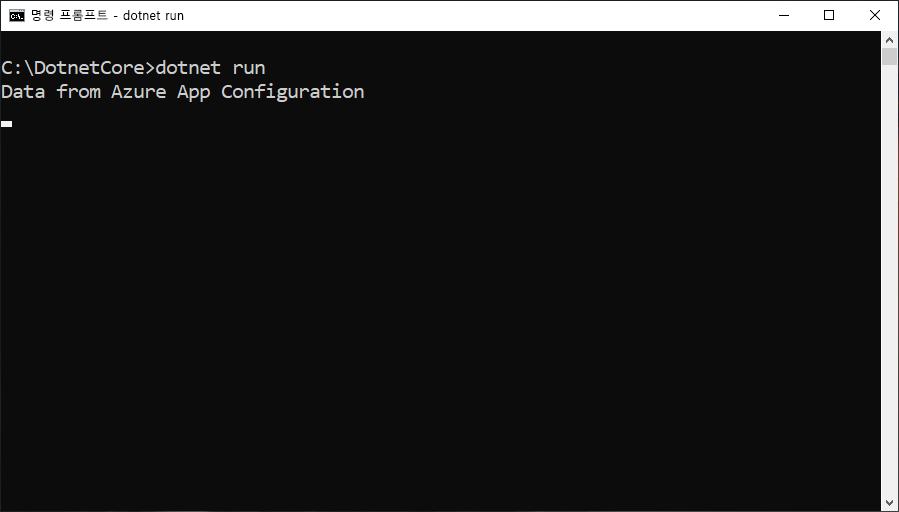

# <a name="quickstart-create-a-net-core-app-with-app-configuration"></a>빠른 시작: App Configuration을 사용하여 .NET Core 앱 만들기

Azure App Configuration은 Azure의 관리형 구성 서비스로서, 코드와 분리된 한 곳에서 모든 애플리케이션 설정을 쉽게 저장하고 관리할 수 있습니다. 이 빠른 시작은 .NET Core 콘솔 앱으로 서비스를 통합하는 방법을 보여줍니다.

이 빠른 시작의 단계는 임의의 코드 편집기를 사용하여 수행할 수 있습니다. [Visual Studio Code](https://code.visualstudio.com/)는 Windows, macOS 및 Linux 플랫폼에서 사용할 수 있는 훌륭한 옵션입니다.



## <a name="prerequisites"></a>필수 조건

이 빠른 시작을 수행하려면 [.NET Core SDK](https://dotnet.microsoft.com/download)를 설치합니다.

[!INCLUDE [quickstarts-free-trial-note](../../includes/quickstarts-free-trial-note.md)]

## <a name="create-an-app-configuration-store"></a>앱 구성 저장소 만들기

[!INCLUDE [azure-app-configuration-create](../../includes/azure-app-configuration-create.md)]

6. **키/값 탐색기** > **+ 만들기**를 차례로 선택하여 다음 키-값 쌍을 추가합니다.

    | 키 | 값 |
    |---|---|
    | TestApp:Settings:Message | Azure App Configuration의 정보 |

    지금은 **레이블**과 **콘텐츠 형식**을 비워 두세요.

## <a name="create-a-net-core-console-app"></a>.NET Core 콘솔 앱 만들기

[.NET Core CLI(명령줄 인터페이스)](https://docs.microsoft.com/dotnet/core/tools/)를 사용하여 새 .NET Core 콘솔 앱 프로젝트를 만듭니다. Visual Studio 대신 .NET Core CLI를 사용하면 Windows, macOS 및 Linux 플랫폼에서 사용할 수 있다는 이점이 있습니다.

1. 프로젝트에 대한 새 폴더를 만듭니다.

2. 새 폴더에서 다음 명령을 실행하여 새 ASP.NET Core MVC 웹앱 프로젝트를 만듭니다.

        dotnet new console

## <a name="connect-to-an-app-configuration-store"></a>앱 구성 저장소에 연결

1. 다음 명령을 실행하여 `Microsoft.Extensions.Configuration.AzureAppConfiguration` NuGet 패키지에 대한 참조를 추가합니다.

        dotnet add package Microsoft.Extensions.Configuration.AzureAppConfiguration --version 1.0.0-preview-007830001

2. 다음 명령을 실행하여 프로젝트에 대한 패키지를 복원합니다.

        dotnet restore

3. *Program.cs*를 열고, App Configuration .NET Core 구성 공급자에 대한 참조를 추가합니다.

    ```csharp
    using Microsoft.Extensions.Configuration;
    using Microsoft.Extensions.Configuration.AzureAppConfiguration;
    ```

4. `builder.AddAzureAppConfiguration()` 메서드를 호출하여 App Configuration을 사용하도록 `Main` 메서드를 업데이트합니다.

    ```csharp
    static void Main(string[] args)
    {
        var builder = new ConfigurationBuilder();
        builder.AddAzureAppConfiguration(Environment.GetEnvironmentVariable("ConnectionString"));

        var config = builder.Build();
        Console.WriteLine(config["TestApp:Settings:Message"] ?? "Hello world!");
    }
    ```

## <a name="build-and-run-the-app-locally"></a>로컬로 앱 빌드 및 실행

1. **ConnectionString**이라는 환경 변수를 앱 구성 저장소에 대한 액세스 키로 설정합니다. Windows 명령 프롬프트를 사용하는 경우 다음 명령을 실행하고, 명령 프롬프트를 다시 시작하여 변경 내용을 적용합니다.

        setx ConnectionString "connection-string-of-your-app-configuration-store"

    Windows PowerShell을 사용하는 경우 다음 명령을 실행합니다.

        $Env:ConnectionString = "connection-string-of-your-app-configuration-store"

    macOS 또는 Linux를 사용하는 경우 다음 명령을 실행합니다.

        export ConnectionString='connection-string-of-your-app-configuration-store'

2. 다음 명령을 실행하여 콘솔 앱을 빌드합니다.

        dotnet build

3. 빌드가 성공적으로 완료되면 다음 명령을 실행하여 앱을 로컬로 실행합니다.

        dotnet run

## <a name="clean-up-resources"></a>리소스 정리

[!INCLUDE [azure-app-configuration-cleanup](../../includes/azure-app-configuration-cleanup.md)]

## <a name="next-steps"></a>다음 단계

이 빠른 시작에서는 새 앱 구성 저장소를 만들고, [앱 구성 공급자](https://go.microsoft.com/fwlink/?linkid=2074664)를 통해 .NET Core 콘솔 앱에서 사용했습니다. App Configuration을 사용하는 방법을 자세히 알아보려면 인증에 대해 설명하는 다음 자습서로 계속 진행하세요.

> [!div class="nextstepaction"]
> [관리 ID 통합](./howto-integrate-azure-managed-service-identity.md)
