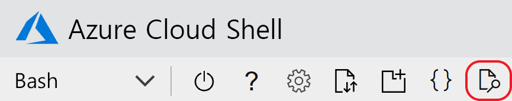

# <a name="quickstart-add-feature-flags-to-an-aspnet-core-app"></a>빠른 시작: ASP.NET Core 앱에 기능 플래그를 추가합니다.

이 빠른 시작에서는 Azure App Configuration을 사용하여 ASP.NET Core 앱에서 기능 관리의 엔드투엔드 구현을 만듭니다. App Configuration 서비스를 사용하여 중앙에서 모든 기능 플래그를 저장하고 상태를 제어합니다. 

.NET Core 기능 관리 라이브러리는 포괄적인 기능 플래그 지원을 통해 프레임워크를 확장합니다. 이 라이브러리는 .NET Core 구성 시스템을 기반으로 빌드됩니다. 또한 해당 .NET Core 구성 공급자를 통해 App Configuration과 원활하게 통합됩니다.

## <a name="prerequisites"></a>사전 요구 사항

* Azure 구독 - [체험 구독 만들기](https://azure.microsoft.com/free/dotnet)
* [.NET Core SDK](https://dotnet.microsoft.com/download)

## <a name="create-an-app-configuration-store"></a>App Configuration 저장소 만들기

[!INCLUDE[Azure App Configuration resource creation steps](../../includes/azure-app-configuration-create.md)]

8. **작업** > **기능 관리자** > **추가**를 선택하여 *Beta*라는 기능 플래그를 추가합니다.

    > [!div class="mx-imgBorder"]
    > 

    지금은 **레이블**을 비워 둡니다. **적용**을 선택하여 새 기능 플래그를 저장합니다.

## <a name="create-an-aspnet-core-web-app"></a>ASP.NET Core 웹앱 만들기

[.NET Core CLI(명령줄 인터페이스)](/dotnet/core/tools)를 사용하여 새 ASP.NET Core MVC 프로젝트를 만듭니다. Visual Studio 대신 .NET Core CLI를 사용할 때 얻을 수 있는 장점은 Windows, macOS 및 Linux 플랫폼에서 .NET Core CLI를 사용할 수 있다는 것입니다.

다음 명령을 실행하여 새 *TestFeatureFlags* 폴더에 ASP.NET Core MVC 프로젝트를 만듭니다.

```dotnetcli
dotnet new mvc --no-https --output TestFeatureFlags
```

[!INCLUDE[Add Secret Manager support to an ASP.NET Core project](../../includes/azure-app-configuration-add-secret-manager.md)]

## <a name="connect-to-an-app-configuration-store"></a>App Configuration 저장소에 연결

1. 다음 명령을 실행하여 [Microsoft.Azure.AppConfiguration.AspNetCore](https://www.nuget.org/packages/Microsoft.Azure.AppConfiguration.AspNetCore) 및 [Microsoft.FeatureManagement.AspNetCore](https://www.nuget.org/packages/Microsoft.FeatureManagement.AspNetCore) NuGet 패키지를 설치합니다.

    ```dotnetcli
    dotnet add package Microsoft.Azure.AppConfiguration.AspNetCore
    ```

    ```dotnetcli
    dotnet add package Microsoft.FeatureManagement.AspNetCore
    ```

1. *.csproj* 파일과 동일한 디렉터리에서 다음 명령을 실행합니다. 이 명령은 비밀 관리자를 사용하여 App Configuration 저장소에 대한 연결 문자열을 저장하는 `ConnectionStrings:AppConfig`라는 비밀을 저장합니다. `<your_connection_string>` 자리 표시자를 App Configuration 저장소의 연결 문자열로 바꿉니다. 연결 문자열은 Azure Portal의 **액세스 키**에서 찾을 수 있습니다.

    ```dotnetcli
    dotnet user-secrets set ConnectionStrings:AppConfig "<your_connection_string>"
    ```

    비밀 관리자는 웹앱을 로컬로 테스트하는 데만 사용됩니다. 앱이 [Azure App Service](https://azure.microsoft.com/services/app-service/web)에 배포되면 비밀 관리자 대신 App Service의 **연결 문자열** 애플리케이션 설정을 사용하여 연결 문자열을 저장합니다.

    .NET Core 구성 API를 사용하여 이 비밀에 액세스합니다. 콜론(`:`)은 지원되는 모든 플랫폼에서 구성 API를 통해 구성 이름에서 작동합니다. 자세한 내용은 [구성 키 및 값](/aspnet/core/fundamentals/configuration#configuration-keys-and-values)을 참조하세요.

1. *Program.cs*에서 `AddAzureAppConfiguration` 메서드를 호출하여 App Configuration을 사용하도록 `CreateWebHostBuilder` 메서드를 업데이트합니다.

    > [!IMPORTANT]
    > .NET Core 3.x에 `CreateHostBuilder`는 `CreateWebHostBuilder`를 대체합니다. 사용자 환경에 따라 올바른 구문을 선택합니다.

    #### <a name="net-core-3x"></a>[.NET Core 3.x](#tab/core3x)

    ```csharp
    public static IHostBuilder CreateHostBuilder(string[] args) =>
        Host.CreateDefaultBuilder(args)
            .ConfigureWebHostDefaults(webBuilder =>
                webBuilder.ConfigureAppConfiguration(config =>
                {
                    var settings = config.Build();
                    var connection = settings.GetConnectionString("AppConfig");
                    config.AddAzureAppConfiguration(options =>
                        options.Connect(connection).UseFeatureFlags());
                }).UseStartup<Startup>());
    ```

    #### <a name="net-core-2x"></a>[.NET Core 2.x](#tab/core2x)

    ```csharp
    public static IWebHostBuilder CreateWebHostBuilder(string[] args) =>
        WebHost.CreateDefaultBuilder(args)
               .ConfigureAppConfiguration(config =>
               {
                   var settings = config.Build();
                   var connection = settings.GetConnectionString("AppConfig");
                   config.AddAzureAppConfiguration(options =>
                       options.Connect(connection).UseFeatureFlags());
               }).UseStartup<Startup>();
    ```

    ---

    위의 변경 내용으로 [App Configuration에 대한 구성 공급자](https://go.microsoft.com/fwlink/?linkid=2074664)가 .NET Core 구성 API에 등록되었습니다.

1. *Startup.cs*에서 .NET Core 기능 관리자에 대한 참조를 추가합니다.

    ```csharp
    using Microsoft.FeatureManagement;
    ```

1. `AddFeatureManagement` 메서드를 호출하여 기능 플래그 지원을 추가하도록 `Startup.ConfigureServices` 메서드를 업데이트합니다. 필요에 따라 `AddFeatureFilter<FilterType>()`을 호출하여 기능 플래그에 사용할 필터를 포함할 수 있습니다 :

    #### <a name="net-core-3x"></a>[.NET Core 3.x](#tab/core3x)

    ```csharp    
    public void ConfigureServices(IServiceCollection services)
    {
        services.AddControllersWithViews();
        services.AddFeatureManagement();
    }
    ```

    #### <a name="net-core-2x"></a>[.NET Core 2.x](#tab/core2x)

    ```csharp
    public void ConfigureServices(IServiceCollection services)
    {
        services.AddMvc()
            .SetCompatibilityVersion(CompatibilityVersion.Version_2_2);
        services.AddFeatureManagement();
    }
    ```

    ---

1. 다음 코드를 사용하여 루트 프로젝트 디렉터리에 *MyFeatureFlags.cs* 파일을 추가합니다.

    ```csharp
    namespace TestFeatureFlags
    {
        public enum MyFeatureFlags
        {
            Beta
        }
    }
    ```

1. 다음 코드를 사용하여 *Controllers* 디렉터리에 *BetaController.cs* 파일을 추가합니다.

    ```csharp
    using Microsoft.AspNetCore.Mvc;
    using Microsoft.FeatureManagement;
    using Microsoft.FeatureManagement.Mvc;

    namespace TestFeatureFlags.Controllers
    {
        public class BetaController: Controller
        {
            private readonly IFeatureManager _featureManager;

            public BetaController(IFeatureManagerSnapshot featureManager) =>
                _featureManager = featureManager;

            [FeatureGate(MyFeatureFlags.Beta)]
            public IActionResult Index() => View();
        }
    }
    ```

1. *Views/_ViewImports.cshtml*에서 `@addTagHelper` 지시문을 사용하여 기능 관리자 태그 도우미를 등록합니다.

    ```cshtml
    @addTagHelper *, Microsoft.FeatureManagement.AspNetCore
    ```

    위의 코드를 사용하면 프로젝트의 *.cshtml* 파일에서 `<feature>` 태그 도우미를 사용할 수 있습니다.

1. *Views/Shared/_Layout.cshtml*에서 `<body>` > `<header>` 아래의 `<nav>` 바코드를 다음 표시로 바꿉니다.

    ```cshtml
    <nav class="navbar navbar-expand-sm navbar-toggleable-sm navbar-light bg-white border-bottom box-shadow mb-3">
        <div class="container">
            <a class="navbar-brand" asp-area="" asp-controller="Home" asp-action="Index">TestFeatureFlags</a>
            <button class="navbar-toggler" type="button" data-toggle="collapse" data-target=".navbar-collapse" aria-controls="navbarSupportedContent"
            aria-expanded="false" aria-label="Toggle navigation">
            <span class="navbar-toggler-icon"></span>
            </button>
            <div class="navbar-collapse collapse d-sm-inline-flex flex-sm-row-reverse">
                <ul class="navbar-nav flex-grow-1">
                    <li class="nav-item">
                        <a class="nav-link text-dark" asp-area="" asp-controller="Home" asp-action="Index">Home</a>
                    </li>
                    <feature name="Beta">
                    <li class="nav-item">
                        <a class="nav-link text-dark" asp-area="" asp-controller="Beta" asp-action="Index">Beta</a>
                    </li>
                    </feature>
                    <li class="nav-item">
                        <a class="nav-link text-dark" asp-area="" asp-controller="Home" asp-action="Privacy">Privacy</a>
                    </li>
                </ul>
            </div>
        </div>
    </nav>
    ```

    위의 표시에서 *Beta* 목록 항목을 둘러싼 `<feature>` 태그 도우미를 확인합니다.

1. 다음 표시를 포함하는 *Views/Beta* 디렉터리 및 *Index.cshtml* 파일을 만듭니다.

    ```cshtml
    @{
        ViewData["Title"] = "Beta Home Page";
    }

    <h1>This is the beta website.</h1>
    ```

## <a name="build-and-run-the-app-locally"></a>로컬로 앱 빌드 및 실행

1. .NET Core CLI를 사용하여 앱을 빌드하려면 명령 셸에서 다음 명령을 실행합니다.

    ```dotnetcli
    dotnet build
    ```

1. 빌드가 성공적으로 완료되면 다음 명령을 실행하여 웹앱을 로컬로 실행합니다.

    ```dotnetcli
    dotnet run
    ```

1. 브라우저 창을 열고, 로컬로 호스팅되는 웹앱에 대한 기본 URL인 `http://localhost:5000`으로 이동합니다. Azure Cloud Shell에서 작업하는 경우 **웹 미리 보기** 단추와 **구성**을 차례로 선택합니다. 메시지가 표시되면 포트 5000을 선택합니다.

    

    브라우저에는 아래 이미지와 비슷한 페이지가 표시되어야 합니다.

    :::image type="content" source="media/quickstarts/aspnet-core-feature-flag-local-before.png" alt-text="변경 전 로컬 빠른 시작 앱" border="true":::

1. [Azure Portal](https://portal.azure.com)에 로그인합니다. **모든 리소스**를 선택하고, 빠른 시작에서 만든 App Configuration 저장소 인스턴스를 선택합니다.

1. **기능 관리자**를 선택하고, *Beta* 키의 상태를 **On**으로 변경합니다.

1. 명령 셸로 돌아갑니다. <kbd>Ctrl+C</kbd>를 눌러 실행 중인 `dotnet` 프로세스를 취소합니다. `dotnet run`을 사용하여 앱을 다시 시작합니다.

1. 새 구성 설정을 확인하려면 브라우저 페이지를 새로 고칩니다.

    :::image type="content" source="media/quickstarts/aspnet-core-feature-flag-local-after.png" alt-text="변경 전 로컬 빠른 시작 앱" border="true":::

## <a name="clean-up-resources"></a>리소스 정리

[!INCLUDE[Azure App Configuration cleanup](../../includes/azure-app-configuration-cleanup.md)]

## <a name="next-steps"></a>다음 단계

이 빠른 시작에서는 새 App Configuration 저장소를 만든 후 [기능 관리 라이브러리](https://go.microsoft.com/fwlink/?linkid=2074664)를 통해 ASP.NET Core 웹앱에서 기능을 관리하는 데 사용했습니다.

* [기능 관리](./concept-feature-management.md)에 대한 자세한 정보
* [기능 플래그 관리](./manage-feature-flags.md)
* [ASP.NET Core 앱에서 기능 플래그 사용](./use-feature-flags-dotnet-core.md)
* [ASP.NET Core 앱에서 동적 구성 사용](./enable-dynamic-configuration-aspnet-core.md)
