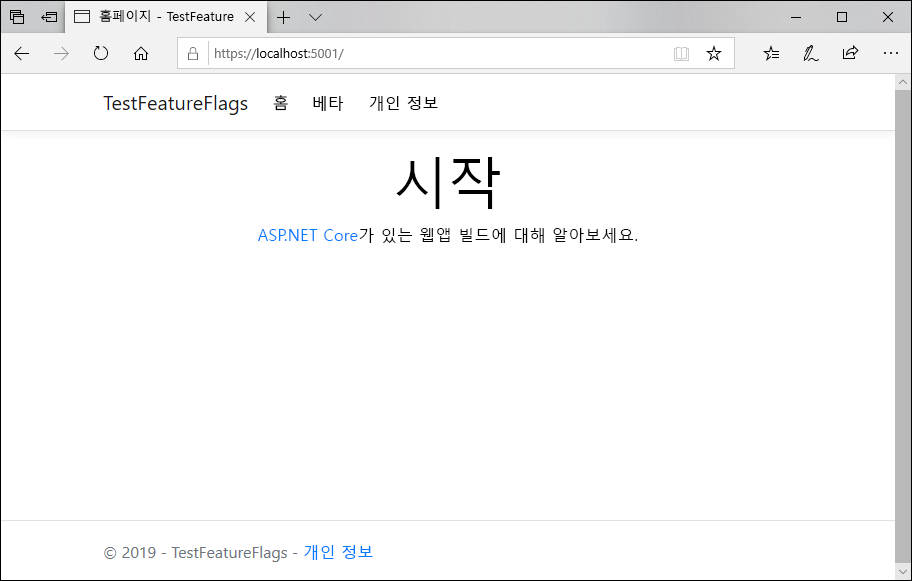

# <a name="quickstart-add-feature-flags-to-an-aspnet-core-app"></a>빠른 시작: ASP.NET Core 앱에 기능 플래그를 추가합니다.

Azure App Configuration에 애플리케이션을 연결하여 ASP.NET Core에서 기능 관리를 사용하도록 설정할 수 있습니다. 이 관리형 서비스를 사용하여 모든 기능 플래그를 저장하고 해당 상태를 중앙에서 제어할 수 있습니다. 이 빠른 시작에서는 이 서비스를 ASP.NET Core 웹앱에 통합하여 기능 관리의 엔드투엔드 구현을 만드는 방법을 보여 줍니다.

.NET Core 기능 관리 라이브러리는 포괄적인 기능 플래그 지원을 통해 프레임워크를 확장합니다. 이 라이브러리는 .NET Core 구성 시스템을 토대로 빌드됩니다. 또한 해당 .NET Core 구성 공급자를 통해 App Configuration과 원활하게 통합됩니다.

이 빠른 시작의 단계는 임의의 코드 편집기를 사용하여 수행할 수 있습니다. [Visual Studio Code](https://code.visualstudio.com/)는 Windows, macOS 및 Linux 플랫폼에서 사용할 수 있는 훌륭한 옵션입니다.

## <a name="prerequisites"></a>필수 조건

이 빠른 시작을 수행하려면 [.NET Core SDK](https://dotnet.microsoft.com/download)를 설치합니다.

[!INCLUDE [quickstarts-free-trial-note](../../includes/quickstarts-free-trial-note.md)]

## <a name="create-an-app-configuration-store"></a>앱 구성 저장소 만들기

[!INCLUDE [azure-app-configuration-create](../../includes/azure-app-configuration-create.md)]

6. **기능 관리자** >  **+ 만들기**를 선택하여 다음 기능 플래그를 추가합니다.

    | 키 | 시스템 상태 |
    |---|---|
    | 베타 | 꺼짐 |

## <a name="create-an-aspnet-core-web-app"></a>ASP.NET Core 웹앱 만들기

[.NET Core CLI(명령줄 인터페이스)](https://docs.microsoft.com/dotnet/core/tools/)를 사용하여 새 ASP.NET Core MVC 웹앱 프로젝트를 만듭니다. Visual Studio 대신 .NET Core CLI를 사용하면 Windows, macOS 및 Linux 플랫폼에서 사용할 수 있다는 이점이 있습니다.

1. 프로젝트에 대한 새 폴더를 만듭니다. 이 빠른 시작에서는 이 폴더 이름을 *TestFeatureFlags*로 지정합니다.

2. 새 폴더에서 다음 명령을 실행하여 새 ASP.NET Core MVC 웹앱 프로젝트를 만듭니다.

        dotnet new mvc

## <a name="add-secret-manager"></a>비밀 관리자 추가

[비밀 관리자 도구](https://docs.microsoft.com/aspnet/core/security/app-secrets)를 프로젝트에 추가합니다. 암호 관리자 도구는 개발 작업에 대한 중요한 데이터를 프로젝트 트리 외부에 저장합니다. 이 방법을 사용하면 소스 코드 내에서 앱 암호를 실수로 공유하는 경우를 방지할 수 있습니다.

- *.csproj* 파일을 엽니다. 아래와 같이 `UserSecretsId` 요소를 추가하고, 해당 값을 고유한 값(일반적으로 GUID)으로 바꿉니다. 파일을 저장합니다.

    ```xml
    <Project Sdk="Microsoft.NET.Sdk.Web">

    <PropertyGroup>
        <TargetFramework>netcoreapp2.1</TargetFramework>
        <UserSecretsId>79a3edd0-2092-40a2-a04d-dcb46d5ca9ed</UserSecretsId>
    </PropertyGroup>

    <ItemGroup>
        <PackageReference Include="Microsoft.AspNetCore.App" />
        <PackageReference Include="Microsoft.AspNetCore.Razor.Design" Version="2.1.2" PrivateAssets="All" />
    </ItemGroup>

    </Project>
    ```

## <a name="connect-to-an-app-configuration-store"></a>앱 구성 저장소에 연결

1. 다음 명령을 실행하여 `Microsoft.Extensions.Configuration.AzureAppConfiguration` 및 `Microsoft.FeatureManagement` NuGet 패키지에 대한 참조를 추가합니다.

        dotnet add package Microsoft.Extensions.Configuration.AzureAppConfiguration --version 1.0.0-preview-008520001

        dotnet add package Microsoft.FeatureManagement.AspNetCore --version 1.0.0-preview-008560001-910

2. 다음 명령을 실행하여 프로젝트에 대한 패키지를 복원합니다.

        dotnet restore

3. *ConnectionStrings:AppConfig*라는 비밀을 비밀 관리자에 추가합니다.

    이 비밀에는 앱 구성 저장소에 액세스하기 위한 연결 문자열이 포함되어 있습니다. 다음 명령의 값을 앱 구성 저장소에 대한 연결 문자열로 바꿉니다.

    이 명령은 *.csproj* 파일이 있는 동일한 디렉터리에서 실행해야 합니다.

        dotnet user-secrets set ConnectionStrings:AppConfig <your_connection_string>

    비밀 관리자는 웹앱을 로컬로 테스트하는 데만 사용됩니다. 앱이 [Azure App Service](https://azure.microsoft.com/services/app-service/web)에 배포되면 예를 들어, 비밀 관리자 대신, App Service의 **연결 문자열**을 사용하여 연결 문자열을 저장하게 됩니다.

    이 비밀은 구성 API를 사용하여 액세스됩니다. 콜론(:)은 지원되는 모든 플랫폼에서 구성 API를 통해 구성 이름으로 작동합니다. [환경별 구성](https://docs.microsoft.com/aspnet/core/fundamentals/configuration/index?tabs=basicconfiguration&view=aspnetcore-2.0)을 참조하세요.

4. *Program.cs*를 열고, .NET Core App Configuration 공급자에 대한 참조를 추가합니다.

    ```csharp
    using Microsoft.Extensions.Configuration.AzureAppConfiguration;
    ```

5. `config.AddAzureAppConfiguration()` 메서드를 호출하여 App Configuration을 사용하도록 `CreateWebHostBuilder` 메서드를 업데이트합니다.

    ```csharp
    public static IWebHostBuilder CreateWebHostBuilder(string[] args) =>
        WebHost.CreateDefaultBuilder(args)
            .ConfigureAppConfiguration((hostingContext, config) =>
            {
                var settings = config.Build();
                config.AddAzureAppConfiguration(options => {
                    options.Connect(settings["ConnectionStrings:AppConfig"])
                           .UseFeatureFlags();
                });
            })
            .UseStartup<Startup>();
    ```

6. *Startup.cs*를 열고 .NET Core 기능 관리자에 대한 참조를 추가합니다.

    ```csharp
    using Microsoft.FeatureManagement.AspNetCore;
    ```

7. `services.AddFeatureManagement()` 메서드를 호출하여 기능 플래그 지원을 추가하도록 `ConfigureServices` 메서드를 업데이트하고, 선택적으로 `services.AddFeatureFilter<FilterType>()`을 호출하여 기능 플래그에 사용할 필터를 포함합니다.

    ```csharp
    public void ConfigureServices(IServiceCollection services)
    {
        services.AddFeatureManagement();
    }
    ```

8. *MyFeatureFlags.cs* 파일을 추가합니다.

    ```csharp
    namespace TestFeatureFlags
    {
        public enum MyFeatureFlags
        {
            Beta
        }
    }
    ```

9. *BetaController.cs*를 Controllers 디렉터리에 추가합니다.

    ```csharp
    using Microsoft.AspNetCore.Mvc;
    using Microsoft.FeatureManagement.AspNetCore;

    namespace TestFeatureFlags.Controllers
    {
        public class BetaController: Controller
        {
            private readonly IFeatureManager _featureManager;

            public BetaController(IFeatureManagerSnapshot featureManager)
            {
                _featureManager = featureManager;
            }

            [Feature(MyFeatureFlags.Beta)]
            public IActionResult Index()
            {
                return View();
            }
        }
    }
    ```

10. Views 디렉터리에서 *_ViewImports.cshtml*을 열고 다음과 같이 기능 관리자 태그 도우미를 추가합니다.

    ```html
    @addTagHelper *, Microsoft.FeatureManagement.AspNetCore
    ```

11. Views > Shared 디렉터리에서 *_Layout.cshtml*을 열고, `<body>` > `<header>` 아래의 `<nav>` 모음을 다음 코드로 바꿉니다.

    ```html
    <nav class="navbar navbar-expand-sm navbar-toggleable-sm navbar-light bg-white border-bottom box-shadow mb-3">
        <div class="container">
            <a class="navbar-brand" asp-area="" asp-controller="Home" asp-action="Index">TestFeatureFlags</a>
            <button class="navbar-toggler" type="button" data-toggle="collapse" data-target=".navbar-collapse" aria-controls="navbarSupportedContent"
            aria-expanded="false" aria-label="Toggle navigation">
            <span class="navbar-toggler-icon"></span>
            </button>
            <div class="navbar-collapse collapse d-sm-inline-flex flex-sm-row-reverse">
                <ul class="navbar-nav flex-grow-1">
                    <li class="nav-item">
                        <a class="nav-link text-dark" asp-area="" asp-controller="Home" asp-action="Index">Home</a>
                    </li>
                    <feature name="Beta">
                    <li class="nav-item">
                        <a class="nav-link text-dark" asp-area="" asp-controller="Beta" asp-action="Index">Beta</a>
                    </li>
                    </feature>
                    <li class="nav-item">
                        <a class="nav-link text-dark" asp-area="" asp-controller="Home" asp-action="Privacy">Privacy</a>
                    </li>
                </ul>
            </div>
        </div>
    </nav>
    ```

12. Views 아래에 Beta 디렉터리를 만들고 *Index.cshtml*을 추가합니다.

    ```html
    @{
        ViewData["Title"] = "Beta Home Page";
    }

    <h1>
        This is the beta website.
    </h1>
    ```

## <a name="build-and-run-the-app-locally"></a>로컬로 앱 빌드 및 실행

1. .NET Core CLI를 사용하여 앱을 빌드하려면 명령 셸에서 다음 명령을 실행합니다.

        dotnet build

2. 빌드가 성공적으로 완료되면 다음 명령을 실행하여 웹앱을 로컬로 실행합니다.

        dotnet run

3. 브라우저 창을 열고, 로컬로 호스팅되는 웹앱에 대한 기본 URL인 `https://localhost:5001`으로 이동합니다.

    

4. [Azure Portal](https://aka.ms/azconfig/portal)에 로그인합니다. **모든 리소스**를 선택하고, 빠른 시작에서 만든 앱 구성 저장소 인스턴스를 선택합니다.

5. **기능 관리자**를 선택하고 *Beta*의 값을 다음과 같이 *On*으로 변경합니다.

    | 키 | 시스템 상태 |
    |---|---|
    | 베타 | 다른 |

6. 새 구성 설정을 확인하려면 브라우저 페이지를 새로 고칩니다.

    

## <a name="clean-up-resources"></a>리소스 정리

[!INCLUDE [azure-app-configuration-cleanup](../../includes/azure-app-configuration-cleanup.md)]

## <a name="next-steps"></a>다음 단계

이 빠른 시작에서는 새 앱 구성 저장소를 만든 후 [기능 관리 라이브러리](https://go.microsoft.com/fwlink/?linkid=2074664)를 통해 ASP.NET Core 웹앱에서 기능을 관리하는 데 사용했습니다.

* [기능 관리](./concept-feature-management.md)에 대한 자세한 정보
* [기능 플래그 관리](./manage-feature-flags.md)
* [ASP.NET Core 앱에서 기능 플래그 사용](./use-feature-flags-dotnet-core.md)
