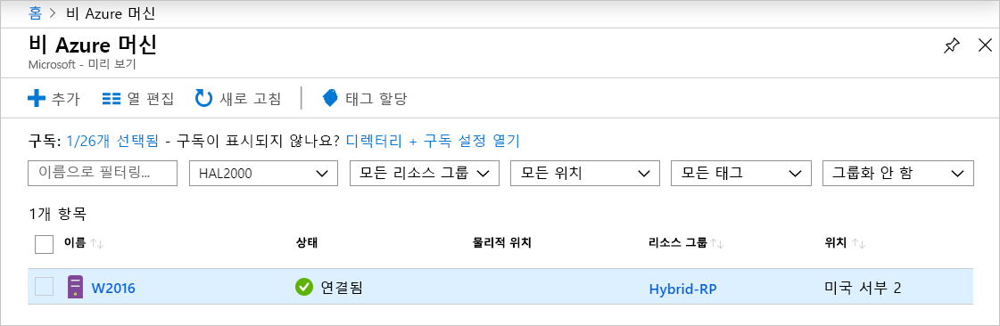

# <a name="quickstart-connect-machines-to-azure-using-azure-arc-for-servers---powershell"></a>빠른 시작: 서버용 Azure Arc를 사용하여 Azure에 머신 연결 - PowerShell

Azure 구독이 아직 없는 경우 시작하기 전에 [체험 계정](https://azure.microsoft.com/free/?WT.mc_id=A261C142F)을 만듭니다.

## <a name="prerequisites"></a>필수 조건

[서버용 Azure Arc 개요](overview.md)에서 지원되는 클라이언트와 필수 네트워크 구성을 검토합니다.

## <a name="create-a-service-principal-for-onboarding-at-scale"></a>대규모 온보딩을 위한 서비스 사용자 만들기

서비스 사용자는 머신을 Azure에 연결하는 데 필요한 최소한의 권한만 부여되는 특별히 한정된 관리 ID입니다. 이렇게 하는 것이 테넌트 관리자와 같은 강력한 계정을 사용하는 것보다 안전합니다. 서비스 사용자는 온보딩 중에만 사용됩니다. 원하는 서버를 연결한 후에는 서비스 사용자를 안전하게 삭제할 수 있습니다.

> [!NOTE]
> 이 단계를 수행하는 것이 좋지만 필수는 아닙니다.

### <a name="steps-to-create-the-service-principal"></a>서비스 사용자를 만드는 단계

이 예에서는 [Azure PowerShell](/powershell/azure/install-az-ps)을 사용하여 SPN(서비스 사용자 이름)을 만듭니다. 또는 이 작업에 대해 [Azure Portal을 사용하여 서비스 사용자 만들기](../../active-directory/develop/howto-create-service-principal-portal.md) 아래에 나열된 단계를 수행할 수 있습니다.

`Azure Connected Machine Onboarding` 역할에는 온보딩에 필요한 권한만 포함됩니다. 해당 범위에 리소스 그룹 또는 구독을 포함할 수 있도록 SPN의 권한을 정의할 수 있습니다.

[`New-AzADServicePrincipal`](/powershell/module/az.resources/new-azadserviceprincipal) cmdlet의 출력을 저장해야 합니다. 그렇지 않으면 이후 단계에서 사용할 암호를 검색할 수 없습니다.

```azurepowershell-interactive
$sp = New-AzADServicePrincipal -DisplayName "Arc-for-servers" -Role "Azure Connected Machine Onboarding"
$sp
```

```output
Secret                : System.Security.SecureString
ServicePrincipalNames : {ad9bcd79-be9c-45ab-abd8-80ca1654a7d1, https://Arc-for-servers}
ApplicationId         : ad9bcd79-be9c-45ab-abd8-80ca1654a7d1
ObjectType            : ServicePrincipal
DisplayName           : Hybrid-RP
Id                    : 5be92c87-01c4-42f5-bade-c1c10af87758
Type                  :
```

이제 Powershell을 사용하여 암호를 검색합니다.

```azurepowershell-interactive
$credential = New-Object pscredential -ArgumentList "temp", $sp.Secret
$credential.GetNetworkCredential().password
```

출력에서 **password**와 **ApplicationId**(이전 단계의)를 복사하여 나중에 사용할 수 있도록 안전한 곳(예: 서버 구성 도구의 비밀 저장소)에 저장해둡니다. SPN 암호를 잊어 버린 경우 [`New-AzADSpCredential`](/powershell/module/azurerm.resources/new-azurermadspcredential) cmdlet을 사용하여 재설정할 수 있습니다.

설치 에이전트 온보딩 스크립트에서:

* **ApplicationId** 속성은 설치 에이전트에서 사용되는 `--service-principal-id` 매개 변수에 사용됩니다.
* **password** 속성은 설치 에이전트의 `--service-principal-secret` 매개 변수에 사용됩니다.

## <a name="manually-install-the-agent-and-connect-to-azure"></a>에이전트를 수동으로 설치하고 Azure에 연결

다음 가이드에서는 머신에 로그인하고 단계를 수행하여 머신을 Azure에 연결할 수 있습니다. [포털에서](quickstart-onboard-portal.md) 머신을 Azure에 연결할 수도 있습니다.

### <a name="download-and-install-the-agent"></a>에이전트 다운로드 및 설치

에이전트 패키지를 설치하려면 대상 서버에 대한 루트 또는 로컬 관리자 액세스 권한이 필요하지만 Azure 액세스 권한은 필요하지 않습니다.

#### <a name="linux"></a>Linux

**Linux** 서버의 경우 에이전트는 선호하는 배포 패키지 형식(.RPM 또는 .DEB)을 사용하여 [Microsoft 패키지 리포지토리](https://packages.microsoft.com)를 통해 배포됩니다.

> [!NOTE]
> 공개 미리 보기 중에는 Ubuntu 16.04 또는 18.04에 적합한 한 가지 패키지만 릴리스되었습니다.

<!-- What about this aks? -->
가장 간단한 옵션은 패키지 리포지토리를 등록한 다음, 배포의 패키지 관리자를 사용하여 패키지를 설치하는 것입니다.
[https://aka.ms/azcmagent](https://aka.ms/azcmagent)에 있는 bash 스크립트는 다음 작업을 수행합니다.

1. `packages.microsoft.com`에서 다운로드할 호스트 머신을 구성합니다.
2. 하이브리드 리소스 공급자 패키지를 설치합니다.
3. 필요에 따라 `--proxy`를 지정하는 경우, 프록시 작업을 위한 에이전트를 구성합니다.

이 스크립트에는 지원되는 배포 및 지원되지 않는 배포에 대한 확인은 물론 설치에 필요한 권한을 감지하는 기능이 포함되어 있습니다.

아래 예제는 조건부 검사 없이 에이전트를 다운로드하여 설치합니다.

```bash
# Download the installation package
wget https://aka.ms/azcmagent -O ~/Install_linux_azcmagent.sh

# Install the connected machine agent. Omit the '--proxy "{proxy-url}"' parameters if proxy is not needed
bash ~/Install_linux_azcmagent.sh--proxy "{proxy-url}"
```

> [!NOTE]
> Microsoft의 패키지 리포지토리를 참조하지 않으려면 패키지 파일을 내부 리포지토리로 복사할 수 있습니다.

#### <a name="windows"></a>Windows

**Windows**의 경우, 에이전트는 Windows Installer(`.MSI`) 파일로 패키지되며 [https://download.microsoft.com](https://download.microsoft.com)에서 호스트되는 [https://aka.ms/AzureConnectedMachineAgent](https://aka.ms/AzureConnectedMachineAgent)에서 다운로드할 수 있습니다.

```powershell
# Download the package
Invoke-WebRequest -Uri https://aka.ms/AzureConnectedMachineAgent -OutFile AzureConnectedMachineAgent.msi

# Install the package
msiexec /i AzureConnectedMachineAgent.msi /l*v installationlog.txt /qn | Out-String
```

> [!NOTE]
> Linux에서 설치 스크립트를 다시 실행하면 자동으로 최신 버전으로 업그레이드됩니다. Windows에서 업그레이드하려면 설치 프로그램을 다시 실행하기 전에 "Azure에 연결된 머신 에이전트"를 제거해야 합니다.

### <a name="connecting-to-azure"></a>Azure에 연결

설치가 완료되면 `azcmagent.exe`라는 명령줄 도구를 사용하여 에이전트를 관리하고 구성할 수 있습니다. 에이전트는 Linux의 경우 `/opt/azcmagent/bin`에, Windows의 경우 `$env:programfiles\AzureConnectedMachineAgent`에 있습니다.

Windows의 경우 대상 노드에서 관리자 권한으로 PowerShell을 열고 다음을 실행합니다.

```powershell
& "$env:ProgramFiles\AzureConnectedMachineAgent\azcmagent.exe" connect `
  --service-principal-id "{your-spn-appid}" `
  --service-principal-secret "{your-spn-password}" `
  --resource-group "{your-resource-group-name}" `
  --tenant-id "{your-tenant-id}" `
  --location "{location-of-your-resource-group}" `
  --subscription-id "{your-subscription-id}"
```

Linux의 경우 셸을 열고 실행합니다.

<!-- Same command for linux?-->
```bash
azcmagent connect \
  --service-principal-id "{your-spn-appid}" \
  --service-principal-secret "{your-spn-password}" \
  --resource-group "{your-resource-group-name}" \
  --tenant-id "{your-tenant-id}" \
  --location "{location-of-your-resource-group}" \
  --subscription-id "{your-subscription-id}"
```

매개 변수

* `tenant-id` : 테넌트 GUID입니다. Azure Portal에서 **Azure Active Directory** -> **속성** -> **디렉터리 ID**를 선택하여 찾을 수 있습니다.
* `subscription-id` : Azure에서 머신을 연결하려는 구독의 GUID입니다.
* `resource-group` : 머신을 연결하려는 리소스 그룹입니다.
* `location` : [Azure 지역 및 위치](https://azure.microsoft.com/global-infrastructure/regions/)를 참조하세요. 이 위치는 리소스 그룹의 위치와 같거나 다를 수 있습니다. 공개 미리 보기를 위해 **미국 서부 2** 및 **서유럽**에서 이 서비스가 지원됩니다.
* `resource-name` :  (*선택 사항*) 온-프레미스 머신의 Azure 리소스 표현에 사용됩니다. 이 값을 지정하지 않으면 머신 호스트 이름이 사용됩니다.

'azcmagent' 도구에 대한 자세한 내용은 [Azcmagent 참조](azcmagent-reference.md)에서 찾을 수 있습니다.
<!-- Isn't this still needed to view machines? -->

성공적으로 완료되면 머신이 Azure에 연결됩니다. [https://aka.ms/hybridmachineportal](https://aka.ms/hybridmachineportal)에 방문하면 Azure Portal에서 머신을 볼 수 있습니다.



### <a name="proxy-server-configuration"></a>프록시 서버 구성

#### <a name="linux"></a>Linux

<!-- New proxy name? -->

**Linux**의 경우 서버에 프록시 서버가 필요하면 다음 중 하나를 수행할 수 있습니다.

* 위의 [에이전트 설치](#download-and-install-the-agent) 섹션에서 `--proxy`를 사용하여 `install_linux_hybrid_agent.sh` 스크립트를 실행합니다.
* 에이전트를 이미 설치한 경우 `/opt/azcmagent/bin/hybridrp_proxy add https://{proxy-url}:{proxy-port}` 명령을 실행하면 프록시가 구성되고 에이전트가 다시 시작됩니다.

#### <a name="windows"></a>Windows

**Windows** 서버에서 인터넷 리소스에 액세스하기 위해 프록시 서버가 필요한 경우, 아래 명령을 실행하여 프록시 서버 환경 변수를 설정해야 합니다. 이렇게 하면 에이전트에서 프록시 서버를 사용하여 인터넷에 액세스할 수 있습니다.

```powershell
# If a proxy server is needed, execute these commands with actual proxy URL
[Environment]::SetEnvironmentVariable("https_proxy", "{https:\\proxy-url:proxyport}", "Machine")
$env:https_proxy = [System.Environment]::GetEnvironmentVariable("https_proxy","Machine")
# The agent service needs to be restarted after the proxy environment variable is set in order for the changes to take effect.
Restart-Service -Name himds
```

> [!NOTE]
> 공개 미리 보기에서는 인증된 프록시가 지원되지 않습니다.

## <a name="clean-up"></a>정리

서버용 Azure Arc에서 머신을 연결 해제하려면 다음의 두 단계를 수행해야 합니다.

1. [포털](https://aka.ms/hybridmachineportal)에서 머신을 선택하고, 줄임표(`...`)를 클릭한 다음, **삭제**를 선택합니다.
1. 머신에서 에이전트를 제거합니다.

## <a name="next-steps"></a>다음 단계

> [!div class="nextstepaction"]
> [연결된 머신에 정책 할당](../../governance/policy/assign-policy-portal.md)
