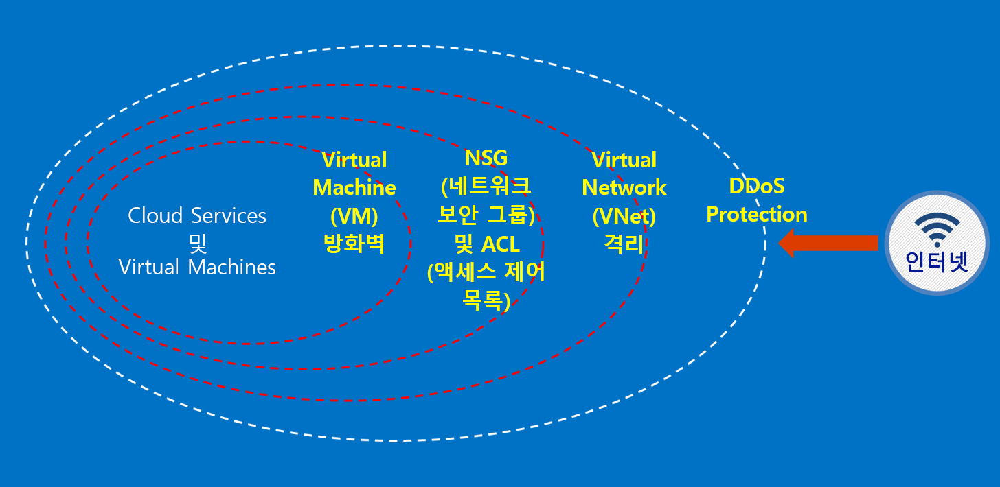

# Azure Australia란?

2014년 Azure는 오스트레일리아의 두 지역인 오스트레일리아 동부(시드니)와 오스트레일리아 남동부(멜버른)에서 시작되었습니다. 2018년 4월에는 캔버라에 위치한 새로운 두 Azure 지역인 오스트레일리아 중부 및 오스트레일리아 중부 2가 시작되었습니다. 오스트레일리아 중부 및 오스트레일리아 중부 2 지역은 정부 및 중요 국가 인프라의 요구 사항을 충족하도록 의도적으로 설계되었으며, 전문화된 연결과 유연성을 제공하여 비밀 등급으로 분류되는 네트워크에만 필요한 수준의 보안 및 복원력을 갖춘 클라우드에 시스템을 배치할 수 있습니다. Azure Australia는 정부 및 중요 국가 인프라의 디지털 전환을 위한 플랫폼이며, 이러한 요구 사항을 충족하도록 특별히 설계되어 오스트레일리아에서 사용할 수 있는 유일한 중요 업무용 클라우드입니다.

[Microsoft Azure Australia](https://azure.microsoft.com/global-infrastructure/australia/) 내에서 오스트레일리아 정부 데이터 및 시스템을 연결, 사용 및 운영하기 위한 특정 오스트레일리아 정부 요구 사항이 있습니다. 또한 이 페이지의 리소스는 보안 구성 및 운영에 집중하는 모든 고객에게 적용될 수 있는 일반 지침을 제공합니다.

Azure Australia IRAP(Information Security Registered Assessor) 평가, 인증 및 CCSL(Certified Cloud Services List)에의 포함에 대한 최신 정보는 [Microsoft Service Trust Portal](https://aka.ms/au-irap)의 Australia 페이지를 참조하세요. Australia 페이지에서는 정부 및 중요 인프라 공급 기업과 관련된 다른 Microsoft 추천 사항도 확인할 수 있습니다.

## Azure Australia의 고객 데이터 보호 원칙

Azure Australia는 규제/제어되는 데이터 요구 사항에 맞게 클라우드 솔루션을 구축하는 데 사용할 수 있는 다양한 기능과 서비스를 제공합니다. 규정을 준수하는 고객 솔루션은 견고한 데이터 보안 사례와 결합된 기본 제공 Azure Australia 기능의 효과적인 구현일 뿐입니다.

Azure Australia에서 솔루션을 호스팅하면 Microsoft는 클라우드 인프라 수준에서 이러한 요구 사항 중 대부분을 처리합니다.

다음 다이어그램에서는 Azure 심층 방어 모델을 보여 줍니다. 예를 들어 Microsoft는 고객 관련 애플리케이션 요구 사항을 위해 보안 어플라이언스 또는 프리미엄 DDoS 서비스와 같은 고객 기능과 함께 기본 클라우드 인프라 DDoS를 제공합니다.

이러한 문서에서는 이러한 원칙을 적용하는 방법에 대한 지침과 모범 사례를 사용하여 서비스와 애플리케이션을 보호하기 위한 기본 원칙을 간략히 설명합니다. 즉 고객이 Azure Australia를 현명하게 사용하여 정부의 중요 및 기밀 정보를 처리하는 솔루션에 필요한 의무와 책임을 충족시키는 방법을 설명합니다.

Azure로 마이그레이션하는 오스트레일리아 정부 기관을 위해 제공되는 두 가지 범주의 설명서가 있습니다.

## Azure Australia의 보안

ID, 역할 기반 액세스 제어, 암호화 및 권한 관리를 통한 데이터 보호, 효과적인 모니터링 및 구성 제어는 구현해야 하는 핵심 요소입니다. 이 섹션에는 기본 제공 Azure 기능과 이러한 기능이 ISM 및 ASD Essential 8과 관련되는 방식을 설명하는 일련의 문서가 있습니다.

이러한 문서는 *Azure Australia에서 개념 -> 보안* 아래의 메뉴를 통해 액세스할 수 있습니다.

## Azure Australia의 게이트웨이

정부 기관을 위한 또 다른 주요 단계는 경계 보안 기능을 설정하는 것입니다. 이러한 기능은 SIG(Secure Internet Gateway)라고 하며, Azure를 사용할 때 이러한 보호가 제대로 작동되도록 해야 합니다. Microsoft는 SIG를 운영하지 않지만, 모든 고객을 보호하는 에지 네트워킹 서비스와 Azure 환경 내에 배포된 특정 서비스를 결합하여 동일한 기능을 수행할 수 있습니다.

이러한 문서는 *Azure Australia에서 개념 -> 게이트웨이* 아래의 메뉴를 통해 액세스할 수 있습니다.

## 다음 단계

* Azure에서 데이터를 보호하는 데 집중하는 경우 [데이터 보안](secure-your-data.md)을 시작합니다.
* Azure에서 게이트웨이를 빌드하는 데 집중하는 경우 [게이트웨이 감사, 로깅 및 표시 유형](gateway-log-audit-visibility.md)을 시작합니다.
