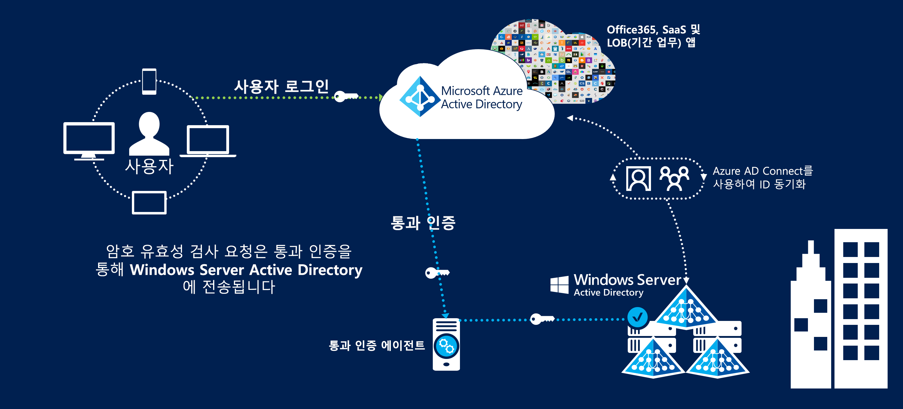

# Azure Australia의 ID 페더레이션

퍼블릭 클라우드를 사용하는 ID 관리 및 페더레이션 제품은 클라우드를 사용하기 위한 가장 중요한 첫 번째 단계 중 하나입니다. Microsoft의 Azure Active Directory 서비스는 사용자 정보를 저장하여 클라우드 서비스에 액세스할 수 있게 하며, 다른 Azure 서비스를 사용하기 위한 필수 구성 요소입니다.

이 문서에서는 Azure Active Directory 구현, Active Directory Domain Services 도메인의 사용자 동기화 및 보안 인증 구현을 위한 주요 디자인 요소에 대해 설명합니다. 특히 ACSC(Australian Cyber Security Center)의 ISM(Information Security Manual) 및 Azure 인증 보고서의 추천 사항을 중점적으로 다룹니다.

Azure Active Directory 내에 저장된 정보의 분류는 디자인 방법에 대한 결정을 알려야 합니다. [ACSC 인증 보고서 – Microsoft Azure](https://aka.ms/au-irap)에서 발췌한 내용은 다음과 같습니다.

>**ACSC 인증 보고서 – Microsoft Azure** 영연방 기관에서 Active Directory의 사용 및 데이터 콘텐츠를 PROTECTED로 분류하는 경우 Azure AD(Azure Active Directory)는 Active Directory Federation Services를 사용하여 구성해야 합니다. UDLM(UNCLASSIFIED Disposition Limiting Markings)으로 분류되는 Active Directory 데이터에는 페더레이션이 필요하지 않지만, 영연방 기관은 페더레이션을 계속 구현하여 오스트레일리아 외부에서 제공되는 서비스와 관련된 위험을 완화할 수 있습니다.

이와 같이 동기화되는 정보와 사용자가 인증되는 메커니즘은 여기서 다루는 두 가지 주요 문제입니다.

## 주요 디자인 고려 사항

### 사용자 동기화

Azure AD Connect를 배포하는 경우 동기화할 데이터에 대해 몇 가지 결정을 내려야 합니다. Azure AD Connect는 Microsoft Identity Manager를 기반으로 하며, 디렉터리 간에 데이터를 [변환](https://docs.microsoft.com/azure/active-directory/hybrid/how-to-connect-sync-best-practices-changing-default-configuration)하기 위한 강력한 기능 세트를 제공합니다.

Microsoft Consulting Services는 기존 Windows Server Active Directory에 대한 ADRAP 평가를 수행할 수 있습니다. ADRAP는 Azure Active Directory와 동기화하기 전에 수정해야 할 수 있는 문제를 확인하는 데 도움이 됩니다. Microsoft 프리미어 지원 계약에는 일반적으로 이 서비스가 포함됩니다.

[IDFix 도구](https://docs.microsoft.com/office365/enterprise/install-and-run-idfix)는 Azure AD와 동기화하기 전에 온-프레미스 Active Directory 도메인에서 문제를 검사합니다. IDFix는 Azure AD Connect를 구현하기 전의 중요한 첫 번째 단계입니다. IDFix 검사에서 많은 문제를 식별할 수 있지만 이러한 문제 중 대부분은 스크립트를 사용하여 빠르게 해결하거나 Azure AD Connect의 데이터 변환을 사용하여 해결할 수 있습니다.

Azure AD를 사용하려면 외부에서 라우팅할 수 있는 최상위 도메인이 사용자에게 있어야 합니다. 외부에서 라우팅할 수 없는 UPN 접미사가 도메인에 있으면 AD Connect의 [대체 로그인 ID](https://docs.microsoft.com/azure/active-directory/hybrid/plan-connect-userprincipalname)를 사용자의 메일 특성으로 설정해야 합니다. 그러면 사용자가 자신의 도메인 로그인 대신 이메일 주소를 사용하여 Azure 서비스에 로그인합니다.

그러나 PowerShell과 같은 도구를 사용하여 사용자 계정의 UPN 접미사를 변경할 수도 있습니다. 그러나 연결된 다른 시스템에 예기치 않은 결과가 발생할 수 있으며 더 이상 모범 사례로 간주되지 않습니다.

Azure Active Directory와 동기화할 특성을 결정할 때 모든 특성이 필요하다고 가정하는 것이 가장 안전합니다. 실제 PROTECTED 데이터가 디렉터리에 포함되는 경우는 거의 없지만 감사를 수행하는 것이 좋습니다. PROTECTED 데이터가 디렉터리 내에 있으면 특성을 생략하거나 변환하는 데 따른 영향을 평가합니다. 유용한 가이드로 Microsoft Cloud Services에 [필요한](https://docs.microsoft.com/azure/active-directory/hybrid/reference-connect-sync-attributes-synchronized) 특성 목록이 있습니다.

### 인증

사용 가능한 옵션과 최종 사용자의 보안을 유지하는 데 사용할 수 있는 방법을 이해하는 것이 중요합니다.
Microsoft는 Azure Active Directory에 대해 사용자를 인증하는 [세 가지 기본 솔루션](https://docs.microsoft.com/azure/active-directory/hybrid/plan-connect-user-signin)을 제공합니다.

* 암호 해시 동기화 - Active Directory Domain Services의 해시 암호는 Azure AD Connect를 통해 Azure Active Directory에 동기화됩니다.
* [통과 인증](https://docs.microsoft.com/azure/active-directory/hybrid/how-to-connect-pta) - 암호는 Active Directory Domain Services 내에 유지됩니다. 사용자는 에이전트를 통해 Active Directory Domain Services에 대해 인증됩니다. Azure AD 내에는 암호가 저장되지 않습니다.
* [페더레이션된 SSO](https://docs.microsoft.com/azure/active-directory/hybrid/how-to-connect-fed-whatis) - Azure Active Directory는 Active Directory Federation Services와 페더레이션되며, 로그인하는 동안 Azure에서 사용자에게 Active Directory Federation Services에 인증되도록 지시합니다. Azure AD 내에는 암호가 저장되지 않습니다.

암호 해시 동기화는 OFFICIAL:Sensitive 및 그 아래의 데이터가 디렉터리 내에 저장되는 시나리오에서 사용할 수 있습니다. PROTECTED 데이터를 저장하는 시나리오에는 나머지 두 옵션 중 하나가 필요합니다.

이 세 가지 옵션은 모두 [암호 쓰기 저장](https://docs.microsoft.com/azure/active-directory/authentication/concept-sspr-writeback)을 지원하지만, [ACSC 소비자 가이드](https://aka.ms/au-irap)에서는 사용하지 않도록 추천합니다. 그러나 조직에서는 셀프 서비스 암호 재설정을 사용하는 경우의 생산성 향상 및 지원 노력 감소와 암호 쓰기 저장을 사용하지 않도록 설정하는 경우의 위험을 비교하여 평가해야 합니다.

#### PTA(통과 인증)

통과 인증은 IRAP 평가가 완료된 후에 릴리스되었으므로 개별적으로 평가하여 조직의 위험 프로필에 대한 솔루션의 적합성을 확인해야 합니다. 보안 상태가 향상되므로 Microsoft는 통과 인증을 페더레이션보다 선호합니다.

통과 인증은 다음과 같은 고려해야 할 몇 가지 디자인 요소를 제시합니다.

* 통과 인증 에이전트는 Microsoft Cloud Services로 나가는 연결을 설정할 수 있어야 합니다.
* 서비스를 항상 사용할 수 있도록 둘 이상의 에이전트를 설치합니다. 3개 이상(최대 12개)의 에이전트를 배포하는 것이 좋습니다.
* 에이전트를 Active Directory 도메인 컨트롤러에 직접 설치하지 않도록 방지하는 것이 좋습니다. 기본적으로 통과 인증을 사용하여Azure AD Connect를 배포하는 경우 에이전트는 AD Connect 서버에 설치됩니다.
* 전용 서버 인프라, 인증서 관리 또는 인바운드 방화벽 규칙이 필요하지 않으므로 통과 인증은 Active Directory Federation Services보다 낮은 유지 관리 옵션입니다.

#### ADFS(Active Directory Federation Services)

Active Directory Federation Services는 IRAP 평가에 포함되었으며 PROTECTED 환경에서 사용하도록 승인되었습니다.

Active Directory Federation Services는 다음과 같은 고려해야 할 몇 가지 디자인 요소를 제시합니다.

* Federation Services에는 인터넷 또는 최소한 Microsoft의 서비스 엔드포인트에서 HTTPS 트래픽에 대한 네트워크 수신이 필요합니다.
* Federation Services는 PKI 및 인증서를 사용하며, 이를 위해 지속적으로 관리하고 갱신해야 합니다.
* Federation Services는 전용 서버에 배포해야 하며, 외부에서 안전하게 액세스할 수 있도록 관련 네트워크 인프라가 필요합니다.

### Multi-Factor Authentication(MFA)

다단계 인증에 대한 ISM 섹션에서는 위험 프로필에 따라 다음과 같은 시나리오에서 이를 구현하도록 추천합니다.

* 표준 사용자 인증
* 권한 있는 계정 인증
* 사용자 원격 액세스 인증
* 권한 있는 작업을 수행하는 사용자

Azure Active Directory는 모든 사용자 또는 일부 사용자(예: 권한 있는 계정)에만 사용할 수 있는 Multi-Factor Authentication을 제공합니다. 또한 Microsoft는 조건부 액세스라는 솔루션을 제공합니다. 이 솔루션을 사용하면 Multi-Factor Authentication이 적용되는 방법(예: 사용자가 원격 IP 주소 범위에서 로그인한 경우에만)을 더 세부적으로 제어할 수 있습니다.

Azure Multi-Factor Authentication에서 지원하는 ISM 허용 유효성 검사 형식은 다음과 같습니다.

* 전화 통화
* SMS 메시지
* Microsoft Authenticator 애플리케이션
* 지원되는 하드웨어 토큰

사용자가 네 번째 추천 사항을 충족하기 위해 권한을 상승시키는 경우 Azure Active Directory의 구성 요소인 Privileged Identity Management를 통해 Multi-Factor Authentication을 사용하도록 적용할 수 있습니다.

## 다음 단계

[역할 기반 액세스 제어 및 Privileged Identity Management](role-privileged.md) 문서를 검토합니다.
