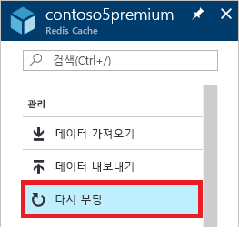
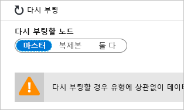
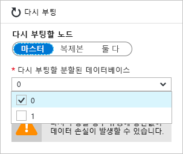
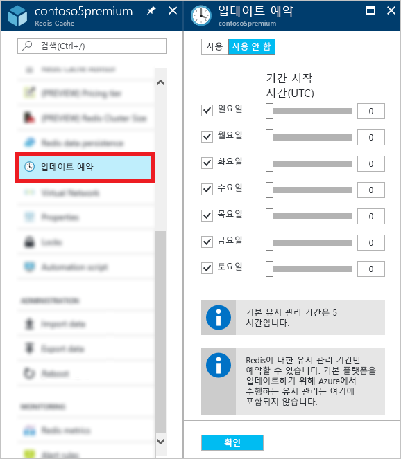

# Azure Cache for Redis를 관리하는 방법
이 항목에서는 Azure Cache for Redis 인스턴스에 대해 [다시 부팅](#reboot) 및 [업데이트 예약](#schedule-updates)과 같은 관리 작업을 수행하는 방법에 대해 설명합니다.

[!INCLUDE [updated-for-az](../../includes/updated-for-az.md)]

## Reboot
**재부팅** 블레이드에서는 하나 이상의 캐시 노드를 재부팅할 수 있습니다. 이 다시 부팅 기능을 사용하면 캐시 노드에 오류가 발생하는 경우 애플리케이션의 복원력을 테스트할 수 있습니다.

다시 부팅할 노드를 선택하고 **다시 부팅**을 클릭합니다.

클러스터링이 설정된 프리미엄 캐시를 사용하는 경우 재부팅할 캐시 분할을 선택할 수 있습니다.

하나 이상의 캐시 노드를 다시 부팅하려면 원하는 노드를 선택하고 **다시 부팅**을 클릭합니다. 클러스터링이 설정된 프리미엄 캐시를 사용하는 경우 다시 부팅할 원하는 분할을 선택하고 **다시 부팅**을 클릭합니다. 몇 분 후 선택된 노드가 다시 부팅되고, 다시 몇 분 후에 온라인 상태가 됩니다.

클라이언트 애플리케이션에 미치는 영향은 다시 부팅하는 노드에 따라 달라집니다.

* **마스터** - 마스터 노드가 다시 부팅되면 Azure Cache for Redis에서 복제본 노드로 장애 조치하고 해당 노드를 마스터로 승격합니다. 이 장애 조치(failover) 동안에는 짧은 시간 동안 캐시에 연결되지 않을 수 있습니다.
* **슬레이브** - 슬레이브 노드를 다시 부팅하는 경우는 일반적으로 캐시 클라이언트에 영향을 주지 않습니다.
* **마스터 및 슬레이브 모두** - 두 캐시 노드가 모두 다시 부팅되면 캐시의 모든 데이터가 유실되고, 주 노드가 다시 온라인 상태가 될 때까지 캐시에 연결할 수 없습니다. [데이터 지속성](cache-how-to-premium-persistence.md)을 구성한 경우 캐시가 다시 온라인 상태가 되면 가장 최근의 백업을 복원하지만 가장 최근의 백업이 손실된 후에 발생한 캐시가 작성됩니다.
* **클러스터링이 설정된 프리미엄 캐시 노드** - 클러스터링이 설정된 프리미엄 캐시 중 하나 이상의 노드를 다시 부팅하면 선택한 노드에서도 해당하는 노드 또는 클러스터링되지 않은 캐시의 노드를 다시 부팅할 때와 같은 동작이 나타납니다.

> [!IMPORTANT]
> 이제 모든 가격 책정 계층에서 다시 부팅을 사용할 수 있습니다.
> 
> 

## 다시 부팅 FAQ
* [애플리케이션을 테스트하려는 경우 어떤 노드를 다시 부팅해야 하나요?](#which-node-should-i-reboot-to-test-my-application)
* [캐시를 다시 부팅하여 클라이언트 연결을 끊을 수 있나요?](#can-i-reboot-the-cache-to-clear-client-connections)
* [다시 부팅하는 경우 캐시의 데이터가 손실되나요?](#will-i-lose-data-from-my-cache-if-i-do-a-reboot)
* [PowerShell, CLI 또는 기타 관리 도구를 사용하여 내 캐시를 다시 부팅할 수 있나요?](#can-i-reboot-my-cache-using-powershell-cli-or-other-management-tools)
* [어떤 가격 책정 계층에서 다시 부팅 기능을 사용할 수 있나요?](#what-pricing-tiers-can-use-the-reboot-functionality)

### 애플리케이션을 테스트하려는 경우 어떤 노드를 다시 부팅해야 하나요?
캐시의 주 노드 장애 시 애플리케이션의 복원력을 테스트하려면 **마스터** 노드를 다시 부팅합니다. 캐시의 보조 노드 장애 시 애플리케이션의 복원력을 테스트하려면 **슬레이브** 노드를 다시 부팅합니다. 캐시 전체의 장애 시 애플리케이션의 복원력을 테스트하려면 **두** 노드를 다시 부팅합니다.

### 캐시를 다시 부팅하여 클라이언트 연결을 끊을 수 있나요?
예, 캐시를 다시 부팅하면 모든 클라이언트 연결이 끊어집니다. 다시 부팅은 클라이언트 애플리케이션의 논리 오류나 버그로 인해 모든 클라이언트 연결이 다 소비된 경우에 유용할 수 있습니다. 각 가격 책정 계층에는 다양한 크기의 [클라이언트 연결 제한](cache-configure.md#default-redis-server-configuration)이 있으며 이러한 제한에 도달하면 추가적인 클라이언트 연결이 더 이상 허용되지 않습니다. 캐시를 다시 부팅하면 모든 클라이언트 연결을 끊을 수 있습니다.

> [!IMPORTANT]
> 캐시를 다시 부팅하여 클라이언트 연결의 선택을 취소하는 경우 Redis 노드가 다시 온라인 상태가 되면 StackExchange.Redis가 자동으로 다시 연결됩니다. 기본 문제가 해결되지 않으면 클라이언트 연결은 계속 소비될 것입니다.
> 
> 

### 다시 부팅하는 경우 캐시의 데이터가 손실되나요?
**마스터** 및 **슬레이브** 노드를 둘 다 다시 부팅하는 경우 캐시(또는 클러스터링이 설정된 프리미엄 캐시를 사용하는 해당 분할)의 모든 데이터가 손실됩니다. [데이터 지속성](cache-how-to-premium-persistence.md)을 구성한 경우 캐시가 다시 온라인 상태가 되면 가장 최근의 백업을 복원하지만 수행된 백업이 손실된 후에 발생한 캐시가 작성됩니다.

노드 중 하나만 다시 부팅하는 경우 일반적으로는 데이터가 손실되지 않지만 여전히 손실될 가능성이 있습니다. 예를 들어 캐시 쓰기가 진행 중일 때 마스터 노드를 다시 부팅하면 캐시 쓰기의 데이터가 손실됩니다. 데이터 손실이 발생할 수 있는 또 다른 시나리오는 노드 하나를 다시 부팅하는 동시에 오류로 인해 다른 노드가 작동 중단되는 경우입니다. 데이터 손실의 가능한 원인에 대한 자세한 내용은 [내 Redis 데이터에서 무엇이 변경되었나요?](https://gist.github.com/JonCole/b6354d92a2d51c141490f10142884ea4#file-whathappenedtomydatainredis-md)를 참조하세요.

### PowerShell, CLI 또는 기타 관리 도구를 사용하여 내 캐시를 다시 부팅할 수 있나요?
예, PowerShell 명령은 [Azure Cache for Redis를 다시 부팅하려면](cache-howto-manage-redis-cache-powershell.md#to-reboot-an-azure-cache-for-redis)을 참조하세요.

### 어떤 가격 책정 계층에서 다시 부팅 기능을 사용할 수 있나요?
모든 가격 책정 계층에서 다시 부팅을 사용할 수 있습니다.

## 업데이트를 예약
**업데이트 예약** 블레이드에서는 프리미엄 계층 캐시의 유지 관리 기간을 지정할 수 있습니다. 유지 관리 기간이 지정되면 이 기간 동안 Redis 서버 업데이트가 진행됩니다. 

> [!NOTE] 
> 유지 관리 기간은 Redis 서버 업데이트에만 적용되며 Azure 업데이트나 캐시를 호스트하는 VM의 운영 체제에 대한 업데이트에는 적용되지 않습니다.
> 
> 

유지 관리 기간을 지정하려면 원하는 요일을 선택하고 각 요일의 유지 관리 기간 시작 시간을 지정한 후 **확인**을 클릭합니다. 유지 관리 기간 시간은 UTC로 나타냅니다. 

업데이트를 위한 기본 및 최소 유지 관리 기간은 5시간입니다. 이 값은 Azure Portal에서는 구성할 수 없지만 PowerShell에서 [New-AzRedisCacheScheduleEntry](/powershell/module/az.rediscache/new-azrediscachescheduleentry) cmdlet의 `MaintenanceWindow` 매개 변수를 사용하여 구성할 수 있습니다. 자세한 내용은 PowerShell, CLI 또는 기타 관리 도구를 사용하여 예약된 업데이트를 관리할 수 있나요?를 참조하세요.

## 업데이트 예약 FAQ
* [일정 업데이트 기능을 사용하지 않으면 업데이트가 언제 발생하나요?](#when-do-updates-occur-if-i-dont-use-the-schedule-updates-feature)
* [예약된 유지 관리 기간 동안에는 어떤 유형의 업데이트가 진행되나요?](#what-type-of-updates-are-made-during-the-scheduled-maintenance-window)
* [PowerShell, CLI 또는 기타 관리 도구를 사용하여 예약된 업데이트를 관리할 수 있나요?](#can-i-managed-scheduled-updates-using-powershell-cli-or-other-management-tools)
* [어떤 가격 책정 계층에서 업데이트 예약 기능을 사용할 수 있나요?](#what-pricing-tiers-can-use-the-schedule-updates-functionality)

### 일정 업데이트 기능을 사용하지 않으면 업데이트가 언제 발생하나요?
유지 관리 기간을 지정하지 않으면, 언제든지 업데이트가 진행될 수 있습니다.

### 예약된 유지 관리 기간 동안에는 어떤 유형의 업데이트가 진행되나요?
예약된 유지 관리 기간 동안에는 Redis 서버 업데이트만 수행됩니다. 유지 관리 기간이 Azure 업데이트 또는 VM 운영 체제에 대한 업데이트에는 적용되지 않습니다.

### PowerShell, CLI 또는 기타 관리 도구를 사용하여 관리되는 예약된 업데이트를 수행할 수 있나요?
예, 다음 PowerShell cmdlet을 사용하여 예약된 업데이트를 관리할 수 있습니다.

* [Get-AzRedisCachePatchSchedule](/powershell/module/az.rediscache/get-azrediscachepatchschedule)
* [New-AzRedisCachePatchSchedule](/powershell/module/az.rediscache/new-azrediscachepatchschedule)
* [New-AzRedisCacheScheduleEntry](/powershell/module/az.rediscache/new-azrediscachescheduleentry)
* [Remove-AzRedisCachePatchSchedule](/powershell/module/az.rediscache/remove-azrediscachepatchschedule)

### 어떤 가격 책정 계층에서 업데이트 예약 기능을 사용할 수 있나요?
**업데이트 예약** 기능은 프리미엄 가격 책정 계층에서만 사용할 수 있습니다.

## 다음 단계
* [Azure Cache for Redis 프리미엄 계층](cache-premium-tier-intro.md) 기능을 자세히 살펴봅니다.

