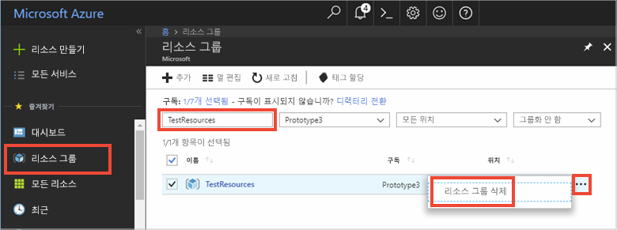

# <a name="quickstart-use-azure-cache-for-redis-with-a-net-application"></a>빠른 시작: .NET 애플리케이션에서 Azure Cache for Redis 사용


이 빠른 시작에서는 .NET에서 Microsoft Azure Cache for Redis 사용을 시작하는 방법을 보여 줍니다. Microsoft Azure Cache for Redis는 많이 사용되는 오픈 소스 Azure Cache for Redis를 기반으로 합니다. 이를 통해 Microsoft에서 관리하는 안전한 전용 Azure Cache for Redis에 액세스할 수 있습니다. Azure Cache for Redis를 사용하여 만들어진 캐시는 Microsoft Azure 내의 모든 애플리케이션에서 액세스할 수 있습니다.

이 빠른 시작에서는 콘솔 앱에서 C\# 코드를 통해 [StackExchange.Redis](https://github.com/StackExchange/StackExchange.Redis) 클라이언트를 사용합니다. 캐시를 만들고 .NET 클라이언트 앱을 구성합니다. 그런 다음, 캐시에 개체를 추가하고 업데이트합니다. 


[!INCLUDE [quickstarts-free-trial-note](../../includes/quickstarts-free-trial-note.md)]

## <a name="prerequisites"></a>필수 조건

* [Visual Studio](https://www.visualstudio.com/downloads/)
* StackExchange.Redis 클라이언트를 사용하려면 [.NET Framework 4 이상](https://www.microsoft.com/net/download/dotnet-framework-runtime)이 필요합니다.

## <a name="create-a-cache"></a>캐시 만들기
[!INCLUDE [redis-cache-create](../../includes/redis-cache-create.md)]

[!INCLUDE [redis-cache-access-keys](../../includes/redis-cache-access-keys.md)]

컴퓨터에 *CacheSecrets.config*라는 파일을 만들고 이 파일을 샘플 응용 프로그램의 소스 코드에서 체크인하지 않을 위치에 배치합니다. 이 빠른 시작의 경우 *CacheSecrets.config* 파일은 여기에서 *C:\AppSecrets\CacheSecrets.config*에 있습니다.

*CacheSecrets.config* 파일을 편집하여 다음 콘텐츠를 추가합니다.

```xml
<appSettings>
    <add key="CacheConnection" value="<cache-name>.redis.cache.windows.net,abortConnect=false,ssl=true,password=<access-key>"/>
</appSettings>
```

`<cache-name>`을 캐시 호스트 이름으로 바꿉니다.

`<access-key>`를 캐시에 대한 기본 키로 바꿉니다.


## <a name="create-a-console-app"></a>콘솔 앱 만들기

Visual Studio에서 **파일** > **새로 만들기** > **프로젝트**를 클릭합니다.

**Visual C#** 아래에서 **Windows 클래식 데스크톱**을 클릭한 다음, **콘솔 앱** 및 **확인**을 클릭하여 새 콘솔 응용 프로그램을 만듭니다.


<a name="configure-the-cache-clients"></a>

## <a name="configure-the-cache-client"></a>캐시 클라이언트 구성

이 섹션에서는 .NET용 [StackExchange.Redis](https://github.com/StackExchange/StackExchange.Redis) 클라이언트를 사용하도록 콘솔 응용 프로그램을 구성합니다.

Visual Studio에서 **도구** > **NuGet 패키지 관리자** > **패키지 관리자 콘솔**을 클릭하고, 패키지 관리자 콘솔 창에서 다음 명령을 실행합니다.

```powershell
Install-Package StackExchange.Redis
```

설치가 완료되면 *StackExchange.Redis* 캐시 클라이언트를 프로젝트에 사용할 수 있습니다.


## <a name="connect-to-the-cache"></a>캐시에 연결

Visual Studio에서 *App.config* 파일을 열고 *CacheSecrets.config* 파일을 참조하는 `appSettings` `file` 특성을 포함하도록 업데이트합니다.

```xml
<?xml version="1.0" encoding="utf-8" ?>
<configuration>
    <startup> 
        <supportedRuntime version="v4.0" sku=".NETFramework,Version=v4.7.1" />
    </startup>

    <appSettings file="C:\AppSecrets\CacheSecrets.config"></appSettings>  

</configuration>
```

솔루션 탐색기에서 **참조**를 마우스 오른쪽 단추로 클릭하고 **참조 추가**를 클릭합니다. **System.Configuration** 어셈블리에 참조를 추가합니다.

*Program.cs*에 다음 `using` 문을 추가합니다.

```csharp
using StackExchange.Redis;
using System.Configuration;
```

Azure Cache for Redis 연결은 `ConnectionMultiplexer` 클래스로 관리됩니다. 이 클래스는 클라이언트 응용 프로그램 전체에서 공유하고 다시 사용해야 합니다. 각 작업에 대해 새 연결을 만들지 마세요. 

소스 코드에 자격 증명을 저장해서는 안 됩니다. 이 샘플을 단순하게 유지하기 위해 외부 비밀 구성 파일만을 사용합니다. 더 나은 방법은 [인증서로 Azure Key Vault](https://docs.microsoft.com/rest/api/keyvault/certificate-scenarios)를 사용하는 것입니다.

*Program.cs*에서 콘솔 응용 프로그램의 `Program` 클래스에 다음 멤버를 추가합니다.

```csharp
        private static Lazy<ConnectionMultiplexer> lazyConnection = new Lazy<ConnectionMultiplexer>(() =>
        {
            string cacheConnection = ConfigurationManager.AppSettings["CacheConnection"].ToString();
            return ConnectionMultiplexer.Connect(cacheConnection);
        });

        public static ConnectionMultiplexer Connection
        {
            get
            {
                return lazyConnection.Value;
            }
        }
```


응용 프로그램에서 `ConnectionMultiplexer` 인스턴스를 공유하는 이 방법은 연결된 인스턴스를 반환하는 정적 속성을 사용합니다. 이 코드에서는 연결된 단일 `ConnectionMultiplexer` 인스턴스만 초기화하는 스레드로부터 안전한 방법을 제공합니다. `abortConnect`는 false로 설정되며, 이는 Azure Cache for Redis에 연결이 설정되지 않은 경우에도 호출이 성공한다는 것을 의미합니다. `ConnectionMultiplexer`의 한 가지 주요 기능은 네트워크 문제 또는 다른 원인이 해결되면 캐시에 연결이 자동으로 복원된다는 점입니다.

*CacheConnection* appSetting 값은 암호 매개 변수로 Azure Portal에서 캐시 연결 문자열을 참조하는 데 사용됩니다.

## <a name="executing-cache-commands"></a>캐시 명령 실행

콘솔 응용 프로그램에 대한 `Program` 클래스의 `Main` 프로시저에 다음 코드를 추가합니다.

```csharp
        static void Main(string[] args)
        {
            // Connection refers to a property that returns a ConnectionMultiplexer
            // as shown in the previous example.
            IDatabase cache = lazyConnection.Value.GetDatabase();

            // Perform cache operations using the cache object...

            // Simple PING command
            string cacheCommand = "PING";
            Console.WriteLine("\nCache command  : " + cacheCommand);
            Console.WriteLine("Cache response : " + cache.Execute(cacheCommand).ToString());

            // Simple get and put of integral data types into the cache
            cacheCommand = "GET Message";
            Console.WriteLine("\nCache command  : " + cacheCommand + " or StringGet()");
            Console.WriteLine("Cache response : " + cache.StringGet("Message").ToString());

            cacheCommand = "SET Message \"Hello! The cache is working from a .NET console app!\"";
            Console.WriteLine("\nCache command  : " + cacheCommand + " or StringSet()");
            Console.WriteLine("Cache response : " + cache.StringSet("Message", "Hello! The cache is working from a .NET console app!").ToString());

            // Demostrate "SET Message" executed as expected...
            cacheCommand = "GET Message";
            Console.WriteLine("\nCache command  : " + cacheCommand + " or StringGet()");
            Console.WriteLine("Cache response : " + cache.StringGet("Message").ToString());

            // Get the client list, useful to see if connection list is growing...
            cacheCommand = "CLIENT LIST";
            Console.WriteLine("\nCache command  : " + cacheCommand);
            Console.WriteLine("Cache response : \n" + cache.Execute("CLIENT", "LIST").ToString().Replace("id=", "id="));

            lazyConnection.Value.Dispose();
        }
```

Azure Cache for Redis에는 Azure Cache for Redis 내에서 데이터를 논리적으로 분리하는 데 사용할 수 있는 구성 가능한 수의 데이터베이스(기본값 16)가 있습니다. 이 코드에서는 기본 데이터베이스인 DB 0에 연결합니다. 자세한 내용은 [Redis 데이터베이스란?](cache-faq.md#what-are-redis-databases) 및 [기본 Redis 서버 구성](cache-configure.md#default-redis-server-configuration)을 참조하세요.

캐시 항목은 `StringSet` 및 `StringGet` 메서드를 사용하여 저장하고 검색할 수 있습니다.

Redis는 대부분의 데이터를 Redis 문자열로 저장하지만, 이 문자열은 캐시에 .NET 개체를 저장할 때 사용할 수 있는 직렬화된 이진 데이터를 포함하여 다양한 데이터 유형을 포함할 수 있습니다.

**Ctrl+F5** 키를 눌러 콘솔 앱을 빌드 및 실행합니다.

아래 예제에서는 이전에 Azure Portal에서 Redis 콘솔을 사용하여 설정된 캐시된 값이 있는 `Message` 키를 볼 수 있습니다. 앱에서 캐시된 값을 업데이트했습니다. 또한 앱에서 `PING` 및 `CLIENT LIST` 명령을 실행했습니다.


## <a name="work-with-net-objects-in-the-cache"></a>캐시의 .NET 개체 사용

Azure Cache for Redis는 .NET 개체 및 기본 데이터 유형을 캐시할 수 있지만 .NET 개체를 캐시하려면 먼저 직렬화해야 합니다. .NET 개체 직렬화는 응용 프로그램 개발자의 책임이며 개발자는 유연하게 직렬 변환기를 선택할 수 있습니다.

개체를 직렬화하는 간단한 방법 중 하나는 [Newtonsoft.Json](https://www.nuget.org/packages/Newtonsoft.Json/)에서 `JsonConvert` 직렬화 메서드를 사용하고 JSON 간에 직렬화하는 것입니다. 이 섹션에서는 .NET 개체를 캐시에 추가합니다.

Visual Studio에서 **도구** > **NuGet 패키지 관리자** > **패키지 관리자 콘솔**을 클릭하고, 패키지 관리자 콘솔 창에서 다음 명령을 실행합니다.

```powershell
Install-Package Newtonsoft.Json
```

다음 `using` 문을 *Program.cs*의 맨 위쪽에 추가합니다.

```charp
using Newtonsoft.Json;
```

다음 `Employee` 클래스 정의를 *Program.cs*에 추가합니다.

```csharp
        class Employee
        {
            public string Id { get; set; }
            public string Name { get; set; }
            public int Age { get; set; }

            public Employee(string EmployeeId, string Name, int Age)
            {
                this.Id = EmployeeId;
                this.Name = Name;
                this.Age = Age;
            }
        }
```

*Program.cs*의 `Main()` 프로시저의 맨 아래쪽에서 `Dispose()`에 대한 호출 앞에 직렬화된 .NET 개체를 캐시하고 검색하도록 다음 코드 줄을 추가합니다.

```csharp
            // Store .NET object to cache
            Employee e007 = new Employee("007", "Davide Columbo", 100);
            Console.WriteLine("Cache response from storing Employee .NET object : " + 
                cache.StringSet("e007", JsonConvert.SerializeObject(e007)));

            // Retrieve .NET object from cache
            Employee e007FromCache = JsonConvert.DeserializeObject<Employee>(cache.StringGet("e007"));
            Console.WriteLine("Deserialized Employee .NET object :\n");
            Console.WriteLine("\tEmployee.Name : " + e007FromCache.Name);
            Console.WriteLine("\tEmployee.Id   : " + e007FromCache.Id);
            Console.WriteLine("\tEmployee.Age  : " + e007FromCache.Age + "\n");
```

**Ctrl+F5** 키를 눌러 .NET 개체의 직렬화를 테스트하도록 콘솔 앱을 빌드 및 실행합니다. 


## <a name="clean-up-resources"></a>리소스 정리

다음 자습서를 계속 진행하려는 경우 이 빠른 시작에서 만든 리소스를 그대로 두었다가 다시 사용할 수 있습니다.

또는, 빠른 시작 샘플 응용 프로그램 사용을 마친 경우 이 빠른 시작에서 만든 Azure 리소스를 삭제하여 요금이 청구되는 것을 방지할 수 있습니다. 

> [!IMPORTANT]
> 리소스 그룹 삭제는 취소할 수 없으며 해당 리소스 그룹 및 해당 그룹 안에 있는 모든 리소스는 영구적으로 삭제됩니다. 잘못된 리소스 그룹 또는 리소스를 자동으로 삭제하지 않도록 해야 합니다. 유지하려는 리소스가 포함된 기존 리소스 그룹 내에 이 샘플을 호스트하기 위한 리소스를 만든 경우 리소스 그룹을 삭제하는 대신, 해당 블레이드에서 각 리소스를 개별적으로 삭제할 수 있습니다.
>

[Azure 포털](https://portal.azure.com) 에 로그인하고 **리소스 그룹**을 클릭합니다.

**이름을 기준으로 필터링...** 텍스트 상자에 리소스 그룹의 이름을 입력합니다. 이 문서의 지침에서는 *TestResources*라는 리소스 그룹을 사용했습니다. 결과 목록의 리소스 그룹에서 **...** 를 클릭한 다음, **리소스 그룹 삭제**를 클릭합니다.



리소스 그룹을 삭제할지 확인하는 메시지가 표시됩니다. 리소스 그룹의 이름을 입력하여 확인한 후 **삭제**를 클릭합니다.

잠시 후, 리소스 그룹 및 해당 그룹에 포함된 모든 리소스가 삭제됩니다.


<a name="next-steps"></a>

## <a name="next-steps"></a>다음 단계

이 빠른 시작에서는 .NET 애플리케이션에서 Azure Cache for Redis를 사용하는 방법을 알아보았습니다. ASP.NET 웹앱에서 Azure Cache for Redis를 사용하려면 다음 빠른 시작으로 계속 진행하세요.

> [!div class="nextstepaction"]
> [Azure Cache for Redis를 사용하는 ASP.NET 웹앱 만들기](./cache-web-app-howto.md)


