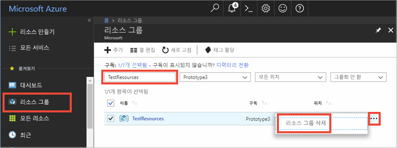

# <a name="quickstart-how-to-use-azure-cache-for-redis-with-java"></a>빠른 시작: Java에서 Azure Cache for Redis를 사용하는 방법


Azure Cache for Redis를 통해 Microsoft에서 관리하는 전용 Azure Cache for Redis에 액세스할 수 있습니다. Microsoft Azure 내의 모든 애플리케이션에서 캐시에 액세스할 수 있습니다.

이 문서에서는 Java용 [Jedis](https://github.com/xetorthio/jedis) Redis 클라이언트를 사용하여 Azure Cache for Redis를 시작하는 방법을 보여 줍니다.


이 빠른 시작의 단계를 완료하려면 아무 코드 편집기나 사용할 수 있습니다. 그러나 [Visual Studio Code](https://code.visualstudio.com/)는 Windows, macOS 및 Linux 플랫폼에서 사용할 수 있는 뛰어난 옵션입니다.

[!INCLUDE [quickstarts-free-trial-note](../../includes/quickstarts-free-trial-note.md)]


## <a name="prerequisites"></a>필수 조건

[Apache Maven](http://maven.apache.org/)


## <a name="create-an-azure-cache-for-redis"></a>Azure Cache for Redis 만들기

[!INCLUDE [redis-cache-create](../../includes/redis-cache-create.md)]

[!INCLUDE [redis-cache-access-keys](../../includes/redis-cache-access-keys.md)]

**호스트 이름** 및 **기본** 액세스 키에 대한 환경 변수를 추가합니다. 코드에 직접 중요한 정보를 포함하는 대신 사용자 코드에서 이러한 변수를 사용합니다.

```
set REDISCACHEHOSTNAME=contosoCache.redis.cache.windows.net
set REDISCACHEKEY=XXXXXXXXXXXXXXXXXXXXXXXXXXXXXXXXXXXXXXXXXXXX
```

## <a name="create-a-new-java-app"></a>새 Java 앱 만들기

Maven을 사용하여 새 빠른 시작 앱을 생성합니다.

```
mvn archetype:generate -DarchetypeGroupId=org.apache.maven.archetypes -DarchetypeArtifactId=maven-archetype-quickstart -DarchetypeVersion=1.3 -DgroupId=example.demo -DartifactId=redistest -Dversion=1.0
```

새 *redistest* 프로젝트 디렉터리로 변경합니다.

*pom.xml* 파일을 열고 [Jedis](https://github.com/xetorthio/jedis)에 대한 종속성을 추가합니다.

```xml
    <dependency>
        <groupId>redis.clients</groupId>
        <artifactId>jedis</artifactId>
        <version>2.9.0</version>
        <type>jar</type>
        <scope>compile</scope>
    </dependency>
```

*pom.xml* 파일을 저장합니다.

*App.java*를 열고 코드를 다음 코드로 바꿉니다.

```java
package example.demo;

import redis.clients.jedis.Jedis;
import redis.clients.jedis.JedisShardInfo;

/**
 * Redis test
 *
 */
public class App 
{
    public static void main( String[] args )
    {

        boolean useSsl = true;
        String cacheHostname = System.getenv("REDISCACHEHOSTNAME");
        String cachekey = System.getenv("REDISCACHEKEY");

        // Connect to the Azure Cache for Redis over the SSL port using the key.
        JedisShardInfo shardInfo = new JedisShardInfo(cacheHostname, 6380, useSsl);
        shardInfo.setPassword(cachekey); /* Use your access key. */
        Jedis jedis = new Jedis(shardInfo);      

        // Perform cache operations using the cache connection object...

        // Simple PING command        
        System.out.println( "\nCache Command  : Ping" );
        System.out.println( "Cache Response : " + jedis.ping());

        // Simple get and put of integral data types into the cache
        System.out.println( "\nCache Command  : GET Message" );
        System.out.println( "Cache Response : " + jedis.get("Message"));

        System.out.println( "\nCache Command  : SET Message" );
        System.out.println( "Cache Response : " + jedis.set("Message", "Hello! The cache is working from Java!"));

        // Demostrate "SET Message" executed as expected...
        System.out.println( "\nCache Command  : GET Message" );
        System.out.println( "Cache Response : " + jedis.get("Message"));

        // Get the client list, useful to see if connection list is growing...
        System.out.println( "\nCache Command  : CLIENT LIST" );
        System.out.println( "Cache Response : " + jedis.clientList());

        jedis.close();
    }
}
```

이 코드는 캐시 호스트 이름 및 키 환경 변수를 사용하여 Azure Cache for Redis 인스턴스에 연결하는 방법을 보여 줍니다. 코드는 또한 캐시에 문자열 값을 저장하고 검색합니다. 또한 `PING` 및 `CLIENT LIST` 명령을 실행했습니다. 

*App.java*를 저장합니다.

## <a name="build-and-run-the-app"></a>앱 빌드 및 실행

다음 Maven 명령을 실행하여 앱을 빌드 및 실행합니다.

```
mvn compile
mvn exec:java -D exec.mainClass=example.demo.App
```

아래 예제에서는 이전에 Azure Portal에서 Redis 콘솔을 사용하여 설정된 캐시된 값이 있는 `Message` 키를 볼 수 있습니다. 앱에서 캐시된 값을 업데이트했습니다. 또한 앱에서 `PING` 및 `CLIENT LIST` 명령을 실행했습니다.


## <a name="clean-up-resources"></a>리소스 정리

다음 자습서를 계속 진행하려는 경우 이 빠른 시작에서 만든 리소스를 그대로 두었다가 다시 사용할 수 있습니다.

또는, 빠른 시작 샘플 애플리케이션 사용을 마친 경우 이 빠른 시작에서 만든 Azure 리소스를 삭제하여 요금이 청구되는 것을 방지할 수 있습니다. 

> [!IMPORTANT]
> 리소스 그룹 삭제는 취소할 수 없으며 해당 리소스 그룹 및 해당 그룹 안에 있는 모든 리소스는 영구적으로 삭제됩니다. 잘못된 리소스 그룹 또는 리소스를 자동으로 삭제하지 않도록 해야 합니다. 유지하려는 리소스가 포함된 기존 리소스 그룹 내에 이 샘플을 호스트하기 위한 리소스를 만든 경우 리소스 그룹을 삭제하는 대신, 해당 블레이드에서 각 리소스를 개별적으로 삭제할 수 있습니다.
>

[Azure 포털](https://portal.azure.com) 에 로그인하고 **리소스 그룹**을 클릭합니다.

**이름을 기준으로 필터링...** 텍스트 상자에 리소스 그룹의 이름을 입력합니다. 이 문서의 지침에서는 *TestResources*라는 리소스 그룹을 사용했습니다. 결과 목록의 리소스 그룹에서 **...** 를 클릭한 다음, **리소스 그룹 삭제**를 클릭합니다.



리소스 그룹을 삭제할지 확인하는 메시지가 표시됩니다. 리소스 그룹의 이름을 입력하여 확인한 후 **삭제**를 클릭합니다.

잠시 후, 리소스 그룹 및 해당 그룹에 포함된 모든 리소스가 삭제됩니다.


## <a name="next-steps"></a>다음 단계

이 빠른 시작에서는 Java 애플리케이션에서 Azure Cache for Redis를 사용하는 방법을 알아보았습니다. ASP.NET 웹앱에서 Azure Cache for Redis를 사용하려면 다음 빠른 시작으로 계속 진행하세요.

> [!div class="nextstepaction"]
> [Azure Cache for Redis를 사용하는 ASP.NET 웹앱 만들기](./cache-web-app-howto.md)


