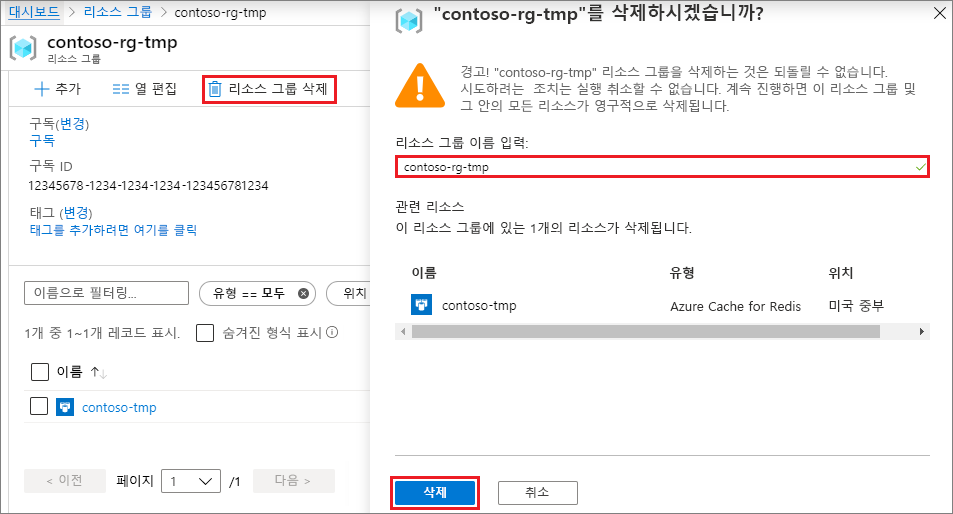

# <a name="quickstart-create-a-python-app-that-uses-azure-cache-for-redis"></a>빠른 시작: Azure Cache for Redis를 사용하는 Python 앱 만들기

이 문서에서는 Azure 내 모든 애플리케이션에서 액세스할 수 있는 안전한 전용 캐시에 액세스할 수 있도록 Azure Cache for Redis를 Python 앱에 통합합니다.

## <a name="prerequisites"></a>필수 조건

- Azure 구독 - [체험 구독 만들기](https://azure.microsoft.com/free/)
- [Python 2 또는 3](https://www.python.org/downloads/)

## <a name="create-an-azure-cache-for-redis-instance"></a>Azure Cache for Redis 인스턴스 만들기
[!INCLUDE [redis-cache-create](../../includes/redis-cache-create.md)]

[!INCLUDE [redis-cache-create](../../includes/redis-cache-access-keys.md)]

## <a name="install-redis-py"></a>redis-py 설치

[Redis-py](https://github.com/andymccurdy/redis-py)는 Azure Cache for Redis에 대한 Python 인터페이스입니다. Python 패키지 도구 *pip*를 사용하여 명령 프롬프트에서 *redis-py* 패키지를 설치합니다. 

다음 예제에서는 Python 3용 *pip3*를 사용하여 관리자 명령 프롬프트에서 Windows 10에 *redis-py*를 설치하는 방법을 소개합니다.


## <a name="read-and-write-to-the-cache"></a>캐시 읽기 및 캐시에 쓰기

명령줄에서 Python을 실행하고 다음 코드를 사용하여 캐시를 테스트합니다. `<Your Host Name>` 및 `<Your Access Key>`를 Azure Cache for Redis 인스턴스의 값으로 바꿉니다. 호스트 이름은 *\<DNS 이름>.redis.cache.windows.net* 형식입니다.

```python
>>> import redis
>>> r = redis.StrictRedis(host='<Your Host Name>',
        port=6380, db=0, password='<Your Access Key>', ssl=True)
>>> r.set('foo', 'bar')
True
>>> r.get('foo')
b'bar'
```

> [!IMPORTANT]
> Azure Cache for Redis 버전이 3.0 이상인 경우 SSL 인증서 확인이 적용됩니다. Azure Cache for Redis에 연결할 때 ssl_ca_certs를 명시적으로 설정해야 합니다. RedHat Linux의 경우 ssl_ca_certs는 */etc/pki/tls/certs/ca-bundle.crt* 인증서 모듈에 있습니다.

## <a name="create-a-python-sample-app"></a>Python 샘플 앱 만들기

새 텍스트 파일을 만들고, 다음 스크립트를 추가한 후 파일을 *PythonApplication1.py*로 저장합니다. `<Your Host Name>` 및 `<Your Access Key>`를 Azure Cache for Redis 인스턴스의 값으로 바꿉니다. 호스트 이름은 *\<DNS 이름>.redis.cache.windows.net* 형식입니다.

```python
import redis

myHostname = "<Your Host Name>"
myPassword = "<Your Access Key>"

r = redis.StrictRedis(host=myHostname, port=6380,
                      password=myPassword, ssl=True)

result = r.ping()
print("Ping returned : " + str(result))

result = r.set("Message", "Hello!, The cache is working with Python!")
print("SET Message returned : " + str(result))

result = r.get("Message")
print("GET Message returned : " + result.decode("utf-8"))

result = r.client_list()
print("CLIENT LIST returned : ")
for c in result:
    print("id : " + c['id'] + ", addr : " + c['addr'])
```

Python을 사용하여 *PythonApplication1.py*를 실행합니다. 다음 예제와 같은 결과가 표시됩니다.


## <a name="clean-up-resources"></a>리소스 정리

이 빠른 시작에서 만든 Azure 리소스 그룹 및 리소스 애플리케이션을 완료했으면 요금이 청구되지 않도록 삭제할 수 있습니다.

> [!IMPORTANT]
> 리소스 그룹을 삭제하면 취소할 수 없으며 해당 리소스 그룹 및 해당 그룹 안에 있는 모든 리소스는 영구적으로 삭제됩니다. 유지하려는 기존 리소스 그룹에 Azure Cache for Redis 인스턴스를 만든 경우 캐시 **개요** 페이지에서 **삭제**를 선택하여 캐시만 삭제할 수 있습니다. 

Azure 인스턴스에 대한 리소스 그룹 및 해당 Redis Cache을 삭제하려면 다음을 수행합니다.

1. [Azure Portal](https://portal.azure.com)에서 **리소스 그룹**을 찾아 선택합니다.
1. **이름으로 필터링** 텍스트 상자에 캐시 인스턴스를 포함하는 리소스 그룹의 이름을 입력한 다음, 검색 결과에서 선택합니다. 
1. 리소스 그룹 페이지에서 **리소스 그룹 삭제**를 선택합니다.
1. 리소스 그룹 이름을 입력한 다음, **삭제**를 선택합니다.
   
   

## <a name="next-steps"></a>다음 단계

> [!div class="nextstepaction"]
> [Azure Cache for Redis를 사용하는 간단한 ASP.NET 웹앱 만들기](./cache-web-app-howto.md)

