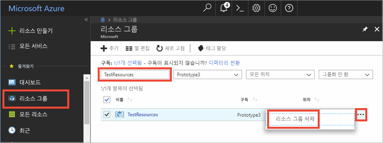

# <a name="quickstart-use-azure-cache-for-redis-with-python"></a>빠른 시작: Python에서 Azure Cache for Redis 사용


## <a name="introduction"></a>소개

이 빠른 시작에서는 캐시를 읽고 캐시에 쓰기 위해 Python을 사용하여 Azure Cache for Redis에 연결하는 방법을 보여 줍니다. 


[!INCLUDE [quickstarts-free-trial-note](../../includes/quickstarts-free-trial-note.md)]

## <a name="prerequisites"></a>필수 조건

* [Python 2 또는 Python 3 환경](https://www.python.org/downloads/)은 [pip](https://pypi.org/project/pip/)와 함께 설치됩니다. 

## <a name="create-an-azure-cache-for-redis-on-azure"></a>Azure에서 Azure Cache for Redis 만들기
[!INCLUDE [redis-cache-create](../../includes/redis-cache-create.md)]

[!INCLUDE [redis-cache-create](../../includes/redis-cache-access-keys.md)]

## <a name="install-redis-py"></a>redis-py 설치

[Redis-py](https://github.com/andymccurdy/redis-py)는 Azure Cache for Redis에 대한 Python 인터페이스입니다. Python 패키지 도구 *pip*를 사용하여 redis-py 패키지를 설치합니다. 

다음 예제는 Python3용 *pip3*을 통해 상승된 관리자 권한을 가지고 실행한 Visual Studio 2019 개발자 명령 프롬프트를 사용하여 Windows 10에 redis-py 패키지를 설치합니다.

    pip3 install redis


## <a name="read-and-write-to-the-cache"></a>캐시 읽기 및 캐시에 쓰기

Python을 실행하고 명령줄에서 캐시를 사용하여 테스트합니다. `<Your Host Name>` 및 `<Your Access Key>`를 Azure Cache for Redis 값으로 바꿉니다. 

```python
>>> import redis
>>> r = redis.StrictRedis(host='<Your Host Name>.redis.cache.windows.net',
        port=6380, db=0, password='<Your Access Key>', ssl=True)
>>> r.set('foo', 'bar')
True
>>> r.get('foo')
b'bar'
```

## <a name="create-a-python-script"></a>Python 스크립트 만들기

*PythonApplication1.py*라는 새 스크립트 텍스트 파일을 만듭니다.

다음 스크립트를 *PythonApplication1.py*에 추가하고 파일을 저장합니다. 이 스크립트가 캐시 액세스를 테스트하게 됩니다. `<Your Host Name>` 및 `<Your Access Key>`를 Azure Cache for Redis 값으로 바꿉니다. 

```python
import redis

myHostname = "<Your Host Name>.redis.cache.windows.net"
myPassword = "<Your Access Key>"

r = redis.StrictRedis(host=myHostname, port=6380,password=myPassword,ssl=True)

result = r.ping()
print("Ping returned : " + str(result))

result = r.set("Message", "Hello!, The cache is working with Python!")
print("SET Message returned : " + str(result))

result = r.get("Message")
print("GET Message returned : " + result.decode("utf-8"))

result = r.client_list()
print("CLIENT LIST returned : ") 
for c in result:
    print("id : " + c['id'] + ", addr : " + c['addr'])
```

Python을 사용하여 스크립트를 실행합니다.


## <a name="clean-up-resources"></a>리소스 정리

다른 자습서를 계속 진행하려는 경우 이 빠른 시작에서 만든 리소스를 그대로 두었다가 다시 사용할 수 있습니다.

그렇지 않고, 빠른 시작 샘플 애플리케이션 사용이 끝나면 이 빠른 시작에서 만든 Azure 리소스를 삭제하여 요금이 청구되는 것을 방지할 수 있습니다. 

> [!IMPORTANT]
> 리소스 그룹 삭제는 취소할 수 없으며 해당 리소스 그룹 및 해당 그룹 안에 있는 모든 리소스는 영구적으로 삭제됩니다. 잘못된 리소스 그룹 또는 리소스를 자동으로 삭제하지 않도록 해야 합니다. 유지하려는 리소스가 포함된 기존 리소스 그룹 내에 이 샘플을 호스트하기 위한 리소스를 만든 경우 리소스 그룹을 삭제하는 대신, 해당 블레이드에서 각 리소스를 개별적으로 삭제할 수 있습니다.
>

[Azure 포털](https://portal.azure.com) 에 로그인하고 **리소스 그룹**을 클릭합니다.

**이름을 기준으로 필터링...** 텍스트 상자에 리소스 그룹의 이름을 입력합니다. 이 문서의 지침에서는 *TestResources*라는 리소스 그룹을 사용했습니다. 결과 목록의 리소스 그룹에서 **...** 를 클릭한 다음, **리소스 그룹 삭제**를 클릭합니다.



리소스 그룹을 삭제할지 확인하는 메시지가 표시됩니다. 리소스 그룹의 이름을 입력하여 확인한 후 **삭제**를 클릭합니다.

잠시 후 리소스 그룹 및 해당 그룹에 포함된 모든 리소스가 삭제됩니다.


## <a name="next-steps"></a>다음 단계

> [!div class="nextstepaction"]
> [Azure Cache for Redis를 사용하는 간단한 ASP.NET 웹앱 만들기](./cache-web-app-howto.md)


<!--Image references-->
[1]: ./media/cache-python-get-started/redis-cache-new-cache-menu.png
[2]: ./media/cache-python-get-started/redis-cache-cache-create.png
