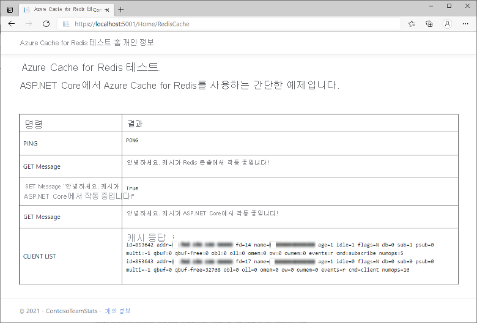

# <a name="quickstart-use-azure-cache-for-redis-with-an-aspnet-core-web-app"></a>빠른 시작: ASP.NET Core 웹앱에서 Azure Cache for Redis 사용 

이 빠른 시작에서는 Azure Cache for Redis에 연결하여 캐시의 데이터를 저장하고 검색하는 ASP.NET Core 웹 애플리케이션에 Azure Cache for Redis를 연결합니다.

## <a name="skip-to-the-code-on-github"></a>GitHub의 코드로 건너뛰기

코드로 바로 건너뛰려면 GitHub의 [ASP.NET Core 빠른 시작](https://github.com/Azure-Samples/azure-cache-redis-samples/tree/main/quickstart/aspnet-core)을 참조하세요.

## <a name="prerequisites"></a>필수 구성 요소

- Azure 구독 - [체험 구독 만들기](https://azure.microsoft.com/free/)
- [.NET Core SDK](https://dotnet.microsoft.com/download)

## <a name="create-a-cache"></a>캐시 만들기

[!INCLUDE [redis-cache-create](../../includes/redis-cache-create.md)]

[!INCLUDE [redis-cache-access-keys](../../includes/redis-cache-access-keys.md)]

**호스트 이름** 및 **기본** 액세스 키를 적어 둡니다. 나중에 이러한 값을 사용하여 *CacheConnection* 비밀을 구성합니다.

## <a name="create-an-aspnet-core-web-app"></a>ASP.NET Core 웹앱 만들기

새 명령 창을 열고, 다음 명령을 실행하여 새 ASP.NET Core 웹앱을 만듭니다(Model-View-Controller).

```dotnetcli
dotnet new mvc -o ContosoTeamStats
```

명령 창에서 새 *ContosoTeamStats* 프로젝트 디렉터리로 변경합니다.

[!INCLUDE[Add Secret Manager support to an ASP.NET Core project](../../includes/azure-app-configuration-add-secret-manager.md)]

다음 명령을 실행하여 프로젝트에 *Microsoft.Extensions.Configuration.UserSecrets* 패키지를 추가합니다.

```dotnetcli
dotnet add package Microsoft.Extensions.Configuration.UserSecrets
```

다음 명령을 실행하여 패키지를 복원합니다.

```dotnetcli
dotnet restore
```

명령 창에서 캐시 이름과 기본 액세스 키에 대한 자리 표시자(꺾쇠 괄호 포함)를 바꾼 다음, 다음 명령을 실행하여 *CacheConnection* 이라는 새 비밀을 저장합니다.

```dotnetcli
dotnet user-secrets set CacheConnection "<cache name>.redis.cache.windows.net,abortConnect=false,ssl=true,allowAdmin=true,password=<primary-access-key>"
```

## <a name="configure-the-cache-client"></a>캐시 클라이언트 구성

이 섹션에서는 .NET용 [StackExchange.Redis](https://github.com/StackExchange/StackExchange.Redis)를 사용하도록 애플리케이션을 구성합니다.

명령 창의 *ContosoTeamStats* 프로젝트 디렉터리에서 다음 명령을 실행합니다.

```dotnetcli
dotnet add package StackExchange.Redis
```

설치가 완료되면 *StackExchange.Redis* 캐시 클라이언트를 프로젝트에 사용할 수 있습니다.

## <a name="update-the-homecontroller-and-layout"></a>HomeController 및 레이아웃 업데이트

다음 `using` 문을 *Controllers\HomeController.cs* 에 추가합니다.

```csharp
using System.Net.Sockets;
using System.Text;
using System.Threading;

using Microsoft.Extensions.Configuration;

using StackExchange.Redis;
```

다음을

```csharp
private readonly ILogger<HomeController> _logger;

public HomeController(ILogger<HomeController> logger)
{
    _logger = logger;
}
```

다음으로 바꿉니다.

```csharp
private readonly ILogger<HomeController> _logger;
private static IConfiguration Configuration { get; set; }

public HomeController(ILogger<HomeController> logger, IConfiguration configuration)
{
    _logger = logger;
    if (Configuration == null)
        Configuration = configuration;
}
```

다음 멤버를 `HomeController` 클래스에 추가하여 새 캐시에 대한 일부 명령을 실행하는 새 `RedisCache` 작업을 지원합니다.

```csharp
public ActionResult RedisCache()
{
    ViewBag.Message = "A simple example with Azure Cache for Redis on ASP.NET Core.";

    IDatabase cache = GetDatabase();

    // Perform cache operations using the cache object...

    // Simple PING command
    ViewBag.command1 = "PING";
    ViewBag.command1Result = cache.Execute(ViewBag.command1).ToString();

    // Simple get and put of integral data types into the cache
    ViewBag.command2 = "GET Message";
    ViewBag.command2Result = cache.StringGet("Message").ToString();

    ViewBag.command3 = "SET Message \"Hello! The cache is working from ASP.NET Core!\"";
    ViewBag.command3Result = cache.StringSet("Message", "Hello! The cache is working from ASP.NET Core!").ToString();

    // Demonstrate "SET Message" executed as expected...
    ViewBag.command4 = "GET Message";
    ViewBag.command4Result = cache.StringGet("Message").ToString();

    // Get the client list, useful to see if connection list is growing...
    // Note that this requires allowAdmin=true in the connection string
    ViewBag.command5 = "CLIENT LIST";
    StringBuilder sb = new StringBuilder();
    var endpoint = (System.Net.DnsEndPoint)GetEndPoints()[0];
    IServer server = GetServer(endpoint.Host, endpoint.Port);
    ClientInfo[] clients = server.ClientList();

    sb.AppendLine("Cache response :");
    foreach (ClientInfo client in clients)
    {
        sb.AppendLine(client.Raw);
    }

    ViewBag.command5Result = sb.ToString();

    return View();
}

private const string SecretName = "CacheConnection";

private static long lastReconnectTicks = DateTimeOffset.MinValue.UtcTicks;
private static DateTimeOffset firstErrorTime = DateTimeOffset.MinValue;
private static DateTimeOffset previousErrorTime = DateTimeOffset.MinValue;

private static readonly object reconnectLock = new object();

// In general, let StackExchange.Redis handle most reconnects,
// so limit the frequency of how often ForceReconnect() will
// actually reconnect.
public static TimeSpan ReconnectMinFrequency => TimeSpan.FromSeconds(60);

// If errors continue for longer than the below threshold, then the
// multiplexer seems to not be reconnecting, so ForceReconnect() will
// re-create the multiplexer.
public static TimeSpan ReconnectErrorThreshold => TimeSpan.FromSeconds(30);

public static int RetryMaxAttempts => 5;

private static Lazy<ConnectionMultiplexer> lazyConnection = CreateConnection();

public static ConnectionMultiplexer Connection
{
    get
    {
        return lazyConnection.Value;
    }
}

private static Lazy<ConnectionMultiplexer> CreateConnection()
{
    return new Lazy<ConnectionMultiplexer>(() =>
    {
        string cacheConnection = Configuration[SecretName];
        return ConnectionMultiplexer.Connect(cacheConnection);
    });
}

private static void CloseConnection(Lazy<ConnectionMultiplexer> oldConnection)
{
    if (oldConnection == null)
        return;

    try
    {
        oldConnection.Value.Close();
    }
    catch (Exception)
    {
        // Example error condition: if accessing oldConnection.Value causes a connection attempt and that fails.
    }
}

/// <summary>
/// Force a new ConnectionMultiplexer to be created.
/// NOTES:
///     1. Users of the ConnectionMultiplexer MUST handle ObjectDisposedExceptions, which can now happen as a result of calling ForceReconnect().
///     2. Don't call ForceReconnect for Timeouts, just for RedisConnectionExceptions or SocketExceptions.
///     3. Call this method every time you see a connection exception. The code will:
///         a. wait to reconnect for at least the "ReconnectErrorThreshold" time of repeated errors before actually reconnecting
///         b. not reconnect more frequently than configured in "ReconnectMinFrequency"
/// </summary>
public static void ForceReconnect()
{
    var utcNow = DateTimeOffset.UtcNow;
    long previousTicks = Interlocked.Read(ref lastReconnectTicks);
    var previousReconnectTime = new DateTimeOffset(previousTicks, TimeSpan.Zero);
    TimeSpan elapsedSinceLastReconnect = utcNow - previousReconnectTime;

    // If multiple threads call ForceReconnect at the same time, we only want to honor one of them.
    if (elapsedSinceLastReconnect < ReconnectMinFrequency)
        return;

    lock (reconnectLock)
    {
        utcNow = DateTimeOffset.UtcNow;
        elapsedSinceLastReconnect = utcNow - previousReconnectTime;

        if (firstErrorTime == DateTimeOffset.MinValue)
        {
            // We haven't seen an error since last reconnect, so set initial values.
            firstErrorTime = utcNow;
            previousErrorTime = utcNow;
            return;
        }

        if (elapsedSinceLastReconnect < ReconnectMinFrequency)
            return; // Some other thread made it through the check and the lock, so nothing to do.

        TimeSpan elapsedSinceFirstError = utcNow - firstErrorTime;
        TimeSpan elapsedSinceMostRecentError = utcNow - previousErrorTime;

        bool shouldReconnect =
            elapsedSinceFirstError >= ReconnectErrorThreshold // Make sure we gave the multiplexer enough time to reconnect on its own if it could.
            && elapsedSinceMostRecentError <= ReconnectErrorThreshold; // Make sure we aren't working on stale data (e.g. if there was a gap in errors, don't reconnect yet).

        // Update the previousErrorTime timestamp to be now (e.g. this reconnect request).
        previousErrorTime = utcNow;

        if (!shouldReconnect)
            return;

        firstErrorTime = DateTimeOffset.MinValue;
        previousErrorTime = DateTimeOffset.MinValue;

        Lazy<ConnectionMultiplexer> oldConnection = lazyConnection;
        CloseConnection(oldConnection);
        lazyConnection = CreateConnection();
        Interlocked.Exchange(ref lastReconnectTicks, utcNow.UtcTicks);
    }
}

// In real applications, consider using a framework such as
// Polly to make it easier to customize the retry approach.
private static T BasicRetry<T>(Func<T> func)
{
    int reconnectRetry = 0;
    int disposedRetry = 0;

    while (true)
    {
        try
        {
            return func();
        }
        catch (Exception ex) when (ex is RedisConnectionException || ex is SocketException)
        {
            reconnectRetry++;
            if (reconnectRetry > RetryMaxAttempts)
                throw;
            ForceReconnect();
        }
        catch (ObjectDisposedException)
        {
            disposedRetry++;
            if (disposedRetry > RetryMaxAttempts)
                throw;
        }
    }
}

public static IDatabase GetDatabase()
{
    return BasicRetry(() => Connection.GetDatabase());
}

public static System.Net.EndPoint[] GetEndPoints()
{
    return BasicRetry(() => Connection.GetEndPoints());
}

public static IServer GetServer(string host, int port)
{
    return BasicRetry(() => Connection.GetServer(host, port));
}
```

*Views\Shared\\_Layout.cshtml* 을 엽니다.

다음을

```cshtml
<a class="navbar-brand" asp-area="" asp-controller="Home" asp-action="Index">ContosoTeamStats</a>
```

다음으로 바꿉니다.

```cshtml
<a class="navbar-brand" asp-area="" asp-controller="Home" asp-action="RedisCache">Azure Cache for Redis Test</a>
```

## <a name="add-a-new-rediscache-view-and-update-the-styles"></a>새 RedisCache 보기 추가 및 스타일 업데이트

다음 콘텐츠를 포함하는 새 파일 *Views\Home\RedisCache.cshtml* 을 만듭니다.

```cshtml
@{
    ViewBag.Title = "Azure Cache for Redis Test";
}

<h2>@ViewBag.Title.</h2>
<h3>@ViewBag.Message</h3>
<br /><br />
<table border="1" cellpadding="10" class="redis-results">
    <tr>
        <th>Command</th>
        <th>Result</th>
    </tr>
    <tr>
        <td>@ViewBag.command1</td>
        <td><pre>@ViewBag.command1Result</pre></td>
    </tr>
    <tr>
        <td>@ViewBag.command2</td>
        <td><pre>@ViewBag.command2Result</pre></td>
    </tr>
    <tr>
        <td>@ViewBag.command3</td>
        <td><pre>@ViewBag.command3Result</pre></td>
    </tr>
    <tr>
        <td>@ViewBag.command4</td>
        <td><pre>@ViewBag.command4Result</pre></td>
    </tr>
    <tr>
        <td>@ViewBag.command5</td>
        <td><pre>@ViewBag.command5Result</pre></td>
    </tr>
</table>
```

*wwwroot\css\site.css* 에 다음 줄을 추가합니다.

```css
.redis-results pre {
  white-space: pre-wrap;
}
```

## <a name="run-the-app-locally"></a>로컬에서 앱 실행하기

명령 창에서 다음 명령을 실행하여 앱을 빌드합니다.

```dotnetcli
dotnet build
```

그런 다음, 다음 명령을 사용하여 앱을 실행합니다.

```dotnetcli
dotnet run
```

웹 브라우저에서 `https://localhost:5001`로 이동합니다.

캐시 액세스를 테스트하려면 웹 페이지의 탐색 모음에서 **Azure Cache for Redis 테스트** 를 선택합니다.

아래 예제에서는 이전에 Azure Portal에서 Redis 콘솔을 사용하여 설정된 캐시된 값이 있는 `Message` 키를 볼 수 있습니다. 앱에서 캐시된 값을 업데이트했습니다. 또한 앱에서 `PING` 및 `CLIENT LIST` 명령을 실행했습니다.



## <a name="clean-up-resources"></a>리소스 정리

다음 자습서를 계속 진행하는 경우 이 빠른 시작에서 만든 리소스를 그대로 두었다가 다시 사용할 수 있습니다.

또는, 빠른 시작 샘플 애플리케이션 사용을 마친 경우 이 빠른 시작에서 만든 Azure 리소스를 삭제하여 요금이 청구되는 것을 방지할 수 있습니다.

> [!IMPORTANT]
> 리소스 그룹을 삭제하면 다시 되돌릴 수 없습니다. 리소스 그룹을 삭제하는 경우 그 안의 모든 리소스가 영구적으로 삭제됩니다. 잘못된 리소스 그룹 또는 리소스를 자동으로 삭제하지 않도록 해야 합니다. 유지하려는 리소스가 포함된 기존 리소스 그룹 내서에 이 샘플을 호스팅하는 리소스를 만든 경우 리소스 그룹을 삭제하는 대신, 완쪽에서 각 리소스를 개별적으로 삭제할 수 있습니다.

### <a name="to-delete-a-resource-group"></a>리소스 그룹을 삭제하려면

1. [Azure Portal](https://portal.azure.com)에 로그인한 다음, **리소스 그룹** 을 선택합니다.

2. **이름을 기준으로 필터링...** 상자에 리소스 그룹의 이름을 입력합니다. 이 문서의 지침에서는 *TestResources* 라는 리소스 그룹을 사용했습니다. 결과 목록의 리소스 그룹에서 **...** 를 선택한 다음, **리소스 그룹 삭제** 를 선택합니다.

    

리소스 그룹 삭제를 확인하는 메시지가 표시됩니다. 리소스 그룹의 이름을 입력하여 확인한 다음, **삭제** 를 선택합니다.

잠시 후, 리소스 그룹 및 모든 해당 리소스가 삭제됩니다.

## <a name="next-steps"></a>다음 단계

Azure로 배포에 대한 자세한 내용은 다음을 참조하세요.

> [!div class="nextstepaction"]
> [자습서: Azure App Service에서 ASP.NET Core 및 SQL Database 앱 빌드](../app-service/tutorial-dotnetcore-sqldb-app.md)

Azure Key Vault에서 캐시 연결 비밀을 저장하는 방법에 대한 자세한 내용은 다음을 참조하세요.

> [!div class="nextstepaction"]
> [ASP.NET Core의 Azure Key Vault 구성 공급자](/aspnet/core/security/key-vault-configuration)

하위 계층에서 더 높은 계층으로 캐시 크기를 조정하고 싶으세요?

> [!div class="nextstepaction"]
> [Azure Cache for Redis의 크기를 조정하는 방법](./cache-how-to-scale.md)

클라우드 비용을 최적화하여 비용을 절감하고 싶습니까?

> [!div class="nextstepaction"]
> [Cost Management를 통한 비용 분석 시작](../cost-management-billing/costs/quick-acm-cost-analysis.md?WT.mc_id=costmanagementcontent_docsacmhorizontal_-inproduct-learn)