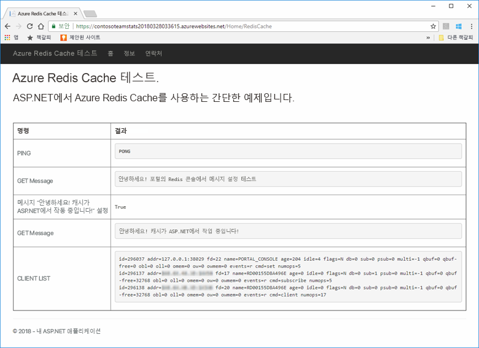
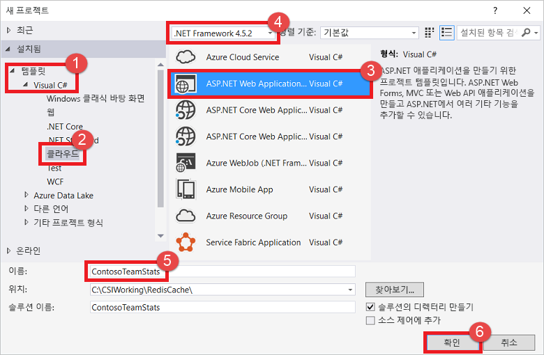
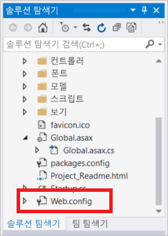
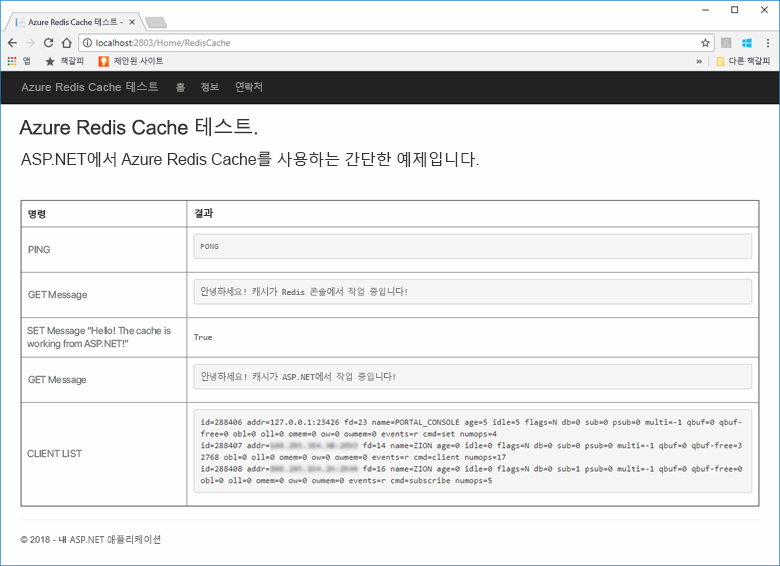
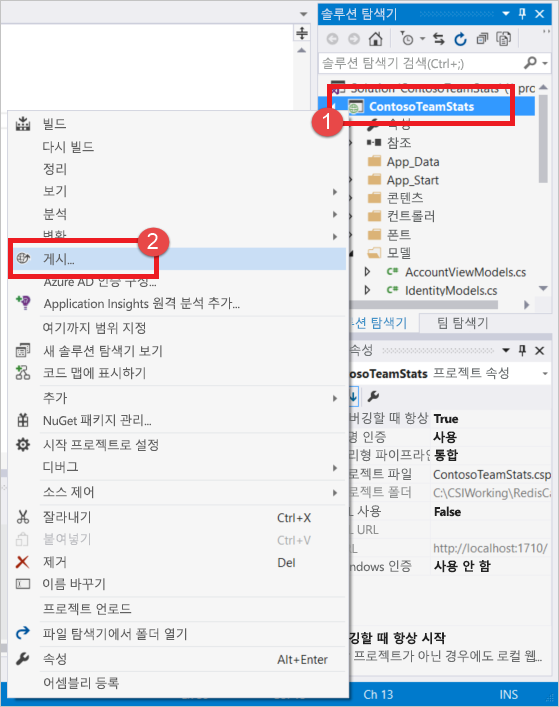
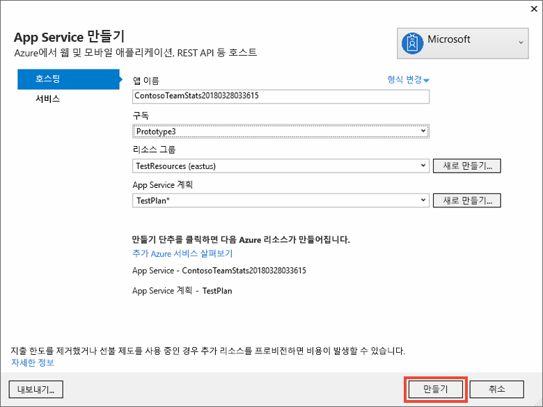
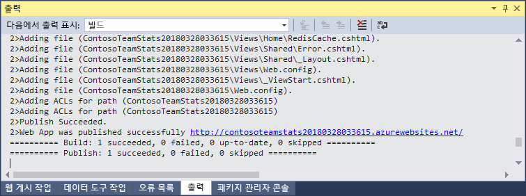
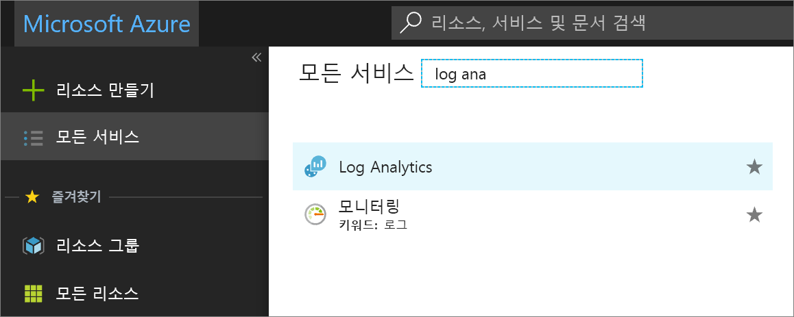
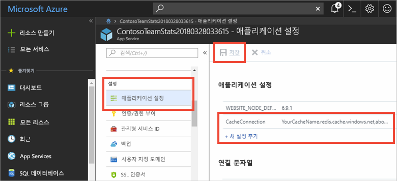

# <a name="quickstart-create-an-aspnet-web-app"></a>빠른 시작: ASP.NET 웹앱 만들기 

## <a name="introduction"></a>소개

이 빠른 시작에서는 Visual Studio 2019를 사용하여 ASP.NET 웹 애플리케이션을 만들고 Azure App Service에 배포하는 방법을 보여 줍니다. 샘플 애플리케이션은 Azure Cache for Redis에 연결되어 데이터를 저장하고 캐시에서 검색합니다. 빠른 시작을 완료한 후 Azure에서 호스트되며 Azure Cache for Redis에서 읽고 쓰는 실행 웹앱을 갖게 됩니다.



[!INCLUDE [quickstarts-free-trial-note](../../includes/quickstarts-free-trial-note.md)]

## <a name="prerequisites"></a>필수 조건

빠른 시작을 완료하려면 다음 환경과 함께 [Visual Studio 2019](https://www.visualstudio.com/downloads/)를 설치합니다.
* ASP.NET 및 웹 개발
* Azure 개발

## <a name="create-the-visual-studio-project"></a>Visual Studio 프로젝트 만들기

1. Visual Studio를 연 다음, **파일** >**새로 만들기** > **프로젝트**를 선택합니다.

2. **새 프로젝트** 대화 상자에서 다음 단계를 수행합니다.

    

    a. **템플릿** 목록에서 **Visual C#** 노드를 확장합니다.

    b. **클라우드**를 선택합니다.

    다. **ASP.NET 웹 애플리케이션**을 선택합니다.

    d. **.NET Framework 4.5.2** 이상이 선택되었는지 확인합니다.

    e. **이름** 상자에서 프로젝트에 이름을 지정합니다. 이 예제의 경우 **ContosoTeamStats**을 사용했습니다.

    f. **확인**을 선택합니다.
   
3. 프로젝트 유형으로 **MVC** 를 선택합니다.

4. **인증** 설정에 **인증 없음**을 지정했는지 확인합니다. Visual Studio의 버전에 따라 다른 기본 **인증**을 설정할 수 있습니다. 변경하려면 **인증 변경** 및 **인증 없음**을 차례로 선택합니다.

5. **확인**을 선택하여 프로젝트를 만듭니다.

## <a name="create-a-cache"></a>캐시 만들기

다음으로 앱에 대한 캐시를 만듭니다.

[!INCLUDE [redis-cache-create](../../includes/redis-cache-create.md)]

[!INCLUDE [redis-cache-access-keys](../../includes/redis-cache-access-keys.md)]

#### <a name="to-edit-the-cachesecretsconfig-file"></a>*CacheSecrets.config* 파일을 편집하려면

1. *CacheSecrets.config*라는 컴퓨터에서 파일을 만듭니다. 샘플 애플리케이션의 소스 코드를 사용하여 체크 인하지 않을 위치에 배치합니다. 이 빠른 시작의 경우 *CacheSecrets.config* 파일은 *C:\AppSecrets\CacheSecrets.config*에 있습니다.

1. *CacheSecrets.config* 파일을 편집합니다. 그런 다음, 다음 내용을 추가합니다.

    ```xml
    <appSettings>
        <add key="CacheConnection" value="<cache-name>.redis.cache.windows.net,abortConnect=false,ssl=true,password=<access-key>"/>
    </appSettings>
    ```

1. `<cache-name>`을 캐시 호스트 이름으로 바꿉니다.

1. `<access-key>`를 캐시에 대한 기본 키로 바꿉니다.

    > [!TIP]
    > 사용자가 기본 액세스 키를 다시 생성하는 동안 대체 키로 키를 회전하는 기간에 보조 액세스 키를 사용합니다.
   >
1. 파일을 저장합니다.

## <a name="update-the-mvc-application"></a>MVC 애플리케이션 업데이트

이 섹션에서는 Azure Cache for Redis에 대해 간단한 테스트를 표시하는 새 보기를 지원하도록 애플리케이션을 업데이트합니다.

* [캐시에 대한 앱 설정이 포함된 web.config 파일 업데이트](#update-the-webconfig-file-with-an-app-setting-for-the-cache)
* StackExchange.Redis 클라이언트를 사용하도록 애플리케이션 구성
* HomeController 및 레이아웃 업데이트
* 새 RedisCache 뷰 추가

### <a name="update-the-webconfig-file-with-an-app-setting-for-the-cache"></a>캐시에 대한 앱 설정이 포함된 web.config 파일 업데이트

애플리케이션을 로컬로 실행하는 경우 *CacheSecrets.config*의 정보는 Azure Cache for Redis 인스턴스에 연결하는 데 사용됩니다. 나중에 이 애플리케이션을 Azure에 배포합니다. 그때 애플리케이션이 이 파일 대신 캐시 연결 정보를 검색하는 데 사용하는 앱 설정을 Azure에서 구성합니다. 

*CacheSecrets.config* 파일이 애플리케이션과 함께 Azure에 배포되지 않으므로 애플리케이션을 로컬로 테스트하는 동안에만 사용합니다. 캐시 데이터에 대한 악의적인 액세스를 방지하기 위해 이 정보를 최대한 안전하게 유지하세요.

#### <a name="to-update-the-webconfig-file"></a>*Web.config* 파일을 업데이트하려면
1. **솔루션 탐색기**에서 *web.config* 파일을 두 번 클릭하여 엽니다.

    

2. *web.config* 파일에서 `<appSetting>` 요소를 찾습니다. 그런 다음, 다음 `file` 특성을 추가합니다. 다른 파일 이름 또는 위치를 사용한 경우, 예제에 나타난 값을 해당 값으로 대체합니다.

* 이전: `<appSettings>`
* 이후: `<appSettings file="C:\AppSecrets\CacheSecrets.config">`

ASP.NET 런타임은 외부 파일의 내용을 `<appSettings>` 요소의 태그와 병합합니다. 지정된 파일을 찾을 수 없는 경우 런타임에서 파일 특성을 무시합니다. 암호(캐시에 대한 연결 문자열)는 애플리케이션에 대 한 소스 코드의 일부분으로 포함되지 않습니다. Azure에 웹앱을 배포하는 경우 *CacheSecrets.config* 파일은 배포되지 않습니다.

### <a name="to-configure-the-application-to-use-stackexchangeredis"></a>StackExchange.Redis를 사용하도록 애플리케이션을 구성하려면

1. Visual Studio용 [StackExchange.Redis](https://github.com/StackExchange/StackExchange.Redis) NuGet 패키지를 사용하여 앱을 구성하려면 **도구 > NuGet 패키지 관리자 > 패키지 관리자 콘솔**을 선택합니다.

2. `Package Manager Console` 창에서 다음 명령을 실행합니다.

    ```powershell
    Install-Package StackExchange.Redis
    ```

3. NuGet 패키지는 클라이언트 애플리케이션이 StackExchange.Azure Cache for Redis 클라이언트를 사용하여 Azure Cache for Redis에 액세스하는 데 필요한 어셈블리 참조를 다운로드하고 추가합니다. 강력한 이름의 `StackExchange.Redis` 클라이언트 라이브러리 버전을 사용하려는 경우 `StackExchange.Redis.StrongName` 패키지를 설치합니다.

### <a name="to-update-the-homecontroller-and-layout"></a>HomeController 및 레이아웃을 업데이트하려면

1. **솔루션 탐색기**에서 **컨트롤러** 폴더를 확장한 다음, *HomeController.cs* 파일을 엽니다.

2. 파일 맨 위에 다음 두 개의 `using` 문을 추가하여 캐시 클라이언트 및 앱 설정을 지원합니다.

    ```csharp
    using System.Configuration;
    using StackExchange.Redis;
    ```

3. 다음 메서드를 `HomeController` 클래스에 추가하여 새 캐시에 대한 일부 명령을 실행하는 새 `RedisCache` 작업을 지원합니다.

    ```csharp
        public ActionResult RedisCache()
        {
            ViewBag.Message = "A simple example with Azure Cache for Redis on ASP.NET.";

            var lazyConnection = new Lazy<ConnectionMultiplexer>(() =>
            {
                string cacheConnection = ConfigurationManager.AppSettings["CacheConnection"].ToString();
                return ConnectionMultiplexer.Connect(cacheConnection);
            });

            // Connection refers to a property that returns a ConnectionMultiplexer
            // as shown in the previous example.
            IDatabase cache = lazyConnection.Value.GetDatabase();

            // Perform cache operations using the cache object...

            // Simple PING command
            ViewBag.command1 = "PING";
            ViewBag.command1Result = cache.Execute(ViewBag.command1).ToString();

            // Simple get and put of integral data types into the cache
            ViewBag.command2 = "GET Message";
            ViewBag.command2Result = cache.StringGet("Message").ToString();

            ViewBag.command3 = "SET Message \"Hello! The cache is working from ASP.NET!\"";
            ViewBag.command3Result = cache.StringSet("Message", "Hello! The cache is working from ASP.NET!").ToString();

            // Demonstrate "SET Message" executed as expected...
            ViewBag.command4 = "GET Message";
            ViewBag.command4Result = cache.StringGet("Message").ToString();

            // Get the client list, useful to see if connection list is growing...
            ViewBag.command5 = "CLIENT LIST";
            ViewBag.command5Result = cache.Execute("CLIENT", "LIST").ToString().Replace(" id=", "\rid=");

            lazyConnection.Value.Dispose();

            return View();
        }
    ```

4. **솔루션 탐색기**에서 **뷰** > **공유됨** 폴더를 확장합니다. 그런 다음, *_Layout.cshtml* 파일을 엽니다.

    다음을
    
    ```csharp
    @Html.ActionLink("Application name", "Index", "Home", new { area = "" }, new { @class = "navbar-brand" })
    ```

    다음으로 바꿀 수 있습니다.

    ```csharp
    @Html.ActionLink("Azure Cache for Redis Test", "RedisCache", "Home", new { area = "" }, new { @class = "navbar-brand" })
    ```

### <a name="to-add-a-new-rediscache-view"></a>새 RedisCache 뷰를 추가하려면

1. **솔루션 탐색기**에서 **뷰** 폴더를 확장한 다음, **Home** 폴더를 마우스 오른쪽 단추로 클릭합니다. **추가** > **뷰...** 를 선택합니다.

2. **뷰 추가** 대화 상자에서 뷰 이름으로 **RedisCache**를 입력합니다. 그런 다음, **추가**를 선택합니다.

3. *RedisCache.cshtml* 파일의 코드를 다음 코드로 바꿉니다.

    ```csharp
    @{
        ViewBag.Title = "Azure Cache for Redis Test";
    }

    <h2>@ViewBag.Title.</h2>
    <h3>@ViewBag.Message</h3>
    <br /><br />
    <table border="1" cellpadding="10">
        <tr>
            <th>Command</th>
            <th>Result</th>
        </tr>
        <tr>
            <td>@ViewBag.command1</td>
            <td><pre>@ViewBag.command1Result</pre></td>
        </tr>
        <tr>
            <td>@ViewBag.command2</td>
            <td><pre>@ViewBag.command2Result</pre></td>
        </tr>
        <tr>
            <td>@ViewBag.command3</td>
            <td><pre>@ViewBag.command3Result</pre></td>
        </tr>
        <tr>
            <td>@ViewBag.command4</td>
            <td><pre>@ViewBag.command4Result</pre></td>
        </tr>
        <tr>
            <td>@ViewBag.command5</td>
            <td><pre>@ViewBag.command5Result</pre></td>
        </tr>
    </table>
    ```

## <a name="run-the-app-locally"></a>로컬에서 앱 실행하기

기본적으로 프로젝트는 테스트 및 디버깅을 위해 [IIS Express](https://docs.microsoft.com/iis/extensions/introduction-to-iis-express/iis-express-overview)에서 앱을 로컬로 호스팅하도록 구성됩니다.

### <a name="to-run-the-app-locally"></a>로컬에서 앱을 실행하려면
1. Visual Studio에서 **디버그** > **디버깅 시작**을 선택하여 테스트 및 디버깅을 위해 앱을 로컬로 빌드하고 시작합니다.

2. 브라우저의 탐색 모음에서 **Azure Cache for Redis 테스트**를 선택합니다.

3. 다음 예제에서 `Message` 키에는 이전에 포털에서 Azure Cache for Redis 콘솔을 사용하여 설정된 캐시된 값이 있습니다. 앱에서 캐시된 값을 업데이트했습니다. 또한 앱에서 `PING` 및 `CLIENT LIST` 명령을 실행했습니다.

    

## <a name="publish-and-run-in-azure"></a>Azure에서 게시 및 실행

앱을 로컬로 성공적으로 테스트한 후에는 Azure에 앱을 배포하고 클라우드에서 실행할 수 있습니다.

### <a name="to-publish-the-app-to-azure"></a>Azure에 앱을 게시하려면

1. Visual Studio의 솔루션 탐색기에서 프로젝트를 마우스 오른쪽 단추로 클릭합니다. 그런 다음, **게시**를 선택합니다.

    

2. **Microsoft Azure App Service** 및 **새로 만들기**를 차례로 선택한 다음, **게시**를 선택합니다.

    

3. **App Service 만들기** 대화 상자에서 다음과 같이 변경합니다.

    | 설정 | 권장되는 값 | 설명 |
    | ------- | :---------------: | ----------- |
    | **앱 이름** | 기본값을 사용하세요. | 앱 이름은 Azure에 배포할 때 앱에 사용하는 호스트 이름입니다. 필요한 경우 이름을 고유하게 만들려면 타임스탬프 접미사가 추가될 수 있습니다. |
    | **구독** | Azure 구독을 선택합니다. | 이 구독은 모든 관련된 호스팅 비용이 청구됩니다. 여러 Azure 구독이 있는 경우 원하는 구독이 선택되어 있는지 확인합니다.|
    | **리소스 그룹** | 캐시를 만든 것과 동일한 리소스 그룹을 사용합니다(예를 들어 *TestResourceGroup*). | 리소스 그룹은 모든 리소스를 그룹으로 관리하는 경우 유용합니다. 나중에 앱을 삭제하려는 경우 그룹만 삭제할 수 있습니다. |
    | **App Service 계획** | **새로 만들기**를 선택하여 *TestingPlan*이라는 새 App Service 계획을 만듭니다. <br />캐시를 만들 때 사용했던 것과 동일한 **위치**를 사용합니다. <br />크기에 대해 **무료**를 선택합니다. | App Service 계획은 실행할 웹앱에 대한 계산 리소스 세트를 정의합니다. |

    

4. App Service 호스팅 설정을 구성한 후 **만들기**를 선택합니다.

5. Visual Studio에서 **출력** 창을 모니터링하여 게시 상태를 확인합니다. 앱이 게시된 후 앱에 대한 URL이 기록됩니다.

    

### <a name="add-the-app-setting-for-the-cache"></a>캐시에 대한 앱 설정 추가

새 앱이 게시된 후에 새 앱 설정을 추가합니다. 이 설정은 캐시 연결 정보를 저장하는 데 사용됩니다. 

#### <a name="to-add-the-app-setting"></a>앱 설정을 추가하려면 

1. 만든 새 앱을 찾으려면 Azure Portal의 위쪽에 있는 검색 표시줄에 앱 이름을 입력합니다.

    

2. 캐시에 연결하는 데 사용할 앱에 대해 **CacheConnection**이란 이름의 새 앱 설정을 추가합니다. 사용자의 *CacheSecrets.config* 파일에서 `CacheConnection`에 대해 구성한 것과 동일한 값을 사용합니다. 키에는 캐시 호스트 이름 및 액세스 키가 포함됩니다.

    

### <a name="run-the-app-in-azure"></a>Azure에서 앱 실행

브라우저에서 앱에 대한 URL로 이동합니다. URL은 Visual Studio의 출력 창에 게시 작업의 결과로 표시됩니다. 또한 사용자가 만든 앱의 개요 페이지에서 Azure Portal에도 제공됩니다.

캐시 액세스를 테스트하려면 탐색 모음에서 **Azure Cache for Redis 테스트**를 선택합니다.


## <a name="clean-up-resources"></a>리소스 정리

다음 자습서를 계속 진행하는 경우 이 빠른 시작에서 만든 리소스를 그대로 두었다가 다시 사용할 수 있습니다.

또는, 빠른 시작 샘플 애플리케이션 사용을 마친 경우 이 빠른 시작에서 만든 Azure 리소스를 삭제하여 요금이 청구되는 것을 방지할 수 있습니다. 

> [!IMPORTANT]
> 리소스 그룹을 삭제하면 다시 되돌릴 수 없습니다. 리소스 그룹을 삭제하는 경우 그 안의 모든 리소스가 영구적으로 삭제됩니다. 잘못된 리소스 그룹 또는 리소스를 자동으로 삭제하지 않도록 해야 합니다. 유지하려는 리소스가 포함된 기존 리소스 그룹 내에 이 샘플을 호스트하기 위한 리소스를 만든 경우 리소스 그룹을 삭제하는 대신, 해당 블레이드에서 각 리소스를 개별적으로 삭제할 수 있습니다.

### <a name="to-delete-a-resource-group"></a>리소스 그룹을 삭제하려면

1. [Azure Portal](https://portal.azure.com)에 로그인한 다음, **리소스 그룹**을 선택합니다.

2. **이름을 기준으로 필터링...** 상자에 리소스 그룹의 이름을 입력합니다. 이 문서의 지침에서는 *TestResources*라는 리소스 그룹을 사용했습니다. 결과 목록의 리소스 그룹에서 **...** 를 선택한 다음, **리소스 그룹 삭제**를 선택합니다.

    

리소스 그룹 삭제를 확인하는 메시지가 표시됩니다. 리소스 그룹의 이름을 입력하여 확인한 다음, **삭제**를 선택합니다.

잠시 후, 리소스 그룹 및 모든 해당 리소스가 삭제됩니다.

## <a name="next-steps"></a>다음 단계

다음 자습서에서는 더욱 현실적인 시나리오에서 Azure Cache for Redis를 사용하여 앱의 성능을 향상합니다. ASP.NET 및 데이터베이스와 캐시 배제 패턴을 사용하여 순위표 결과를 캐시하려면 이 애플리케이션을 업데이트합니다.

> [!div class="nextstepaction"]
> [ASP.NET에서 캐시 배제 순위표 만들기](cache-web-app-cache-aside-leaderboard.md)
