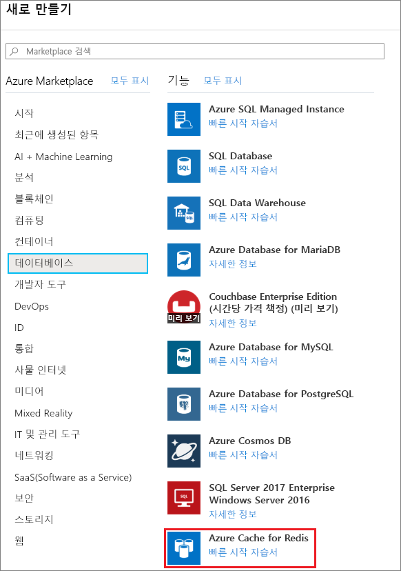
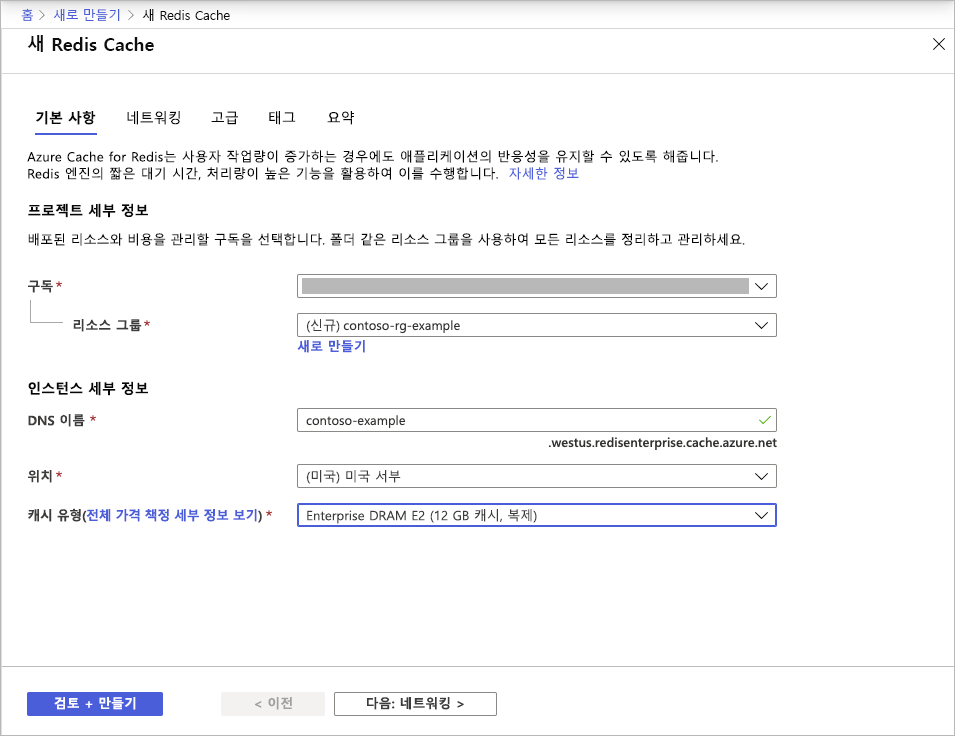
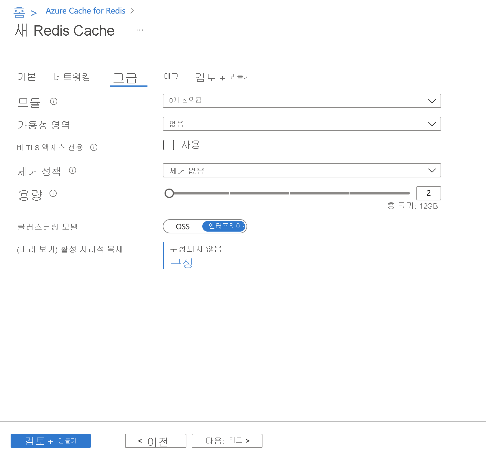
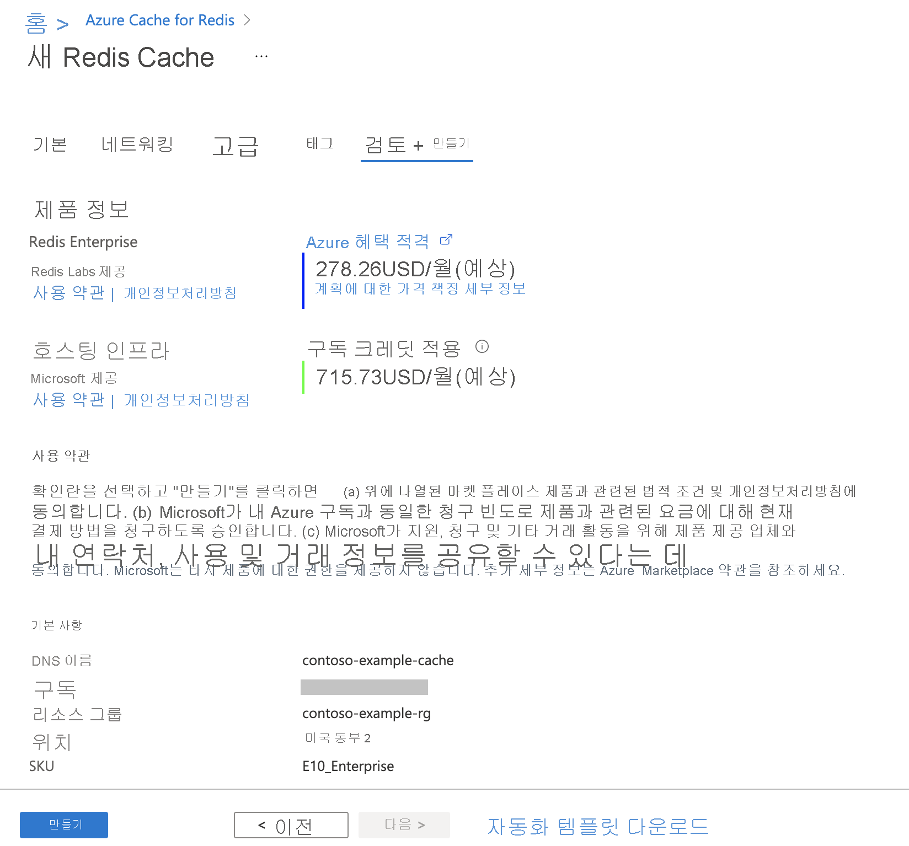

# 빠른 시작: Enterprise 계층 캐시 만들기(미리 보기)

Azure Cache for Redis Enterprise 계층은 Azure에서 완전히 통합되고 관리되는 [Redis Enterprise](https://redislabs.com/redis-enterprise/)를 제공합니다. 현재는 미리 보기로 제공됩니다. 이 미리 보기에는 두 개의 새로운 계층이 있습니다.
* Enterprise는 가상 머신에서 휘발성 메모리(DRAM)를 사용하여 데이터를 저장합니다.
* Enterprise SSD는 휘발성 및 비휘발성 메모리(NVMe)를 사용하여 데이터를 저장합니다.

미리 보기에 조인하는 데 드는 비용은 없습니다. 관심이 있는 경우 [Azure Marketplace](https://aka.ms/redispreviewsignup/) **연락처**를 통해 등록하세요. 참가자의 수가 매우 제한적이므로 미리 보기가 허용되지 않을 수 있습니다.

## 사전 요구 사항

시작하려면 Azure 구독이 필요합니다. 아직 없는 경우 먼저 [체험 계정](https://azure.microsoft.com/free/)을 만드세요.

## 캐시 만들기
1. 캐시를 만들려면 미리 보기 초대 링크를 사용하여 Azure Portal에 로그인하여 **리소스 만들기**를 선택합니다.

   > [!IMPORTANT] 
   > Marketplace에서 직접 *Azure Cache for Redis, Enterprise 계층*을 구독하지 마세요.
   > 이 단계는 Azure Cache for Redis 포털 UI에서 자동으로 수행됩니다.
   >
   
1. **새로 만들기** 페이지에서 **데이터베이스**를 선택한 다음, **Azure Cache for Redis**를 선택합니다.
   
   
   
1. **새 Redis Cache** 페이지에서 새 캐시의 설정을 구성합니다.
   
   | 설정      | 제안 값  | Description |
   | ------------ |  ------- | -------------------------------------------------- |
   | **구독** | 드롭다운하여 구독을 선택합니다. | 이 구독 아래에 새 Azure Cache for Redis 인스턴스가 만들어집니다. | 
   | **리소스 그룹** | 드롭다운하여 리소스 그룹을 선택하거나, **새로 만들기**를 선택하고 새 리소스 그룹 이름을 입력합니다. | 캐시 및 기타 리소스를 만들 새 리소스 그룹의 이름입니다. 모든 앱 리소스를 하나의 리소스 그룹에 배치하면 앱 리소스를 쉽게 관리하거나 삭제할 수 있습니다. | 
   | **DNS 이름** | 전역적으로 고유한 이름을 입력합니다. | 캐시 이름은 1~63자의 문자열이어야 하며 숫자, 문자 및 하이픈만 포함할 수 있습니다. 이름은 숫자 또는 문자로 시작하고 끝나야 하며 연속 하이픈을 포함할 수 없습니다. 캐시 인스턴스의 *호스트 이름*은 *\<DNS 이름>.<Azure region>.redisenterprise.cache.azure.net*입니다. | 
   | **위치** | 드롭다운하여 위치를 선택합니다. | Enterprise 계층은 미국 서부, 미국 동부 2 및 서유럽에서 사용할 수 있습니다. |
   | **캐시 계층** | *Enterprise DRAM* 또는 *Enterprise SSD* 계층 및 크기를 드롭다운하여 선택합니다. |  계층에 따라 캐시에 사용 가능한 크기, 성능 및 기능이 결정됩니다. |
   
    

1. 완료되면 **다음: 네트워킹**을 선택하고 건너뜁니다.

   > [!NOTE] 
   > 프라이빗 링크에 대한 지원은 나중에 제공됩니다.
   >

1. 완료되면 **다음: 고급**을 선택합니다.
   
   기본 설정을 유지하거나 적절하게 변경할 수 있습니다. **TLS를 통해서만 액세스 허용**을 설정하는 경우 애플리케이션에서 새 캐시에 액세스하려면 TLS를 사용해야 합니다.

    

   > [!NOTE] 
   > Redis 모듈은 아직 Enterprise SSD 계층에서 지원되지 않습니다. Redis 모듈을 사용하려는 경우 Enterprise 계층 캐시를 선택해야 합니다.
   >
   
1. 완료되면 **다음: 태그**를 선택하고 건너뜁니다.

1. 완료되면 **다음: 요약**을 선택합니다.

    

1. **약관** 아래의 확인란을 클릭하고 설정을 검토한 다음, **검토 + 만들기**를 선택합니다.
   
   캐시를 만드는 데는 약간의 시간이 걸립니다. Azure Cache for Redis **개요** 페이지에서 진행률을 모니터링할 수 있습니다. **상태**가 **실행 중**으로 표시되면 캐시를 사용할 준비가 된 것입니다.

   > [!NOTE] 
   > Enterprise 계층 캐시가 생성된 후에는 Azure Marketplace에서 *Azure Cache for Redis, Enterprise 계층*을 구성하기 위한 **작업 필요** 이메일을 받게 됩니다. 이 작업은 필요하지 않습니다. 해당 이메일은 무시해도 됩니다.
   >

## 다음 단계

이 빠른 시작에서는 Azure Cache for Redis의 Enterprise 계층 인스턴스를 만드는 방법을 알아봅니다.

> [!div class="nextstepaction"]
> [Azure Cache for Redis를 사용하는 ASP.NET 웹앱 만들기](./cache-web-app-howto.md)

