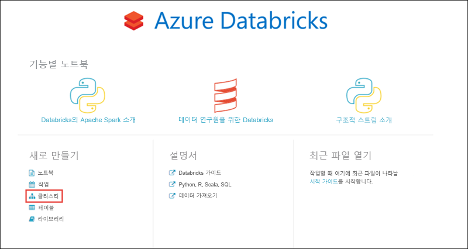

# <a name="tutorial-extract-transform-and-load-data-by-using-azure-databricks"></a>자습서: Azure Databricks를 사용하여 데이터 추출, 변환 및 로드

이 자습서에서는 Azure Databricks를 사용하여 ETL(추출, 변환 및 데이터 로드) 작업을 수행합니다. Azure Data Lake Storage Gen2에서 Azure Databricks로 데이터를 추출하고, Azure Databricks에서 데이터를 변환하여, 변환된 데이터를 Azure SQL Data Warehouse에 로드합니다.

이 자습서의 단계에서는 Azure Databricks용 SQL Data Warehouse 커넥터를 사용하여 Azure Databricks로 데이터를 전송합니다. 그러면 이 커넥터는 Azure Blob Storage를 Azure Databricks 클러스터와 Azure SQL Data Warehouse 간에 전송되는 데이터의 임시 스토리지로 사용합니다.

다음 그림에서는 애플리케이션 흐름을 보여줍니다.


이 자습서에서 다루는 작업은 다음과 같습니다.

> [!div class="checklist"]
> * Azure Databricks 서비스 만들기
> * Azure Databricks에 Spark 클러스터 만들기
> * Data Lake Storage Gen2 계정에서 파일 시스템 만들기
> * Azure Data Lake Storage Gen2 계정에 샘플 데이터 업로드
> * 서비스 주체 만들기
> * Azure Data Lake Storage Gen2 계정에서 데이터 추출
> * Azure Databricks에서 데이터 변환
> * Azure SQL Data Warehouse에 데이터 로드

Azure 구독이 아직 없는 경우 시작하기 전에 [무료 계정](https://azure.microsoft.com/free/?WT.mc_id=A261C142F) 을 만듭니다.

> [!Note]
> 이 자습서는 **Azure 평가판 구독**을 사용하여 수행할 수 없습니다.
> 무료 계정을 사용하여 Azure Databricks 클러스터를 만들려면 클러스터를 만들기 전에 프로필로 이동하고 구독을 **종량제**로 변경합니다. 자세한 내용은 [Azure 체험 계정](https://azure.microsoft.com/free/)을 참조하세요.
     
## <a name="prerequisites"></a>필수 조건

이 자습서를 시작하기 전에 다음 작업을 완료합니다.

* Azure SQL Data Warehouse를 만들고, 서버 수준 방화벽 규칙을 만들고, 서버 관리자로 서버에 연결합니다. [빠른 시작: Azure Portal에서 Azure SQL 데이터 웨어하우스 생성 및 쿼리](../sql-data-warehouse/create-data-warehouse-portal.md)

* Azure SQL Data Warehouse에 대한 데이터베이스 마스터 키를 만듭니다. [데이터베이스 마스터 키 만들기](https://docs.microsoft.com/sql/relational-databases/security/encryption/create-a-database-master-key)를 참조하세요.

* Azure Blob Storage 계정을 만들고, 그 안에 컨테이너를 만듭니다. 또한 저장소 계정에 액세스하는 데 사용되는 액세스 키를 검색합니다. [빠른 시작: Azure Portal을 사용하여 BLOB 업로드, 다운로드 및 나열](../storage/blobs/storage-quickstart-blobs-portal.md)

* Azure Data Lake Storage Gen2 스토리지 계정을 만듭니다. [빠른 시작: Azure Data Lake Storage Gen2 스토리지 계정 만들기](../storage/blobs/data-lake-storage-quickstart-create-account.md)를 참조하세요.

* 서비스 주체 만들기 [방법: 포털을 사용하여 리소스에 액세스할 수 있는 Azure AD 애플리케이션 및 서비스 주체 만들기](https://docs.microsoft.com/azure/active-directory/develop/howto-create-service-principal-portal)

   해당 문서의 단계를 수행할 때 해야 하는 두어 가지 항목이 있습니다.

   * 문서의 [애플리케이션을 역할에 할당](https://docs.microsoft.com/azure/active-directory/develop/howto-create-service-principal-portal#assign-the-application-to-a-role) 섹션에 있는 단계를 수행할 때 **Storage Blob 데이터 기여자** 역할을 Data Lake Storage Gen2 계정 범위에 있는 서비스 주체에 할당해야 합니다. 역할을 부모 리소스 그룹 또는 구독에 할당하는 경우 이러한 역할 할당이 스토리지 계정에 전파될 때까지 권한 관련 오류가 발생합니다.

      특정 파일 또는 디렉터리를 사용하여 서비스 주체를 연결하는 데 ACL(액세스 제어 목록)을 사용하려는 경우 [Azure Data Lake Storage Gen2의 액세스 제어](../storage/blobs/data-lake-storage-access-control.md)를 참조하세요.

   * 문서의 [로그인을 위한 값 가져오기](https://docs.microsoft.com/azure/active-directory/develop/howto-create-service-principal-portal#get-values-for-signing-in) 섹션에 있는 단계를 수행하는 경우 테넌트 ID, 앱 ID 및 암호 값을 텍스트 파일에 붙여넣습니다. 곧 이 값들이 필요합니다.

* [Azure Portal](https://portal.azure.com/)에 로그인합니다.

## <a name="gather-the-information-that-you-need"></a>필요한 정보 수집

이 자습서의 필수 조건을 완료했는지 확인합니다.

   시작하기 전에 다음 정보 항목이 있어야 합니다.

   :heavy_check_mark:  데이터베이스 이름, 데이터베이스 서버 이름, 사용자 이름 및 Azure SQL Data Warehouse의 암호

   :heavy_check_mark:  Blob Storage 계정에 대한 액세스 키

   :heavy_check_mark:  Azure Data Lake Storage Gen2 스토리지 계정의 이름

   :heavy_check_mark:  구독의 테넌트 ID

   :heavy_check_mark:  Azure AD(Azure Active Directory)에 등록된 앱의 애플리케이션 ID

   :heavy_check_mark:  Azure AD에 등록된 앱의 인증 키

## <a name="create-an-azure-databricks-service"></a>Azure Databricks 서비스 만들기

이 섹션에서는 Azure Portal을 사용하여 Azure Databricks 서비스를 만듭니다.

1. Azure Portal에서 **리소스 만들기** > **분석** > **Azure Databricks**를 차례로 선택합니다.

    

2. **Azure Databricks 서비스** 아래에서 다음 값을 입력하여 Databricks 서비스를 만듭니다.

    |자산  |설명  |
    |---------|---------|
    |**작업 영역 이름**     | Databricks 작업 영역에 대한 이름을 제공합니다.        |
    |**구독**     | 드롭다운에서 Azure 구독을 선택합니다.        |
    |**리소스 그룹**     | 새 리소스 그룹을 만들지, 아니면 기존 그룹을 사용할지 여부를 지정합니다. 리소스 그룹은 Azure 솔루션에 관련된 리소스를 보유하는 컨테이너입니다. 자세한 내용은 [Azure Resource Manager 개요](../azure-resource-manager/resource-group-overview.md)를 참조하세요. |
    |**위치**:     | **미국 서부 2**를 선택합니다.  사용 가능한 다른 영역은 [지역별 사용 가능한 Azure 서비스](https://azure.microsoft.com/regions/services/)를 참조하세요.      |
    |**가격 책정 계층**     |  **표준**을 선택합니다.     |

3. 계정 생성에는 몇 분 정도가 소요됩니다. 작업 상태를 모니터링하려면 맨 위에 있는 진행률 표시줄을 확인합니다.

4. **대시보드에 고정**을 선택한 다음, **만들기**를 선택합니다.

## <a name="create-a-spark-cluster-in-azure-databricks"></a>Azure Databricks에 Spark 클러스터 만들기

1. Azure Portal에서 본인이 만든 Databricks 서비스로 이동한 다음, **작업 영역 시작**을 선택합니다.

2. Azure Databricks 포털로 리디렉션됩니다. 포털에서 **클러스터**를 선택합니다.

    

3. **새 클러스터** 페이지에서 값을 제공하여 클러스터를 만듭니다.

    

4. 다음 필드에 대한 값을 입력하고, 다른 필드에는 기본값을 그대로 적용합니다.

    * 클러스터의 이름을 입력합니다.

    * 이 문서에서는 **5.1** 런타임을 사용하여 클러스터를 만듭니다.

    * **비활성 \_\_분 후 종료** 확인란을 선택합니다. 클러스터가 사용되지 않는 경우 클러스터를 종료할 시간(분)을 입력합니다.

    * **클러스터 만들기**를 선택합니다. 클러스터가 실행되면 Notebook을 클러스터에 연결하고 Spark 작업을 실행할 수 있습니다.

## <a name="create-a-file-system-in-the-azure-data-lake-storage-gen2-account"></a>Azure Data Lake Storage Gen2 계정에서 파일 시스템 만들기

이 섹션에서는 Azure Databricks 작업 영역에서 Notebook을 만든 다음, 코드 조각을 실행하여 스토리지 계정을 구성합니다.

1. [Azure Portal](https://portal.azure.com)에서 본인이 만든 Azure Databricks 서비스로 이동한 다음, **작업 영역 시작**을 선택합니다.

2. 왼쪽 창에서 **작업 영역**을 선택합니다. **작업 영역** 드롭다운에서 **만들기** > **Notebook**을 차례로 선택합니다.

    

3. **노트북 만들기** 대화 상자에서 노트북 이름을 입력합니다. 언어로 **Scala**를 선택한 다음, 앞에서 만든 Spark 클러스터를 선택합니다.

    

4. **만들기**를 선택합니다.

5. 다음 코드 블록은 Spark 세션에서 액세스하는 ADLS Gen 2 계정에 대한 기본 서비스 주체 자격 증명을 설정합니다. 두 번째 코드 블록은 특정 ADLS Gen 2 계정에 대한 자격 증명을 지정하는 설정에 계정 이름을 추가합니다.  Azure Databricks Notebook의 첫 번째 셀에 코드 블록 중 하나를 복사하여 붙여넣습니다.

   **세션 구성**

   ```scala
   spark.conf.set("fs.azure.account.auth.type", "OAuth")
   spark.conf.set("fs.azure.account.oauth.provider.type", "org.apache.hadoop.fs.azurebfs.oauth2.ClientCredsTokenProvider")
   spark.conf.set("fs.azure.account.oauth2.client.id", "<appID>")
   spark.conf.set("fs.azure.account.oauth2.client.secret", "<password>")
   spark.conf.set("fs.azure.account.oauth2.client.endpoint", "https://login.microsoftonline.com/<tenant-id>/oauth2/token")
   spark.conf.set("fs.azure.createRemoteFileSystemDuringInitialization", "true")
   dbutils.fs.ls("abfss://<file-system-name>@<storage-account-name>.dfs.core.windows.net/")
   spark.conf.set("fs.azure.createRemoteFileSystemDuringInitialization", "false")
   ```

   **계정 구성**

   ```scala
   spark.conf.set("fs.azure.account.auth.type.<storage-account-name>.dfs.core.windows.net", "OAuth")
   spark.conf.set("fs.azure.account.oauth.provider.type.<storage-account-name>.dfs.core.windows.net", "org.apache.hadoop.fs.azurebfs.oauth2.ClientCredsTokenProvider")
   spark.conf.set("fs.azure.account.oauth2.client.id.<storage-account-name>.dfs.core.windows.net", "<appID>")
   spark.conf.set("fs.azure.account.oauth2.client.secret.<storage-account-name>.dfs.core.windows.net", "<password>")
   spark.conf.set("fs.azure.account.oauth2.client.endpoint.<storage-account-name>.dfs.core.windows.net", "https://login.microsoftonline.com/<tenant-id>/oauth2/token")
   spark.conf.set("fs.azure.createRemoteFileSystemDuringInitialization", "true")
   dbutils.fs.ls("abfss://<file-system-name>@<storage-account-name>.dfs.core.windows.net/")
   spark.conf.set("fs.azure.createRemoteFileSystemDuringInitialization", "false")
   ```

6. 이 코드 블록에서 `appID`, `password`, `tenant-id` 및 `storage-account-name` 자리 표시자 값을 이 자습서의 필수 조건을 수행하는 동안 수집한 값으로 바꿉니다. `file-system-name` 자리 표시자 값을 파일 시스템에 제공하려는 이름으로 바꿉니다.

   * `appID` 및 `password`는 서비스 주체 만들기의 일환으로 활성 디렉터리에 등록한 앱에서 가져온 것입니다.

   * `tenant-id`는 구독에서 가져온 것입니다.

   * `storage-account-name`은 Azure Data Lake Storage Gen2 스토리지 계정의 이름입니다.

7. 이 블록에서 코드를 실행하려면 **SHIFT + ENTER** 키를 누릅니다.

## <a name="ingest-sample-data-into-the-azure-data-lake-storage-gen2-account"></a>Azure Data Lake Storage Gen2 계정에 샘플 데이터 수집

이 섹션을 시작하기 전에 다음 필수 구성 요소를 완료해야 합니다.

노트북 셀에 다음 코드를 입력합니다.

    %sh wget -P /tmp https://raw.githubusercontent.com/Azure/usql/master/Examples/Samples/Data/json/radiowebsite/small_radio_json.json

셀에서 **Shift+Enter**를 눌러 코드를 실행합니다.

이제 이 아래에 있는 새 셀에서 다음 코드를 입력하고 괄호에 나타나는 값을 이전에 사용한 동일한 값으로 바꿉니다.

    dbutils.fs.cp("file:///tmp/small_radio_json.json", "abfss://<file-system>@<account-name>.dfs.core.windows.net/")

셀에서 **Shift+Enter**를 눌러 코드를 실행합니다.

## <a name="extract-data-from-the-azure-data-lake-storage-gen2-account"></a>Azure Data Lake Storage Gen2 계정에서 데이터 추출

1. 이제 Azure Databricks에서 샘플 json 파일을 데이터 프레임으로 로드할 수 있습니다. 다음 코드를 새 셀에 붙여넣습니다. 대괄호 안에 표시된 자리 표시자를 사용자 고유의 값으로 바꿉니다.

   ```scala
   val df = spark.read.json("abfss://<file-system-name>@<storage-account-name>.dfs.core.windows.net/small_radio_json.json")
   ```

   * `file-system-name` 자리 표시자 값을 Storage Explorer의 파일 시스템에 설정한 이름으로 바꿉니다.

   * `storage-account-name` 자리 표시자를 스토리지 계정 이름으로 바꿉니다.

2. 이 블록에서 코드를 실행하려면 **SHIFT + ENTER** 키를 누릅니다.

3. 데이터 프레임의 콘텐츠를 보려면 다음 코드를 실행합니다.

    ```scala
    df.show()
    ```
   다음 코드 조각과 유사한 결과가 표시됩니다.

   ```bash
   +---------------------+---------+---------+------+-------------+----------+---------+-------+--------------------+------+--------+-------------+---------+--------------------+------+-------------+------+
   |               artist|     auth|firstName|gender|itemInSession|  lastName|   length|  level|            location|method|    page| registration|sessionId|                song|status|           ts|userId|
   +---------------------+---------+---------+------+-------------+----------+---------+-------+--------------------+------+--------+-------------+---------+--------------------+------+-------------+------+
   | El Arrebato         |Logged In| Annalyse|     F|            2|Montgomery|234.57914| free  |  Killeen-Temple, TX|   PUT|NextSong|1384448062332|     1879|Quiero Quererte Q...|   200|1409318650332|   309|
   | Creedence Clearwa...|Logged In|   Dylann|     M|            9|    Thomas|340.87138| paid  |       Anchorage, AK|   PUT|NextSong|1400723739332|       10|        Born To Move|   200|1409318653332|    11|
   | Gorillaz            |Logged In|     Liam|     M|           11|     Watts|246.17751| paid  |New York-Newark-J...|   PUT|NextSong|1406279422332|     2047|                DARE|   200|1409318685332|   201|
   ...
   ...
   ```

   이제 Azure Data Lake Storage Gen2에서 Azure Databricks로 데이터를 추출했습니다.

## <a name="transform-data-in-azure-databricks"></a>Azure Databricks에서 데이터 변환

원시 샘플 데이터 **small_radio_json.json** 파일은 라디오 방송국의 대상을 캡처하며, 다양한 열을 갖고 있습니다. 이 섹션에서는 데이터 세트의 특정 열만 검색하도록 데이터를 변환합니다.

1. 먼저 앞에서 만든 데이터 프레임에서 **firstname**, **lastname**, **gender**, **location** 및 **level** 열만 검색합니다.

   ```scala
   val specificColumnsDf = df.select("firstname", "lastname", "gender", "location", "level")
   specificColumnsDf.show()
   ```

   다음 코드 조각과 같은 출력이 수신됩니다.

   ```bash
   +---------+----------+------+--------------------+-----+
   |firstname|  lastname|gender|            location|level|
   +---------+----------+------+--------------------+-----+
   | Annalyse|Montgomery|     F|  Killeen-Temple, TX| free|
   |   Dylann|    Thomas|     M|       Anchorage, AK| paid|
   |     Liam|     Watts|     M|New York-Newark-J...| paid|
   |     Tess|  Townsend|     F|Nashville-Davidso...| free|
   |  Margaux|     Smith|     F|Atlanta-Sandy Spr...| free|
   |     Alan|     Morse|     M|Chicago-Napervill...| paid|
   |Gabriella|   Shelton|     F|San Jose-Sunnyval...| free|
   |   Elijah|  Williams|     M|Detroit-Warren-De...| paid|
   |  Margaux|     Smith|     F|Atlanta-Sandy Spr...| free|
   |     Tess|  Townsend|     F|Nashville-Davidso...| free|
   |     Alan|     Morse|     M|Chicago-Napervill...| paid|
   |     Liam|     Watts|     M|New York-Newark-J...| paid|
   |     Liam|     Watts|     M|New York-Newark-J...| paid|
   |   Dylann|    Thomas|     M|       Anchorage, AK| paid|
   |     Alan|     Morse|     M|Chicago-Napervill...| paid|
   |   Elijah|  Williams|     M|Detroit-Warren-De...| paid|
   |  Margaux|     Smith|     F|Atlanta-Sandy Spr...| free|
   |     Alan|     Morse|     M|Chicago-Napervill...| paid|
   |   Dylann|    Thomas|     M|       Anchorage, AK| paid|
   |  Margaux|     Smith|     F|Atlanta-Sandy Spr...| free|
   +---------+----------+------+--------------------+-----+
   ```

2. 열 **level**을 **subscription_type**으로 지정하도록 이 데이터를 추가로 변환할 수 있습니다.

   ```scala
   val renamedColumnsDF = specificColumnsDf.withColumnRenamed("level", "subscription_type")
   renamedColumnsDF.show()
   ```

   다음 코드 조각과 같은 출력이 수신됩니다.

   ```bash
   +---------+----------+------+--------------------+-----------------+
   |firstname|  lastname|gender|            location|subscription_type|
   +---------+----------+------+--------------------+-----------------+
   | Annalyse|Montgomery|     F|  Killeen-Temple, TX|             free|
   |   Dylann|    Thomas|     M|       Anchorage, AK|             paid|
   |     Liam|     Watts|     M|New York-Newark-J...|             paid|
   |     Tess|  Townsend|     F|Nashville-Davidso...|             free|
   |  Margaux|     Smith|     F|Atlanta-Sandy Spr...|             free|
   |     Alan|     Morse|     M|Chicago-Napervill...|             paid|
   |Gabriella|   Shelton|     F|San Jose-Sunnyval...|             free|
   |   Elijah|  Williams|     M|Detroit-Warren-De...|             paid|
   |  Margaux|     Smith|     F|Atlanta-Sandy Spr...|             free|
   |     Tess|  Townsend|     F|Nashville-Davidso...|             free|
   |     Alan|     Morse|     M|Chicago-Napervill...|             paid|
   |     Liam|     Watts|     M|New York-Newark-J...|             paid|
   |     Liam|     Watts|     M|New York-Newark-J...|             paid|
   |   Dylann|    Thomas|     M|       Anchorage, AK|             paid|
   |     Alan|     Morse|     M|Chicago-Napervill...|             paid|
   |   Elijah|  Williams|     M|Detroit-Warren-De...|             paid|
   |  Margaux|     Smith|     F|Atlanta-Sandy Spr...|             free|
   |     Alan|     Morse|     M|Chicago-Napervill...|             paid|
   |   Dylann|    Thomas|     M|       Anchorage, AK|             paid|
   |  Margaux|     Smith|     F|Atlanta-Sandy Spr...|             free|
   +---------+----------+------+--------------------+-----------------+
   ```

## <a name="load-data-into-azure-sql-data-warehouse"></a>Azure SQL Data Warehouse에 데이터 로드

이 섹션에서는 변환된 데이터를 Azure SQL Data Warehouse로 업로드합니다. Azure Databricks용 Azure SQL Data Warehouse 커넥터를 사용하여 데이터 프레임을 SQL 데이터 웨어하우스의 테이블로 직접 업로드합니다.

앞서 언급했듯이, SQL Data Warehouse 커넥터는 Azure Blob 스토리지를 임시 스토리지로 사용하여 Azure Databricks와 Azure SQL Data Warehouse 간에 데이터를 업로드합니다. 따라서 저장소 계정에 연결하는 구성을 먼저 제공해야 합니다. 이 문서의 필수 구성 요소로 이미 계정을 만들어 두셨을 것입니다.

1. Azure Databricks에서 Azure Storage 계정에 액세스하기 위한 구성을 입력합니다.

   ```scala
   val blobStorage = "<blob-storage-account-name>.blob.core.windows.net"
   val blobContainer = "<blob-container-name>"
   val blobAccessKey =  "<access-key>"
   ```

2. Azure Databricks와 Azure SQL Data Warehouse 간에 데이터를 이동할 때 사용할 임시 폴더를 지정합니다.

   ```scala
   val tempDir = "wasbs://" + blobContainer + "@" + blobStorage +"/tempDirs"
   ```

3. 다음 코드 조각을 실행하여 Azure Blob Storage 액세스 키를 구성에 저장합니다. 이 작업을 수행하면 액세스 키를 노트북에서 일반 텍스트로 유지할 필요가 없습니다.

   ```scala
   val acntInfo = "fs.azure.account.key."+ blobStorage
   sc.hadoopConfiguration.set(acntInfo, blobAccessKey)
   ```

4. Azure SQL Data Warehouse 인스턴스에 연결하기 위한 값을 입력합니다. 필수 구성 요소의 일부로 SQL 데이터 웨어하우스를 이미 만들어 두셨을 것입니다. **dwServer**에 대해 정규화된 서버 이름을 사용합니다. 예: `<servername>.database.windows.net`

   ```scala
   //SQL Data Warehouse related settings
   val dwDatabase = "<database-name>"
   val dwServer = "<database-server-name>"
   val dwUser = "<user-name>"
   val dwPass = "<password>"
   val dwJdbcPort =  "1433"
   val dwJdbcExtraOptions = "encrypt=true;trustServerCertificate=true;hostNameInCertificate=*.database.windows.net;loginTimeout=30;"
   val sqlDwUrl = "jdbc:sqlserver://" + dwServer + ":" + dwJdbcPort + ";database=" + dwDatabase + ";user=" + dwUser+";password=" + dwPass + ";$dwJdbcExtraOptions"
   val sqlDwUrlSmall = "jdbc:sqlserver://" + dwServer + ":" + dwJdbcPort + ";database=" + dwDatabase + ";user=" + dwUser+";password=" + dwPass
   ```

5. 다음 코드 조각을 실행하여 변환된 데이터 프레임 **renamedColumnsDF**를 SQL 데이터 웨어하우스에 테이블로 로드합니다. 이 코드 조각은 SQL 데이터베이스에 **SampleTable**이라는 테이블을 만듭니다.

   ```scala
   spark.conf.set(
       "spark.sql.parquet.writeLegacyFormat",
       "true")

   renamedColumnsDF.write
       .format("com.databricks.spark.sqldw")
       .option("url", sqlDwUrlSmall) 
       .option("dbtable", "SampleTable")
       .option( "forward_spark_azure_storage_credentials","True")
       .option("tempdir", tempDir)
       .mode("overwrite")
       .save()
   ```

   > [!NOTE]
   > 이 샘플에서는 SQL Data Warehouse가 액세스 키를 사용하여 BLOB 스토리지의 데이터에 액세스하도록 하는 `forward_spark_azure_storage_credentials` 플래그를 사용합니다. 이것이 유일하게 지원되는 인증 방법입니다.
   >
   > Azure Blob Storage가 가상 네트워크를 선택하도록 제한되면 SQL Data Warehouse에 [액세스 키 대신 관리 서비스 ID](../sql-database/sql-database-vnet-service-endpoint-rule-overview.md#impact-of-using-vnet-service-endpoints-with-azure-storage)가 필요합니다. 이렇게 하면 "이 요청은 작업을 수행할 권한이 없습니다." 오류가 발생합니다.

6. SQL 데이터베이스에 연결하여 **SampleTable**이라는 데이터베이스가 있는지 확인합니다.

   

7. select 쿼리를 실행하여 테이블의 콘텐츠를 확인합니다. 이 테이블에 **renamedColumnsDF** 데이터 프레임과 똑같은 데이터가 있어야 합니다.

    

## <a name="clean-up-resources"></a>리소스 정리

자습서를 마친 후에는 클러스터를 종료해도 됩니다. Azure Databricks 작업 영역의 왼쪽에서 **클러스터**를 선택합니다. 클러스터를 종료하려면 **작업** 아래에서 줄임표(...)를 가리키고 **종료** 아이콘을 선택합니다.


클러스터를 만들 때 **비활성 \_\_분 후 종료** 확인란을 선택한 경우 클러스터를 수동으로 종료하지 않으면 클러스터가 자동으로 중지됩니다. 이 경우 지정한 시간 동안 클러스터가 비활성 상태이면 클러스터가 자동으로 중지됩니다.

## <a name="next-steps"></a>다음 단계

이 자습서에서는 다음 방법에 대해 알아보았습니다.

> [!div class="checklist"]
> * Azure Databricks 서비스 만들기
> * Azure Databricks에 Spark 클러스터 만들기
> * Azure Databricks에 Notebook 만들기
> * Data Lake Storage Gen2 계정에서 데이터 추출
> * Azure Databricks에서 데이터 변환
> * Azure SQL Data Warehouse에 데이터 로드

다음 자습서로 넘어가서 Azure Event Hubs를 사용하여 Azure Databricks로 실시간 데이터를 스트리밍하는 방법을 알아보세요.

> [!div class="nextstepaction"]
>[Event Hubs를 사용하여 Azure Databricks로 데이터 스트리밍](databricks-stream-from-eventhubs.md)
