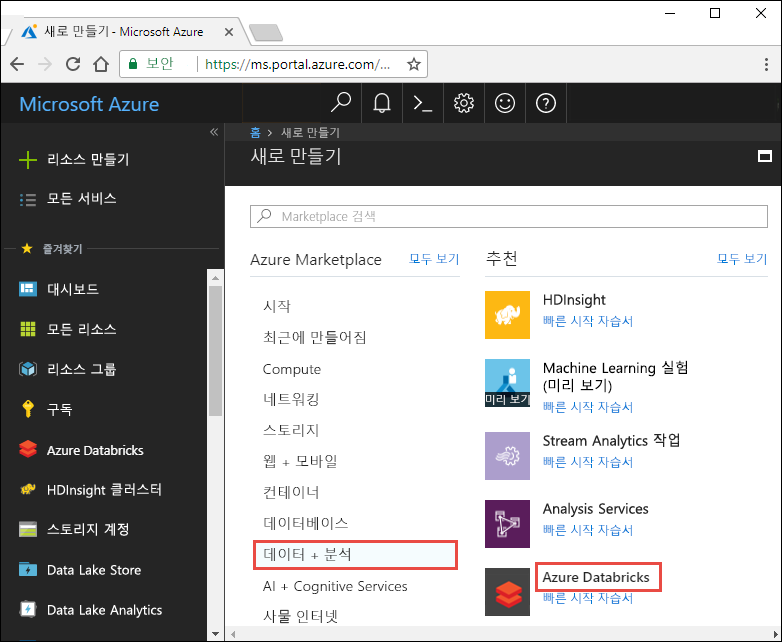
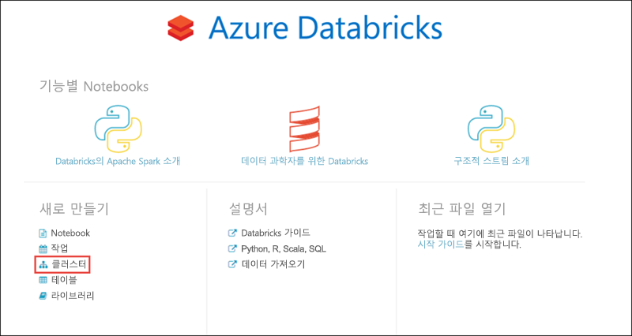
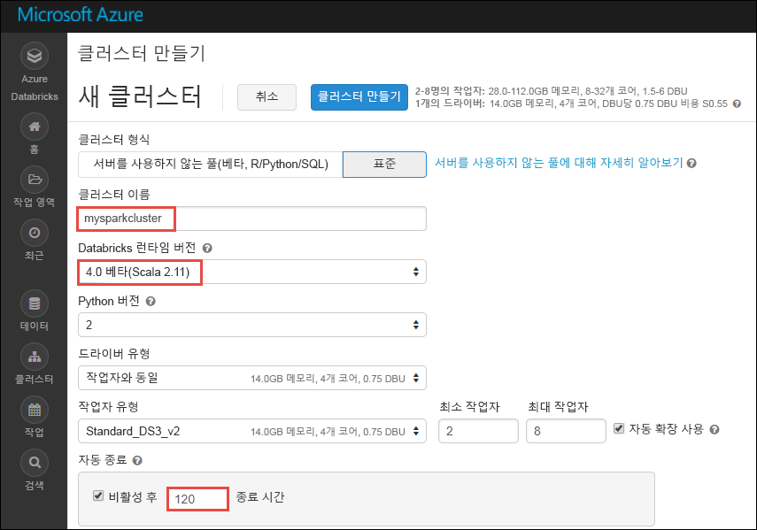
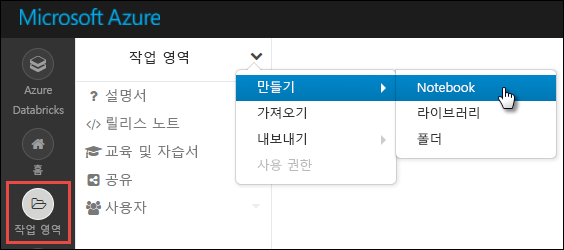
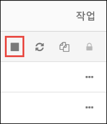

# <a name="tutorial-sentiment-analysis-on-streaming-data-using-azure-databricks"></a>자습서: Azure Databricks를 사용하여 스트리밍 데이터에 대한 감정 분석

이 자습서에서는 Azure Databricks를 사용하여 데이터 스트림에 대한 감정 분석을 거의 실시간으로 실행하는 방법을 알아봅니다. Azure Event Hubs를 사용하여 데이터 수집 시스템을 설정합니다. Spark Event Hubs 커넥터를 사용하여 Event Hubs에서 Azure Databricks로 메시지를 사용합니다. 마지막으로, Microsoft Cognitive Service API를 사용하여 스트리밍된 데이터에 대한 감정 분석을 실행합니다.

이 자습서가 완료되면 Twitter에서 "Azure"라는 용어가 포함된 트윗을 스트리밍하고 트윗에 대한 감정 분석을 실행하게 됩니다.

다음 그림에서는 애플리케이션 흐름을 보여줍니다.


이 자습서에서 다루는 작업은 다음과 같습니다.

> [!div class="checklist"]
> * Azure Databricks 작업 영역 만들기
> * Azure Databricks에 Spark 클러스터 만들기
> * 스트리밍 데이터에 액세스하는 Twitter 앱 만들기
> * Azure Databricks에 노트북 만들기
> * Event Hubs 및 Twitter API에 대한 라이브러리 연결
> * Microsoft Cognitive Services 계정 만들기 및 액세스 키 검색
> * Event Hubs에 트윗 보내기
> * Event Hubs에서 트윗 읽기
> * 트윗에 대한 감정 분석 실행

Azure 구독이 아직 없는 경우 시작하기 전에 [체험](https://azure.microsoft.com/free/) 계정을 만듭니다.

> [!Note]
> 이 자습서는 **Azure 평가판 구독**을 사용하여 수행할 수 없습니다.
> 무료 계정을 사용하여 Azure Databricks 클러스터를 만들려면 클러스터를 만들기 전에 프로필로 이동하고 구독을 **종량제**로 변경합니다. 자세한 내용은 [Azure 체험 계정](https://azure.microsoft.com/free/)을 참조하세요.

## <a name="prerequisites"></a>필수 조건

이 자습서를 시작하기 전에 다음 요구 사항이 충족되는지 확인합니다.
- Azure Event Hubs 네임스페이스.
- 네임스페이스 내의 Event Hub
- Event Hubs 네임스페이스에 액세스하기 위한 연결 문자열. 연결 문자열의 형식은 `Endpoint=sb://<namespace>.servicebus.windows.net/;SharedAccessKeyName=<key name>;SharedAccessKey=<key value>`와 비슷해야 합니다.
- Event Hubs에 대한 공유 액세스 정책 이름 및 정책 키

[Azure Event Hubs 네임스페이스 및 이벤트 허브 만들기](../event-hubs/event-hubs-create.md) 문서의 단계를 수행하여 이러한 요구 사항을 충족시킬 수 있습니다.

## <a name="sign-in-to-the-azure-portal"></a>Azure Portal에 로그인

[Azure Portal](https://portal.azure.com/)에 로그인합니다.

## <a name="create-an-azure-databricks-workspace"></a>Azure Databricks 작업 영역 만들기

이 섹션에서는 Azure Portal을 사용하여 Azure Databricks 작업 영역을 만듭니다.

1. Azure Portal에서 **리소스 만들기** > **데이터 + 분석** > **Azure Databricks**를 차례로 선택합니다.

    

3. **Azure Databricks 서비스** 아래에서 Databricks 작업 영역을 만들기 위한 값을 제공합니다.

    

    다음 값을 제공합니다.

    |자산  |설명  |
    |---------|---------|
    |**작업 영역 이름**     | Databricks 작업 영역의 이름을 제공합니다.        |
    |**구독**     | 드롭다운에서 Azure 구독을 선택합니다.        |
    |**리소스 그룹**     | 새 리소스 그룹을 만들지, 아니면 기존 그룹을 사용할지 여부를 지정합니다. 리소스 그룹은 Azure 솔루션에 관련된 리소스를 보유하는 컨테이너입니다. 자세한 내용은 [Azure Resource Manager 개요](../azure-resource-manager/resource-group-overview.md)를 참조하세요. |
    |**위치**:     | **미국 동부 2**를 선택합니다. 사용 가능한 다른 영역은 [지역별 사용 가능한 Azure 서비스](https://azure.microsoft.com/regions/services/)를 참조하세요.        |
    |**가격 책정 계층**     |  **표준** 또는 **프리미엄** 중에서 선택합니다. 이러한 계층에 대한 자세한 내용은 [Databricks 가격 페이지](https://azure.microsoft.com/pricing/details/databricks/)를 참조하세요.       |

    **대시보드에 고정**을 선택한 다음, **만들기**를 선택합니다.

4. 계정 생성에는 몇 분 정도가 소요됩니다. 계정을 만드는 동안 포털의 오른쪽에 **Azure Databricks에 대한 배포 제출**이 표시됩니다. 타일을 보려면 대시보드에서 오른쪽으로 스크롤해야 할 수도 있습니다. 화면 위쪽에 진행률 표시줄이 표시되기도 합니다. 두 영역에서 진행 상태를 볼 수 있습니다.

    

## <a name="create-a-spark-cluster-in-databricks"></a>Databricks에서 Spark 클러스터 만들기

1. Azure Portal에서 사용자가 만든 Databricks 작업 영역으로 이동한 다음, **작업 영역 시작**을 선택합니다.

2. Azure Databricks 포털로 리디렉션됩니다. 포털에서 **클러스터**를 선택합니다.

    

3. **새 클러스터** 페이지에서 값을 제공하여 클러스터를 만듭니다.

    

    다음 항목 이외의 다른 모든 기본값을 허용합니다.

   * 클러스터의 이름을 입력합니다.
   * 이 문서에서는 **4.0(베타)** 런타임을 사용하여 클러스터를 만듭니다.
   * **비활성 \_\_분 후 종료** 확인란을 선택했는지 확인합니다. 클러스터를 사용하지 않는 경우 클러스터를 종료하는 기간(분)을 제공합니다.

     **클러스터 만들기**를 선택합니다. 클러스터가 실행되면 노트북을 클러스터에 첨부하고 Spark 작업을 실행할 수 있습니다.

## <a name="create-a-twitter-application"></a>Twitter 애플리케이션 만들기

트윗 스트림을 받으려면 Twitter에 애플리케이션을 만들어야 합니다. 다음 단계에 따라 Twitter 애플리케이션을 만들고 이 자습서를 완료하는 데 필요한 값을 기록합니다.

1. 웹 브라우저에서 [Twitter 애플리케이션 관리](https://apps.twitter.com/)로 이동하고 **새 앱 만들기**를 선택합니다.

    

2. **애플리케이션 만들기** 페이지에서 새 앱에 대한 세부 정보를 제공한 다음, **Twitter 애플리케이션 만들기**를 선택합니다.

    

3. 애플리케이션 페이지에서 **키 및 액세스 토큰** 탭을 선택하고, **소비자 키** 및 **소비자 비밀**에 대한 값을 복사합니다. 또한 **내 액세스 토큰 만들기**를 선택하여 액세스 토큰을 생성합니다. **액세스 토큰** 및 **액세스 토큰 비밀**에 대한 값을 복사합니다.

    

Twitter 애플리케이션에 대해 검색한 값을 저장합니다. 이러한 값은 자습서의 뒷부분에서 필요합니다.

## <a name="attach-libraries-to-spark-cluster"></a>Spark 클러스터에 라이브러리 연결

이 자습서에서는 Twitter API를 사용하여 트윗을 Event Hubs에 보냅니다. 또한 [Apache Spark Event Hubs 커넥터](https://github.com/Azure/azure-event-hubs-spark)를 사용하여 Azure Event Hubs에 데이터를 읽고 씁니다. 이러한 API를 클러스터의 일부로 사용하려면 Azure Databricks에 라이브러리로 추가한 다음, 이를 Spark 클러스터와 연결합니다. 다음 지침에서는 작업 영역의 **공유** 폴더에 라이브러리를 추가하는 방법을 보여줍니다.

1. Azure Databricks 작업 영역에서 **작업 영역**을 선택한 다음, **공유**를 마우스 오른쪽 단추로 클릭합니다. 바로 가기 메뉴에서 **만들기** > **라이브러리**를 차례로 선택합니다.

   

2. [새 라이브러리] 페이지에서 **원본**에 대해 **Maven 코디네이트**를 선택합니다. **코디네이트**에서 추가하려는 패키지에 대한 코디네이트를 입력합니다. 이 자습서에서 사용된 라이브러리에 대한 Maven 코디네이트는 다음과 같습니다.

   * Spark Event Hubs 커넥터 - `com.microsoft.azure:azure-eventhubs-spark_2.11:2.3.5`
   * Twitter API - `org.twitter4j:twitter4j-core:4.0.6`

     

3. **라이브러리 만들기**를 선택합니다.

4. 라이브러리를 추가한 폴더를 선택한 다음, 라이브러리 이름을 선택합니다.

    

5. 라이브러리 페이지에서 해당 라이브러리를 사용하려는 클러스터를 선택합니다. 라이브러리가 클러스터와 성공적으로 연결되는 즉시 상태가 **연결됨**으로 변경됩니다.

    

6. `twitter4j-core:4.0.6` Twitter 패키지에 대해 이러한 단계를 반복합니다.

## <a name="get-a-cognitive-services-access-key"></a>Cognitive Services 액세스 키 가져오기

이 자습서에서는 [Azure Cognitive Services Text Analytics API](../cognitive-services/text-analytics/overview.md)를 사용하여 트윗 스트림에 대한 감정 분석을 거의 실시간으로 실행합니다. API를 사용하기 전에 Azure에 Azure Cognitive Services 계정을 만들고, Text Analytics API를 사용하기 위한 액세스 키를 검색해야 합니다.

1. [Azure Portal](https://portal.azure.com/)에 로그인합니다.

2. **+ 리소스 만들기**를 선택합니다.

3. Azure Marketplace 아래에서 **AI + Cognitive Services** > **텍스트 분석 API**를 선택합니다.

    

4. **만들기** 대화 상자에서 다음 값을 제공합니다.

    

   - Cognitive Services 계정에 대한 이름을 입력합니다.
   - 계정을 만들 Azure 구독을 선택합니다.
   - Azure 위치를 선택합니다.
   - 서비스에 대한 가격 책정 계층을 선택합니다. Cognitive Services 가격 책정에 대한 자세한 내용은 [가격 페이지](https://azure.microsoft.com/pricing/details/cognitive-services/)를 참조하세요.
   - 새 리소스 그룹을 만들지, 아니면 기존 그룹을 선택할지 여부를 지정합니다.

     **만들기**를 선택합니다.

5. 계정이 만들어지면 **개요** 탭에서 **액세스 키 표시**를 선택합니다.

    

    또한 스크린샷과 같이 엔드포인트 URL의 일부를 복사합니다. 이 URL은 자습서에서 필요합니다.

6. **키 관리** 아래에서 사용하려는 키에 대한 복사 아이콘을 선택합니다.

    

7. 이 단계에서 검색한 엔드포인트 URL 및 액세스 키에 대한 값을 저장합니다. 이러한 값은 이 자습서의 뒷부분에서 필요합니다.

## <a name="create-notebooks-in-databricks"></a>Databricks에 노트북 만들기

이 섹션에서는 다음 이름을 사용하여 Databricks 작업 영역에 두 개의 노트북을 만듭니다

- **SendTweetsToEventHub** - Twitter에서 트윗을 가져와서 Event Hubs로 스트리밍하는 데 사용하는 생산자 노트북입니다.
- **AnalyzeTweetsFromEventHub** - Event Hubs에서 트윗을 읽고 감정 분석을 실행하는 데 사용하는 소비자 노트북입니다.

1. 왼쪽 창에서 **작업 영역**을 선택합니다. **작업 영역** 드롭다운에서 **만들기**, **Notebook**을 차례로 선택합니다.

    

2. **Notebook 만들기** 대화 상자에서 **SendTweetsToEventHub**를 입력하고, **Scala**를 언어로 선택하고, 이전에 만든 Spark 클러스터를 선택합니다.

    

    **만들기**를 선택합니다.

3. 단계를 반복하여 **AnalyzeTweetsFromEventHub** 노트북을 만듭니다.

## <a name="send-tweets-to-event-hubs"></a>Event Hubs에 트윗 보내기

**SendTweetsToEventHub** 노트북에서 다음 코드를 붙여넣고, 자리 표시자를 이전에 만든 Event Hubs 네임스페이스 및 Twitter 애플리케이션에 대한 값으로 바꿉니다. 이 노트북은 "Azure" 키워드가 있는 트윗을 Event Hubs에 실시간으로 스트리밍합니다.

```scala
import java.util._
import scala.collection.JavaConverters._
import com.microsoft.azure.eventhubs._
import java.util.concurrent._

val namespaceName = "<EVENT HUBS NAMESPACE>"
val eventHubName = "<EVENT HUB NAME>"
val sasKeyName = "<POLICY NAME>"
val sasKey = "<POLICY KEY>"
val connStr = new ConnectionStringBuilder()
            .setNamespaceName(namespaceName)
            .setEventHubName(eventHubName)
            .setSasKeyName(sasKeyName)
            .setSasKey(sasKey)

val pool = Executors.newScheduledThreadPool(1)
val eventHubClient = EventHubClient.create(connStr.toString(), pool)

def sendEvent(message: String) = {
  val messageData = EventData.create(message.getBytes("UTF-8"))
  eventHubClient.get().send(messageData)
  System.out.println("Sent event: " + message + "\n")
}

import twitter4j._
import twitter4j.TwitterFactory
import twitter4j.Twitter
import twitter4j.conf.ConfigurationBuilder

// Twitter configuration!
// Replace values below with yours

val twitterConsumerKey = "<CONSUMER KEY>"
val twitterConsumerSecret = "<CONSUMER SECRET>"
val twitterOauthAccessToken = "<ACCESS TOKEN>"
val twitterOauthTokenSecret = "<TOKEN SECRET>"

val cb = new ConfigurationBuilder()
  cb.setDebugEnabled(true)
  .setOAuthConsumerKey(twitterConsumerKey)
  .setOAuthConsumerSecret(twitterConsumerSecret)
  .setOAuthAccessToken(twitterOauthAccessToken)
  .setOAuthAccessTokenSecret(twitterOauthTokenSecret)

val twitterFactory = new TwitterFactory(cb.build())
val twitter = twitterFactory.getInstance()

// Getting tweets with keyword "Azure" and sending them to the Event Hub in realtime!

val query = new Query(" #Azure ")
query.setCount(100)
query.lang("en")
var finished = false
while (!finished) {
  val result = twitter.search(query)
  val statuses = result.getTweets()
  var lowestStatusId = Long.MaxValue
  for (status <- statuses.asScala) {
    if(!status.isRetweet()){
      sendEvent(status.getText())
    }
    lowestStatusId = Math.min(status.getId(), lowestStatusId)
    Thread.sleep(2000)
  }
  query.setMaxId(lowestStatusId - 1)
}

// Closing connection to the Event Hub
 eventHubClient.get().close()
```

노트북을 실행하려면 **Shift+Enter**를 누릅니다. 다음 코드 조각과 같은 출력이 표시됩니다. 출력의 각 이벤트는 Event Hubs로 수집되는 트윗입니다.

    Sent event: @Microsoft and @Esri launch Geospatial AI on Azure https://t.co/VmLUCiPm6q via @geoworldmedia #geoai #azure #gis #ArtificialIntelligence

    Sent event: Public preview of Java on App Service, built-in support for Tomcat and OpenJDK
    https://t.co/7vs7cKtvah
    #cloudcomputing #Azure

    Sent event: 4 Killer #Azure Features for #Data #Performance https://t.co/kpIb7hFO2j by @RedPixie

    Sent event: Migrate your databases to a fully managed service with Azure SQL Database Managed Instance | #Azure | #Cloud https://t.co/sJHXN4trDk

    Sent event: Top 10 Tricks to #Save Money with #Azure Virtual Machines https://t.co/F2wshBXdoz #Cloud

    ...
    ...

## <a name="read-tweets-from-event-hubs"></a>Event Hubs에서 트윗 읽기

**AnalyzeTweetsFromEventHub** 노트북에서 다음 코드를 붙여넣고, 자리 표시자를 이전에 만든 Azure Event Hubs의 값으로 바꿉니다. 이 노트북은 **SendTweetsToEventHub** 노트북을 사용하여 이전에 Event Hubs로 스트리밍한 트윗을 읽습니다.

```scala
import org.apache.spark.eventhubs._

// Build connection string with the above information
val namespaceName = "<EVENT HUBS NAMESPACE>"
val eventHubName = "<EVENT HUB NAME>"
val sasKeyName = "<POLICY NAME>"
val sasKey = "<POLICY KEY>"
val connectionString = ConnectionStringBuilder()
            .setNamespaceName(namespaceName)
            .setEventHubName(eventHubName)
            .setSasKeyName(sasKeyName)
            .setSasKey(sasKey)

val customEventhubParameters =
  EventHubsConf(connectionString.toString())
  .setMaxEventsPerTrigger(5)

val incomingStream = spark.readStream.format("eventhubs").options(customEventhubParameters.toMap).load()

incomingStream.printSchema

// Sending the incoming stream into the console.
// Data comes in batches!
incomingStream.writeStream.outputMode("append").format("console").option("truncate", false).start().awaitTermination()
```

다음과 같은 출력을 얻습니다.

    root
     |-- body: binary (nullable = true)
     |-- offset: long (nullable = true)
     |-- seqNumber: long (nullable = true)
     |-- enqueuedTime: long (nullable = true)
     |-- publisher: string (nullable = true)
     |-- partitionKey: string (nullable = true)

    -------------------------------------------
    Batch: 0
    -------------------------------------------
    +------+------+--------------+---------------+---------+------------+
    |body  |offset|sequenceNumber|enqueuedTime   |publisher|partitionKey|
    +------+------+--------------+---------------+---------+------------+
    |[50 75 62 6C 69 63 20 70 72 65 76 69 65 77 20 6F 66 20 4A 61 76 61 20 6F 6E 20 41 70 70 20 53 65 72 76 69 63 65 2C 20 62 75 69 6C 74 2D 69 6E 20 73 75 70 70 6F 72 74 20 66 6F 72 20 54 6F 6D 63 61 74 20 61 6E 64 20 4F 70 65 6E 4A 44 4B 0A 68 74 74 70 73 3A 2F 2F 74 2E 63 6F 2F 37 76 73 37 63 4B 74 76 61 68 20 0A 23 63 6C 6F 75 64 63 6F 6D 70 75 74 69 6E 67 20 23 41 7A 75 72 65]                              |0     |0             |2018-03-09 05:49:08.86 |null     |null        |
    |[4D 69 67 72 61 74 65 20 79 6F 75 72 20 64 61 74 61 62 61 73 65 73 20 74 6F 20 61 20 66 75 6C 6C 79 20 6D 61 6E 61 67 65 64 20 73 65 72 76 69 63 65 20 77 69 74 68 20 41 7A 75 72 65 20 53 51 4C 20 44 61 74 61 62 61 73 65 20 4D 61 6E 61 67 65 64 20 49 6E 73 74 61 6E 63 65 20 7C 20 23 41 7A 75 72 65 20 7C 20 23 43 6C 6F 75 64 20 68 74 74 70 73 3A 2F 2F 74 2E 63 6F 2F 73 4A 48 58 4E 34 74 72 44 6B]            |168   |1             |2018-03-09 05:49:24.752|null     |null        |
    +------+------+--------------+---------------+---------+------------+

    -------------------------------------------
    Batch: 1
    -------------------------------------------
    ...
    ...

출력은 이진 모드이므로 다음 코드 조각을 사용하여 문자열로 변환합니다.

```scala
import org.apache.spark.sql.types._
import org.apache.spark.sql.functions._

// Event Hub message format is JSON and contains "body" field
// Body is binary, so we cast it to string to see the actual content of the message
val messages =
  incomingStream
  .withColumn("Offset", $"offset".cast(LongType))
  .withColumn("Time (readable)", $"enqueuedTime".cast(TimestampType))
  .withColumn("Timestamp", $"enqueuedTime".cast(LongType))
  .withColumn("Body", $"body".cast(StringType))
  .select("Offset", "Time (readable)", "Timestamp", "Body")

messages.printSchema

messages.writeStream.outputMode("append").format("console").option("truncate", false).start().awaitTermination()
```

이제 출력은 다음 코드 조각과 비슷합니다.

    root
     |-- Offset: long (nullable = true)
     |-- Time (readable): timestamp (nullable = true)
     |-- Timestamp: long (nullable = true)
     |-- Body: string (nullable = true)

    -------------------------------------------
    Batch: 0
    -------------------------------------------
    +------+-----------------+----------+-------+
    |Offset|Time (readable)  |Timestamp |Body
    +------+-----------------+----------+-------+
    |0     |2018-03-09 05:49:08.86 |1520574548|Public preview of Java on App Service, built-in support for Tomcat and OpenJDK
    https://t.co/7vs7cKtvah
    #cloudcomputing #Azure          |
    |168   |2018-03-09 05:49:24.752|1520574564|Migrate your databases to a fully managed service with Azure SQL Database Managed Instance | #Azure | #Cloud https://t.co/sJHXN4trDk    |
    |0     |2018-03-09 05:49:02.936|1520574542|@Microsoft and @Esri launch Geospatial AI on Azure https://t.co/VmLUCiPm6q via @geoworldmedia #geoai #azure #gis #ArtificialIntelligence|
    |176   |2018-03-09 05:49:20.801|1520574560|4 Killer #Azure Features for #Data #Performance https://t.co/kpIb7hFO2j by @RedPixie                                                    |
    +------+-----------------+----------+-------+
    -------------------------------------------
    Batch: 1
    -------------------------------------------
    ...
    ...

이제 Apache Spark용 Event Hubs 커넥터를 사용하여 거의 실시간으로 Azure Event Hubs의 데이터를 Azure Databricks로 스트림했습니다. Spark에 Event Hubs 커넥터를 사용하는 방법에 대한 자세한 내용은 [커넥터 설명서](https://github.com/Azure/azure-event-hubs-spark/tree/master/docs)를 참조하세요.

## <a name="run-sentiment-analysis-on-tweets"></a>트윗에 대한 감정 분석 실행

이 섹션에서는 Twitter API를 사용하여 받은 트윗에 대한 감정 분석을 실행합니다. 이 섹션에서는 코드 조각을 동일한 **AnalyzeTweetsFromEventHub** 노트북에 추가합니다.

먼저 노트북에 새 코드 셀을 추가한 다음, 아래에 제공된 코드 조각을 붙여넣습니다. 이 코드 조각은 언어 및 감정 API를 사용하기 위한 데이터 형식을 정의합니다.

```scala
import java.io._
import java.net._
import java.util._

case class Language(documents: Array[LanguageDocuments], errors: Array[Any]) extends Serializable
case class LanguageDocuments(id: String, detectedLanguages: Array[DetectedLanguages]) extends Serializable
case class DetectedLanguages(name: String, iso6391Name: String, score: Double) extends Serializable

case class Sentiment(documents: Array[SentimentDocuments], errors: Array[Any]) extends Serializable
case class SentimentDocuments(id: String, score: Double) extends Serializable

case class RequestToTextApi(documents: Array[RequestToTextApiDocument]) extends Serializable
case class RequestToTextApiDocument(id: String, text: String, var language: String = "") extends Serializable
```

새 코드 셀을 추가하고 아래에 제공된 코드 조각을 붙여넣습니다. 이 코드 조각은 언어 감지 및 감정 분석을 실행하기 위해 텍스트 분석 API를 호출하는 함수가 포함된 개체를 정의합니다. `<PROVIDE ACCESS KEY HERE>` 및 `<PROVIDE REGION HERE>` 자리 표시자를 Cognitive Services에 대해 검색한 값으로 바꿔야 합니다.

```scala
import javax.net.ssl.HttpsURLConnection
import com.google.gson.Gson
import com.google.gson.GsonBuilder
import com.google.gson.JsonObject
import com.google.gson.JsonParser
import scala.util.parsing.json._

object SentimentDetector extends Serializable {

    // Cognitive Services API connection settings
    val accessKey = "<PROVIDE ACCESS KEY HERE>"
    val host = "https://<PROVIDE REGION HERE>.api.cognitive.microsoft.com"
    val languagesPath = "/text/analytics/v2.0/languages"
    val sentimentPath = "/text/analytics/v2.0/sentiment"
    val languagesUrl = new URL(host+languagesPath)
    val sentimenUrl = new URL(host+sentimentPath)
    val g = new Gson

    def getConnection(path: URL): HttpsURLConnection = {
        val connection = path.openConnection().asInstanceOf[HttpsURLConnection]
        connection.setRequestMethod("POST")
        connection.setRequestProperty("Content-Type", "text/json")
        connection.setRequestProperty("Ocp-Apim-Subscription-Key", accessKey)
        connection.setDoOutput(true)
        return connection
    }

    def prettify (json_text: String): String = {
        val parser = new JsonParser()
        val json = parser.parse(json_text).getAsJsonObject()
        val gson = new GsonBuilder().setPrettyPrinting().create()
        return gson.toJson(json)
    }

    // Handles the call to Cognitive Services API.
    def processUsingApi(request: RequestToTextApi, path: URL): String = {
        val requestToJson = g.toJson(request)
        val encoded_text = requestToJson.getBytes("UTF-8")
        val connection = getConnection(path)
        val wr = new DataOutputStream(connection.getOutputStream())
        wr.write(encoded_text, 0, encoded_text.length)
        wr.flush()
        wr.close()

        val response = new StringBuilder()
        val in = new BufferedReader(new InputStreamReader(connection.getInputStream()))
        var line = in.readLine()
        while (line != null) {
            response.append(line)
            line = in.readLine()
        }
        in.close()
        return response.toString()
    }

    // Calls the language API for specified documents.
    def getLanguage (inputDocs: RequestToTextApi): Option[Language] = {
        try {
            val response = processUsingApi(inputDocs, languagesUrl)
            // In case we need to log the json response somewhere
            val niceResponse = prettify(response)
            // Deserializing the JSON response from the API into Scala types
            val language = g.fromJson(niceResponse, classOf[Language])
            if (language.documents(0).detectedLanguages(0).iso6391Name == "(Unknown)")
                return None
            return Some(language)
        } catch {
            case e: Exception => return None
        }
    }

    // Calls the sentiment API for specified documents. Needs a language field to be set for each of them.
    def getSentiment (inputDocs: RequestToTextApi): Option[Sentiment] = {
        try {
            val response = processUsingApi(inputDocs, sentimenUrl)
            val niceResponse = prettify(response)
            // Deserializing the JSON response from the API into Scala types
            val sentiment = g.fromJson(niceResponse, classOf[Sentiment])
            return Some(sentiment)
        } catch {
            case e: Exception => return None
        }
    }
}
```

다른 셀을 추가하여 감정을 결정하는 Spark UDF(사용자 정의 함수)를 정의합니다.

```scala
// User Defined Function for processing content of messages to return their sentiment.
val toSentiment =
    udf((textContent: String) =>
        {
            val inputObject = new RequestToTextApi(Array(new RequestToTextApiDocument(textContent, textContent)))
            val detectedLanguage = SentimentDetector.getLanguage(inputObject)
            detectedLanguage match {
                case Some(language) =>
                    if(language.documents.size > 0) {
                        inputObject.documents(0).language = language.documents(0).detectedLanguages(0).iso6391Name
                        val sentimentDetected = SentimentDetector.getSentiment(inputObject)
                        sentimentDetected match {
                            case Some(sentiment) => {
                                if(sentiment.documents.size > 0) {
                                    sentiment.documents(0).score.toString()
                                }
                                else {
                                    "Error happened when getting sentiment: " + sentiment.errors(0).toString
                                }
                            }
                            case None => "Couldn't detect sentiment"
                        }
                    }
                    else {
                        "Error happened when getting language" + language.errors(0).toString
                    }
                case None => "Couldn't detect language"
            }
        }
    )
```

마지막 코드 셀을 추가하여 트윗의 내용과 해당 트윗과 관련된 감정이 포함된 데이터 프레임을 준비합니다.

```scala
// Prepare a dataframe with Content and Sentiment columns
val streamingDataFrame = incomingStream.selectExpr("cast (body as string) AS Content").withColumn("Sentiment", toSentiment($"Content"))

// Display the streaming data with the sentiment
streamingDataFrame.writeStream.outputMode("append").format("console").option("truncate", false).start().awaitTermination()
```

다음 코드 조각과 유사한 출력이 표시됩니다.

    -------------------------------------------
    Batch: 0
    -------------------------------------------
    +--------------------------------+------------------+
    |Content                         |Sentiment         |
    +--------------------------------+------------------+
    |Public preview of Java on App Service, built-in support for Tomcat and OpenJDK
    https://t.co/7vs7cKtvah   #cloudcomputing #Azure          |0.7761918306350708|
    |Migrate your databases to a fully managed service with Azure SQL Database Managed Instance | #Azure | #Cloud https://t.co/sJHXN4trDk    |0.8558163642883301|
    |@Microsoft and @Esri launch Geospatial AI on Azure https://t.co/VmLUCiPm6q via @geoworldmedia #geoai #azure #gis #ArtificialIntelligence|0.5               |
    |4 Killer #Azure Features for #Data #Performance https://t.co/kpIb7hFO2j by @RedPixie                                                    |0.5               |
    +--------------------------------+------------------+

**Sentiment** 열에서 **1**에 가까운 값은 Azure와 훌륭한 경험이 있음을 나타냅니다. **0**에 가까운 값은 Microsoft Azure를 사용하면서 사용자가 직면한 문제가 있음을 나타냅니다.

이것으로 끝입니다. Azure Databricks를 사용하여 데이터를 Azure Event Hubs에 성공적으로 스트림하고, Event Hubs 커넥터를 통해 스트림 데이터를 사용한 다음, 스트리밍 데이터에 대한 감정 분석을 거의 실시간으로 실행했습니다.

## <a name="clean-up-resources"></a>리소스 정리

자습서 실행이 완료되면 클러스터를 종료할 수 있습니다. 이렇게 하려면 왼쪽 창의 Azure Databricks 작업 영역에서 **클러스터**를 선택합니다. 종료하려는 클러스터에서 **작업** 열 아래의 줄임표 위로 커서를 이동한 다음, **종료** 아이콘을 선택합니다.



클러스터를 수동으로 종료하지 않은 경우 클러스터를 만드는 중에 **비활성 \_\_분 후 종료** 확인란을 선택하면 자동으로 중지됩니다. 이 경우 지정한 시간 동안 클러스터가 비활성 상태이면 클러스터가 자동으로 중지됩니다.

## <a name="next-steps"></a>다음 단계
이 자습서에서는 Azure Databricks를 사용하여 Azure Event Hubs로 데이터를 스트리밍한 다음, Event Hubs에서 스트리밍 데이터를 실시간으로 읽는 방법을 알아보았습니다. 다음 방법에 대해 알아보았습니다.
> [!div class="checklist"]
> * Azure Databricks 작업 영역 만들기
> * Azure Databricks에 Spark 클러스터 만들기
> * 스트리밍 데이터에 액세스하는 Twitter 앱 만들기
> * Azure Databricks에 노트북 만들기
> * Event Hubs 및 Twitter API에 대한 라이브러리 추가 및 연결
> * Microsoft Cognitive Services 계정 만들기 및 액세스 키 검색
> * Event Hubs에 트윗 보내기
> * Event Hubs에서 트윗 읽기
> * 트윗에 대한 감정 분석 실행

Azure Databricks를 사용하여 기계 학습 작업을 수행하는 방법에 대해 알아보려면 다음 자습서로 계속 진행하세요.

> [!div class="nextstepaction"]
>[Azure Databricks를 사용한 Machine Learning](https://docs.azuredatabricks.net/spark/latest/mllib/decision-trees.html)
