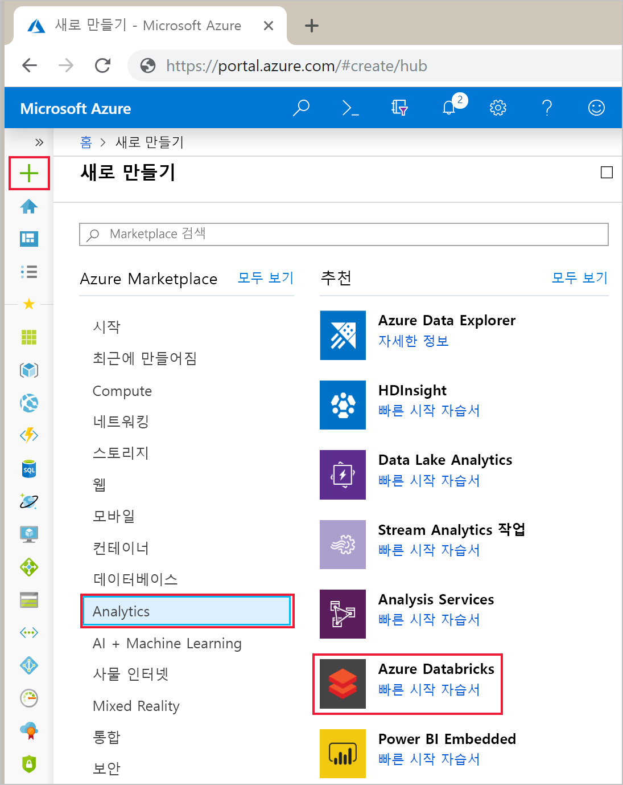
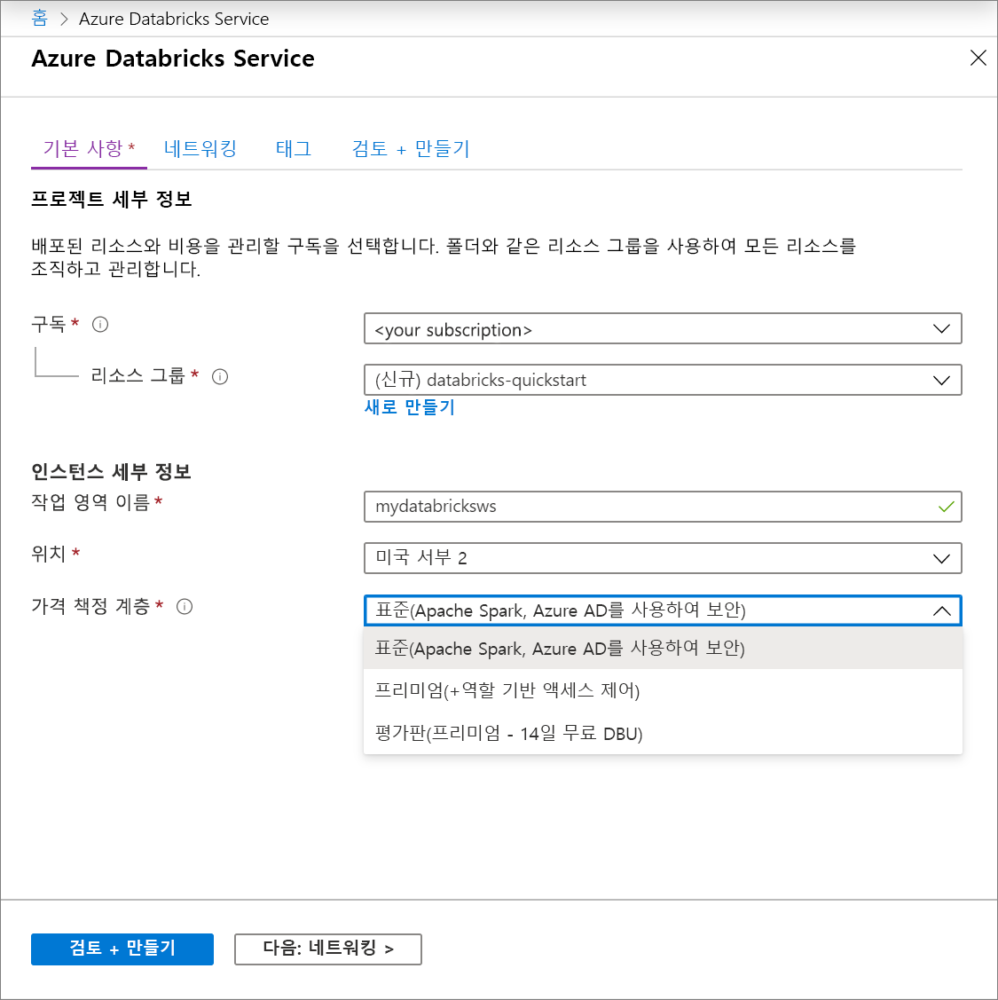
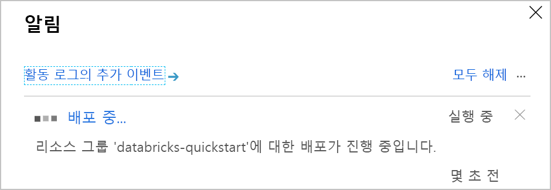
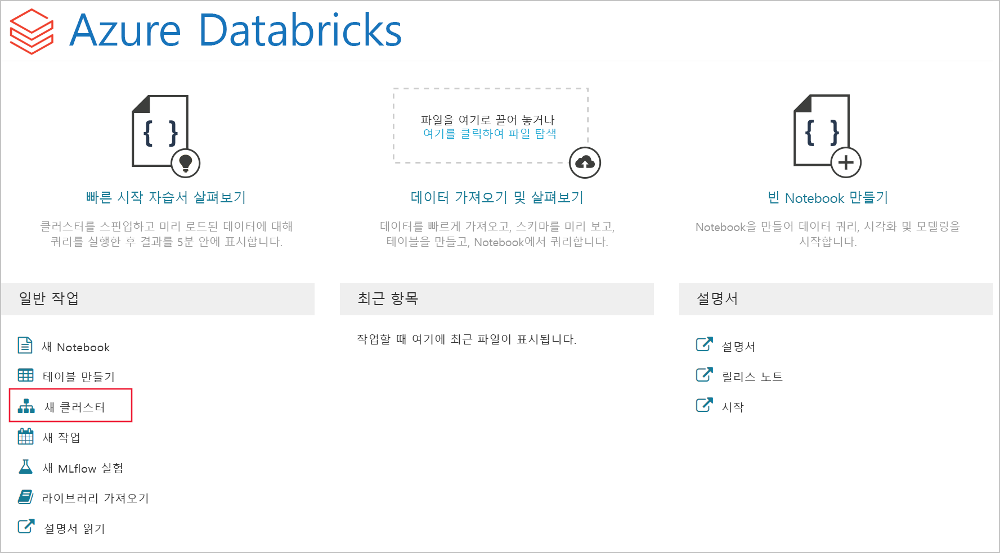
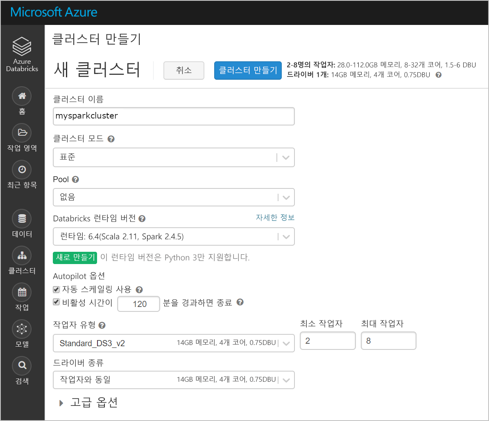
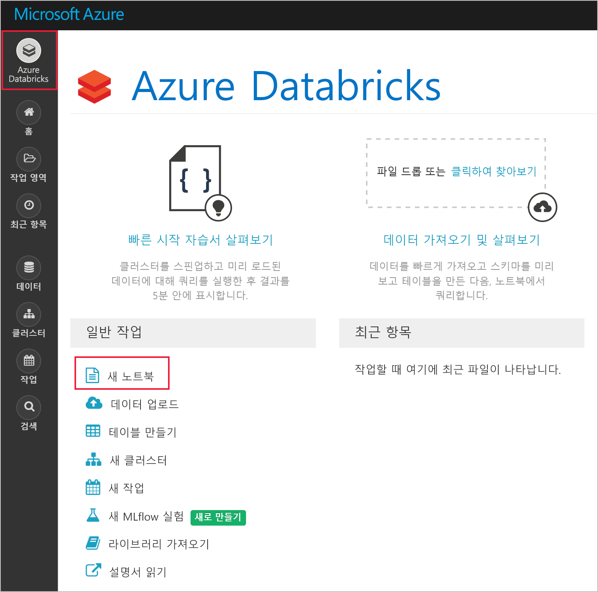
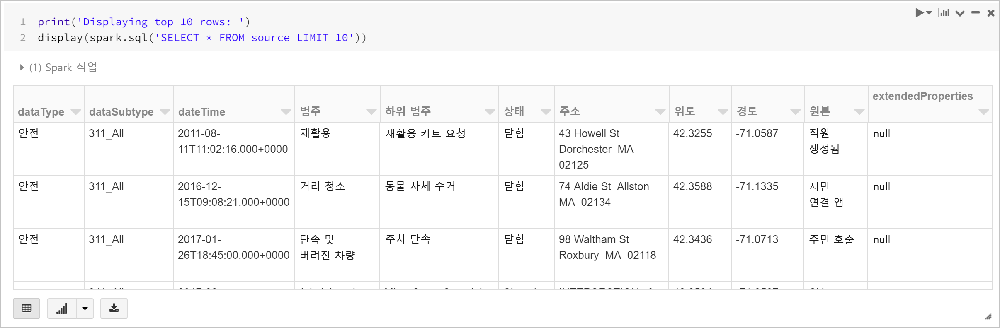
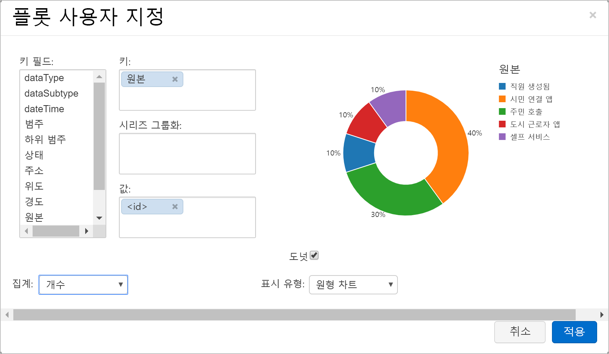
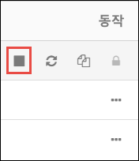

# <a name="quickstart-run-a-spark-job-on-azure-databricks-using-the-azure-portal"></a>빠른 시작: Azure Portal을 사용하여 Azure Databricks에서 Spark 작업 실행

빠른 시작은 Azure Databricks 작업 영역과 해당 작업 영역 내에 Apache Spark 클러스터를 만드는 방법을 보여줍니다. 마지막으로, Databricks 클러스터에서 Spark 작업을 실행하는 방법을 알아봅니다. Azure Databricks에 대한 자세한 내용은 [Azure Databricks란?](what-is-azure-databricks.md)을 참조하세요.

이 빠른 시작에서는 Spark 작업의 일부로 Boston 안전 데이터를 분석하여 다양한 보고 방법을 파악합니다.

Azure 구독이 아직 없는 경우 시작하기 전에 [체험](https://azure.microsoft.com/free/) 계정을 만듭니다.

## <a name="sign-in-to-the-azure-portal"></a>Azure Portal에 로그인

[Azure Portal](https://portal.azure.com)에 로그인합니다.

## <a name="create-an-azure-databricks-workspace"></a>Azure Databricks 작업 영역 만들기

이 섹션에서는 Azure Portal을 사용하여 Azure Databricks 작업 영역을 만듭니다.

1. Azure Portal에서 **리소스 만들기** > **분석** > **Azure Databricks**를 차례로 선택합니다.

    

2. **Azure Databricks 서비스** 아래에서 Databricks 작업 영역을 만들기 위한 값을 제공합니다.

    

    다음 값을 제공합니다.
    
    |자산  |설명  |
    |---------|---------|
    |**작업 영역 이름**     | Databricks 작업 영역의 이름을 제공합니다.        |
    |**구독**     | 드롭다운에서 Azure 구독을 선택합니다.        |
    |**리소스 그룹**     | 새 리소스 그룹을 만들지, 아니면 기존 그룹을 사용할지 여부를 지정합니다. 리소스 그룹은 Azure 솔루션에 관련된 리소스를 보유하는 컨테이너입니다. 자세한 내용은 [Azure Resource Manager 개요](../azure-resource-manager/resource-group-overview.md)를 참조하세요. |
    |**위치**:     | **미국 서부 2**를 선택합니다. 사용 가능한 다른 영역은 [지역별 사용 가능한 Azure 서비스](https://azure.microsoft.com/regions/services/)를 참조하세요.        |
    |**가격 책정 계층**     |  **표준**, **프리미엄** 또는 **평가판** 중에서 선택합니다. 이러한 계층에 대한 자세한 내용은 [Databricks 가격 페이지](https://azure.microsoft.com/pricing/details/databricks/)를 참조하세요.       |

    **대시보드에 고정**을 선택한 다음, **만들기**를 클릭합니다.

4. 작업 영역 생성에는 몇 분 정도가 소요됩니다. 작업 영역을 만드는 동안 **알림**에서 배포 상태를 볼 수 있습니다.

    

## <a name="create-a-spark-cluster-in-databricks"></a>Databricks에서 Spark 클러스터 만들기

> [!NOTE]
> 무료 계정을 사용하여 Azure Databricks 클러스터를 만들려면 클러스터를 만들기 전에 프로필로 이동하고 구독을 **종량제**로 변경합니다. 자세한 내용은 [Azure 체험 계정](https://azure.microsoft.com/free/)을 참조하세요.

1. Azure Portal에서 사용자가 만든 Databricks 작업 영역으로 이동한 다음, **작업 영역 시작**을 클릭합니다.

2. Azure Databricks 포털로 리디렉션됩니다. 포털에서 **새 클러스터**를 클릭합니다.

    

3. **새 클러스터** 페이지에서 값을 제공하여 클러스터를 만듭니다.

    

    다음 항목 이외의 다른 모든 기본값을 허용합니다.

   * 클러스터의 이름을 입력합니다.
   * 이 문서에서는 **5.2** 런타임을 사용하여 클러스터를 만듭니다.
   * **비활성 \_\_분 후 종료** 확인란을 선택했는지 확인합니다. 클러스터를 사용하지 않는 경우 클러스터를 종료하는 기간(분)을 제공합니다.
    
     **클러스터 만들기**를 선택합니다. 클러스터가 실행되면 노트북을 클러스터에 첨부하고 Spark 작업을 실행할 수 있습니다.

클러스터를 만드는 방법에 대한 자세한 내용은 [Azure Databricks에서 Spark 클러스터 만들기](https://docs.azuredatabricks.net/user-guide/clusters/create.html)를 참조하세요.

## <a name="run-a-spark-sql-job"></a>Spark SQL 작업 실행

다음 작업을 수행하여 Databricks에서 Notebook을 만들고, Azure Open Datasets에서 데이터를 읽도록 Notebook을 구성한 다음, 해당 데이터에 대해 Spark SQL 작업을 실행합니다.

1. 왼쪽 창에서 **Azure Databricks**를 선택합니다. **일반 작업**에서 **새 Notebook**을 선택합니다.

    

2. **Notebook 만들기** 대화 상자에서 이름을 입력하고 언어로 **Python**을 선택한 다음, 이전에 만든 Spark 클러스터를 선택합니다.

    

    **만들기**를 선택합니다.

3. 이 단계에서는 [Azure Open Datasets](https://azure.microsoft.com/services/open-datasets/catalog/boston-safety-data/#AzureDatabricks)의 Boston 안전 데이터를 사용하여 Spark DataFrame을 만들고 SQL을 사용하여 데이터를 쿼리합니다.

   다음 명령은 Azure Storage 액세스 정보를 설정합니다. 이 PySpark 코드를 첫 번째 셀에 붙여넣고 **Shift+Enter**를 사용하여 해당 코드를 실행합니다.

   ```python
   blob_account_name = "azureopendatastorage"
   blob_container_name = "citydatacontainer"
   blob_relative_path = "Safety/Release/city=Boston"
   blob_sas_token = r"?st=2019-02-26T02%3A34%3A32Z&se=2119-02-27T02%3A34%3A00Z&sp=rl&sv=2018-03-28&sr=c&sig=XlJVWA7fMXCSxCKqJm8psMOh0W4h7cSYO28coRqF2fs%3D"
   ```

   다음 명령은 Spark가 BLOB 스토리지에서 원격으로 읽을 수 있도록 합니다. 이 PySpark 코드를 다음 셀에 붙여넣고 **Shift+Enter**를 사용하여 해당 코드를 실행합니다.

   ```python
   wasbs_path = 'wasbs://%s@%s.blob.core.windows.net/%s' % (blob_container_name, blob_account_name, blob_relative_path)
   spark.conf.set('fs.azure.sas.%s.%s.blob.core.windows.net' % (blob_container_name, blob_account_name), blob_sas_token)
   print('Remote blob path: ' + wasbs_path)
   ```

   다음 명령은 DataFrame을 만듭니다. 이 PySpark 코드를 다음 셀에 붙여넣고 **Shift+Enter**를 사용하여 해당 코드를 실행합니다.

   ```python
   df = spark.read.parquet(wasbs_path)
   print('Register the DataFrame as a SQL temporary view: source')
   df.createOrReplaceTempView('source')
   ```

4. **원본**이라는 임시 보기에서 데이터의 위쪽 10행을 반환하는 SQL 명령문을 실행합니다. 이 PySpark 코드를 다음 셀에 붙여넣고 **Shift+Enter**를 사용하여 해당 코드를 실행합니다.

   ```python
   print('Displaying top 10 rows: ')
   display(spark.sql('SELECT * FROM source LIMIT 10'))
   ```

5. 다음 스크린샷과 같이 테이블 형식으로 출력됩니다(일부 열만 표시됨).

    

6. 이제 다른 원본 대신에 시민 연결 앱 및 도시 근로자 앱을 사용하여 보고되는 안전 이벤트 수를 표시하는 데이터의 시각적 표시를 만듭니다. 테이블 형식 출력의 아래쪽에서 **가로 막대형 차트** 아이콘을 선택한 다음, **출력 옵션**을 클릭합니다.

    

8. **사용자 지정 플롯**에서 스크린샷에 표시된 것과 같이 값을 끌어서 놓습니다.

    

   * **키**를 **원본**으로 설정합니다.
   * **값**을 **<\id>** 로 설정합니다.
   * **집계**를 **COUNT**로 설정합니다.
   * **표시 형식**을 **파이차트**로 설정합니다.

     **적용**을 클릭합니다.

## <a name="clean-up-resources"></a>리소스 정리

이 문서가 완료되면 클러스터를 종료할 수 있습니다. 이렇게 하려면 왼쪽 창의 Azure Databricks 작업 영역에서 **클러스터**를 선택합니다. 종료하려는 클러스터에서 **작업** 열 아래의 줄임표 위로 커서를 이동한 다음, **종료** 아이콘을 선택합니다.



클러스터를 수동으로 종료하지 않은 경우 클러스터를 만드는 중에 **비활성 \_\_분 후 종료** 확인란을 선택하면 자동으로 중지됩니다. 이 경우 지정한 시간 동안 클러스터가 비활성 상태이면 클러스터가 자동으로 중지됩니다.

## <a name="next-steps"></a>다음 단계

이 문서에서는 Azure Databricks에서 Spark 클러스터를 만들고 Azure Open Datasets의 데이터를 사용하여 Spark 작업을 실행했습니다. 또한 [Spark 데이터 소스](https://docs.azuredatabricks.net/spark/latest/data-sources/index.html)를 보고 다른 데이터 소스의 데이터를 Azure Databricks로 가져오는 방법을 배울 수 있습니다. Azure Databricks를 사용하여 ETL 작업(데이터 추출, 변환 및 로드)을 수행하는 방법을 알아보려면 다음 문서로 이동합니다.

> [!div class="nextstepaction"]
>[Azure Databricks를 사용하여 데이터 추출, 변환 및 로드](databricks-extract-load-sql-data-warehouse.md)
