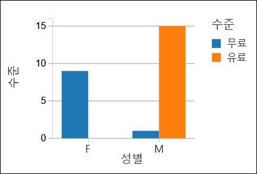

# <a name="quickstart-run-a-spark-job-on-azure-databricks-using-the-azure-portal"></a>빠른 시작: Azure Portal을 사용하여 Azure Databricks에서 Spark 작업 실행

빠른 시작은 Azure Databricks 작업 영역과 해당 작업 영역 내에 Apache Spark 클러스터를 만드는 방법을 보여줍니다. 마지막으로, Databricks 클러스터에서 Spark 작업을 실행하는 방법을 알아봅니다. Azure Databricks에 대한 자세한 내용은 [Azure Databricks란?](what-is-azure-databricks.md)을 참조하세요.

이 빠른 시작에서는 Spark 작업의 일부로 라디오 채널 구독 데이터를 분석하여 인구 통계를 기반으로 무료/유료 사용에 대한 정보를 얻습니다. 

Azure 구독이 아직 없는 경우 시작하기 전에 [체험](https://azure.microsoft.com/free/) 계정을 만듭니다.

## <a name="log-in-to-the-azure-portal"></a>Azure Portal에 로그인

[Azure Portal](https://portal.azure.com)에 로그인합니다.

## <a name="create-an-azure-databricks-workspace"></a>Azure Databricks 작업 영역 만들기

이 섹션에서는 Azure Portal을 사용하여 Azure Databricks 작업 영역을 만듭니다. 

1. Azure Portal에서 **리소스 만들기** > **데이터 + 분석** > **Azure Databricks**를 차례로 선택합니다. 

    

2. **Azure Databricks 서비스** 아래에서 Databricks 작업 영역을 만들기 위한 값을 제공합니다.

    

    다음 값을 제공합니다. 
     
    |자산  |설명  |
    |---------|---------|
    |**작업 영역 이름**     | Databricks 작업 영역의 이름을 제공합니다.        |
    |**구독**     | 드롭다운에서 Azure 구독을 선택합니다.        |
    |**리소스 그룹**     | 새 리소스 그룹을 만들지, 아니면 기존 그룹을 사용할지 여부를 지정합니다. 리소스 그룹은 Azure 솔루션에 관련된 리소스를 보유하는 컨테이너입니다. 자세한 내용은 [Azure Resource Manager 개요](../azure-resource-manager/resource-group-overview.md)를 참조하세요. |
    |**위치**:     | **미국 동부 2**를 선택합니다. 사용 가능한 다른 영역은 [지역별 사용 가능한 Azure 서비스](https://azure.microsoft.com/regions/services/)를 참조하세요.        |
    |**가격 책정 계층**     |  **표준** 또는 **프리미엄** 중에서 선택합니다. 이러한 계층에 대한 자세한 내용은 [Databricks 가격 페이지](https://azure.microsoft.com/pricing/details/databricks/)를 참조하세요.       |

    **대시보드에 고정**을 선택한 다음, **만들기**를 클릭합니다.

4. 작업 영역 생성에는 몇 분 정도가 소요됩니다. 작업 영역을 만드는 동안 포털의 오른쪽에 **Azure Databricks에 대한 배포 제출** 타일이 표시됩니다. 타일을 보려면 대시보드에서 오른쪽으로 스크롤해야 할 수도 있습니다. 화면 위쪽에 진행률 표시줄이 표시되기도 합니다. 두 영역에서 진행 상태를 볼 수 있습니다.

    

## <a name="create-a-spark-cluster-in-databricks"></a>Databricks에서 Spark 클러스터 만들기

> [!NOTE] 
> 무료 계정을 사용하여 Azure Databricks 클러스터를 만들려면 클러스터를 만들기 전에 프로필로 이동하고 구독을 **종량제**로 변경합니다. 자세한 내용은 [Azure 체험 계정](https://azure.microsoft.com/free/)을 참조하세요.  

1. Azure Portal에서 사용자가 만든 Databricks 작업 영역으로 이동한 다음, **작업 영역 시작**을 클릭합니다.

2. Azure Databricks 포털로 리디렉션됩니다. 포털에서 **클러스터**를 클릭합니다.

    

3. **새 클러스터** 페이지에서 값을 제공하여 클러스터를 만듭니다.

    

    다음 항목 이외의 다른 모든 기본값을 허용합니다.

    * 클러스터의 이름을 입력합니다.
    * 이 문서에서는 **4.0** 런타임을 사용하여 클러스터를 만듭니다. 
    * **비활성 \_\_분 후 종료** 확인란을 선택했는지 확인합니다. 클러스터를 사용하지 않는 경우 클러스터를 종료하는 기간(분)을 제공합니다.
    
    **클러스터 만들기**를 선택합니다. 클러스터가 실행되면 노트북을 클러스터에 첨부하고 Spark 작업을 실행할 수 있습니다. 

클러스터를 만드는 방법에 대한 자세한 내용은 [Azure Databricks에서 Spark 클러스터 만들기](https://docs.azuredatabricks.net/user-guide/clusters/create.html)를 참조하세요.


## <a name="download-a-sample-data-file"></a>샘플 데이터 파일 다운로드
샘플 JSON 데이터 파일을 다운로드하고 Azure Blob 저장소에 저장합니다.

1. 이 샘플 JSON 데이터 파일을 [Github에서](https://raw.githubusercontent.com/Azure/usql/master/Examples/Samples/Data/json/radiowebsite/small_radio_json.json) 로컬 컴퓨터로 다운로드합니다. 마우스 오른쪽 단추로 클릭하고 원시 파일을 로컬로 저장하도록 다른 이름으로 저장합니다. 

2. 저장소 계정이 아직 없는 경우 만듭니다. 
   - Azure Portal에서 **리소스 만들기**를 선택합니다.  **저장소** 범주를 선택하고, **저장소 계정**을 선택합니다.  
   - 저장소 계정에 고유한 이름을 제공합니다.
   - **계정 종류** 선택: **Blob Storage**
   - **리소스 그룹** 이름을 선택합니다. Databricks 작업 영역을 만든 것과 동일한 리소스 그룹을 사용합니다.
   
   자세한 내용은 [Azure Blob 저장소 계정 만들기](../storage/common/storage-quickstart-create-account.md)를 참조하세요. 

3. Blob Storage 계정에 저장소 컨테이너를 만들고 컨테이너에 샘플 json 파일을 업로드합니다. Azure Portal 또는 [Microsoft Azure Storage 탐색기](../vs-azure-tools-storage-manage-with-storage-explorer.md)를 사용하여 파일을 업로드할 수 있습니다.

   - Azure Portal에서 저장소 계정을 엽니다.
   - **Blob**을 선택합니다.
   - **+ 컨테이너**를 선택하여 새 빈 컨테이너를 만듭니다.
   - 컨테이너에 **이름**을 제공합니다(예: `databricks`). 
   - **개인(익명이 아닌 액세스)** 액세스 수준을 선택합니다.
   - 컨테이너가 만들어지면 컨테이너 이름을 선택합니다.
   - **업데이트** 단추를 선택합니다.
   - **파일** 페이지에서 **폴더 아이콘**을 선택하여 업로드를 위해 `small_radio_json.json` 샘플 파일을 찾고 선택합니다. 
   - **업로드**를 선택하여 파일을 업로드합니다.
   
   
## <a name="run-a-spark-sql-job"></a>Spark SQL 작업 실행
다음 작업을 수행하여 Databricks에서 노트북을 만들고, Azure Blob 저장소 계정에서 데이터를 읽는 노트북을 구성한 다음, 이 데이터에 대해 Spark SQL 작업을 실행합니다.

1. 왼쪽 창에서 **작업 영역**을 클릭합니다. **작업 영역** 드롭 다운에서 **만들기**를 클릭한 다음, **Notebook**을 클릭합니다.

    

2. **Notebook 만들기** 대화 상자에서 이름을 입력하고, 언어로 **Scala**를 선택한 다음, 이전에 만든 Spark 클러스터를 선택합니다.

    

    **만들기**를 클릭합니다.

3. 이 단계에서 Azure Storage 계정을 Databricks Spark 클러스터와 연결합니다. 이 연결을 수행하는 데는 두 가지 방법이 있습니다. Azure Storage 계정을 DBFS(Databricks 파일 시스템)에 탑재하거나 만든 응용 프로그램에서 Azure Storage 계정에 직접 액세스할 수 있습니다.  

    > [!IMPORTANT]
    >이 문서에서는 **DBFS를 사용하여 저장소를 탑재**하는 방법을 사용합니다. 이 방법을 사용하면 탑재된 저장소가 클러스터 파일 시스템 자체와 연결됩니다. 따라서 클러스터에 액세스하는 모든 응용 프로그램에서도 연결된 저장소를 사용할 수 있습니다. 직접 액세스 방식은 액세스를 구성한 응용 프로그램으로 제한됩니다.
    >
    > 탑재 방법을 사용하려면 이 문서에서 선택한 Databricks 런타임 버전 **4.0**을 사용하여 Spark 클러스터를 만들어야 합니다.

    다음 코드 조각에서 `{YOUR CONTAINER NAME}`, `{YOUR STORAGE ACCOUNT NAME}` 및 `{YOUR STORAGE ACCOUNT ACCESS KEY}`를 Azure Storage 계정에 적절한 값으로 바꿉니다. 노트북의 빈 셀에 코드 조각을 붙여넣은 다음 SHIFT + ENTER를 눌러 코드 셀을 실행합니다.

    * **DBFS를 사용하여 저장소 계정 탑재(권장)** 다음 코드 조각에서 Azure Storage 계정 경로는 `/mnt/mypath`에 탑재됩니다. 따라서 Azure Storage 계정에 액세스하는 향후의 모든 발생에서 전체 경로를 제공할 필요가 없습니다. `/mnt/mypath`만 사용하면 됩니다.

          dbutils.fs.mount(
            source = "wasbs://{YOUR CONTAINER NAME}@{YOUR STORAGE ACCOUNT NAME}.blob.core.windows.net/",
            mountPoint = "/mnt/mypath",
            extraConfigs = Map("fs.azure.account.key.{YOUR STORAGE ACCOUNT NAME}.blob.core.windows.net" -> "{YOUR STORAGE ACCOUNT ACCESS KEY}"))

    * **저장소 계정에 직접 액세스**

          spark.conf.set("fs.azure.account.key.{YOUR STORAGE ACCOUNT NAME}.blob.core.windows.net", "{YOUR STORAGE ACCOUNT ACCESS KEY}")

    저장소 계정 키를 검색하는 방법에 대한 지침은 [저장소 액세스 키 관리](../storage/common/storage-account-manage.md#access-keys)를 참조하세요.

    > [!NOTE]
    > 또한 Azure Databricks에서 Azure Data Lake Store를 Spark 클러스터와 함께 사용할 수 있습니다. 자세한 내용은 [Azure Databricks에서 Data Lake Store 사용](https://go.microsoft.com/fwlink/?linkid=864084)을 참조하세요.

4. SQL 문을 실행하여 샘플 JSON 데이터 파일인 **small_radio_json.json**의 데이터를 사용하여 임시 테이블을 만듭니다. 다음 코드 조각에서 자리 표시자 값을 컨테이너 이름 및 저장소 계정 이름으로 대체합니다. 노트북의 코드 셀에 코드 조각을 붙여넣은 다음 SHIFT + ENTER를 누릅니다. 코드 조각에서 `path`는 Azure 저장소 계정에 업로드한 샘플 JSON 파일의 위치를 나타냅니다.

    ```sql
    %sql 
    DROP TABLE IF EXISTS radio_sample_data;
    CREATE TABLE radio_sample_data
    USING json
    OPTIONS (
     path "/mnt/mypath/small_radio_json.json"
    )
    ```

    명령이 성공적으로 완료되면 JSON 파일의 모든 데이터가 Databricks 클러스터에 테이블로 저장됩니다.

    `%sql` 언어 magic 명령을 사용하면 노트북이 다른 유형인 경우에도 노트북에서 SQL 코드를 실행할 수 있습니다. 자세한 내용은 [노트북에서 언어 혼합](https://docs.azuredatabricks.net/user-guide/notebooks/index.html#mixing-languages-in-a-notebook)을 참조하세요.

5. 사용자가 실행하는 쿼리를 더 잘 이해할 수 있도록 샘플 JSON 데이터의 스냅숏을 살펴보겠습니다. 코드 셀에 다음 코드 조각을 붙여넣은 다음 **SHIFT + ENTER**를 누릅니다.

    ```sql
    %sql 
    SELECT * from radio_sample_data
    ```

6. 다음 스크린샷과 같이 테이블 형식으로 출력됩니다(일부 열만 표시됨).

    

    기타 세부 사항 중 샘플 데이터는 라디오 채널(열 이름, **성별**)의 청중의 성별과 구독이 무료 또는 유료(열 이름, **수준**)인지 여부를 캡처합니다.

7. 이제 이 데이터를 시각적으로 표현하여 각 성별, 무료 계정을 가진 사용자 수 및 유료 구독자 수를 보여줍니다. 테이블 형식 출력 하단에서 **가로 막대형 차트** 아이콘을 클릭한 다음 **플롯 옵션**을 클릭합니다.

    

8. **사용자 지정 플롯**에서 스크린샷에 표시된 것과 같이 값을 끌어서 놓습니다.

    

    * **키**를 **성별**로 설정합니다.
    * **시계열 그룹화**를 **수준**으로 설정합니다.
    * **값**을 **수준**으로 설정합니다.
    * **집계**를 **COUNT**로 설정합니다.

    **적용**을 클릭합니다.

9. 출력은 다음 스크린샷에 표시된 것처럼 시각적인 표시를 보여줍니다.

     

## <a name="clean-up-resources"></a>리소스 정리

이 문서가 완료되면 클러스터를 종료할 수 있습니다. 이렇게 하려면 왼쪽 창의 Azure Databricks 작업 영역에서 **클러스터**를 선택합니다. 종료하려는 클러스터에서 **작업** 열 아래의 줄임표 위로 커서를 이동한 다음, **종료** 아이콘을 선택합니다.


클러스터를 수동으로 종료하지 않은 경우 클러스터를 만드는 중에 **Terminate after __ minutes of inactivity**(비활성 __분 후 종료) 확인란을 선택하면 자동으로 중지됩니다. 이 경우 지정한 시간 동안 클러스터가 비활성 상태이면 클러스터가 자동으로 중지됩니다.

## <a name="next-steps"></a>다음 단계

이 문서에서는 Azure Databricks에서 Spark 클러스터를 만들고 Azure 저장소의 데이터를 사용하여 Spark 작업을 실행했습니다. 또한 [Spark 데이터 소스](https://docs.azuredatabricks.net/spark/latest/data-sources/index.html)를 보고 다른 데이터 소스의 데이터를 Azure Databricks로 가져오는 방법을 배울 수 있습니다. Azure Databricks를 사용하여 ETL 작업(데이터 추출, 변환 및 로드)을 수행하는 방법을 알아보려면 다음 문서로 이동합니다.

> [!div class="nextstepaction"]
>[Azure Databricks를 사용하여 데이터 추출, 변환 및 로드](databricks-extract-load-sql-data-warehouse.md)
