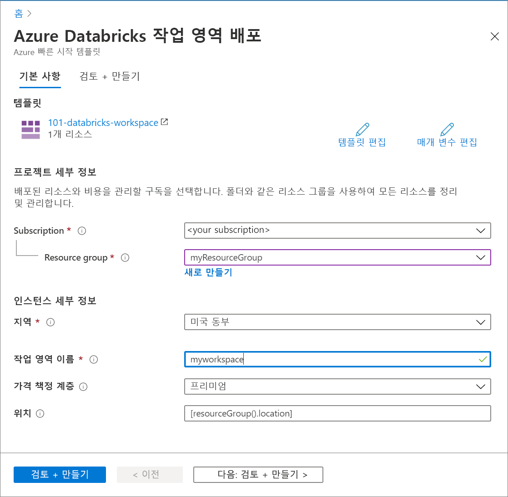

# <a name="quickstart-create-an-azure-databricks-workspace-by-using-the-azure-resource-manager-template"></a>빠른 시작: Azure Resource Manager 템플릿을 사용하여 Azure Databricks 작업 영역 만들기

이 빠른 시작에서는 Azure Resource Manager 템플릿을 사용하여 Azure Databricks 작업 영역을 만듭니다. 작업 영역을 만든 후에는 배포의 유효성을 검사합니다.

[!INCLUDE [About Azure Resource Manager](../../includes/resource-manager-quickstart-introduction.md)]

## <a name="prerequisites"></a>필수 구성 요소

이 문서를 완료하려면 다음이 필요합니다.

* Azure 구독 - [체험 구독 만들기](https://azure.microsoft.com/free/)

## <a name="create-an-azure-databricks-workspace"></a>Azure Databricks 작업 영역 만들기

### <a name="review-the-template"></a>템플릿 검토

이 빠른 시작에서 사용되는 템플릿은 [Azure 빠른 시작 템플릿](https://azure.microsoft.com/resources/templates/101-databricks-workspace/)에서 나온 것입니다.

:::code language="json" source="~/quickstart-templates/101-databricks-workspace/azuredeploy.json" range="1-53" highlight="33-46":::

템플릿에 정의된 Azure 리소스는 [Microsoft.Databricks/workspaces](/azure/templates/microsoft.databricks/workspaces): Azure Databricks 작업 영역 만들기입니다.

### <a name="deploy-the-template"></a>템플릿 배포

이 섹션에서는 Azure Resource Manager 템플릿을 사용하여 Azure Databricks 작업 영역을 만듭니다.

1. 다음 이미지를 선택하고 Azure에 로그인하여 템플릿을 엽니다. 템플릿이 Azure Databricks 작업 영역을 만듭니다.

   [](https://portal.azure.com/#create/Microsoft.Template/uri/https%3A%2F%2Fraw.githubusercontent.com%2FAzure%2Fazure-quickstart-templates%2Fmaster%2F101-databricks-workspace%2Fazuredeploy.json)

2. Azure Databricks 작업 영역을 만드는 데 필요한 값 입력

   

   다음 값을 제공합니다.

   |속성  |Description  |
   |---------|---------|
   |**구독**     | 드롭다운에서 Azure 구독을 선택합니다.        |
   |**리소스 그룹**     | 새 리소스 그룹을 만들지, 아니면 기존 그룹을 사용할지 여부를 지정합니다. 리소스 그룹은 Azure 솔루션에 관련된 리소스를 보유하는 컨테이너입니다. 자세한 내용은 [Azure Resource Manager 개요](../azure-resource-manager/management/overview.md)를 참조하세요. |
   |**위치**     | **미국 동부 2**를 선택합니다. 사용 가능한 다른 영역은 [지역별 사용 가능한 Azure 서비스](https://azure.microsoft.com/regions/services/)를 참조하세요.        |
   |**작업 영역 이름**     | Databricks 작업 영역의 이름을 제공합니다.        |
   |**가격 책정 계층**     |  **표준** 또는 **프리미엄** 중에서 선택합니다. 이러한 계층에 대한 자세한 내용은 [Databricks 가격 페이지](https://azure.microsoft.com/pricing/details/databricks/)를 참조하세요.       |

3. **검토 + 만들기**를 선택한 다음, **만들기**를 선택합니다.

4. 작업 영역 생성에는 몇 분 정도가 소요됩니다. 작업 영역 배포가 실패해도 작업 영역은 여전히 실패한 상태로 생성됩니다. 실패한 작업 영역을 삭제하고 배포 오류를 해결하는 새 작업 영역을 만듭니다. 실패한 작업 영역을 삭제하면 관리되는 리소스 그룹과 성공적으로 배포된 리소스도 모두 삭제됩니다.

## <a name="review-deployed-resources"></a>배포된 리소스 검토

Azure Portal을 사용하여 Azure Databricks 작업 영역을 확인하거나 다음 Azure CLI 또는 Azure PowerShell 스크립트를 사용하여 리소스를 나열합니다.

### <a name="azure-cli"></a>Azure CLI

```azurecli-interactive
echo "Enter your Azure Databricks workspace name:" &&
read databricksWorkspaceName &&
echo "Enter the resource group where the Azure Databricks workspace exists:" &&
read resourcegroupName &&
az databricks workspace show -g $resourcegroupName -n $databricksWorkspaceName
```

### <a name="azure-powershell"></a>Azure PowerShell

```azurepowershell-interactive
$resourceGroupName = Read-Host -Prompt "Enter the resource group name where your Azure Databricks workspace exists"
(Get-AzResource -ResourceType "Microsoft.Databricks/workspaces" -ResourceGroupName $resourceGroupName).Name
 Write-Host "Press [ENTER] to continue..."
```

## <a name="clean-up-resources"></a>리소스 정리

후속 자습서를 계속 진행하려는 경우 이러한 리소스를 그대로 유지하는 것이 좋습니다. 더 이상 필요하지 않은 경우 리소스 그룹을 삭제합니다. 그러면 해당 Azure Databricks 작업 영역 및 관련 리소스가 삭제됩니다. Azure CLI 또는 Azure PowerShell을 사용하여 리소스 그룹을 삭제하려면 다음을 수행합니다.

### <a name="azure-cli"></a>Azure CLI

```azurecli-interactive
echo "Enter the Resource Group name:" &&
read resourceGroupName &&
az group delete --name $resourceGroupName &&
echo "Press [ENTER] to continue ..."
```

### <a name="azure-powershell"></a>Azure PowerShell

```azurepowershell-interactive
$resourceGroupName = Read-Host -Prompt "Enter the Resource Group name"
Remove-AzResourceGroup -Name $resourceGroupName
Write-Host "Press [ENTER] to continue..."
```

## <a name="next-steps"></a>다음 단계

이 빠른 시작에서는 Azure Resource Manager 템플릿을 사용하여 Azure Databricks 작업 영역을 만들고 배포의 유효성을 검사했습니다. Azure Databricks를 사용하여 ETL 작업(데이터 추출, 변환 및 로드)을 수행하는 방법을 알아보려면 다음 문서로 이동합니다.

> [!div class="nextstepaction"]
> [Azure Databricks를 사용하여 데이터 추출, 변환 및 로드](databricks-extract-load-sql-data-warehouse.md)
