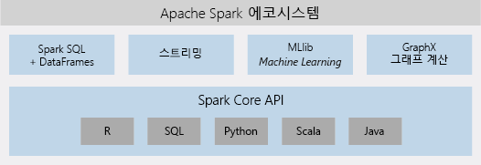

# Azure Databricks란?

Azure Databricks는 Microsoft Azure Cloud Services 플랫폼에 대해 최적화된 Apache Spark 기반 분석 플랫폼입니다. Apache Spark의 기반으로 설계된 Databricks는 Azure와 통합되어 원클릭 설정, 간소화된 워크플로 및 데이터 과학자, 데이터 엔지니어, 비즈니스 분석가가 공동 작업할 수 있도록 하는 대화형 작업 영역을 제공합니다.

![Azure Databricks란? ] (./media/what-is-azure-databricks/azure-databricks-overview.png "Azure Databricks란?")

## Apache Spark 기반 분석 플랫폼

Azure Databricks는 완전한 오픈 소스 Apache Spark 클러스터 기술 및 기능으로 구성됩니다. Azure Databricks의 Spark는 다음 구성 요소가 포함되어 있습니다.

* **Spark SQL 및 DataFrames**: Spark SQL는 구조화된 데이터로 작업하기 위한 Spark 모듈입니다. DataFrame은 명명된 열로 구성된 데이터의 분산된 컬렉션입니다. 관계형 데이터베이스의 테이블이나 R/Python의 데이터 프레임과 개념적으로 동일합니다.

* **스트리밍**: 분석 및 대화형 응용 프로그램을 위한 실시간 데이터 처리 및 분석입니다. HDFS, Flume 및 Kafka와 통합합니다.

* **MLib**: 분류, 재발, 클러스터링, 공동 작업 필터링, 차원 감소, 기본 최적화 기본 요소 등 일반적인 학습 알고리즘 및 유틸리티로 구성된 Machine Learning 라이브러리입니다.

* **GraphX**: 인지 분석에서 데이터 탐색에 이르는 광범위한 사용 사례에 대한 그래프 및 그래프 계산입니다.

* **Spark 핵심 API**: R, SQL, Python, Scala 및 Java에 대한 지원을 포함합니다.

## Azure Databricks의 Apache Spark

Azure Databricks는 다음을 포함하는 무 관리 클라우드 플랫폼을 제공함으로써 Spark의 기능을 기반으로 합니다.

- 완전히 관리되는 Spark 클러스터
- 탐색 및 시각화를 위한 대화형 작업 영역
- 즐겨 찾는 Spark 기반 응용 프로그램을 구동할 수 있는 플랫폼

### 클라우드에서 완전히 관리되는 Apache Spark 클러스터

Azure Databricks는 Spark 전문가가 관리하고 지원하는 클라우드에서 안전하고 안정적인 프로덕션 환경을 갖추고 있습니다. 다음을 수행할 수 있습니다.

* 몇 초 만에 클러스터를 만듭니다.
* 서버가 없는 클러스터를 포함하여 클러스터를 위아래로 동적으로 자동 크기 조정하고 팀간에 공유합니다. 
* REST API를 사용하여 프로그래밍 방식으로 클러스터를 사용합니다. 
* Spark 위에 구축된 보안 데이터 통합 기능을 사용하면 중앙 집중화 하지 않고도 데이터를 통합할 수 있습니다. 
* 각 릴리스와 함께 최신 Apache Spark 기능에 즉시 액세스합니다.

### Databricks 런타임
Databricks 런타임은 Apache Spark를 기반으로 구축되었으며 기본적으로 Azure 클라우드용으로 구축되었습니다. 

**서버 없음** 옵션을 사용하면 Azure Databricks가 인프라 복잡성과 데이터 인프라를 설정하고 구성하기 위해 전문 기술의 필요성을 완전히 추상화합니다. 서버 없음 옵션을 통해 데이터 과학자들은 팀으로 빠르게 반복할 수 있습니다.

프로덕션 작업의 성능에 신경을 쓰는 데이터 엔지니어를 위해 Azure Databricks는 I/O 레이어 및 프로세스 레이어(Databricks I/O)에서 다양한 최적화를 통해 빠르고 성능이 우수한 Spark 엔진을 제공합니다.

### 공동 작업을 위한 작업 영역

Azure Databricks는 공동 작업 및 통합 환경을 통해 Spark에서 데이터 탐색, 프로토타입 생성 및 데이터 기반 응용 프로그램 실행 프로세스를 간소화합니다.

* 손쉬운 데이터 탐색으로 데이터를 사용하는 방법을 결정합니다.
* R, Python, Scala 또는 SQL로 진행 상황을 노트북에 문서화합니다.
* 몇 번의 클릭만으로 데이터를 시각화하고 Matplotlib, ggplot 또는 d3과 같은 친숙한 도구를 사용합니다.
* 대화형 대시보드를 사용하여 동적 보고서를 만듭니다.
* Spark를 사용하여 동시에 데이터와 상호 작용합니다.

## 엔터프라이즈 보안

Azure Databricks는 Azure Active Directory 통합, 역할 기반 제어 및 데이터 및 비즈니스를 보호하는 SLA를 비롯하여 엔터프라이즈급 Azure 보안을 제공합니다.

* Azure Active Directory와 통합하면 Azure Databricks를 사용하여 완전한 Azure 기반 솔루션을 실행할 수 있습니다.
* Azure Databricks 역할 기반 액세스는 노트북, 클러스터, 작업 및 데이터에 대한 세밀한 사용자 권한을 가능하게 합니다.
* 엔터프라이즈급 SLA. 

## Azure 서비스와의 통합

Azure Databricks는 Azure 데이터베이스 및 저장소(SQL Data Warehouse, Cosmos DB, Data Lake Store 및 Blob Storage)와 밀접하게 통합됩니다. 

## Power BI와 통합
Power BI와의 풍부한 통합을 통해 Azure Databricks는 유용한 정보를 빠르고 쉽게 찾아 공유할 수 있습니다. JDBC/ODBC 클러스터 끝점을 통해 Tableau 소프트웨어와 같은 다른 BI 도구도 사용할 수 있습니다.

## 다음 단계

* [빠른 시작: Azure Databricks에서 Spark 작업 실행](quickstart-create-databricks-workspace-portal.md)
* [Spark 클러스터 작업](https://docs.azuredatabricks.net/user-guide/clusters/index.html)
* [Notebooks 작업](https://docs.azuredatabricks.net/user-guide/notebooks/index.html)
* [Spark 작업 만들기](https://docs.azuredatabricks.net/user-guide/jobs.html)

 

