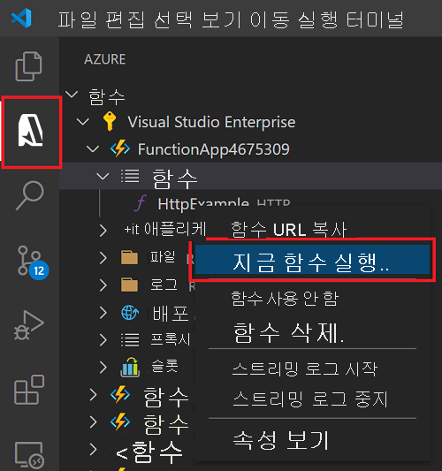

# 빠른 시작: Visual Studio Code를 사용하여 Azure에서 JavaScript 함수 만들기

> [!div class="op_single_selector" title1="함수 언어를 선택합니다. "]
> - [JavaScript](create-first-function-vs-code-node.md)
> - [C#](create-first-function-vs-code-csharp.md)
> - [Java](create-first-function-vs-code-java.md)
> - [PowerShell](create-first-function-vs-code-powershell.md)
> - [Python](create-first-function-vs-code-python.md)
> - [TypeScript](create-first-function-vs-code-typescript.md)
> - [기타(Go/Rust)](create-first-function-vs-code-other.md)

Visual Studio Code를 사용하여 HTTP 요청에 응답하는 JavaScript 함수를 만듭니다. 코드를 로컬로 테스트한 다음, 서버리스 Azure Functions 환경에 배포합니다.

이 빠른 시작을 완료하면 Azure 계정에 미화 몇 센트 이하로 소액의 비용이 부과됩니다. <abbr title="Azure 계정은 Azure 서비스 및 Azure 구독에 대한 액세스를 제공하는 글로벌 고유 엔터티입니다.">Azure 계정</abbr>.

## 1. 환경 준비

시작하기 전에 다음 요구 사항을 갖추었는지 확인합니다.

+ 활성 구독이 있는 <abbr title="Azure 구독은 Azure에서 리소스를 프로비저닝하는 데 사용되는 논리적 컨테이너입니다. VM(가상 머신), 데이터베이스 등 모든 리소스에 대한 세부 정보를 보관합니다.">Azure 계정</abbr>. [체험 계정을 만듭니다](https://azure.microsoft.com/free/?ref=microsoft.com&utm_source=microsoft.com&utm_medium=docs&utm_campaign=visualstudio).

+ [Node.js 10.14.1 이상](https://nodejs.org/)

+ [Visual Studio Code](https://code.visualstudio.com/)

+ Visual Studio Code용 [Azure Functions 확장](https://marketplace.visualstudio.com/items?itemName=ms-azuretools.vscode-azurefunctions)

+ [Azure Functions Core 도구](functions-run-local.md?tabs=linux%2Ccsharp%2Cbash#install-the-azure-functions-core-tools)

 

## 2. 로컬 Functions 프로젝트 만들기

1. 작업 표시줄에서 Azure 아이콘을 <abbr title="">선택한 다음</abbr>그런 다음, **Azure: Functions** 영역에서 **새 프로젝트 만들기...** 아이콘을 선택합니다.

    

1. 프로젝트 작업 영역의 **디렉터리 위치를 선택** 한 다음, **선택** 을 누릅니다. 

1. 프롬프트에서 다음 정보를 제공합니다.

    + **함수 프로젝트에 대한 언어 선택**: `JavaScript`을 선택합니다.

    + **프로젝트의 첫 번째 함수에 대한 템플릿 선택**: `HTTP trigger`을 선택합니다.

    + **함수 이름 입력**: `HttpExample`.

    + **권한 부여 수준**: 누구나 함수 엔드포인트를 호출할 수 있도록 하는 `Anonymous`를 선택합니다.

    + **프로젝트를 여는 방법 선택**: `Add to workspace`을 선택합니다.

 

<strong>함수 프로젝트를 만들 수 없나요?</strong>

로컬 Functions 프로젝트를 만들 때 해결해야 하는 가장 일반적인 문제는 다음과 같습니다.
* Azure Functions 확장이 설치되어 있지 않습니다. 

 

## 3. 로컬에서 함수 실행

1. <kbd>F5</kbd> 키를 눌러 함수 앱 프로젝트를 시작합니다. 

1. **터미널** 에서, 로컬로 실행 중인 함수의 URL 엔드포인트를 봅니다.

    

1. 다음 URL을 복사하여 웹 브라우저에 붙여넣은 다음, Enter 키를 누릅니다.

    `http://localhost:7071/api/HttpExample?name=Functions`

1. 반환된 응답을 봅니다.

    

1. **터미널** 패널에서 요청에 대한 정보를 봅니다.

    

1. <kbd>Ctrl + C</kbd>를 눌러 Core Tools를 중지하고 디버거 연결을 끊습니다.

 

<strong>함수를 로컬에서 실행할 수 없나요?</strong>

로컬 Functions 프로젝트를 실행할 때 해결해야 하는 가장 일반적인 문제는 다음과 같습니다.
* 핵심 도구가 설치되어 있지 않습니다. 
*  Windows에서 실행하는 데 문제가 있는 경우 Visual Studio Code의 기본 터미널 셸이 WSL Bash로 설정되어 있지 않은지 확인합니다. 

 

## 4. Azure에 로그인

앱을 게시하려면 Azure에 로그인합니다. 이미 로그인한 경우 다음 섹션으로 이동합니다.

1. 작업 막대에서 Azure 아이콘을 선택한 다음, **Azure: Functions** 영역에서 **Azure에 로그인...** 을 선택합니다.

    

1. 브라우저에 메시지가 표시되면 **Azure 계정을 선택** 하고 Azure 계정 자격 증명을 사용하여 **로그인** 합니다.

1. 성공적으로 로그인한 후에는 새 브라우저 창을 닫고 Visual Studio Code로 돌아갑니다. 

 

## 5. Azure에 프로젝트 게시

첫 번째 코드 배포에는 Azure 구독에서 함수 리소스 만들기가 포함됩니다. 

1. 작업 막대에서 Azure 아이콘을 선택한 다음, **Azure: Functions** 영역에서 **함수 앱에 배포...** 단추를 선택합니다.

    

1. 프롬프트에서 다음 정보를 제공합니다.

    + **폴더 선택**: 함수 앱이 들어 있는 폴더를 선택합니다. 

    + **구독 선택**: 사용할 구독을 선택합니다. 구독이 한 개만 있으면 이 메시지가 표시되지 않습니다.

    + **Azure에서 함수 앱 선택**: `+ Create new Function App`을 선택합니다.

    + **함수 앱의 전역적으로 고유한 이름 입력**: URL 경로에 Azure 전체에서 고유한 이름을 입력합니다. 여기서 입력하는 이름이 전역적으로 고유한지 확인하기 위해 이 이름의 유효성이 검사됩니다.

    + **런타임 선택**: 로컬에서 실행 중인 Node.js 버전을 선택합니다. `node --version` 명령을 사용하여 버전을 확인할 수 있습니다.

    + **새 리소스의 위치 선택**:  성능을 향상시키려면 근처에 있는 [지역](https://azure.microsoft.com/regions/)을 선택합니다. 

1. 함수 앱을 만들고 배포 패키지가 적용되면 알림이 표시됩니다. **출력 보기** 를 선택하여 만들기 및 배포 결과를 확인합니다. 
    
    

 

<strong>함수를 게시할 수 없나요?</strong>

이 섹션에서는 Azure 리소스를 만들고 함수 앱에 로컬 코드를 배포했습니다. 이 작업에 실패한 경우:

* 출력에서 오류 정보를 검토합니다. 오른쪽 아래 모서리에 있는 종 모양 아이콘은 출력을 볼 수 있는 또 다른 방법입니다. 
* 기존 함수 앱에 게시했나요? 이렇게 하면 Azure에서 해당 앱의 콘텐츠를 덮어씁니다.

 

<strong>어떤 리소스를 만들었나요?</strong>

완료되면 함수 앱 이름을 기반으로 하는 이름을 사용하여 구독에 다음 Azure 리소스가 생성됩니다. 
* **리소스 그룹**: 리소스 그룹은 동일한 지역에 있는 관련 리소스에 대한 논리적 컨테이너입니다.
* **Azure Storage 계정**: Storage 리소스는 프로젝트에 대한 상태 및 기타 정보를 유지합니다.
* **사용 계획**: 사용 계획은 서버리스 함수 앱의 기본 호스트를 정의합니다.
* **함수 앱**: 함수 앱은 함수 코드 및 그룹 함수를 논리적 단위로 실행하기 위한 환경을 제공합니다.
* **Application Insights**: Application Insights는 서버리스 함수 사용 현황을 추적합니다.

 

## 6. Azure에서 함수 실행
1. **Azure: Functions** 사이드바에서 새 함수 앱을 확장합니다. 
1. **Functions** 를 확장하고 **HttpExample** 을 마우스 오른쪽 단추로 클릭한 다음, **지금 함수 실행...** 을 선택합니다.

    

1. **Enter를 눌러** 기본 요청 메시지를 함수로 보냅니다. 

1. 함수 실행이 완료되면 Visual Studio Code에서 알림이 발생합니다.

 

<strong>클라우드 기반 함수 앱을 실행할 수 없나요?</strong>

* URL 끝에 querystring을 추가했나요?

 

## 7. 리소스 정리

추가 비용이 발생하지 않도록 함수 앱과 해당 리소스를 삭제하세요.

1. Visual Studio Code의 작업 표시줄에서 Azure 아이콘을 선택한 다음, 사이드바에서 Functions 영역을 선택합니다. 
1. 함수 앱을 선택하고 마우스 오른쪽 단추로 클릭한 다음, **함수 앱 삭제...** 를 선택합니다.

 

## 다음 단계

출력 바인딩을 추가하여 함수를 <abbr title="함수에 바인딩하는 것은 또 다른 리소스를 함수에 선언적으로 연결하는 방법입니다.">확장합니다</abbr>. 이 바인딩은 HTTP 요청의 문자열을 Azure Queue Storage 큐의 메시지에 씁니다. 

> [!div class="nextstepaction"]
> [Azure Storage 큐에 연결](functions-add-output-binding-storage-queue-vs-code.md?pivots=programming-language-javascript)

[Azure Functions Core Tools]: functions-run-local.md
[Azure Functions extension for Visual Studio Code]: https://marketplace.visualstudio.com/items?itemName=ms-azuretools.vscode-azurefunctions
