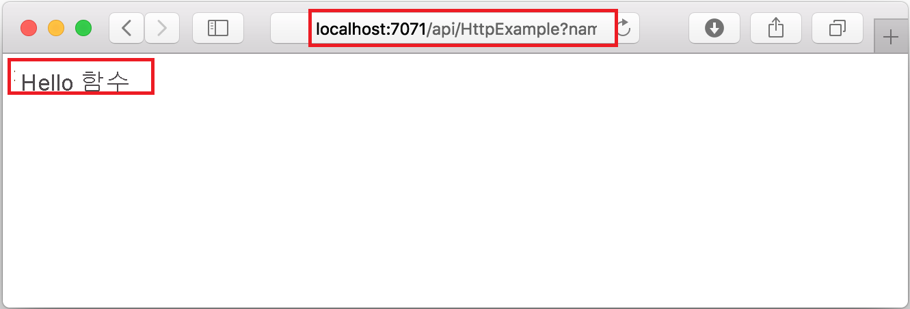
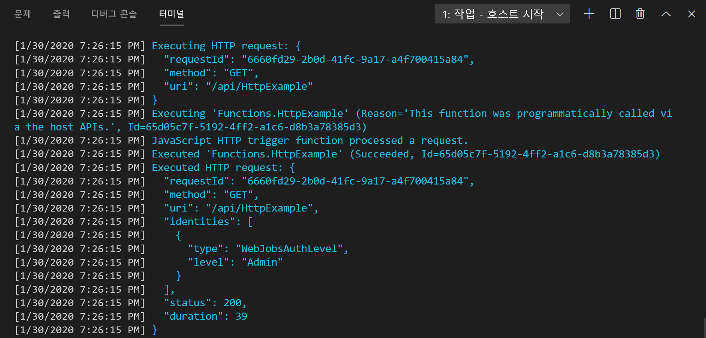
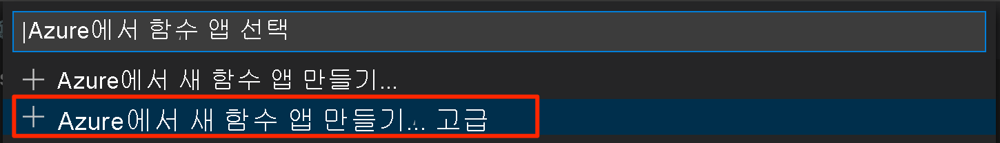

# <a name="quickstart-create-a-go-or-rust-function-in-azure-using-visual-studio-code"></a>빠른 시작: Visual Studio Code를 사용하여 Azure에서 Go 또는 Rust 함수 만들기

[!INCLUDE [functions-language-selector-quickstart-vs-code](../../includes/functions-language-selector-quickstart-vs-code.md)]

이 문서에서는 Visual Studio Code를 사용하여 HTTP 요청에 응답하는 [사용자 지정 처리기](functions-custom-handlers.md) 함수를 만듭니다. 코드를 로컬로 테스트한 후 서버리스 Azure Functions 환경에 배포합니다.

사용자 지정 처리기는 HTTP 서버 프로세스를 실행하여 언어 또는 런타임에서 함수를 만드는 데 사용할 수 있습니다. 이 문서에서는 [Go](create-first-function-vs-code-other.md?tabs=go) 및 [Rust](create-first-function-vs-code-other.md?tabs=rust)를 모두 지원합니다.

이 빠른 시작을 완료하면 Azure 계정에서 USD 센트 이하의 작은 비용이 발생합니다.

## <a name="configure-your-environment"></a>환경 구성

시작하기 전에 다음 요구 사항을 갖추었는지 확인합니다.

# <a name="go"></a>[Go](#tab/go)

+ 활성 구독이 있는 Azure 계정. [체험 계정을 만듭니다](https://azure.microsoft.com/free/?ref=microsoft.com&utm_source=microsoft.com&utm_medium=docs&utm_campaign=visualstudio).

+ [지원되는 플랫폼](https://code.visualstudio.com/docs/supporting/requirements#_platforms) 중 하나인 [Visual Studio Code](https://code.visualstudio.com/).

+ Visual Studio Code용 [Azure Functions 확장](https://marketplace.visualstudio.com/items?itemName=ms-azuretools.vscode-azurefunctions).

+ [Azure Functions Core Tools](./functions-run-local.md#v2) 버전 3.x. `func --version` 명령을 사용하여 제대로 설치되었는지 확인합니다.

+ [Go](https://golang.org/doc/install)(추천되는 최신 버전). `go version` 명령을 사용하여 버전을 확인합니다.

# <a name="rust"></a>[Rust](#tab/rust)

+ 활성 구독이 있는 Azure 계정. [체험 계정을 만듭니다](https://azure.microsoft.com/free/?ref=microsoft.com&utm_source=microsoft.com&utm_medium=docs&utm_campaign=visualstudio).

+ [지원되는 플랫폼](https://code.visualstudio.com/docs/supporting/requirements#_platforms) 중 하나인 [Visual Studio Code](https://code.visualstudio.com/).

+ Visual Studio Code용 [Azure Functions 확장](https://marketplace.visualstudio.com/items?itemName=ms-azuretools.vscode-azurefunctions).

+ [Azure Functions Core Tools](./functions-run-local.md#v2) 버전 3.x. `func --version` 명령을 사용하여 제대로 설치되었는지 확인합니다.

+ [rustup](https://www.rust-lang.org/tools/install)을 사용하는 Rust 도구 체인. `rustc --version` 명령을 사용하여 버전을 확인합니다.

---

## <a name="create-your-local-project"></a><a name="create-an-azure-functions-project"></a>로컬 프로젝트 만들기

이 섹션에서는 Visual Studio Code를 사용하여 로컬 Azure Functions 사용자 지정 처리기 프로젝트를 만듭니다. 이 문서의 뒷부분에서 함수 코드를 Azure에 게시합니다.

1. 작업 막대에서 Azure 아이콘을 선택한 다음, **Azure: Functions** 영역에서 **새 프로젝트 만들기...** 아이콘을 선택합니다.

    

1. 프로젝트 작업 영역에 대한 디렉터리 위치를 선택하고 **선택** 을 선택합니다.

    > [!NOTE]
    > 다음 단계는 작업 영역 외부에서 완료하도록 설계되었습니다. 이 경우 작업 영역에 포함된 프로젝트 폴더를 선택하지 마십시오.

1. 프롬프트에서 다음 정보를 제공합니다.

    + **함수 프로젝트에 대한 언어 선택**: `Custom`을 선택합니다.

    + **프로젝트의 첫 번째 함수에 대한 템플릿 선택**: `HTTP trigger`을 선택합니다.

    + **함수 이름 입력**: `HttpExample`.

    + **권한 부여 수준**: 누구나 함수 엔드포인트를 호출할 수 있도록 하는 `Anonymous`를 선택합니다. 권한 부여 수준에 대해 알아보려면 [권한 부여 키](functions-bindings-http-webhook-trigger.md#authorization-keys)를 참조하세요.

    + **프로젝트를 여는 방법 선택**: `Add to workspace`을 선택합니다.

1. Visual Studio Code는 이 정보를 사용하여 HTTP 트리거 함수가 포함된 Azure Functions 프로젝트를 생성합니다. 탐색기에서 로컬 프로젝트 파일을 볼 수 있습니다. 생성된 파일에 대한 자세한 내용은 [생성된 프로젝트 파일](functions-develop-vs-code.md#generated-project-files)을 참조하세요. 

## <a name="create-and-build-your-function"></a>함수 만들기 및 빌드

*HttpExample* 폴더의 *function.json* 파일은 HTTP 트리거 함수를 선언합니다. 처리기를 추가하고 실행 파일로 컴파일하여 함수를 완료합니다.

# <a name="go"></a>[Go](#tab/go)

1. <kbd>Ctrl+N</kbd>(macOS의 경우 <kbd>Cmd+N</kbd>)을 눌러 새 파일을 만듭니다. 이 파일을 *handler.go* 로 함수 앱 루트(*host.json* 과 동일한 폴더에 있음)에 저장합니다.

1. *handler.go* 에서 다음 코드를 추가하고 파일을 저장합니다. 이는 Go 사용자 지정 처리기입니다.

    ```go
    package main
    
    import (
        "fmt"
        "log"
        "net/http"
        "os"
    )
    
    func helloHandler(w http.ResponseWriter, r *http.Request) {
        message := "This HTTP triggered function executed successfully. Pass a name in the query string for a personalized response.\n"
        name := r.URL.Query().Get("name")
        if name != "" {
            message = fmt.Sprintf("Hello, %s. This HTTP triggered function executed successfully.\n", name)
        }
        fmt.Fprint(w, message)
    }
    
    func main() {
        listenAddr := ":8080"
        if val, ok := os.LookupEnv("FUNCTIONS_CUSTOMHANDLER_PORT"); ok {
            listenAddr = ":" + val
        }
        http.HandleFunc("/api/HttpExample", helloHandler)
        log.Printf("About to listen on %s. Go to https://127.0.0.1%s/", listenAddr, listenAddr)
        log.Fatal(http.ListenAndServe(listenAddr, nil))
    }
    ```

1. <kbd>Ctrl+Shift+'</kbd>를 누르거나 *터미널* 메뉴에서 *새 터미널* 을 선택하여 VS Code에서 새 통합 터미널을 엽니다.

1. 다음 명령을 사용하여 사용자 지정 처리기를 컴파일합니다. `handler`(Windows에서는 `handler.exe`)라는 실행 파일이 함수 앱 루트 폴더에 출력됩니다.

    ```bash
    go build handler.go
    ```

    

# <a name="rust"></a>[Rust](#tab/rust)

1. <kbd>Ctrl+Shift+'</kbd>를 누르거나 *터미널* 메뉴에서 *새 터미널* 을 선택하여 VS Code에서 새 통합 터미널을 엽니다.

1. 함수 앱 루트(*host.json* 과 동일한 폴더)에서 `handler`라는 Rust 프로젝트를 초기화합니다.

    ```bash
    cargo init --name handler
    ```

1. *Cargo.toml* 에서 이 빠른 시작을 완료하는 데 필요한 다음 종속성을 추가합니다. 이 예제에서는 [warp](https://docs.rs/warp/) 웹 서버 프레임워크를 사용합니다.

    ```toml
    [dependencies]
    warp = "0.3"
    tokio = { version = "1", features = ["rt", "macros", "rt-multi-thread"] }
    ```

1. *src/main.rs* 에서 다음 코드를 추가하고 파일을 저장합니다. 이는 Rust 사용자 지정 처리기입니다.

    ```rust
    use std::collections::HashMap;
    use std::env;
    use std::net::Ipv4Addr;
    use warp::{http::Response, Filter};

    #[tokio::main]
    async fn main() {
        let example1 = warp::get()
            .and(warp::path("api"))
            .and(warp::path("HttpExample"))
            .and(warp::query::<HashMap<String, String>>())
            .map(|p: HashMap<String, String>| match p.get("name") {
                Some(name) => Response::builder().body(format!("Hello, {}. This HTTP triggered function executed successfully.", name)),
                None => Response::builder().body(String::from("This HTTP triggered function executed successfully. Pass a name in the query string for a personalized response.")),
            });

        let port_key = "FUNCTIONS_CUSTOMHANDLER_PORT";
        let port: u16 = match env::var(port_key) {
            Ok(val) => val.parse().expect("Custom Handler port is not a number!"),
            Err(_) => 3000,
        };

        warp::serve(example1).run((Ipv4Addr::UNSPECIFIED, port)).await
    }
    ```

1. 사용자 지정 처리기에 대한 이진 파일을 컴파일합니다. `handler`(Windows에서는 `handler.exe`)라는 실행 파일이 함수 앱 루트 폴더에 출력됩니다.

    ```bash
    cargo build --release
    cp target/release/handler .
    ```

    

---

## <a name="configure-your-function-app"></a>함수 앱 구성

함수 호스트는 시작할 때 사용자 지정 처리기 이진 파일을 실행하도록 구성해야 합니다.

1. *host.json* 을 엽니다.

1. `customHandler.description` 섹션에서 `defaultExecutablePath` 값을 `handler`로 설정합니다(Windows에서는 `handler.exe`로 설정).

1. `customHandler` 섹션에서 `enableForwardingHttpRequest`라는 속성을 추가하고, 해당 값을 `true`로 설정합니다. HTTP 트리거로만 구성된 함수의 경우 이 설정은 사용자 지정 처리기 [요청 페이로드](functions-custom-handlers.md#request-payload) 대신 일반 HTTP 요청으로 작업할 수 있도록 하여 프로그래밍을 간소화합니다.

1. `customHandler` 섹션이 다음 예제와 같은지 확인합니다. 파일을 저장합니다.

    ```
    "customHandler": {
      "description": {
        "defaultExecutablePath": "handler",
        "workingDirectory": "",
        "arguments": []
      },
      "enableForwardingHttpRequest": true
    }
    ```

함수 앱이 사용자 지정 처리기 실행 파일을 시작하도록 구성됩니다.

## <a name="run-the-function-locally"></a>로컬에서 함수 실행

이 프로젝트는 Azure에 게시하기 전에 로컬 개발 컴퓨터에서 실행할 수 있습니다.

1. 통합 터미널에서 Azure Functions Core Tools를 사용하여 함수 앱을 시작합니다.

    ```bash
    func start
    ```

1. Core Tools를 실행 중인 상태에서 다음 URL로 이동하여 `?name=Functions` 쿼리 문자열이 포함된 GET 요청을 실행합니다.

    `http://localhost:7071/api/HttpExample?name=Functions`

1. 브라우저에서 다음과 같이 표시되는 응답이 반환됩니다.

    

1. 요청에 대한 정보는 **터미널** 패널에 표시됩니다.

    

1. <kbd>Ctrl+C</kbd>를 눌러 Core Tools를 중지합니다.

함수가 로컬 컴퓨터에서 제대로 실행되는지 확인한 후에 Visual Studio Code를 사용하여 프로젝트를 Azure에 직접 게시합니다.

[!INCLUDE [functions-sign-in-vs-code](../../includes/functions-sign-in-vs-code.md)]

## <a name="compile-the-custom-handler-for-azure"></a>Azure에 대한 사용자 지정 처리기 컴파일

이 섹션에서는 Linux를 실행하는 함수 앱에서 프로젝트를 Azure에 게시합니다. 대부분의 경우 이진 파일을 다시 컴파일하고, Azure에 게시하기 전에 대상 플랫폼과 일치하도록 구성을 조정해야 합니다.

# <a name="go"></a>[Go](#tab/go)

1. 통합 터미널에서 처리기를 Linux/x64로 컴파일합니다. `handler`라는 이진 파일이 함수 앱 루트에 만들어집니다.

    # <a name="macos"></a>[macOS](#tab/macos)

    ```bash
    GOOS=linux GOARCH=amd64 go build handler.go
    ```

    # <a name="linux"></a>[Linux](#tab/linux)

    ```bash
    GOOS=linux GOARCH=amd64 go build handler.go
    ```

    # <a name="windows"></a>[Windows](#tab/windows)
    ```cmd
    set GOOS=linux
    set GOARCH=amd64
    go build handler.go
    ```

    *host.json* 의 `defaultExecutablePath`를 `handler.exe`에서 `handler`로 변경합니다. 이렇게 하면 함수 앱에서 Linux 이진 파일을 실행하도록 지시합니다.
    
    ---

# <a name="rust"></a>[Rust](#tab/rust)

1. 파일을 *.cargo/config* 에 만듭니다. 다음 콘텐츠를 추가하고, 파일을 저장합니다.

    ```
    [target.x86_64-unknown-linux-musl]
    linker = "rust-lld"
    ```

1. 통합 터미널에서 처리기를 Linux/x64로 컴파일합니다. `handler`라는 이진 파일이 만들어집니다. 이 파일을 함수 앱 루트에 복사합니다.

    ```bash
    rustup target add x86_64-unknown-linux-musl
    cargo build --release --target=x86_64-unknown-linux-musl
    cp target/x86_64-unknown-linux-musl/release/handler .
    ```

1. Windows를 사용하는 경우 *host.json* 의 `defaultExecutablePath`를 `handler.exe`에서 `handler`로 변경합니다. 이렇게 하면 함수 앱에서 Linux 이진 파일을 실행하도록 지시합니다.

1. 다음 줄을 *.funcignore* 파일에 추가합니다.

    ```
    target
    ```

    이렇게 하면 *target* 폴더의 콘텐츠가 게시되지 않습니다.

---

## <a name="publish-the-project-to-azure"></a>Azure에 프로젝트 게시

이 섹션에서는 Azure 구독에서 함수 앱 및 관련 리소스를 만든 다음, 코드를 배포합니다. 

> [!IMPORTANT]
> 기존 함수 앱에 게시하면 Azure에서 해당 앱의 콘텐츠를 덮어씁니다. 


1. 작업 막대에서 Azure 아이콘을 선택한 다음, **Azure: Functions** 영역에서 **함수 앱에 배포...** 단추를 선택합니다.

    

1. 프롬프트에서 다음 정보를 제공합니다.

    + **폴더 선택**: 작업 영역에서 폴더를 선택하거나 함수 앱을 포함하는 폴더를 찾습니다. 유효한 함수 앱이 이미 열려 있는 경우에는 이 메시지가 표시되지 않습니다.

    + **구독 선택**: 사용할 구독을 선택합니다. 구독이 한 개만 있으면 이 메시지가 표시되지 않습니다.

    + **Azure에서 함수 앱 선택**: `+ Create new Function App (advanced)`을 선택합니다. 
    
        > [!IMPORTANT]
        > `advanced` 옵션을 사용하면 함수 앱이 Azure에서 실행되는 특정 운영 체제(이 경우 Linux)를 선택할 수 있습니다.

        

    + **함수 앱에 대해 전역적으로 고유 이름을 입력합니다**. URL 경로에 유효한 이름을 입력합니다. 입력한 이름이 Azure Functions에서 고유한지 확인하기 위해 유효성을 검사합니다.

    + **런타임 스택 선택**: `Custom Handler`을 선택합니다.

    + **OS 선택**: `Linux`을 선택합니다.

    + **호스팅 계획 선택**: `Consumption`을 선택합니다.

    + **리소스 그룹 선택**: `+ Create new resource group`을 선택합니다. 리소스 그룹 이름을 입력합니다. 이 이름은 Azure 구독 내에서 고유해야 합니다. 프롬프트에서 제안된 이름을 사용할 수 있습니다.

    + **스토리지 계정 선택**: `+ Create new storage account`을 선택합니다. 이 이름은 Azure 내에서 전역적으로 고유해야 합니다. 프롬프트에서 제안된 이름을 사용할 수 있습니다.

    + **Application Insights 리소스 선택**: `+ Create Application Insights resource`을 선택합니다. 이 이름은 Azure 내에서 전역적으로 고유해야 합니다. 프롬프트에서 제안된 이름을 사용할 수 있습니다.

    + **새 리소스의 위치 선택**:  더 나은 성능을 위해 가까운 [지역](https://azure.microsoft.com/regions/)을 선택합니다. 확장은 알림 영역에서 Azure에 생성되는 개별 리소스의 상태를 보여줍니다.

    :::image type="content" source="../../includes/media/functions-publish-project-vscode/resource-notification.png" alt-text="Azure 리소스 생성 알림":::

1. 완료되면 구독에 다음과 같은 Azure 리소스가 생성됩니다.

    [!INCLUDE [functions-vs-code-created-resources](../../includes/functions-vs-code-created-resources.md)]

    함수 앱을 만들고 배포 패키지가 적용되면 알림이 표시됩니다. 

4. 이 알림에서 **출력 보기** 를 선택하여 사용자가 만든 Azure 리소스를 포함한 만들기 및 배포 결과를 표시합니다. 알림이 누락된 경우 오른쪽 아래 모서리에 있는 종 모양 아이콘을 선택하여 다시 확인합니다.

    

[!INCLUDE [functions-vs-code-run-remote](../../includes/functions-vs-code-run-remote.md)]

[!INCLUDE [functions-cleanup-resources-vs-code.md](../../includes/functions-cleanup-resources-vs-code.md)]

## <a name="next-steps"></a>다음 단계

> [!div class="nextstepaction"]
> [Azure Functions 사용자 지정 처리기에 대해 알아보기](functions-custom-handlers.md)
