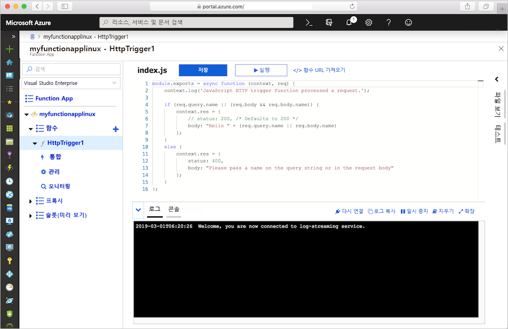
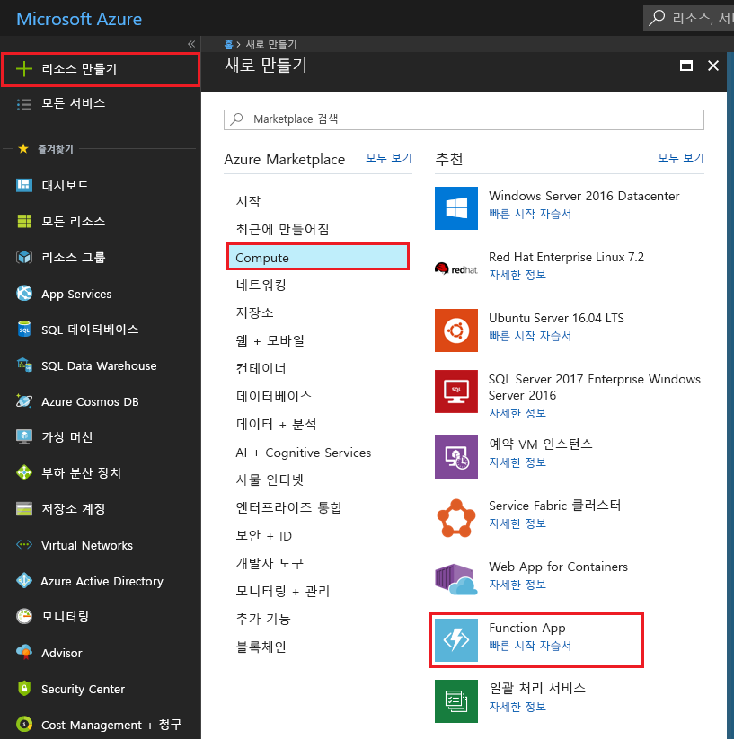
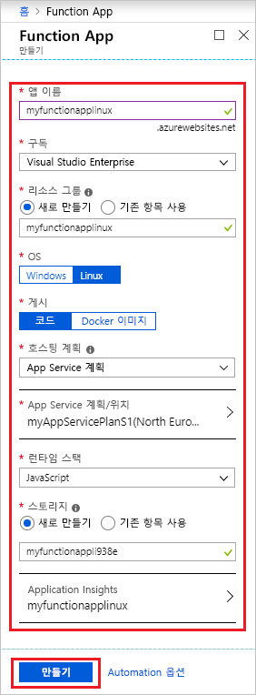
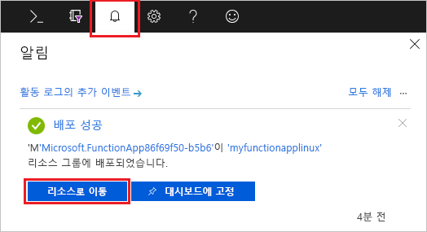
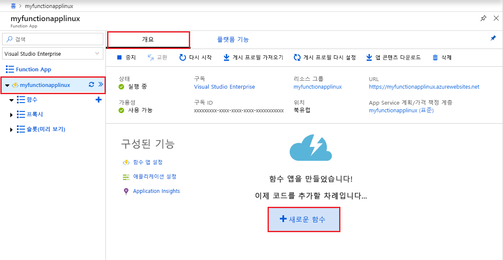
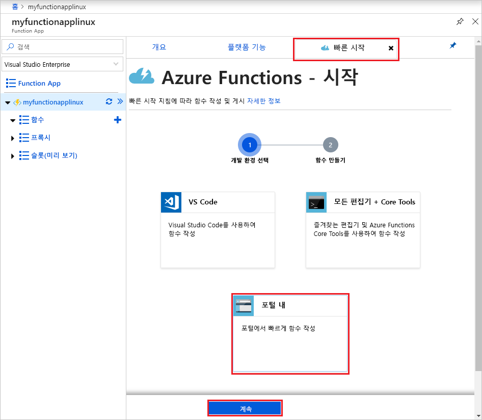
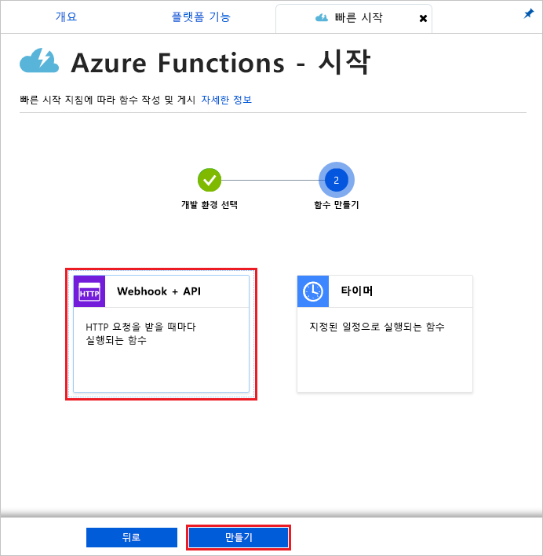
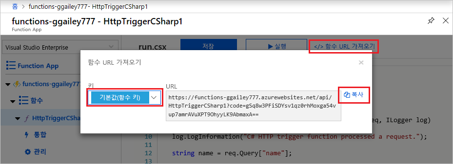
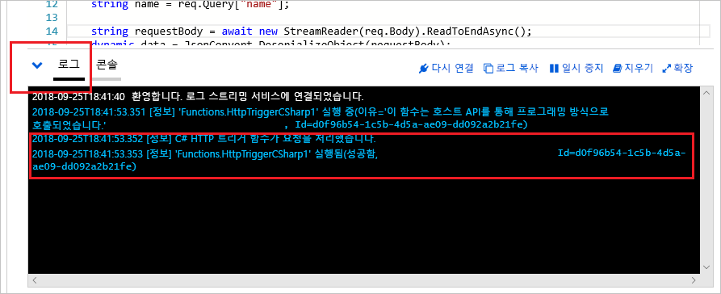

# Azure App Service 계획에서 Linux로 실행되는 함수 앱 만들기

Azure Functions를 사용하면 Linux에서 기본 Azure App Service 컨테이너에 함수를 호스트할 수 있습니다. 이 문서에서는 [Azure Portal](https://portal.azure.com)을 사용하여 [App Service 계획](functions-scale.md#app-service-plan)에서 실행되는 Linux 호스티드 Function App을 만드는 방법을 보여 줍니다. [고유한 사용자 지정 컨테이너를 가져올 수도](functions-create-function-linux-custom-image.md) 있습니다.

[!INCLUDE [quickstarts-free-trial-note](../../includes/quickstarts-free-trial-note.md)]

## Azure에 로그인

Azure 계정을 사용하여 <https://portal.azure.com>에서 Azure Portal에 로그인합니다.

## 함수 앱 만들기

Linux에서 함수 실행을 호스트하는 함수 앱이 있어야 합니다. 함수 앱은 함수 코드 실행을 위한 환경을 제공합니다. 이를 통해 함수를 논리 단위로 그룹화하여 더욱 쉽게 리소스를 관리, 배포 및 공유할 수 있습니다. 이 문서에서는 Function App을 만들 때 App Service 계획을 만듭니다.

1. Azure Portal의 왼쪽 위 모서리에 있는 **리소스 만들기** 단추를 선택한 다음, **계산** > **Function App**을 차례로 선택합니다.

    

2. 이미지 아래 표에 지정된 것처럼 함수 앱 설정을 사용합니다.

    

    | 설정      | 제안 값  | 설명                                        |
    | ------------ |  ------- | -------------------------------------------------- |
    | **앱 이름** | 전역적으로 고유한 이름 | 새 함수 앱을 식별하는 이름입니다. 유효한 문자는 `a-z`, `0-9` 및 `-`입니다.  | 
    | **구독** | 사용자의 구독 | 이 새 함수 앱이 만들어질 구독입니다. | 
    | **[리소스 그룹](../azure-resource-manager/resource-group-overview.md)** |  myResourceGroup | 함수 앱을 만들 새 리소스 그룹의 이름입니다. |
    | **OS** | Linux | Linux에서 Function App이 실행됩니다. |
    | **게시** | 코드 | **런타임 스택**의 기본 Linux 컨테이너가 사용됩니다. Function App 프로젝트 코드만 제공하면 됩니다. 또 다른 옵션은 사용자 지정 [Docker 이미지](functions-create-function-linux-custom-image.md)를 게시하는 것입니다. |
    | **[호스팅 계획](functions-scale.md)** | App Service 계획 | 함수 앱에 리소스가 할당되는 방법을 정의하는 호스팅 계획입니다. App Service 계획에서 실행하는 경우 [Function App의 크기 조정](functions-scale.md)을 제어할 수 있습니다.  |
    | **App Service 계획/위치** | 계획 만들기 | **새로 만들기**를 선택하고 **App Service 계획** 이름을 지정합니다. 사용자 또는 함수가 액세스하는 기타 서비스에 가까운 [지역](https://azure.microsoft.com/regions/)의 **위치**를 선택합니다. 원하는 **[가격 책정 계층](https://azure.microsoft.com/pricing/details/app-service/linux/)** 을 선택합니다.  동일한 App Service 계획에서 Linux 및 Windows Function App을 둘 다 실행할 수는 없습니다. |
    | **런타임 스택** | 기본 설정 언어 | 즐겨찾는 함수 프로그래밍 언어를 지원하는 런타임을 선택합니다. C# 및 F# 함수의 경우 **.NET**을 선택합니다. [Python 지원](functions-reference-python.md)은 현재 미리 보기로 제공됩니다. |
    | **[Storage](../storage/common/storage-quickstart-create-account.md)** |  전역적으로 고유한 이름 |  함수 앱에서 사용하는 저장소 계정을 만듭니다. Storage 계정 이름은 3자에서 24자 사이여야 하고 숫자 및 소문자만 포함할 수 있습니다. 기존 계정을 사용할 수도 있습니다. 여기서는 [저장소 계정 요구 사항](functions-scale.md#storage-account-requirements)을 충족해야 합니다. |
    | **[Application Insights](functions-monitoring.md)** | 사용 | Application Insights는 기본적으로 사용하지 않도록 설정됩니다. 이제 Application Insights 통합을 사용하도록 설정하고 App Service 계획 위치 가까이의 호스팅 위치를 선택하는 것이 좋습니다. 나중에 이 작업을 수행하려는 경우 [Azure Functions 모니터링](functions-monitoring.md)을 참조하세요.  |

3. **만들기**를 선택하여 함수 앱을 프로비전하고 배포합니다.

4. 포털의 오른쪽 위 모서리에 있는 [알림] 아이콘을 선택하고 **배포 성공** 메시지가 표시될 때까지 기다립니다.

    

5. **리소스로 이동**을 선택하여 함수 앱을 봅니다.

> [!TIP]
> 포털에서 함수 앱을 찾는 데 문제가 있는 경우 [Azure Portal에서 즐겨찾기에 Function App을 추가](functions-how-to-use-azure-function-app-settings.md#favorite)합니다.

다음으로 새 함수 앱에서 함수를 만듭니다. Function App을 사용할 수 있게 된 이후에도 완전히 초기화될 때까지 몇 분 정도 걸릴 수 있습니다.

## HTTP 트리거 함수 만들기

이 섹션에서는 포털의 새 Function App에서 함수를 만드는 방법을 보여 줍니다.

> [!NOTE]
> 포털 개발 환경은 Azure Functions를 사용해 보는 데 유용할 수 있습니다. 대부분의 시나리오에서 [Visual Studio Code](functions-create-first-function-vs-code.md#create-an-azure-functions-project) 또는 [Azure Functions Core Tools](functions-run-local.md#create-a-local-functions-project)를 사용하여 함수를 개발하고 Function App에 프로젝트를 게시하는 것이 좋습니다.  

1. 새 Function App에서 **개요** 탭을 선택하고 완전히 로드된 후 **+ 새 함수**를 선택합니다.

    

1. **빠른 시작** 탭에서 **포털 내**를 선택하고 **계속**을 선택합니다.

    

1. **웹후크 + API**를 선택한 다음, **만들기**를 선택합니다.

    

HTTP 트리거 함수에 대한 언어별 템플릿을 사용하여 함수가 만들어집니다.

이제 HTTP 요청을 전송하여 새 함수를 실행할 수 있습니다.

## 함수 테스트

1. 새 함수에서 오른쪽 맨 위에 있는 **</> 함수 URL 가져오기**를 클릭하고 **기본값(함수 키)** 를 선택한 후 **복사**를 클릭합니다. 

    

2. 함수 URL을 브라우저의 주소 표시줄에 붙여 넣습니다. `&name=<yourname>` 쿼리 문자열을 이 URL의 마지막에 추가하고 키보드에서 `Enter` 키를 눌러 요청을 실행합니다. 브라우저에 함수에서 반환한 응답이 표시될 것입니다.  

    다음 예에서는 브라우저의 응답을 보여 줍니다.

    

    요청 URL에는 기본적으로 HTTP를 통해 함수에 액세스하는 데 필요한 키가 포함됩니다.

3. 함수가 실행되면 추적 정보가 로그에 기록됩니다. 이전 실행에서 추적 출력을 보려면 포털에서 함수로 돌아가 화면 맨 아래에서 위쪽 화살표를 클릭하여 **로그**를 확장합니다.

   

## 리소스 정리

[!INCLUDE [Clean-up resources](../../includes/functions-quickstart-cleanup.md)]

## 다음 단계

간단한 HTTP 트리거 함수가 있는 함수 앱을 만들었습니다.  

[!INCLUDE [Next steps note](../../includes/functions-quickstart-next-steps.md)]

자세한 내용은 [Azure Functions HTTP 바인딩](functions-bindings-http-webhook.md)을 참조하세요.
