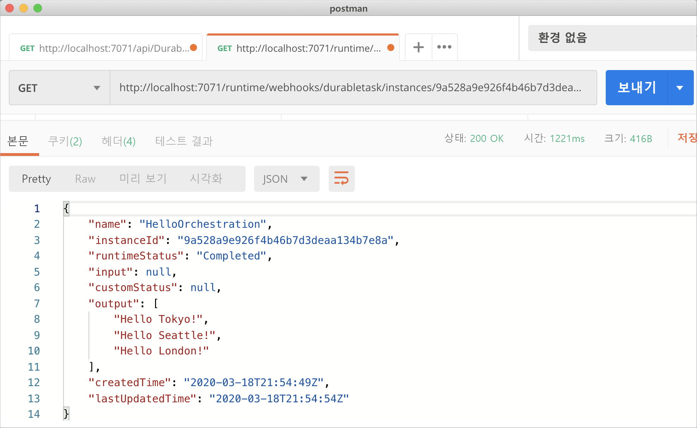
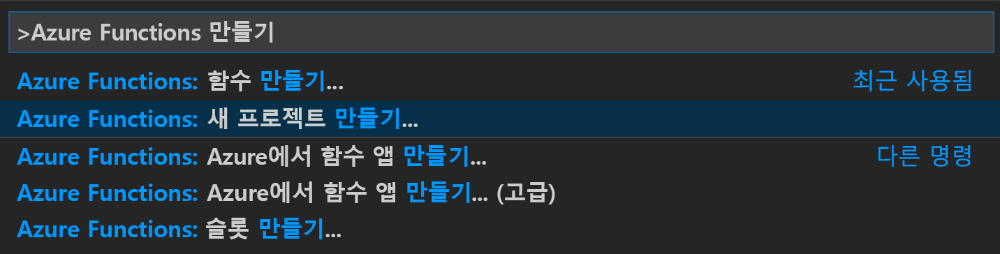
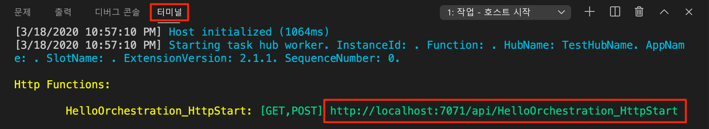
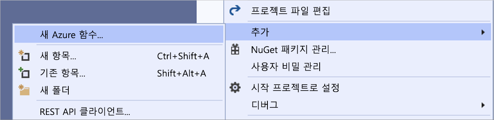

# <a name="create-your-first-durable-function-in-c"></a>C\#으로 첫 번째 지속성 함수 만들기

*Durable Functions*는 서버리스 환경에서 상태 저장 함수를 작성할 수 있게 하는 [Azure Functions](../functions-overview.md)의 확장입니다. 확장은 상태, 검사점 및 다시 시작을 관리합니다.

::: zone pivot="code-editor-vscode"

이 문서에서는 Visual Studio Code를 사용하여 "hello world" 지속성 함수를 로컬로 만들고 테스트하는 방법에 대해 알아봅니다.  이 함수는 다른 함수에 대한 호출을 오케스트레이션하고 함께 연결합니다. 그런 후 함수 코드를 Azure에 게시합니다. 이러한 도구는 VS Code [Azure Functions 확장](https://marketplace.visualstudio.com/items?itemName=ms-azuretools.vscode-azurefunctions)의 일부로 사용할 수 있습니다.



## <a name="prerequisites"></a>사전 요구 사항

이 자습서를 완료하려면 다음이 필요합니다.

* [Visual Studio Code](https://code.visualstudio.com/download)를 설치합니다.

* 다음 VS Code 확장을 설치합니다.
    - [Azure Functions](https://marketplace.visualstudio.com/items?itemName=ms-azuretools.vscode-azurefunctions)
    - [C#](https://marketplace.visualstudio.com/items?itemName=ms-dotnettools.csharp)

* 최신 버전의 [Azure Functions Core Tools](../functions-run-local.md)가 있는지 확인합니다.

* Durable Functions에는 Azure 스토리지 계정이 필요합니다. Azure 구독이 필요합니다.

* 버전 3.1 이상의 [.NET Core SDK](https://dotnet.microsoft.com/download)가 설치되어 있는지 확인합니다.

[!INCLUDE [quickstarts-free-trial-note](../../../includes/quickstarts-free-trial-note.md)]

## <a name="create-your-local-project"></a><a name="create-an-azure-functions-project"></a>로컬 프로젝트 만들기 

이 섹션에서는 Visual Studio Code를 사용하여 로컬 Azure Functions 프로젝트를 만듭니다. 

1. Visual Studio Code에서 F1(또는 Ctrl/Cmd+Shift+P) 키를 눌러 명령 팔레트를 엽니다. 명령 팔레트에서 `Azure Functions: Create New Project...`을 검색하여 선택합니다.

    

1. 프로젝트에 대한 빈 폴더 위치를 선택하고 **선택**을 선택합니다.

1. 지시에 따라 다음 정보를 제공합니다.

    | prompt | 값 | Description |
    | ------ | ----- | ----------- |
    | 함수 앱 프로젝트에 대한 언어를 선택합니다. | C# | 로컬 C# 함수 프로젝트를 만듭니다. |
    | 버전 선택 | Azure Functions v3 | 핵심 도구가 아직 설치되지 않은 경우에만 이 옵션이 표시됩니다. 이 경우 앱을 처음 실행할 때 핵심 도구가 설치됩니다. |
    | 프로젝트의 첫 번째 함수에 대한 템플릿 선택 | 지금은 건너뛰기 | |
    | 프로젝트를 여는 방법을 선택합니다. | 현재 창에서 열기 | 선택한 폴더에서 VS Code를 다시 엽니다. |

필요한 경우 Visual Studio Code가 Azure Functions Core Tools를 설치합니다. 또한 폴더에서 함수 앱 프로젝트를 만듭니다. 이 프로젝트에는 [host.json](../functions-host-json.md) 및 [local.settings.json](../functions-run-local.md#local-settings-file) 구성 파일이 포함되어 있습니다.

## <a name="add-functions-to-the-app"></a>함수를 앱에 추가

다음 단계에서는 템플릿을 사용하여 프로젝트에 지속성 함수 코드를 만듭니다.

1. 명령 팔레트에서 `Azure Functions: Create Function...`을 검색하여 선택합니다.

1. 지시에 따라 다음 정보를 제공합니다.

    | prompt | 값 | Description |
    | ------ | ----- | ----------- |
    | 함수의 템플릿 선택 | DurableFunctionsOrchestration | Durable Functions 오케스트레이션 만들기 |
    | 함수 이름 제공 | HelloOrchestration | 함수가 생성되는 클래스의 이름 |
    | 네임스페이스 제공 | Company.Function | 생성된 클래스의 네임스페이스 |

1. VS Code에서 스토리지 계정을 선택하라는 메시지가 표시되면 **스토리지 계정 선택**을 선택합니다. 메시지에 따라 다음 정보를 제공하여 Azure에서 새 스토리지 계정을 만듭니다.

    | prompt | 값 | Description |
    | ------ | ----- | ----------- |
    | 구독 선택 | *구독 이름* | Azure 구독 선택 |
    | 스토리지 계정 선택 | 새 스토리지 계정 만들기 |  |
    | 새 스토리지 계정의 이름 입력 | *고유 이름* | 만들 스토리지 계정의 이름 |
    | 리소스 그룹 선택 | *고유 이름* | 만들 리소스 그룹의 이름 |
    | 위치 선택 | *region* | 가까운 지역 선택 |

새 함수를 포함하는 클래스가 프로젝트에 추가됩니다. 또한 VS Code는 스토리지 계정 연결 문자열을 *local.settings.json*에 추가하고 [`Microsoft.Azure.WebJobs.Extensions.DurableTask`](https://www.nuget.org/packages/Microsoft.Azure.WebJobs.Extensions.DurableTask) NuGet 패키지에 대한 참조를 *.csproj* 프로젝트 파일에 추가합니다.

새 *HelloOrchestration.cs* 파일을 열어 콘텐츠를 봅니다. 이 지속성 함수는 다음 메서드를 포함하는 간단한 함수 체이닝 예제입니다.  

| 방법 | FunctionName | Description |
| -----  | ------------ | ----------- |
| **`RunOrchestrator`** | `HelloOrchestration` | 지속성 오케스트레이션을 관리합니다. 이 경우 오케스트레이션이 시작되고, 목록을 만들며 세 가지 함수 호출의 결과를 목록에 추가합니다.  세 가지 함수 호출이 완료되면 목록이 반환됩니다. |
| **`SayHello`** | `HelloOrchestration_Hello` | 함수는 hello를 반환합니다. 이 함수는 오케스트레이션되고 있는 비즈니스 논리를 포함하는 함수입니다. |
| **`HttpStart`** | `HelloOrchestration_HttpStart` | 오케스트레이션 인스턴스를 시작하고 상태 확인 응답을 반환하는 [HTTP 트리거 함수](../functions-bindings-http-webhook.md)입니다. |

함수 프로젝트 및 지속성 함수를 만들었으니, 이제 로컬 컴퓨터에서 이 함수를 테스트할 수 있습니다.

## <a name="test-the-function-locally"></a>로컬에서 함수 테스트

Azure Functions Core Tools를 사용하면 로컬 개발 컴퓨터에서 Azure Functions 프로젝트를 실행할 수 있습니다. Visual Studio Code에서 처음으로 함수를 시작할 때 이러한 도구를 설치하도록 요구하는 메시지가 표시됩니다.

1. 함수를 테스트하려면 `SayHello` 작업 함수 코드에 중단점을 설정하고 F5 키를 눌러 함수 앱 프로젝트를 시작합니다. 핵심 도구의 출력이 **터미널** 패널에 표시됩니다.

    > [!NOTE]
    > 디버깅에 대한 자세한 내용은 [Durable Functions 진단](durable-functions-diagnostics.md#debugging)을 참조하세요.

1. **터미널** 패널에서 HTTP 트리거 함수의 URL 엔드포인트를 복사합니다.

    

1. [Postman](https://www.getpostman.com/) 또는 [cURL](https://curl.haxx.se/)과 같은 도구를 사용하여 HTTP POST 요청을 URL 엔드포인트로 보냅니다.

   응답은 지속성 오케스트레이션이 성공적으로 시작되었음을 알리는 HTTP 함수의 초기 결과입니다. 아직 오케스트레이션의 최종 결과는 아닙니다. 응답에는 몇 가지 유용한 URL이 포함되어 있습니다. 현재로는 오케스트레이션의 상태를 쿼리해보겠습니다.

1. `statusQueryGetUri`에 대한 URL 값을 복사하고 브라우저의 주소에 붙여넣은 후 요청을 실행합니다. 또는 Postman을 사용하여 GET 요청을 계속 실행할 수도 있습니다.

   요청은 상태에 대한 오케스트레이션 인스턴스를 쿼리합니다. 인스턴스가 완료되었음을 나타내고 지속성 함수의 출력 또는 결과를 포함하는 최종 응답을 얻습니다. 다음과 같이 표시됩니다. 

    ```json
    {
        "name": "HelloOrchestration",
        "instanceId": "9a528a9e926f4b46b7d3deaa134b7e8a",
        "runtimeStatus": "Completed",
        "input": null,
        "customStatus": null,
        "output": [
            "Hello Tokyo!",
            "Hello Seattle!",
            "Hello London!"
        ],
        "createdTime": "2020-03-18T21:54:49Z",
        "lastUpdatedTime": "2020-03-18T21:54:54Z"
    }
    ```

1. 디버깅을 중지하려면 VS Code에서 **Shift + F5**를 누릅니다.

함수가 로컬 컴퓨터에서 제대로 실행되는지 확인한 후에 해당 프로젝트를 Azure에 게시해야 합니다.

[!INCLUDE [functions-create-function-app-vs-code](../../../includes/functions-sign-in-vs-code.md)]

[!INCLUDE [functions-publish-project-vscode](../../../includes/functions-publish-project-vscode.md)]

## <a name="test-your-function-in-azure"></a>Azure에서 함수 테스트

1. **출력** 패널에서 HTTP 트리거의 URL을 복사합니다. HTTP 트리거 함수를 호출하는 URL은 다음 형식이어야 합니다.

    `https://<functionappname>.azurewebsites.net/api/HelloOrchestration_HttpStart`

1. HTTP 요청에 대한 이러한 새 URL을 브라우저의 주소 표시줄에 붙여넣습니다. 게시된 앱을 사용하는 경우 앞으로 같은 상태 응답을 가져와야 합니다.

## <a name="next-steps"></a>다음 단계

Visual Studio Code를 사용하여 C# 지속성 함수 앱을 만들고 게시했습니다.

> [!div class="nextstepaction"]
> [일반적인 지속성 함수 패턴에 대해 알아보기](durable-functions-overview.md#application-patterns)

::: zone-end

::: zone pivot="code-editor-visualstudio"

이 문서에서는 Visual Studio 2019를 사용하여 "hello world" 지속성 함수를 로컬로 만들고 테스트하는 방법에 대해 알아봅니다.  이 함수는 다른 함수에 대한 호출을 오케스트레이션하고 함께 연결합니다. 그런 후 함수 코드를 Azure에 게시합니다. 이러한 도구는 Visual Studio 2019에서 Azure 개발 워크로드의 일부로 제공됩니다.


## <a name="prerequisites"></a>사전 요구 사항

이 자습서를 완료하려면 다음이 필요합니다.

* [Visual Studio 2019](https://visualstudio.microsoft.com/vs/)를 설치합니다. **Azure 개발** 워크로드도 설치되어 있어야 합니다. Visual Studio 2017도 Durable Functions 개발을 지원하지만 UI와 단계가 다릅니다.

* [Azure Storage 에뮬레이터](../../storage/common/storage-use-emulator.md)가 설치 및 실행되고 있는지 확인합니다.

[!INCLUDE [quickstarts-free-trial-note](../../../includes/quickstarts-free-trial-note.md)]

## <a name="create-a-function-app-project"></a>함수 앱 프로젝트 만들기

Azure Functions 템플릿은 Azure에서 함수 앱에 게시할 수 있는 프로젝트를 만듭니다. 함수 앱을 사용하면 함수를 논리 단위로 그룹화하여 더 쉽게 리소스를 관리, 배포, 크기 조정 및 공유할 수 있습니다.

1. Visual Studio의 **파일** 메뉴에서 **새로 만들기** > **프로젝트**를 선택합니다.

1. **새 프로젝트 만들기** 대화 상자에서 `functions`를 검색하여 **Azure Functions** 템플릿을 선택하고 **다음**을 선택합니다. 

    

1. 프로젝트의 **프로젝트 이름**을 입력하고, **확인**을 선택합니다. 프로젝트 이름은 C# 네임스페이스로 유효해야 하므로 밑줄, 하이픈 또는 기타 영숫자가 아닌 문자는 사용하지 마세요.

1. **새 Azure Functions 애플리케이션 만들기**에서 이미지 아래의 표에 지정된 설정을 사용합니다.

    

    | 설정      | 제안 값  | Description                      |
    | ------------ |  ------- |----------------------------------------- |
    | **버전** | Azure Functions 3.0 <br />(.NET Core) | .NET Core 3.1을 지원하는 Azure Functions의 버전 3.0 런타임을 사용하는 함수 프로젝트를 만듭니다. 자세한 내용은 [Azure Functions 런타임 버전을 대상으로 지정하는 방법](../functions-versions.md)을 참조하세요.   |
    | **템플릿** | Empty | 빈 함수 앱을 만듭니다. |
    | **스토리지 계정**  | 스토리지 에뮬레이터 | 스토리지 계정은 지속성 함수 상태 관리에 필요합니다. |

4. **만들기**를 선택하여 빈 함수 프로젝트를 만듭니다. 이 프로젝트에는 함수를 실행하는 데 필요한 기본 구성 파일이 있습니다.

## <a name="add-functions-to-the-app"></a>함수를 앱에 추가

다음 단계에서는 템플릿을 사용하여 프로젝트에 지속성 함수 코드를 만듭니다.

1. Visual Studio에서 프로젝트를 마우스 오른쪽 단추로 누르고 **추가** > **새 Azure Function**을 선택합니다.

    

1. 추가 메뉴에서 **Azure Function**이 선택되어 있는지 확인하고, C# 파일의 이름을 입력한 다음, **추가**를 선택합니다.

1. **Durable Functions 오케스트레이션** 템플릿을 선택한 다음, **확인**을 선택합니다.

    

새 지속성 함수가 앱에 추가됩니다.  새 .cs 파일을 열어 콘텐츠를 봅니다. 이 지속성 함수는 다음 메서드를 포함하는 간단한 함수 체이닝 예제입니다.  

| 방법 | FunctionName | Description |
| -----  | ------------ | ----------- |
| **`RunOrchestrator`** | `<file-name>` | 지속성 오케스트레이션을 관리합니다. 이 경우 오케스트레이션이 시작되고, 목록을 만들며 세 가지 함수 호출의 결과를 목록에 추가합니다.  세 가지 함수 호출이 완료되면 목록이 반환됩니다. |
| **`SayHello`** | `<file-name>_Hello` | 함수는 hello를 반환합니다. 이 함수는 오케스트레이션되고 있는 비즈니스 논리를 포함하는 함수입니다. |
| **`HttpStart`** | `<file-name>_HttpStart` | 오케스트레이션 인스턴스를 시작하고 상태 확인 응답을 반환하는 [HTTP 트리거 함수](../functions-bindings-http-webhook.md)입니다. |

함수 프로젝트 및 지속성 함수를 만들었으니, 이제 로컬 컴퓨터에서 이 함수를 테스트할 수 있습니다.

## <a name="test-the-function-locally"></a>로컬에서 함수 테스트

Azure Functions Core Tools를 사용하면 로컬 개발 컴퓨터에서 Azure Functions 프로젝트를 실행할 수 있습니다. Visual Studio에서 처음으로 함수를 시작할 때 이 도구를 설치하도록 요구하는 메시지가 표시됩니다.

1. 함수를 테스트하려면 F5 키를 누릅니다. 메시지가 표시되면 Visual Studio에서 Azure Functions Core(CLI) 도구를 다운로드하여 설치하도록 요구하는 요청을 수락합니다. 또한 도구에서 HTTP 요청을 처리할 수 있도록 방화벽 예외를 사용하도록 설정해야 합니다.

2. Azure Functions 런타임 출력에서 함수의 URL을 복사합니다.

    

3. HTTP 요청에 대한 URL을 브라우저의 주소 표시줄에 붙여넣고 요청을 실행합니다. 다음은 함수에서 반환된 로컬 GET 요청에 대한 브라우저의 응답을 보여 줍니다.

    

    응답은 지속성 오케스트레이션이 성공적으로 시작되었음을 알리는 HTTP 함수의 초기 결과입니다.  아직 오케스트레이션의 최종 결과는 아닙니다.  응답에는 몇 가지 유용한 URL이 포함되어 있습니다.  현재로는 오케스트레이션의 상태를 쿼리해보겠습니다.

4. `statusQueryGetUri`에 대한 URL 값을 복사하고 브라우저의 주소에 붙여넣은 후 요청을 실행합니다.

    요청은 상태에 대한 오케스트레이션 인스턴스를 쿼리합니다. 최종 응답은 다음과 같이 표시되어야 합니다.  이 출력은 인스턴스가 완료되었음을 나타내며, 지속성 함수의 출력 또는 결과를 포함합니다.

    ```json
    {
        "instanceId": "d495cb0ac10d4e13b22729c37e335190",
        "runtimeStatus": "Completed",
        "input": null,
        "customStatus": null,
        "output": [
            "Hello Tokyo!",
            "Hello Seattle!",
            "Hello London!"
        ],
        "createdTime": "2019-11-02T07:07:40Z",
        "lastUpdatedTime": "2019-11-02T07:07:52Z"
    }
    ```

5. 디버깅을 중지하려면 **Shift + F5**를 누릅니다.

함수가 로컬 컴퓨터에서 제대로 실행되는지 확인한 후에 해당 프로젝트를 Azure에 게시해야 합니다.

## <a name="publish-the-project-to-azure"></a>Azure에 프로젝트 게시

프로젝트를 게시하려면 먼저 Azure 구독에 함수 앱이 있어야 합니다. Visual Studio에서 직접 함수 앱을 만들 수 있습니다.

[!INCLUDE [Publish the project to Azure](../../../includes/functions-vstools-publish.md)]

## <a name="test-your-function-in-azure"></a>Azure에서 함수 테스트

1. 게시 프로필 페이지에서 함수 앱의 기준 URL을 복사합니다. 로컬에서 함수를 테스트할 때 사용한 URL의 `localhost:port` 부분을 새 기준 URL로 바꿉니다.

    지속성 함수 HTTP 트리거를 호출하는 URL은 다음 형식이어야 합니다.

    `https://<APP_NAME>.azurewebsites.net/api/<FUNCTION_NAME>_HttpStart`

2. HTTP 요청에 대한 이러한 새 URL을 브라우저의 주소 표시줄에 붙여넣습니다. 게시된 앱을 사용하는 경우 앞으로 같은 상태 응답을 가져와야 합니다.

## <a name="next-steps"></a>다음 단계

Visual Studio를 사용하여 C# 지속성 함수 앱을 만들고 게시했습니다.

> [!div class="nextstepaction"]
> [일반적인 지속성 함수 패턴에 대해 알아보기](durable-functions-overview.md#application-patterns)

::: zone-end
