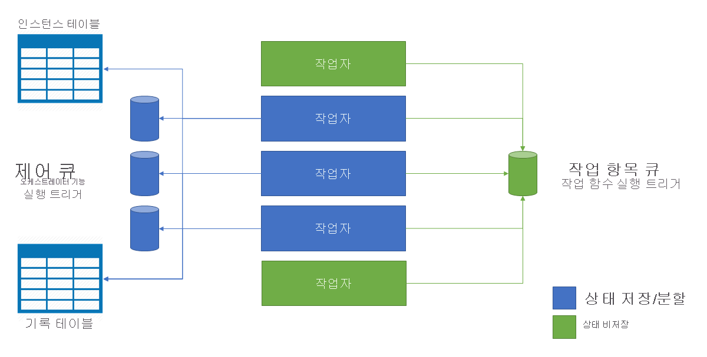

# <a name="performance-and-scale-in-durable-functions-azure-functions"></a>지속성 함수의 성능 및 크기 조정(Azure Functions)

성능 및 확장성을 최적화 하려면 [Durable Functions](durable-functions-overview.md)의 고유한 크기 조정 특성을 이해 하는 것이 중요 합니다.

크기 조정 동작을 이해하려면 기본 Azure Storage 공급자의 세부 정보 중 일부를 이해해야 합니다.

## <a name="history-table"></a>기록 테이블

**기록** 테이블은 작업 허브 내의 모든 오케스트레이션 인스턴스에 대한 기록 이벤트가 포함된 Azure Storage 테이블입니다. 이 테이블의 이름은 *TaskHubName*History 형태를 갖습니다. 인스턴스가 실행되면 새 행이 이 테이블에 추가됩니다. 이 테이블의 파티션 키는 오케스트레이션의 인스턴스 ID에서 파생됩니다. 인스턴스 ID는 대부분의 경우 임의적이며, 이는 Azure Storage에서 내부 파티션을 최적으로 배포할 수 있도록 합니다.

오케스트레이션 인스턴스를 실행해야 할 경우 기록 테이블의 해당 행이 메모리에 로드됩니다. 그런 다음, 이러한 *기록 이벤트*는 오케스트레이터 함수 코드로 재생되어 이전의 검사점 상태로 돌아갑니다. 이러한 방식으로 상태를 다시 작성하기 위해 실행 기록을 사용하게 되면 [이벤트 소싱 패턴](https://docs.microsoft.com/azure/architecture/patterns/event-sourcing)의 영향을 받습니다.

## <a name="instances-table"></a>인스턴스 테이블

**Instances** 테이블은 작업 허브 내의 모든 오케스트레이션 및 엔터티 인스턴스의 상태를 포함 하는 또 다른 Azure Storage 테이블입니다. 인스턴스가 생성되면 새 행이 이 테이블에 추가됩니다. 이 테이블의 파티션 키는 오케스트레이션 인스턴스 ID 또는 엔터티 키 이며 행 키는 고정 상수입니다. 오케스트레이션 또는 엔터티 인스턴스당 하나의 행이 있습니다.

이 테이블은 `GetStatusAsync` (.net) 및 `getStatus` (JavaScript) api 및 [상태 쿼리 HTTP api](durable-functions-http-api.md#get-instance-status)의 인스턴스 쿼리 요청을 충족 하는 데 사용 됩니다. 결과적으로 앞서 언급된 **기록** 테이블의 내용과 일관되게 유지됩니다. 이러한 방식으로 인스턴스 쿼리 작업을 효과적으로 충족하기 위해 별도 Azure Storage 테이블을 사용하면 [CQRS(명령 및 쿼리 책임 분리) 패턴](https://docs.microsoft.com/azure/architecture/patterns/cqrs)의 영향을 받습니다.

## <a name="internal-queue-triggers"></a>내부 큐 트리거

오케스트레이터 함수 및 활동 함수는 모두 함수 앱의 작업 허브에 있는 내부 큐에서 트리거됩니다. 이러한 방식으로 큐를 사용하면 신뢰할 수 있는 "최소 한 번" 메시지 배달이 보장됩니다. 지속성 함수에는 **제어 큐** 및 **작업 항목 큐**의 두 가지 유형의 큐가 있습니다.

### <a name="the-work-item-queue"></a>작업 항목 큐

지속성 함수에는 작업 허브마다 하나의 작업 항목 큐가 있습니다. 이것은 기본 큐이며 Azure Functions의 다른 모든 `queueTrigger` 큐와 비슷하게 동작합니다. 이 큐는 한 번에 하나의 메시지를 큐에서 제거하여 상태 비저장 *작업 함수*를 트리거하는 데 사용됩니다. 이러한 각 메시지는 작업 함수 입력 및 추가 메타데이터(예: 실행할 함수)를 포함합니다. Durable Functions 애플리케이션이 여러 VM으로 확장하는 경우 이러한 VM은 모두 작업 항목 큐에서 작업을 가져오려고 경쟁합니다.

### <a name="control-queues"></a>제어 큐

지속형 함수의 작업 허브당 여러 개의 *제어 큐*가 있습니다. *제어 큐*는 간단한 작업 항목 큐보다 더 복잡합니다. 제어 큐는 상태 저장 orchestrator 및 entity 함수를 트리거하는 데 사용 됩니다. Orchestrator 및 entity 함수 인스턴스는 상태 저장 단일 항목 이므로 경쟁 소비자 모델을 사용 하 여 Vm 간에 부하를 분산할 수 없습니다. 대신 orchestrator 및 엔터티 메시지는 제어 큐에서 부하가 분산 됩니다. 이 동작에 대한 자세한 내용은 이후 섹션을 참조하세요.

제어 큐에는 다양한 오케스트레이션 수명 주기 메시지 유형이 포함됩니다. 예를 들어 [오케스트레이터 제어 메시지](durable-functions-instance-management.md), 작업 함수 *응답* 메시지 및 타이머 메시지가 있습니다. 단일 폴링의 제어 큐에서 최대 32개의 메시지가 제거됩니다. 이러한 메시지는 의도한 오케스트레이션 인스턴스를 포함하는 메타데이터 뿐만 아니라 페이로드 데이터도 포함됩니다. 큐에서 제거된 메시지가 여러 개의 동일한 오케스트레이션 인스턴스를 위한 것이면 일괄로 처리됩니다.

### <a name="queue-polling"></a>큐 폴링

지 속성 작업 확장은 임의 지 수 백오프 알고리즘을 구현 하 여 유휴 큐 폴링이 저장소 트랜잭션 비용에 미치는 영향을 줄입니다. 메시지가 발견 되 면 런타임은 다른 메시지를 즉시 확인 합니다. 메시지를 찾을 수 없으면 일정 시간 동안 기다린 후 다시 시도 합니다. 큐 메시지를 가져오기 위해 후속 시도가 실패 한 후 대기 시간은 최대 대기 시간에 도달할 때까지 계속 증가 하며 기본값은 30 초입니다.

최대 폴링 지연은 `maxQueuePollingInterval` [파일의host.js](../functions-host-json.md#durabletask)에 있는 속성을 통해 구성할 수 있습니다. 이 속성을 더 큰 값으로 설정 하면 메시지 처리 대기 시간이 더 길어질 수 있습니다. 대기 시간이 길수록 비활성 기간 후에만 예상 됩니다. 이 속성을 더 낮은 값으로 설정 하면 저장소 트랜잭션이 증가 하 여 저장소 비용이 높아질 수 있습니다.

> [!NOTE]
> Azure Functions 소비 및 프리미엄 계획에서 실행 하는 경우 [Azure Functions 크기 조정 컨트롤러](../functions-scale.md#how-the-consumption-and-premium-plans-work) 는 각 제어 및 작업 항목 큐를 10 초 마다 한 번씩 폴링합니다. 이 추가 폴링은 함수 앱 인스턴스를 활성화 하 고 크기 결정을 내리는 시기를 결정 하는 데 필요 합니다. 작성 시이 10 초 간격은 일정 하므로 구성할 수 없습니다.

### <a name="orchestration-start-delays"></a>오케스트레이션 시작 지연
오케스트레이션 인스턴스는 `ExecutionStarted` 작업 허브의 제어 큐 중 하나에 메시지를 추가 하 여 시작 됩니다. 특정 조건에서는 오케스트레이션이 실행 되도록 예약 된 시간과 실제로 실행이 시작 될 때 사이에 여러 초 지연이 발생할 수 있습니다. 이 시간 간격 동안 오케스트레이션 인스턴스는 상태로 유지 됩니다 `Pending` . 이러한 지연의 두 가지 가능한 원인은 다음과 같습니다.

1. **백로그 된 제어 큐**:이 인스턴스에 대 한 제어 큐에 많은 수의 메시지가 포함 되어 있으면 `ExecutionStarted` 런타임에서 메시지를 받고 처리 하기까지 시간이 걸릴 수 있습니다. 오케스트레이션이 많은 이벤트를 동시에 처리 하는 경우 메시지 백로그가 발생할 수 있습니다. 제어 큐로 이동 하는 이벤트는 오케스트레이션 시작 이벤트, 작업 완료, 지 속성 타이머, 종료 및 외부 이벤트를 포함 합니다. 정상적인 상황에서 이러한 지연이 발생 하는 경우 더 많은 파티션이 있는 새 작업 허브를 만드는 것이 좋습니다. 더 많은 파티션을 구성 하면 런타임에서 부하 배포를 위한 더 많은 제어 큐를 만듭니다.

2. **폴링 지연 백오프**: 오케스트레이션 지연의 또 다른 일반적인 원인은 이전에 [제어 큐에 대 한 백오프 폴링 동작을 설명한](#queue-polling)것입니다. 그러나이 지연은 응용 프로그램이 둘 이상의 인스턴스로 확장 된 경우에만 예상 됩니다. 앱 인스턴스가 하나 뿐 이거나 오케스트레이션을 시작 하는 앱 인스턴스가 대상 제어 큐를 폴링하는 것과 동일한 인스턴스인 경우 큐 폴링 지연이 발생 하지 않습니다. 이전에 설명한 대로 설정 **에서host.js** 를 업데이트 하면 다시 폴링 지연 시간을 줄일 수 있습니다.

## <a name="storage-account-selection"></a>스토리지 계정 선택

Durable Functions에서 사용 되는 큐, 테이블 및 blob은 구성 된 Azure Storage 계정에 만들어집니다. 사용할 계정은 `durableTask/storageProvider/connectionStringName` `durableTask/azureStorageConnectionStringName` 파일 **의host.js** 에 있는 설정 (또는 Durable Functions 1.x의 설정)을 사용 하 여 지정할 수 있습니다.

### <a name="durable-functions-2x"></a>Durable Functions 2.x

```json
{
  "extensions": {
    "durableTask": {
      "storageProvider": {
        "connectionStringName": "MyStorageAccountAppSetting"
      }
    }
  }
}
```

### <a name="durable-functions-1x"></a>Durable Functions 1.x

```json
{
  "extensions": {
    "durableTask": {
      "azureStorageConnectionStringName": "MyStorageAccountAppSetting"
    }
  }
}
```

계정을 지정하지 않으면 기본 `AzureWebJobsStorage` 스토리지 계정이 사용됩니다. 그렇지만 성능이 중요한 워크로드에서는 기본이 아닌 스토리지 계정을 구성하는 것이 좋습니다. 지속형 함수는 Azure Storage를 과도하게 사용하며, 전용 스토리지 계정을 사용하면 지속형 함수 스토리지 사용이 Azure Functions 호스트의 내부 사용과 분리됩니다.

## <a name="orchestrator-scale-out"></a>오케스트레이터 확장

작업 함수는 상태 비저장이며, VM을 추가하여 자동으로 확장됩니다. 반면에 오 케 스트레이 터 함수 및 엔터티는 하나 이상의 제어 큐에서 *분할* 됩니다. 제어 큐의 수는 **host.json** 파일에서 정의됩니다. 다음 예제 host.js에서는 코드 조각에서 `durableTask/storageProvider/partitionCount` 속성 (또는 `durableTask/partitionCount` Durable Functions 1.x)을로 설정 합니다 `3` .

### <a name="durable-functions-2x"></a>Durable Functions 2.x

```json
{
  "extensions": {
    "durableTask": {
      "storageProvider": {
          "partitionCount": 3
      }
    }
  }
}
```

### <a name="durable-functions-1x"></a>Durable Functions 1.x

```json
{
  "extensions": {
    "durableTask": {
      "partitionCount": 3
    }
  }
}
```

작업 허브는 1~16개 파티션으로 구성할 수 있습니다. 파티션 수를 지정하지 않으면 기본 파티션 수는 **4**개 입니다.

여러 함수 호스트 인스턴스(일반적으로 서로 다른 VM에 있음)로 확장하는 경우 각 인스턴스는 제어 큐 중 하나에 대한 잠금을 얻습니다. 이러한 잠금은 내부적으로 blob storage 임대로 구현 되며 오케스트레이션 인스턴스나 엔터티는 한 번에 하나의 호스트 인스턴스에만 실행 되도록 합니다. 작업 허브가 3 개의 제어 큐로 구성 된 경우 오케스트레이션 인스턴스 및 엔터티는 최대 3 개의 Vm에서 부하가 분산 될 수 있습니다. 작업 함수 실행을 위한 용량을 늘리기 위해 추가 VM을 추가할 수 있습니다.

다음 다이어그램에서는 Azure Functions 호스트에서 확장된 환경의 스토리지 엔터티와 상호 작용하는 방법을 보여 줍니다.



이전 다이어그램에 나와 있는 것처럼 모든 VM은 작업 항목 큐에 메시지에 대해 경합합니다. 그러나 세 개의 VM만 제어 큐에서 메시지를 얻을 수 있으며 각 VM에서 단일 제어 큐를 잠급니다.

오케스트레이션 인스턴스 및 엔터티는 모든 제어 큐 인스턴스에 분산 됩니다. 배포는 오케스트레이션의 인스턴스 ID 또는 엔터티 이름 및 키 쌍을 해시 하 여 수행 됩니다. 오케스트레이션 인스턴스 Id는 기본적으로 임의 Guid 이며 인스턴스가 모든 제어 큐에서 동일 하 게 분산 되도록 합니다.

일반적으로 말해서 오케스트레이터 함수는 간단하게 설계되므로 많은 컴퓨팅 성능이 필요하지 않습니다. 따라서 오케스트레이션의 처리량을 높이기 위해 많은 수의 제어 큐 파티션을 만들 필요가 없습니다. 대부분의 과도한 작업은 무한정 확장될 수 있는 상태 비저장 작업 함수에서 수행하는 것이 좋습니다.

## <a name="auto-scale"></a>자동 크기 조정

소비 및 탄력적 프리미엄 계획에서 실행 되는 모든 Azure Functions와 마찬가지로 Durable Functions는 [Azure Functions 크기 조정 컨트롤러](../functions-scale.md#runtime-scaling)를 통해 자동 크기 조정을 지원 합니다. 크기 조정 컨트롤러는 _peek_ 명령을 주기적으로 실행하여 모든 큐의 대기 시간을 모니터링합니다. 확인된 메시지의 대기 시간에 따라, 크기 조정 컨트롤러는 VM을 추가할지 또는 제거할지를 결정합니다.

크기 조정 컨트롤러는 제어 큐 메시지 대기 시간이 너무 높다고 판단되면 메시지 대기 시간이 적절한 수준까지 감소하거나, 제어 큐 파티션 수에 도달할 때까지 VM 인스턴스를 추가합니다. 마찬가지로, 파티션 수에 관계없이 작업 항목 큐 대기 시간이 높으면 크기 조정 컨트롤러는 VM 인스턴스를 계속 추가합니다.

> [!NOTE]
> Durable Functions 2.0부터 함수 앱은 탄력적 프리미엄 계획의 VNET 보호 서비스 끝점 내에서 실행 되도록 구성할 수 있습니다. 이 구성에서 Durable Functions는 크기 조정 컨트롤러 대신 시작 크기 조정 요청을 트리거합니다.

## <a name="thread-usage"></a>스레드 사용

오케스트레이터 함수는 여러 번의 재생을 거치면서 실행이 결정적이 될 수 있도록 단일 스레드에서 실행됩니다. 이러한 단일 스레드 실행 때문에, 오케스트레이터 함수 스레드는 어떤 이유로든 CPU 집약적 작업을 수행하지 않고, I/O를 수행하지 않고, 차단하지 않습니다. I/O, 차단 또는 다중 스레드가 필요한 작업은 작업 함수로 이동해야 합니다.

작업 함수에는 일반 큐 트리거 함수와 동일한 모든 동작이 있습니다. I/O를 안전하게 수행하고, CPU 집약적 작업을 실행하며, 여러 스레드를 사용할 수 있습니다. 작업 트리거는 상태 비저장이므로 VM 수에 관계 없이 자유롭게 확장할 수 있습니다.

엔터티 함수도 단일 스레드에서 실행 되 고 작업은 한 번에 하나씩 처리 됩니다. 그러나 엔터티 함수에는 실행할 수 있는 코드의 형식에 대 한 제한이 없습니다.

## <a name="concurrency-throttles"></a>동시성 제한

Azure Functions는 단일 응용 프로그램 인스턴스 내에서 여러 함수를 동시에 실행하도록 지원합니다. 이러한 동시 실행은 병렬 처리를 늘리며, 일반적인 앱이 시간이 지나면서 겪게 되는 "콜드 시작"의 수를 최소화합니다. 그러나 높은 동시성은 네트워크 연결 또는 사용 가능한 메모리와 같은 VM 별 시스템 리소스를 고갈 시킬 수 있습니다. 함수 앱의 요구에 따라, 고부하 상황에서 메모리의 부족 문제를 방지하기 위해 인스턴스당 동시성을 제한해야 할 수도 있습니다.

작업, orchestrator 및 엔터티 함수 동시성 제한은 파일 **의host.js** 에서 구성할 수 있습니다. 관련 설정은 `durableTask/maxConcurrentActivityFunctions` 작업 함수 및 `durableTask/maxConcurrentOrchestratorFunctions` orchestrator와 엔터티 함수 모두에 대 한 것입니다.

### <a name="functions-20"></a>함수 2.0

```json
{
  "extensions": {
    "durableTask": {
      "maxConcurrentActivityFunctions": 10,
      "maxConcurrentOrchestratorFunctions": 10
    }
  }
}
```

### <a name="functions-1x"></a>Functions 1.x

```json
{
  "durableTask": {
    "maxConcurrentActivityFunctions": 10,
    "maxConcurrentOrchestratorFunctions": 10
  }
}
```

이전 예제에서는 최대 10 개의 orchestrator 또는 entity 함수와 10 개의 작업 함수가 단일 VM에서 동시에 실행 될 수 있습니다. 지정 하지 않으면 동시 작업 및 orchestrator 또는 엔터티 함수 실행 수가 VM의 코어 수 10 배에서 더 이상 표시 되지 않습니다.

> [!NOTE]
> 이러한 설정은 단일 VM의 메모리 및 CPU 사용량을 관리하는 데 유용합니다. 그러나 여러 Vm에서 확장 하는 경우 각 VM에는 고유한 제한 집합이 있습니다. 이러한 설정은 전역 수준에서 동시성을 제어 하는 데 사용할 수 없습니다.

## <a name="extended-sessions"></a>확장 세션

확장 세션은 메시지 처리를 완료 한 후에도 메모리에 오케스트레이션 및 엔터티를 유지 하는 설정입니다. 확장 세션을 사용하도록 설정하면 일반적으로 Azure Storage 계정에 대한 I/O가 줄어들고 전반적인 처리량은 향상됩니다.

`durableTask/extendedSessionsEnabled` `true` 파일의 **host.js** 에서을로 설정 하 여 확장 세션을 사용 하도록 설정할 수 있습니다. `durableTask/extendedSessionIdleTimeoutInSeconds`설정은 유휴 세션이 메모리에 유지 되는 기간을 제어 하는 데 사용할 수 있습니다.

**함수 2.0**
```json
{
  "extensions": {
    "durableTask": {
      "extendedSessionsEnabled": true,
      "extendedSessionIdleTimeoutInSeconds": 30
    }
  }
}
```

**함수 1.0**
```json
{
  "durableTask": {
    "extendedSessionsEnabled": true,
    "extendedSessionIdleTimeoutInSeconds": 30
  }
}
```

이 설정의 두 가지 잠재적 단점이는 다음과 같이 인식 됩니다.

1. 함수 앱 메모리 사용은 전반적으로 증가 합니다.
2. 동시에 실행 되는 단기 오 케 스트레이 터 또는 엔터티 함수 실행이 많은 경우 전반적으로 처리량이 줄어들 수 있습니다.

예를 들어, `durableTask/extendedSessionIdleTimeoutInSeconds` 가 30 초로 설정 된 경우 1 초 미만으로 실행 되는 단기 orchestrator 또는 entity 함수 에피소드는 30 초 동안 메모리를 계속 차지 합니다. 또한 이전에 언급 한 `durableTask/maxConcurrentOrchestratorFunctions` 할당량을 계산 하 여 다른 orchestrator 또는 entity 함수 실행을 방해할 수 있습니다.

Orchestrator 및 entity 함수에서 확장 세션의 구체적인 효과는 다음 섹션에 설명 되어 있습니다.

### <a name="orchestrator-function-replay"></a>오케스트레이터 함수 재생

앞서 언급된 것처럼 오케스트레이터 함수는 **기록** 테이블의 콘텐츠를 사용하여 재생됩니다. 기본적으로 오케스트레이터 함수 코드는 메시지의 일괄 처리가 제어 큐에서 제거될 때마다 재생됩니다. 팬 아웃 및 팬 인 패턴을 사용 하 고 모든 작업이 완료 될 때까지 대기 하는 경우에도 (예: `Task.WhenAll` .net 또는 JavaScript에서 사용 `context.df.Task.all` ) 작업 응답의 일괄 처리가 시간에 따라 처리 될 때 발생 하는 재생이 발생 합니다. 확장 세션을 사용 하도록 설정 하면 오 케 스트레이 터 함수 인스턴스가 메모리에 더 오래 유지 되 고 전체 기록 재생 없이 새 메시지를 처리할 수 있습니다.

확장 세션의 성능 향상은 일반적으로 다음과 같은 경우에 관찰 됩니다.

* 동시에 실행 되는 오케스트레이션 인스턴스 수가 제한 되는 경우
* 오케스트레이션에 많은 수의 순차적 작업 (예: 수백 개의 작업 함수 호출)이 있으면 빠르게 완료 됩니다.
* 오케스트레이션 팬 아웃 및 팬이 동시에 완료 되는 많은 수의 작업을 수행 하는 경우
* Orchestrator 함수에서 많은 메시지를 처리 하거나 CPU를 많이 사용 하는 데이터 처리를 수행 해야 하는 경우

다른 모든 경우에는 일반적으로 오 케 스트레이 터 함수에 대 한 성능 향상이 없습니다.

> [!NOTE]
> 이러한 설정은 오케스트레이터 함수가 완전하게 개발 및 테스트된 후에만 사용해야 합니다. 기본 적극적인 재생 동작은 개발 시 오 케 스트레이 터 [함수 코드 제약 조건](durable-functions-code-constraints.md) 위반을 검색 하는 데 유용할 수 있으므로 기본적으로 사용 하지 않도록 설정 되어 있습니다.

### <a name="entity-function-unloading"></a>엔터티 함수 언로드

엔터티 함수는 단일 일괄 처리에서 최대 20 개의 작업을 처리 합니다. 엔터티가 작업 일괄 처리를 완료 하는 즉시 해당 상태를 유지 하 고 메모리에서 언로드합니다. 확장 된 세션 설정을 사용 하 여 메모리에서 엔터티 언로드를 지연할 수 있습니다. 엔터티는 이전과 같이 상태 변경을 계속 유지 하지만, Azure Storage에서 로드 수를 줄이기 위해 구성 된 기간 동안 메모리에 유지 됩니다. Azure Storage에서 부하가 감소 하면 자주 액세스 하는 엔터티의 전체 처리량을 향상 시킬 수 있습니다.

## <a name="performance-targets"></a>성능 목표

프로덕션 애플리케이션에 대해 지속형 함수를 사용하려는 경우 계획 프로세스의 초기에 성능 요구 사항을 검토해야 합니다. 이 섹션에서는 몇 가지 기본 사용 시나리오와 예상되는 최대 처리량 수치를 설명합니다.

* **순차적 작업 실행**: 이 시나리오에서는 일련의 작업 함수를 순차적으로 실행하는 오케스트레이터 함수를 설명합니다. 이 시나리오는 [함수 체인](durable-functions-sequence.md) 샘플과 가장 유사합니다.
* **병렬 작업 실행**: 이 시나리오에서는 [팬아웃, 팬인](durable-functions-cloud-backup.md) 패턴을 사용하여 많은 작업 함수를 병렬로 실행하는 오케스트레이터 함수를 설명합니다.
* **병렬 응답 처리**:이 시나리오는 [팬아웃, 팬인](durable-functions-cloud-backup.md) 패턴의 두 번째 절반 부분입니다. 팬인 부분의 성능에 중점을 둡니다. 팬아웃과 달리, 팬인은 단일 오케스트레이터 함수 인스턴스에 의해 수행되므로 단일 VM에서만 실행될 수 있습니다.
* **외부 이벤트 처리**: 이 시나리오에서는 한 번에 하나씩 [외부 이벤트](durable-functions-external-events.md)를 처리하는 단일 오케스트레이터 함수 인스턴스를 나타냅니다.
* **엔터티 작업 처리**:이 시나리오는 _단일_ [카운터 엔터티가](durable-functions-entities.md) 작업의 상수 스트림을 처리할 수 있는 속도를 테스트 합니다.

> [!TIP]
> 팬아웃과 달리, 팬인 작업은 단일 VM으로 제한됩니다. 애플리케이션이 팬아웃, 팬인 패턴을 사용하며, 팬인 성능에 걱정될 경우 여러 [하위 오케스트레이션](durable-functions-sub-orchestrations.md)에 걸쳐 작업 함수 팬아웃을 세분화하는 것을 고려합니다.

다음 표에서는 앞서 설명한 시나리오에 대해 예상되는 *최대* 처리량 수치를 보여줍니다. "인스턴스"는 Azure App Service의 하나의 작은 ([A1](../../virtual-machines/sizes-previous-gen.md)) VM에서 실행되는 오케스트레이터 함수의 단일 인스턴스를 나타냅니다. 모든 경우에 [확장 세션](#orchestrator-function-replay)이 사용되도록 설정되어 있다고 가정합니다. 실제 결과는 함수 코드에서 수행하는 CPU 또는 I/O 작업에 따라 달라질 수 있습니다.

| 시나리오 | 최대 처리량 |
|-|-|
| 순차적 작업 실행 | 인스턴스별 초당 5개 작업 |
| 병렬 작업 실행(팬아웃) | 인스턴스별 초당 100개 작업 |
| 병렬 응답 처리(팬인) | 인스턴스별 초당 150개 응답 |
| 외부 이벤트 처리 | 인스턴스별 초당 50개 이벤트 |
| 엔터티 작업 처리 | 초당 64 작업 |

> [!NOTE]
> 이러한 수치는 지속형 함수 확장의 v1.4.0(GA) 릴리스 당시의 최신 값입니다. 이러한 수치는 시간이 지나면서 기능이 완성되고 최적화가 진행됨에 따라 달라질 수 있습니다.

예상되는 처리량 수치가 표시되지 않는데 CPU 및 메모리 사용량이 정상으로 표시되면 해당 원인이 [스토리지 계정의 상태](../../storage/common/storage-monitoring-diagnosing-troubleshooting.md#troubleshooting-guidance)와 관련이 있는 것인지 확인합니다. 지속형 함수 확장은 Azure Storage 계정에 과도한 부하를 발생할 수 있으며 충분히 높은 부하는 스토리지 계정 제한을 유발할 수 있습니다.

## <a name="next-steps"></a>다음 단계

> [!div class="nextstepaction"]
> [재해 복구 및 지역 배포에 대 한 자세한 정보](durable-functions-disaster-recovery-geo-distribution.md)
