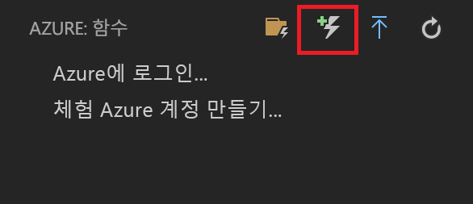
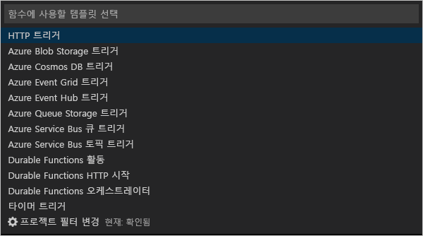
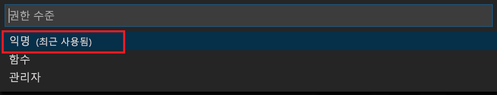

# <a name="create-your-first-durable-function-in-javascript"></a>JavaScript로 첫 번째 지속성 함수 만들기

*Durable Functions*는 서버리스 환경에서 상태 저장 함수를 작성할 수 있게 하는 [Azure Functions](../functions-overview.md)의 확장입니다. 확장은 상태, 검사점 및 다시 시작을 관리합니다.

[!INCLUDE [v1-note](../../../includes/functions-durable-v1-tutorial-note.md)]

이 문서에서는 Visual Studio Code Azure Functions를 사용하여 로컬로 “hello world” 지속성 함수를 만들고 테스트하는 방법에 대해 알아봅니다.  이 함수는 다른 함수에 대한 호출을 오케스트레이션하고 함께 연결합니다. 그런 후 함수 코드를 Azure에 게시합니다.


## <a name="prerequisites"></a>사전 요구 사항

이 자습서를 완료하려면 다음이 필요합니다.

* [Visual Studio Code](https://code.visualstudio.com/download)를 설치합니다.

* 최신 버전의 [Azure Functions Core Tools](../functions-run-local.md)가 있는지 확인합니다.

* Windows 컴퓨터에서 [Azure Storage 에뮬레이터](../../storage/common/storage-use-emulator.md)가 설치 및 실행되고 있는지 확인합니다. Mac 또는 Linux 컴퓨터에서는 실제 Azure Storage 계정을 사용해야 합니다.

* 버전 8.0 이상 버전의 [Node.js](https://nodejs.org/)가 설치되어 있는지 확인합니다.

[!INCLUDE [quickstarts-free-trial-note](../../../includes/quickstarts-free-trial-note.md)]

[!INCLUDE [functions-install-vs-code-extension](../../../includes/functions-install-vs-code-extension.md)]

## <a name="create-an-azure-functions-project"></a>로컬 프로젝트 만들기 

이 섹션에서는 Visual Studio Code를 사용하여 로컬 Azure Functions 프로젝트를 만듭니다. 

1. Visual Studio Code에서 F1 키를 눌러 명령 팔레트를 엽니다. 명령 팔레트에서 `Azure Functions: Create new project...`을 검색하여 선택합니다.

1. 프로젝트 작업 영역에 대한 디렉터리 위치를 선택하고 **선택**을 선택합니다.

    > [!NOTE]
    > 다음 단계는 작업 영역 외부에서 완료하도록 설계되었습니다. 이 경우 작업 영역에 포함된 프로젝트 폴더를 선택하지 마십시오.

1. 프롬프트에 따라 원하는 언어에 대한 다음 정보를 제공합니다.

    | prompt | 값 | Description |
    | ------ | ----- | ----------- |
    | 함수 앱 프로젝트에 대한 언어를 선택합니다. | JavaScript | 로컬 Node.js Functions 프로젝트를 만듭니다. |
    | 버전 선택 | Azure Functions v2 | 핵심 도구가 아직 설치되지 않은 경우에만 이 옵션이 표시됩니다. 이 경우 앱을 처음 실행할 때 핵심 도구가 설치됩니다. |
    | 프로젝트의 첫 번째 함수에 대한 템플릿 선택 | HTTP 트리거 | 새 함수 앱에서 HTTP 트리거 함수를 만듭니다. |
    | 함수 이름 제공 | HttpTrigger | Enter 키를 눌러 기본 이름을 사용합니다. |
    | 권한 부여 수준 | 함수 | `function` 권한 부여 수준에서는 함수의 HTTP 엔드포인트를 호출할 때 액세스 키를 제공해야 합니다. 이렇게 하면 보안되지 않은 엔드포인트에 액세스하기가 더 어려워집니다. 자세한 내용은 [권한 부여 키](../functions-bindings-http-webhook-trigger.md#authorization-keys)를 참조하세요.  |
    | 프로젝트를 여는 방법을 선택합니다. | 작업 영역에 추가 | 현재 작업 영역에 함수 앱을 만듭니다. |

필요한 경우 Visual Studio Code가 Azure Functions Core Tools를 설치합니다. 또한 새 작업 영역에서 함수 앱 프로젝트를 만듭니다. 이 프로젝트에는 [host.json](../functions-host-json.md) 및 [local.settings.json](../functions-run-local.md#local-settings-file) 구성 파일이 포함되어 있습니다. 또한 [function.json 정의 파일](../functions-reference-node.md#folder-structure) 및 함수 코드가 포함된 Node.js 파일인 [index.js 파일](../functions-reference-node.md#exporting-a-function)을 포함하는 HttpExample 폴더를 만듭니다.

package.json 파일도 루트 폴더에 생성됩니다.

## <a name="install-the-durable-functions-npm-package"></a>Durable Functions npm 패키지 설치

1. 함수 앱의 루트 디렉터리에서 `npm install durable-functions`를 실행하여 `durable-functions` npm 패키지를 설치합니다.

## <a name="creating-your-functions"></a>함수 만들기

이제 Durable Functions를 시작하는 데 필요한 세 가지 함수(HTTP 스타터, 오케스트레이터, 작업 함수)를 만듭니다. HTTP 스타터는 전체 솔루션을 시작하고, 오케스트레이터는 다양한 작업 함수로 작업을 디스패치합니다.

### <a name="http-starter"></a>HTTP 스타터

먼저, 지속성 함수 오케스트레이션을 시작하는 HTTP 트리거 함수를 만듭니다.

1. *Azure: Functions*에서 **함수 만들기** 아이콘을 선택합니다.

    

2. 함수 앱 프로젝트를 사용하여 폴더를 선택하고 **Durable Functions HTTP 스타터** 함수 템플릿을 선택합니다.

    

3. 기본 이름을 `DurableFunctionsHttpStart`로 그대로 두고 ** **Enter** 키를 누른 다음, **익명** 인증을 선택합니다.

    

이제 지속성 함수에 진입점이 생성되었습니다. 오케스트레이터를 추가해 보겠습니다.

### <a name="orchestrator"></a>오케스트레이터

이제 작업 함수를 조정하기 위해 오케스트레이터를 만듭니다.

1. *Azure: Functions*에서 **함수 만들기** 아이콘을 선택합니다.

    

2. 함수 앱 프로젝트를 사용하여 폴더를 선택하고 **Durable Functions 오케스트레이터** 함수 템플릿을 선택합니다. 이름을 기본값 "DurableFunctionsOrchestrator"로 그대로 두기

    

작업 함수를 조정하기 위해 오케스트레이터를 추가했습니다. 참조된 작업 함수를 지금 추가하겠습니다.

### <a name="activity"></a>작업

이제 실제로 솔루션의 작업을 수행하는 작업 함수를 만듭니다.

1. *Azure: Functions*에서 **함수 만들기** 아이콘을 선택합니다.

    

2. 함수 앱 프로젝트를 사용하여 폴더를 선택하고 **Durable Functions 작업** 함수 템플릿을 선택합니다. 이름을 기본값 "Hello"로 그대로 둡니다.

    

이제 오케스트레이션을 시작하고 작업 함수를 함께 연결하는 데 필요한 모든 구성 요소를 추가했습니다.

## <a name="test-the-function-locally"></a>로컬에서 함수 테스트

Azure Functions Core Tools를 사용하면 로컬 개발 컴퓨터에서 Azure Functions 프로젝트를 실행할 수 있습니다. Visual Studio Code에서 처음으로 함수를 시작할 때 이러한 도구를 설치하도록 요구하는 메시지가 표시됩니다.

1. Windows 컴퓨터에서 Azure Storage 에뮬레이터를 시작하고 *local.settings.json*의 **AzureWebJobsStorage** 속성이 `UseDevelopmentStorage=true`로 설정되어 있는지 확인합니다.

    Storage Emulator 5.8은 local.settings.json의 **AzureWebJobsSecretStorageType** 속성이 `files`로 설정되었는지 확인합니다. Mac 또는 Linux 컴퓨터에서는 **AzureWebJobsStorage** 속성을 기존 Azure Storage 계정의 연결 문자열로 설정해야 합니다. 스토리지 계정은 이 문서의 뒷부분에서 만듭니다.

2. 함수를 테스트하려면 함수 코드에 중단점을 설정하고 F5 키를 눌러 함수 앱 프로젝트를 시작합니다. 핵심 도구의 출력이 **터미널** 패널에 표시됩니다. 처음으로 Durable Functions를 사용하는 경우 Durable Functions 확장이 설치되고 빌드하는 데 몇 초 정도 걸릴 수 있습니다.

    > [!NOTE]
    > JavaScript Durable Functions에는 버전 **1.7.0** 이상의 **Microsoft.Azure.WebJobs.Extensions.DurableTask** 확장이 필요합니다. Azure Functions 앱의 루트 폴더에서 다음 명령을 실행하여 Durable Functions 확장 `func extensions install -p Microsoft.Azure.WebJobs.Extensions.DurableTask -v 1.7.0`을 설치합니다.

3. **터미널** 패널에서 HTTP 트리거 함수의 URL 엔드포인트를 복사합니다.

    

4. `{functionName}`을 `DurableFunctionsOrchestrator`로 바꿉니다.

5. [Postman](https://www.getpostman.com/) 또는 [cURL](https://curl.haxx.se/)과 같은 도구를 사용하여 HTTP POST 요청을 URL 엔드포인트로 보냅니다.

   응답은 지속성 오케스트레이션이 성공적으로 시작되었음을 알리는 HTTP 함수의 초기 결과입니다. 아직 오케스트레이션의 최종 결과는 아닙니다. 응답에는 몇 가지 유용한 URL이 포함되어 있습니다. 현재로는 오케스트레이션의 상태를 쿼리해보겠습니다.

6. `statusQueryGetUri`에 대한 URL 값을 복사하고 브라우저의 주소에 붙여넣은 후 요청을 실행합니다. 또는 Postman을 사용하여 GET 요청을 계속 실행할 수도 있습니다.

   요청은 상태에 대한 오케스트레이션 인스턴스를 쿼리합니다. 인스턴스가 완료되었음을 나타내고 지속성 함수의 출력 또는 결과를 포함하는 최종 응답을 얻습니다. 다음과 같이 표시됩니다. 

    ```json
    {
        "instanceId": "d495cb0ac10d4e13b22729c37e335190",
        "runtimeStatus": "Completed",
        "input": null,
        "customStatus": null,
        "output": [
            "Hello Tokyo!",
            "Hello Seattle!",
            "Hello London!"
        ],
        "createdTime": "2018-11-08T07:07:40Z",
        "lastUpdatedTime": "2018-11-08T07:07:52Z"
    }
    ```

7. 디버깅을 중지하려면 VS Code에서 **Shift + F5**를 누릅니다.

함수가 로컬 컴퓨터에서 제대로 실행되는지 확인한 후에 해당 프로젝트를 Azure에 게시해야 합니다.

[!INCLUDE [functions-create-function-app-vs-code](../../../includes/functions-sign-in-vs-code.md)]

[!INCLUDE [functions-publish-project-vscode](../../../includes/functions-publish-project-vscode.md)]

## <a name="test-your-function-in-azure"></a>Azure에서 함수 테스트

1. **출력** 패널에서 HTTP 트리거의 URL을 복사합니다. HTTP 트리거 함수를 호출하는 URL은 다음 형식이어야 합니다.

        http://<functionappname>.azurewebsites.net/orchestrators/<functionname>

2. HTTP 요청에 대한 이러한 새 URL을 브라우저의 주소 표시줄에 붙여넣습니다. 게시된 앱을 사용하는 경우 앞으로 같은 상태 응답을 가져와야 합니다.

## <a name="next-steps"></a>다음 단계

Visual Studio Code를 사용하여 JavaScript 지속성 함수 앱을 만들고 게시했습니다.

> [!div class="nextstepaction"]
> [일반적인 지속성 함수 패턴에 대해 알아보기](durable-functions-overview.md#application-patterns)