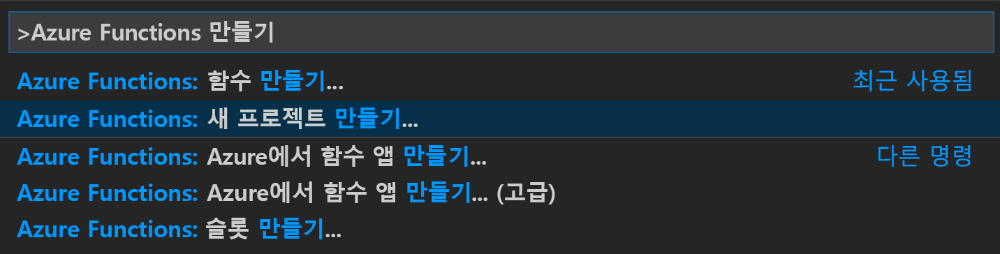
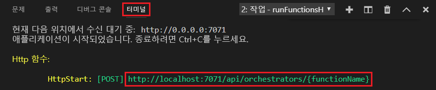

# <a name="create-your-first-durable-function-in-powershell"></a>PowerShell에서 첫 번째 지속성 함수 만들기

*Durable Functions*는 서버리스 환경에서 상태 저장 함수를 작성할 수 있게 하는 [Azure Functions](../functions-overview.md)의 확장입니다. 확장은 상태, 검사점 및 다시 시작을 관리합니다.

이 문서에서는 Visual Studio Code Azure Functions를 사용하여 로컬로 “hello world” 지속성 함수를 만들고 테스트하는 방법에 대해 알아봅니다.  이 함수는 다른 함수에 대한 호출을 오케스트레이션하고 함께 연결합니다. 그런 후 함수 코드를 Azure에 게시합니다.


## <a name="prerequisites"></a>사전 요구 사항

이 자습서를 완료하려면 다음이 필요합니다.

* [Visual Studio Code](https://code.visualstudio.com/download)를 설치합니다.

* [Azure Functions](https://marketplace.visualstudio.com/items?itemName=ms-azuretools.vscode-azurefunctions)와 VS Code 확장 설치 비교

* 최신 버전의 [Azure Functions Core Tools](../functions-run-local.md)가 있는지 확인합니다.

* Durable Functions를 사용하려면 Azure 스토리지 계정이 필요합니다. Azure 구독이 필요합니다.

[!INCLUDE [quickstarts-free-trial-note](../../../includes/quickstarts-free-trial-note.md)]

## <a name="create-your-local-project"></a><a name="create-an-azure-functions-project"></a>로컬 프로젝트 만들기 

이 섹션에서는 Visual Studio Code를 사용하여 로컬 Azure Functions 프로젝트를 만듭니다. 

1. Visual Studio Code에서 F1 키를 눌러 명령 팔레트를 엽니다. 명령 팔레트에서 `Azure Functions: Create New Project...`을 검색하여 선택합니다.

    

1. 프로젝트에 대한 빈 폴더 위치를 선택하고, **선택**을 누릅니다.

1. 지시에 따라 다음 정보를 제공합니다.

    | prompt | 값 | Description |
    | ------ | ----- | ----------- |
    | 함수 앱 프로젝트에 대한 언어를 선택합니다. | PowerShell | 로컬 PowerShell Functions 프로젝트를 만듭니다. |
    | 버전 선택 | Azure Functions v3 | 핵심 도구가 아직 설치되지 않은 경우에만 이 옵션이 표시됩니다. 이 경우 앱을 처음 실행할 때 핵심 도구가 설치됩니다. |
    | 프로젝트의 첫 번째 함수에 대한 템플릿 선택 | 지금은 건너뛰기 | |
    | 프로젝트를 여는 방법을 선택합니다. | 현재 창에서 열기 | 선택한 폴더에서 VS Code를 다시 엽니다. |

필요한 경우 Visual Studio Code가 Azure Functions Core Tools를 설치합니다. 또한 폴더에서 함수 앱 프로젝트를 만듭니다. 이 프로젝트에는 [host.json](../functions-host-json.md) 및 [local.settings.json](../functions-run-local.md#local-settings-file) 구성 파일이 포함되어 있습니다.

package.json 파일도 루트 폴더에 생성됩니다.

### <a name="configure-function-app-to-use-powershell-7"></a>PowerShell 7을 사용하도록 함수 앱 구성

*local.settings.json* 파일을 열고 `FUNCTIONS_WORKER_RUNTIME_VERSION`이라는 설정이 `~7`로 설정되었는지 확인합니다. 누락되거나 다른 값으로 설정된 경우 파일의 내용을 업데이트합니다.

```json
{
  "IsEncrypted": false,
  "Values": {
    "AzureWebJobsStorage": "",
    "FUNCTIONS_WORKER_RUNTIME": "powershell",
    "FUNCTIONS_WORKER_RUNTIME_VERSION" : "~7"
  }
}
```

## <a name="create-your-functions"></a>함수 만들기

가장 기본적인 Durable Functions 앱에는 다음 세 가지 함수가 포함되어 있습니다.

* *Orchestrator 함수* - 다른 함수를 오케스트레이션하는 워크플로를 설명합니다.
* *작업 함수* - 오케스트레이터 함수에 의해 호출되며, 작업을 수행하고 경우에 따라 반환합니다.
* *클라이언트 함수* - 오케스트레이터 함수를 시작하는 일반 Azure 함수입니다. 이 예제에서는 HTTP 트리거 함수를 사용합니다.

### <a name="orchestrator-function"></a>오케스트레이터 함수

템플릿을 사용하여 프로젝트에 지속성 함수 코드를 만듭니다.

1. 명령 팔레트에서 `Azure Functions: Create Function...`을 검색하여 선택합니다.

1. 지시에 따라 다음 정보를 제공합니다.

    | prompt | 값 | Description |
    | ------ | ----- | ----------- |
    | 함수의 템플릿 선택 | Durable Functions 오케스트레이터(미리 보기) | Durable Functions 오케스트레이션 만들기 |
    | 함수 이름 제공 | HelloOrchestrator | 지속성 함수의 이름 |

작업 함수를 조정하기 위한 오케스트레이터를 추가했습니다. 오케스트레이터 함수를 보려면 *HelloOrchestrator/run.ps1*을 엽니다. `Invoke-ActivityFunction` cmdlet에 대한 각 호출은 `Hello`라는 작업 함수를 호출합니다.

다음으로, 참조된 `Hello` 작업 함수를 추가하겠습니다.

### <a name="activity-function"></a>작업 함수

1. 명령 팔레트에서 `Azure Functions: Create Function...`을 검색하여 선택합니다.

1. 지시에 따라 다음 정보를 제공합니다.

    | prompt | 값 | Description |
    | ------ | ----- | ----------- |
    | 함수의 템플릿 선택 | Durable Functions 작업(미리 보기) | 작업 함수 만들기 |
    | 함수 이름 제공 | 안녕하세요. | 작업 함수의 이름 |

오케스트레이터에서 호출하는 `Hello` 작업 함수를 추가했습니다. *Hello/run.ps1*을 열어 입력으로 이름을 가져오고 인사말을 반환하는지 확인합니다. 작업 함수에서는 데이터베이스 호출, 컴퓨팅 수행 등의 작업을 수행할 것입니다.

마지막으로, 오케스트레이션을 시작하는 HTTP 트리거 함수를 추가합니다.

### <a name="client-function-http-starter"></a>클라이언트 함수(HTTP 스타터)

1. 명령 팔레트에서 `Azure Functions: Create Function...`을 검색하여 선택합니다.

1. 지시에 따라 다음 정보를 제공합니다.

    | prompt | 값 | Description |
    | ------ | ----- | ----------- |
    | 함수의 템플릿 선택 | Durable Functions HTTP 스타터(미리 보기) | HTTP 스타터 함수 만들기 |
    | 함수 이름 제공 | HttpStart | 작업 함수의 이름 |
    | 권한 부여 수준 | 익명 | 데모용으로 인증 없이 함수를 호출할 수 있도록 허용합니다. |

오케스트레이션을 시작하는 HTTP 트리거 함수를 추가했습니다. *HttpStart/run.ps1*을 열어 `Start-NewOrchestration` cmdlet을 사용하여 새 오케스트레이션을 시작하는지 확인합니다. 그런 다음, `New-OrchestrationCheckStatusResponse` cmdlet을 사용하여 새 오케스트레이션을 모니터링하고 관리하는 데 사용할 수 있는 URL이 포함된 HTTP 응답을 반환합니다.

이제 로컬로 실행하고 Azure에 배포할 수 있는 Durable Functions 앱이 생겼습니다.

## <a name="test-the-function-locally"></a>로컬에서 함수 테스트

Azure Functions Core Tools를 사용하면 로컬 개발 컴퓨터에서 Azure Functions 프로젝트를 실행할 수 있습니다. Visual Studio Code에서 처음으로 함수 앱을 시작할 때 이러한 도구를 설치하라는 메시지가 표시됩니다.

1. 함수를 테스트하려면 `Hello` 작업 함수 코드(*Hello/run.ps1*)에서 중단점을 설정합니다. F5 키를 누르거나 명령 팔레트에서 `Debug: Start Debugging`을 선택하여 함수 앱 프로젝트를 시작합니다. 핵심 도구의 출력이 **터미널** 패널에 표시됩니다.

    > [!NOTE]
    > 디버깅에 대한 자세한 내용은 [Durable Functions 진단](durable-functions-diagnostics.md#debugging)을 참조하세요.

1. Durable Functions를 사용하려면 Azure Storage 계정을 실행해야 합니다. VS Code에서 스토리지 계정을 선택하라는 메시지가 표시되면 **스토리지 계정 선택**을 선택합니다.

    

1. 메시지를 따라 다음 정보를 제공하여 Azure에서 새 스토리지 계정을 만듭니다.

    | prompt | 값 | Description |
    | ------ | ----- | ----------- |
    | 구독 선택 | *구독 이름* | Azure 구독 선택 |
    | 스토리지 계정 선택 | 새 스토리지 계정 만들기 |  |
    | 새 스토리지 계정의 이름 입력 | *고유 이름* | 만들 스토리지 계정의 이름 |
    | 리소스 그룹 선택 | *고유 이름* | 만들 리소스 그룹의 이름 |
    | 위치 선택 | *region* | 가까운 지역 선택 |

1. **터미널** 패널에서 HTTP 트리거 함수의 URL 엔드포인트를 복사합니다.

    

1. 브라우저 또는 [Postman](https://www.getpostman.com/), [cURL](https://curl.haxx.se/)과 같은 도구를 사용하여 HTTP POST 요청을 URL 엔드포인트로 보냅니다. 마지막 세그먼트를 오케스트레이터 함수의 이름(`HelloOrchestrator`)으로 바꿉니다. URL은 `http://localhost:7071/api/orchestrators/HelloOrchestrator` 형식입니다.

   응답은 지속성 오케스트레이션이 성공적으로 시작되었음을 알리는 HTTP 함수의 초기 결과입니다. 아직 오케스트레이션의 최종 결과는 아닙니다. 응답에는 몇 가지 유용한 URL이 포함되어 있습니다. 현재로는 오케스트레이션의 상태를 쿼리해보겠습니다.

1. `statusQueryGetUri`에 대한 URL 값을 복사하고 브라우저의 주소에 붙여넣은 후 요청을 실행합니다. 또는 Postman을 사용하여 GET 요청을 계속 실행할 수도 있습니다.

   요청은 상태에 대한 오케스트레이션 인스턴스를 쿼리합니다. 인스턴스가 완료되었음을 나타내고 지속성 함수의 출력 또는 결과를 포함하는 최종 응답을 얻습니다. 다음과 같이 표시됩니다. 

    ```json
    {
        "name": "HelloOrchestrator",
        "instanceId": "9a528a9e926f4b46b7d3deaa134b7e8a",
        "runtimeStatus": "Completed",
        "input": null,
        "customStatus": null,
        "output": [
            "Hello Tokyo!",
            "Hello Seattle!",
            "Hello London!"
        ],
        "createdTime": "2020-03-18T21:54:49Z",
        "lastUpdatedTime": "2020-03-18T21:54:54Z"
    }
    ```

1. 디버깅을 중지하려면 VS Code에서 **Shift + F5**를 누릅니다.

함수가 로컬 컴퓨터에서 제대로 실행되는지 확인한 후에 해당 프로젝트를 Azure에 게시해야 합니다.

[!INCLUDE [functions-create-function-app-vs-code](../../../includes/functions-sign-in-vs-code.md)]

## <a name="publish-the-project-to-azure"></a>Azure에 프로젝트 게시

이 섹션에서는 Azure 구독에서 함수 앱 및 관련 리소스를 만든 다음, 코드를 배포합니다. 

> [!IMPORTANT]
> 기존 함수 앱에 게시하면 Azure에서 해당 앱의 콘텐츠를 덮어씁니다. 


1. 작업 막대에서 Azure 아이콘을 선택한 다음, **Azure: Functions** 영역에서 **함수 앱에 배포...** 단추를 선택합니다.

    

1. 프롬프트에서 다음 정보를 제공합니다.

    + **폴더 선택**: 작업 영역에서 폴더를 선택하거나 함수 앱을 포함하는 폴더를 찾습니다. 유효한 함수 앱이 이미 열려 있는 경우에는 이 메시지가 표시되지 않습니다.

    + **구독 선택**: 사용할 구독을 선택합니다. 구독이 한 개만 있으면 이 메시지가 표시되지 않습니다.

    + **Azure에서 함수 앱 선택**: `+ Create new Function App`을 선택합니다. (이 문서에서 다루지 않는 `Advanced` 옵션은 선택하지 마세요.)
      
    + **함수 앱에 대해 전역적으로 고유 이름을 입력합니다**. URL 경로에 유효한 이름을 입력합니다. 입력한 이름이 Azure Functions에서 고유한지 확인하기 위해 유효성을 검사합니다. 

    + **런타임 선택**: 로컬에서 실행 중인 PowerShell 버전을 선택합니다. `pwsh -version` 명령을 사용하여 버전을 확인할 수 있습니다.

        > [!NOTE]
        > Azure Functions VS Code 확장은 아직 PowerShell 7을 지원하지 않을 수 있습니다. PowerShell 7을 옵션으로 사용할 수 없는 경우 지금 PowerShell 6.x를 선택하고 함수 앱을 만든 후 [수동으로 버전을 업데이트](#update-function-app-ps7)합니다.

    + **새 리소스의 위치 선택**:  성능을 향상시키려면 근처에 있는 [지역](https://azure.microsoft.com/regions/)을 선택합니다. 
    
1.  완료되면 함수 앱 이름을 기반으로 하는 이름을 사용하여 구독에 다음 Azure 리소스가 생성됩니다.
    
    + 리소스 그룹 - 관련 리소스에 대한 논리 컨테이너입니다.
    + 표준 Azure Storage 계정 - 프로젝트에 대한 상태 및 기타 정보를 유지 관리합니다.
    + 소비 계획 - 서버리스 함수 앱의 기본 호스트를 정의합니다. 
    + 함수 앱 - 함수 코드를 실행할 수 있는 환경을 제공합니다. 함수 앱을 사용하면 함수를 논리 단위로 그룹화하여 동일한 호스팅 계획 내에서 더 쉽게 리소스를 관리, 배포 및 공유할 수 있습니다.
    + 서버리스 함수의 사용을 추적하는 함수 앱에 연결된 Application Insights 인스턴스입니다.

    함수 앱을 만들고 배포 패키지가 적용되면 알림이 표시됩니다.

1. <a name="update-function-app-ps7"></a>함수 앱을 만들 때 이전에 *PowerShell 7*을 선택할 수 없는 경우 F1(또는 Ctrl/Cmd+Shift+P)을 눌러 명령 팔레트를 엽니다. 명령 팔레트에서 `Azure Functions: Upload Local Settings...`을 검색하여 선택합니다. 프롬프트에 따라 만든 함수 앱을 선택합니다. 기존 설정을 덮어쓸지 묻는 메시지가 표시되면 *모두 아니요*를 선택합니다.
    
1. 이 알림에서 **출력 보기**를 선택하여 사용자가 만든 Azure 리소스를 포함한 만들기 및 배포 결과를 표시합니다. 알림이 누락된 경우 오른쪽 아래 모서리에 있는 종 모양 아이콘을 선택하여 다시 확인합니다.

    


## <a name="test-your-function-in-azure"></a>Azure에서 함수 테스트

1. **출력** 패널에서 HTTP 트리거의 URL을 복사합니다. HTTP 트리거 함수를 호출하는 URL은 `http://<functionappname>.azurewebsites.net/api/orchestrators/HelloOrchestrator` 형식입니다.

2. HTTP 요청에 대한 이러한 새 URL을 브라우저의 주소 표시줄에 붙여넣습니다. 게시된 앱을 사용하는 경우 앞으로 같은 상태 응답을 가져와야 합니다.

## <a name="next-steps"></a>다음 단계

Visual Studio Code를 사용하여 PowerShell 지속성 함수 앱을 만들고 게시했습니다.

> [!div class="nextstepaction"]
> [일반적인 지속성 함수 패턴에 대해 알아보기](durable-functions-overview.md#application-patterns)
