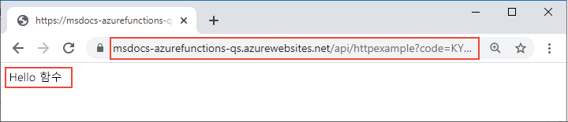

# <a name="connect-azure-functions-to-azure-storage-using-command-line-tools"></a>명령줄 도구를 사용하여 Azure Functions를 Azure Storage에 연결

이 문서에서는 [이전 빠른 시작](functions-create-first-azure-function-azure-cli.md)에서 만든 함수 및 스토리지 계정과 Azure Storage 큐를 통합합니다. 이 통합은 데이터를 HTTP 요청에서 큐의 메시지에 쓰는 *출력 바인딩*을 사용하여 달성할 수 있습니다. 이 문서를 완료하면 이전의 빠른 시작에서 소요된 몇 USD 센트를 초과하는 추가 비용이 발생하지 않습니다. 바인딩에 대해 자세히 알아보려면 [Azure Functions 트리거 및 바인딩 개념](functions-triggers-bindings.md)을 참조하세요.

## <a name="configure-your-local-environment"></a>로컬 환경 구성

시작하기 전에, [빠른 시작: 명령줄에서 Azure Functions 프로젝트 만들기](functions-create-first-azure-function-azure-cli.md) 문서를 완료해야 합니다. 해당 문서의 끝에서 리소스를 이미 정리한 경우, 해당 단계를 다시 수행하여 Azure에서 함수 앱 및 관련 리소스를 다시 만듭니다.

[!INCLUDE [functions-cli-get-storage-connection](../../includes/functions-cli-get-storage-connection.md)]

[!INCLUDE [functions-register-storage-binding-extension-csharp](../../includes/functions-register-storage-binding-extension-csharp.md)]

[!INCLUDE [functions-add-output-binding-cli](../../includes/functions-add-output-binding-cli.md)]

::: zone pivot="programming-language-csharp"  
[!INCLUDE [functions-add-storage-binding-csharp-library](../../includes/functions-add-storage-binding-csharp-library.md)]  
::: zone-end  
::: zone pivot="programming-language-java" 
[!INCLUDE [functions-add-output-binding-java-cli](../../includes/functions-add-output-binding-java-cli.md)]
::: zone-end   

바인딩 세부 정보에 대한 자세한 내용은 [Azure Functions 트리거 및 바인딩 개념](functions-triggers-bindings.md) 및 [큐 출력 구성](functions-bindings-storage-queue-output.md#configuration)을 참조하세요.

## <a name="add-code-to-use-the-output-binding"></a>출력 바인딩을 사용하는 코드 추가

큐 바인딩이 정의된 상태에서 이제 `msg` 출력 매개 변수를 받고 메시지를 큐에 쓰도록 함수를 업데이트할 수 있습니다.

::: zone pivot="programming-language-python"     
[!INCLUDE [functions-add-output-binding-python](../../includes/functions-add-output-binding-python.md)]
::: zone-end  

::: zone pivot="programming-language-javascript"  
[!INCLUDE [functions-add-output-binding-js](../../includes/functions-add-output-binding-js.md)]
::: zone-end  

::: zone pivot="programming-language-typescript"  
[!INCLUDE [functions-add-output-binding-ts](../../includes/functions-add-output-binding-ts.md)]
::: zone-end  

::: zone pivot="programming-language-powershell"  
[!INCLUDE [functions-add-output-binding-powershell](../../includes/functions-add-output-binding-powershell.md)]  
::: zone-end

::: zone pivot="programming-language-csharp"  
[!INCLUDE [functions-add-storage-binding-csharp-library-code](../../includes/functions-add-storage-binding-csharp-library-code.md)]
::: zone-end 

::: zone pivot="programming-language-java"
[!INCLUDE [functions-add-output-binding-java-code](../../includes/functions-add-output-binding-java-code.md)]

[!INCLUDE [functions-add-output-binding-java-test-cli](../../includes/functions-add-output-binding-java-test-cli.md)]
::: zone-end

인증, 큐 참조 가져오기 또는 데이터 쓰기를 위한 코드를 작성할 필요가 *없습니다*. 이러한 모든 통합 작업은 Azure Functions 런타임 및 큐 출력 바인딩에서 편리하게 처리됩니다.

[!INCLUDE [functions-run-function-test-local-cli](../../includes/functions-run-function-test-local-cli.md)]

[!INCLUDE [functions-extension-bundles-info](../../includes/functions-extension-bundles-info.md)]

## <a name="view-the-message-in-the-azure-storage-queue"></a>Azure Storage 큐의 메시지 보기

[!INCLUDE [functions-add-output-binding-view-queue-cli](../../includes/functions-add-output-binding-view-queue-cli.md)]

## <a name="redeploy-the-project-to-azure"></a>Azure에 프로젝트 다시 배포

함수가 Azure Storage 큐에 메시지를 쓴 것을 로컬에서 확인했으면, 프로젝트를 다시 배포하여 Azure에서 실행되는 엔드포인트를 업데이트할 수 있습니다.

::: zone pivot="programming-language-javascript,programming-language-typescript,programming-language-python,programming-language-powershell,programming-language-csharp" 
*LocalFunctionsProj* 폴더에서 [`func azure functionapp publish`](functions-run-local.md#project-file-deployment) 명령을 사용하여 프로젝트를 다시 배포합니다. 여기서 `<APP_NAME>`을 앱 이름으로 바꿉니다.

```
func azure functionapp publish <APP_NAME>
```
::: zone-end  

::: zone pivot="programming-language-java" 

로컬 프로젝트 폴더에서 다음 Maven 명령을 사용하여 프로젝트를 다시 게시합니다.
```
mvn azure-functions:deploy
```
::: zone-end

## <a name="verify-in-azure"></a>Azure에서 확인

1. 이전 빠른 시작에서와 같이 브라우저 또는 CURL을 사용하여 다시 배포된 함수를 테스트합니다.

    # <a name="browser"></a>[브라우저](#tab/browser)
    
    publish 명령의 출력에 표시된 **호출 URL** 전체를 브라우저 주소 표시줄에 복사하여 `&name=Functions` 쿼리 매개 변수를 추가합니다. 브라우저에서 함수를 로컬로 실행했을 때와 비슷한 출력이 표시됩니다.

    

    # <a name="curl"></a>[curl](#tab/curl)
    
    **호출 URL**을 사용하고 `&name=Functions` 매개 변수를 추가하여 [`curl`](https://curl.haxx.se/)을 실행합니다. 명령의 출력은 "Hello Functions" 텍스트여야 합니다.
    
    

    --- 

1. 이전 섹션에서 설명한 대로 Storage 큐를 다시 검사하여 큐에 쓴 새 메시지가 포함되어 있는지 확인합니다.

## <a name="clean-up-resources"></a>리소스 정리

완료한 후 추가 비용이 발생하지 않도록 다음 명령을 사용하여 리소스 그룹 및 포함된 모든 리소스를 삭제합니다.

```azurecli
az group delete --name AzureFunctionsQuickstart-rg
```

## <a name="next-steps"></a>다음 단계

Storage 큐에 데이터를 쓰도록 HTTP 트리거 함수를 업데이트했습니다. 이제 Core Tools 및 Azure CLI를 사용하여 명령줄에서 함수를 개발하는 방법에 대해 자세히 알아볼 수 있습니다.

+ [Azure Functions Core Tools 작업](functions-run-local.md)  

::: zone pivot="programming-language-csharp"  
+ [C# 전체 함수 프로젝트에 대한 예제](/samples/browse/?products=azure-functions&languages=csharp)

+ [Azure Functions C# 개발자 참조](functions-dotnet-class-library.md)  
::: zone-end 
::: zone pivot="programming-language-javascript"  
+ [JavaScript 전체 함수 프로젝트에 대한 예제](/samples/browse/?products=azure-functions&languages=javascript)

+ [Azure Functions JavaScript 개발자 가이드](functions-reference-node.md)  
::: zone-end  
::: zone pivot="programming-language-typescript"  
+ [TypeScript 전체 함수 프로젝트에 대한 예제](/samples/browse/?products=azure-functions&languages=typescript)

+ [Azure Functions TypeScript 개발자 가이드](functions-reference-node.md#typescript)  
::: zone-end  
::: zone pivot="programming-language-python"  
+ [Python의 전체 함수 프로젝트에 대한 예제](/samples/browse/?products=azure-functions&languages=python)

+ [Azure Functions Python 개발자 가이드](functions-reference-python.md)  
::: zone-end  
::: zone pivot="programming-language-powershell"  
+ [PowerShell 전체 함수 프로젝트에 대한 예제](/samples/browse/?products=azure-functions&languages=azurepowershell)

+ [Azure Functions PowerShell 개발자 가이드](functions-reference-powershell.md) 
::: zone-end
+ [Azure Functions 트리거 및 바인딩](functions-triggers-bindings.md)

+ [Functions 가격 페이지](https://azure.microsoft.com/pricing/details/functions/)

+ [소비 계획 비용 예측](functions-consumption-costs.md) 
