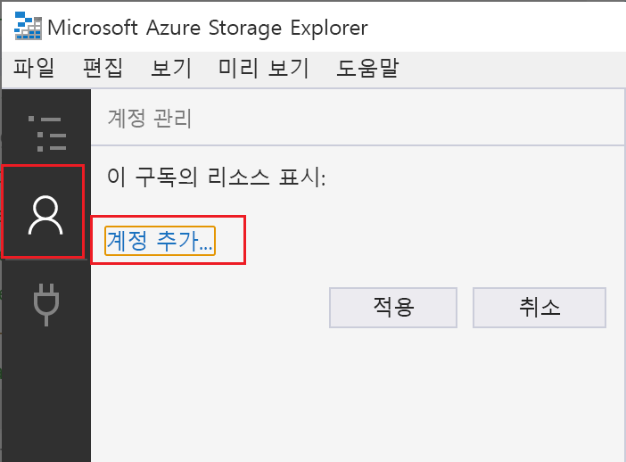
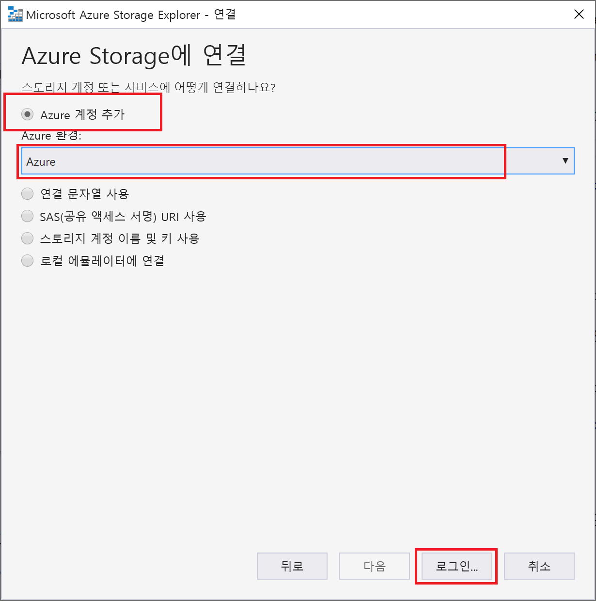
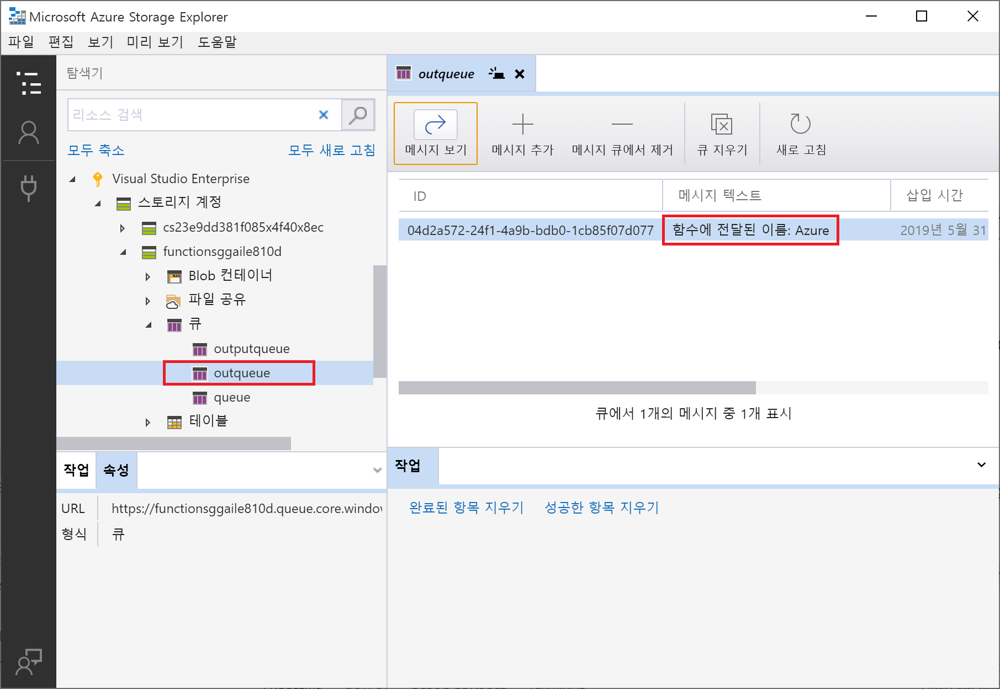
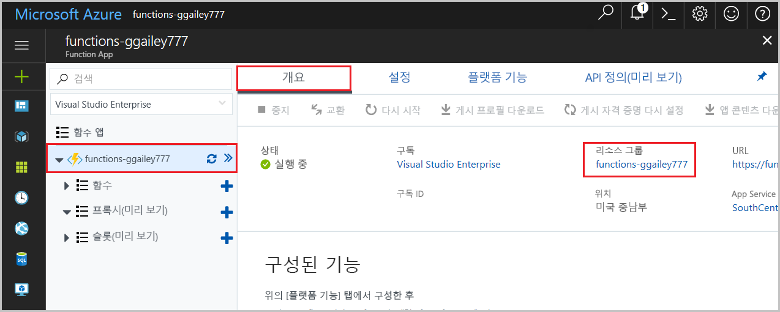

# <a name="connect-functions-to-azure-storage-using-visual-studio-code"></a>Visual Studio Code를 사용하여 Azure Storage에 함수 연결

Azure Functions를 사용하면 자체 통합 코드를 작성하지 않고도 함수를 Azure 서비스 및 기타 리소스에 연결할 수 있습니다. 입력과 출력을 모두 나타내는 이러한 *바인딩*은 함수 정의 내에서 선언됩니다. 바인딩의 데이터는 함수에 매개 변수로 제공됩니다. 트리거는 특수한 형식의 입력 바인딩입니다. 한 함수는 하나의 트리거만 가질 수 있지만, 입력 및 출력 바인딩은 여러 개 가질 수 있습니다. 자세한 내용은 [Azure Functions 트리거 및 바인딩 개념](functions-triggers-bindings.md)을 참조하세요.

이 문서에서는 Visual Studio Code를 사용하여 [이전의 빠른 시작 문서](functions-create-first-function-vs-code.md)에서 만든 함수를 Azure Storage에 연결하는 방법을 보여 줍니다. 이 함수에 추가되는 출력 바인딩은 HTTP 요청의 데이터를 Azure Queue storage 큐의 메시지에 씁니다. 

대부분의 바인딩은 Functions에서 바인딩된 서비스에 액세스할 때 사용할 저장된 연결 문자열이 필요합니다. 이 부분을 간편하게 해결하려면 함수 앱으로 만든 Storage 계정을 사용합니다. 이 계정에 대한 연결은 이미 `AzureWebJobsStorage` 앱 설정에 저장되어 있습니다.  

## <a name="prerequisites"></a>필수 조건

이 문서를 시작하기 전에 다음 요구 사항을 충족해야 합니다.

* [Visual Studio Code용 Azure Storage 확장](https://marketplace.visualstudio.com/items?itemName=ms-azuretools.vscode-azurestorage)을 설치합니다.
* [Azure Storage Explorer](https://storageexplorer.com/)를 설치합니다. Storage Explorer는 출력 바인딩에서 생성하는 큐 메시지를 검토하는 데 사용하는 도구입니다. Storage Explorer는 macOS, Windows, Linux 기반 운영 체제에서 지원됩니다.
* [.NET Core CLI 도구](https://docs.microsoft.com/dotnet/core/tools/?tabs=netcore2x)(C# 프로젝트에만 해당)를 설치합니다.
* [Visual Studio Code 빠른 시작의 1부](functions-create-first-function-vs-code.md)의 단계를 완료합니다. 

이 문서는 Visual Studio Code에서 Azure 구독에 이미 로그인했다고 가정합니다. 명령 팔레트에서 `Azure: Sign In`을 실행하여 로그인할 수 있습니다. 

## <a name="download-the-function-app-settings"></a>함수 앱 설정 다운로드

[이전의 빠른 시작 문서](functions-create-first-function-vs-code.md)에서는 Azure에서 필요한 스토리지 계정과 함께 함수 앱을 만들었습니다. 이 계정의 연결 문자열은 Azure의 앱 설정에 안전하게 저장됩니다. 이 문서에서는 같은 계정의 Storage 큐에 메시지를 작성합니다. 함수를 로컬로 실행할 때 Storage 계정에 연결하려면 앱 설정을 local.settings.json 파일에 다운로드해야 합니다. 

1. F1 키를 눌러 명령 팔레트를 연 다음, `Azure Functions: Download Remote Settings....` 명령을 검색하고 실행합니다. 

1. 이전 문서에서 만든 함수 앱을 선택합니다. **모두 예**를 선택하여 기존 로컬 설정을 덮어씁니다. 

    > [!IMPORTANT]  
    > local.settings.json 파일은 비밀을 포함하고 있으므로 절대 게시되지 않으며, 소스 제어에서 제외됩니다.

1. 스토리지 계정 연결 문자열 값에 대한 키인 `AzureWebJobsStorage` 값을 복사합니다. 이 연결을 사용하여 출력 바인딩이 예상대로 작동하는지 확인합니다.

## <a name="register-binding-extensions"></a>바인딩 확장 등록

Queue storage 출력 바인딩을 사용하므로 프로젝트를 실행하기 전에 스토리지 바인딩 확장을 설치해야 합니다. 

### <a name="javascript"></a>JavaScript

[!INCLUDE [functions-extension-bundles](../../includes/functions-extension-bundles.md)]

### <a name="c-class-library"></a>C\# 클래스 라이브러리

HTTP 및 타이머 트리거를 제외하고 바인딩은 확장 패키지로 구현됩니다. 터미널 창에서 다음 [dotnet add package](/dotnet/core/tools/dotnet-add-package) 명령을 실행하여 프로젝트에 스토리지 확장 패키지를 추가합니다.

```bash
dotnet add package Microsoft.Azure.WebJobs.Extensions.Storage --version 3.0.4
```

이제 프로젝트에 스토리지 출력 바인딩을 추가할 수 있습니다.

## <a name="add-an-output-binding"></a>출력 바인딩 추가

Functions에서 각 바인딩 형식의 `direction`, `type` 및 고유한 `name`을 function.json 파일에 정의해야 합니다. 이러한 특성을 정의하는 방법은 함수 앱의 언어에 따라 달라집니다.

### <a name="javascript"></a>JavaScript

바인딩 특성은 function.json 파일에서 직접 정의됩니다. 바인딩 형식에 따라 추가 속성이 필요할 수 있습니다. [큐 출력 구성](functions-bindings-storage-queue.md#output---configuration)은 Azure Storage 큐 바인딩에 필요한 필드를 설명합니다. 확장을 통해 바인딩을 function.json 파일에 쉽게 추가할 수 있습니다. 

바인딩을 만들려면 HttpTrigger 폴더의 `function.json` 파일을 마우스 오른쪽 단추로 클릭하고(macOS에서 Ctrl+ 클릭) **바인딩 추가...** 를 선택합니다. 프롬프트에 따라 새 바인딩에 대해 다음 바인딩 속성을 정의합니다.

| prompt | 값 | 설명 |
| -------- | ----- | ----------- |
| **바인딩 방향 선택** | `out` | 바인딩은 출력 바인딩입니다. |
| **...방향으로 바인딩 선택** | `Azure Queue Storage` | 바인딩은 Azure Storage 큐 바인딩입니다. |
| **코드에서 이 바인딩을 식별하는 데 사용하는 이름** | `msg` | 코드에서 참조되는 바인딩 매개 변수를 식별하는 이름입니다. |
| **메시지가 전송될 큐** | `outqueue` | 바인딩이 데이터를 쓰는 큐의 이름입니다. 바인딩을 처음 사용할 때 *queueName*이 없으면 바인딩이 알아서 만듭니다. |
| **"local.setting.json"에서 설정 선택** | `AzureWebJobsStorage` | 스토리지 계정의 연결 문자열이 포함된 애플리케이션 설정의 이름입니다. `AzureWebJobsStorage` 설정은 함수 앱을 사용하여 만든 Storage 계정의 연결 문자열을 포함합니다. |

바인딩은 function.json 파일의 `bindings` 배열에 추가되며, 이제 다음 예제처럼 표시됩니다.

```json
{
   ...

  "bindings": [
    {
      "authLevel": "function",
      "type": "httpTrigger",
      "direction": "in",
      "name": "req",
      "methods": [
        "get",
        "post"
      ]
    },
    {
      "type": "http",
      "direction": "out",
      "name": "$return"
    },
    {
      "type": "queue",
      "direction": "out",
      "name": "msg",
      "queueName": "outqueue",
      "connection": "AzureWebJobsStorage"
    }
  ]
}
```

### <a name="c-class-library"></a>C\# 클래스 라이브러리

C# 클래스 라이브러리 프로젝트에서 바인딩은 함수 메서드의 바인딩 특성으로 정의됩니다. 그런 다음, function.json 파일은 이러한 특성을 기반으로 자동으로 생성됩니다.

HttpTrigger.cs 프로젝트 파일을 열고 다음 `using` 문을 추가합니다.

```cs
using Microsoft.Azure.WebJobs.Extensions.Storage;
```

다음 매개 변수를 `Run` 메서드 정의에 추가합니다.

```cs
[Queue("outqueue"),StorageAccount("AzureWebJobsStorage")] ICollector<string> msg
```

`msg` 매개 변수는 `ICollector<T>` 형식이며, 함수가 완료될 때 출력 바인딩에 작성되는 메시지의 컬렉션을 나타냅니다. 이 경우 출력은 `outqueue`라는 스토리지 큐입니다. 스토리지 계정에 대한 연결 문자열은 `StorageAccountAttribute`로 설정됩니다. 이 특성은 스토리지 계정 연결 문자열을 포함하는 설정을 나타내며 클래스, 메서드 또는 매개 변수 수준에서 적용될 수 있습니다. 이 경우 이미 기본 스토리지 계정을 사용하고 있으므로 `StorageAccountAttribute`를 생략할 수 있습니다.

Run 메서드 정의는 이제 다음과 같이 표시됩니다.  

```cs
[FunctionName("HttpTrigger")]
public static async Task<IActionResult> Run(
    [HttpTrigger(AuthorizationLevel.Function, "get", "post", Route = null)] HttpRequest req, 
    [Queue("outqueue"),StorageAccount("AzureWebJobsStorage")] ICollector<string> msg, ILogger log)
```

## <a name="add-code-that-uses-the-output-binding"></a>출력 바인딩을 사용하는 코드 추가

바인딩이 정의되면 바인딩의 `name`을 사용하여 함수 시그니처의 특성으로 액세스할 수 있습니다. 출력 바인딩을 사용하면 인증을 받거나 큐 참조를 가져오거나 데이터를 쓸 때 Azure Storage SDK 코드를 사용할 필요가 없습니다. Functions 런타임 및 큐 출력 바인딩이 이러한 작업을 알아서 처리합니다.

### <a name="javascript"></a>JavaScript

`context.bindings`에서 `msg` 출력 바인딩 개체를 사용하여 큐 메시지를 만드는 코드를 추가합니다. `context.res` 문 앞에 이 코드를 추가합니다.

```javascript
// Add a message to the Storage queue.
context.bindings.msg = "Name passed to the function: " + 
(req.query.name || req.body.name);
```

이 시점에서 함수는 다음과 같이 표시됩니다.

```javascript
module.exports = async function (context, req) {
    context.log('JavaScript HTTP trigger function processed a request.');

    if (req.query.name || (req.body && req.body.name)) {
        // Add a message to the Storage queue.
        context.bindings.msg = "Name passed to the function: " + 
        (req.query.name || req.body.name);
        context.res = {
            // status: 200, /* Defaults to 200 */
            body: "Hello " + (req.query.name || req.body.name)
        };
    }
    else {
        context.res = {
            status: 400,
            body: "Please pass a name on the query string or in the request body"
        };
    }
};
```

### <a name="c"></a>C\#

`msg` 출력 바인딩 개체를 사용하여 큐 메시지를 만드는 코드를 추가합니다. 메서드가 반환되기 전에 이 코드를 추가합니다.

```cs
if (!string.IsNullOrEmpty(name))
{
    // Add a message to the output collection.
    msg.Add(string.Format("Name passed to the function: {0}", name));
}
```

이 시점에서 함수는 다음과 같이 표시됩니다.

```cs
[FunctionName("HttpTrigger")]
public static async Task<IActionResult> Run(
    [HttpTrigger(AuthorizationLevel.Function, "get", "post", Route = null)] HttpRequest req, 
    [Queue("outqueue"),StorageAccount("AzureWebJobsStorage")] ICollector<string> msg, ILogger log)
{
    log.LogInformation("C# HTTP trigger function processed a request.");

    string name = req.Query["name"];

    string requestBody = await new StreamReader(req.Body).ReadToEndAsync();
    dynamic data = JsonConvert.DeserializeObject(requestBody);
    name = name ?? data?.name;

    if (!string.IsNullOrEmpty(name))
    {
        // Add a message to the output collection.
        msg.Add(string.Format("Name passed to the function: {0}", name));
    }
    return name != null
        ? (ActionResult)new OkObjectResult($"Hello, {name}")
        : new BadRequestObjectResult("Please pass a name on the query string or in the request body");
}
```

[!INCLUDE [functions-run-function-test-local-vs-code](../../includes/functions-run-function-test-local-vs-code.md)]

**outqueue**라는 새 큐는 출력 바인딩이 처음 사용될 때 함수 런타임에 의해 Storage 계정에 만들어집니다. Storage Explorer를 사용하여 새 메시지와 함께 큐가 만들어졌는지 확인합니다.

### <a name="connect-storage-explorer-to-your-account"></a>Storage Explorer를 계정에 연결

Azure Storage Explorer를 이미 설치했고 Azure 계정에 연결한 경우 이 섹션을 건너뜁니다.

1. [Azure Storage Explorer] 도구를 실행하여 왼쪽에 있는 연결 아이콘을 선택한 다음, **계정 추가**를 선택합니다.

    

1. **연결** 대화 상자에서 **Azure 계정 추가**를 선택한 다음, **Azure 환경**과 **로그인...** 을 차례대로 선택합니다. 

    

계정에 성공적으로 로그인하면 계정에 연결된 모든 Azure 구독이 표시됩니다.

### <a name="examine-the-output-queue"></a>출력 큐 검토

1. Visual Studio Code에서 F1 키를 눌러 명령 팔레트를 연 다음, `Azure Storage: Open in Storage Explorer` 명령을 검색하여 실행하고 스토리지 계정 이름을 선택합니다. 스토리지 계정이 Azure Storage Explorer에서 열립니다.  

1. **큐** 노드를 확장한 다음 이름이 **outqueue**인 큐를 선택합니다. 

   이 큐에는 HTTP 트리거 함수를 실행했을 때 만들어진 큐 출력 바인딩 메시지가 포함되어 있습니다. 기본 `name` 값 Azure로 함수를 호출했다면 큐 메시지는 ‘함수에 전달된 이름:   Azure’입니다.

    

1. 함수를 다시 실행한 다음, 다른 요청을 보내면 큐에 새 메시지가 표시되는 것을 알 수 있습니다.  

이제 업데이트된 함수 앱을 Azure에 다시 게시할 차례입니다.

## <a name="redeploy-and-test-the-updated-app"></a>업데이트된 앱 재배포 및 테스트

1. Visual Studio Code에서 F1 키를 눌러 명령 팔레트를 엽니다. 명령 팔레트에서 `Azure Functions: Deploy to function app...`을 검색하여 선택합니다.

1. 처음 문서에서 만든 함수 앱을 선택합니다. 동일한 앱에 프로젝트를 다시 배포하므로 **배포**를 선택하여 파일 덮어쓰기에 대한 경고를 해제합니다.

1. 배포가 완료되면 cURL 또는 브라우저를 다시 사용하여 재배포된 함수를 테스트할 수 있습니다. 앞에서와 같이 쿼리 문자열을 `&name=<yourname>` URL에 추가합니다. 다음 예제를 참조하세요.

    ```bash
    curl https://myfunctionapp.azurewebsites.net/api/httptrigger?code=cCr8sAxfBiow548FBDLS1....&name=<yourname>
    ```

1. 다시 [스토리지 큐의 메시지를 보고](#examine-the-output-queue) 출력 바인딩이 큐에 새 메시지를 다시 생성하는지 확인합니다.

## <a name="clean-up-resources"></a>리소스 정리

Azure에서 *리소스*란 앱, 함수, 저장소 계정 등을 의미합니다. 리소스는 *리소스 그룹*으로 그룹화되며 그룹을 삭제하면 그룹의 모든 항목을 삭제할 수 있습니다.

이러한 빠른 시작을 완료하기 위해 리소스를 만들었습니다. [계정 상태](https://azure.microsoft.com/account/) 및 [서비스 가격 책정](https://azure.microsoft.com/pricing/)에 따라 리소스에 대해 요금이 청구될 수 있습니다. 리소스가 더 이상 필요하지 않게 되면 다음과 같이 삭제합니다.

1. Visual Studio Code에서 F1 키를 눌러 명령 팔레트를 엽니다. 명령 팔레트에서 `Azure Functions: Open in portal`을 검색하여 선택합니다.

1. 함수 앱을 선택한 다음, Enter 키를 누릅니다. 함수 앱 페이지는 [Azure Portal](https://portal.azure.com)에서 열립니다.

1. **개요** 탭에서 **리소스 그룹** 아래에 있는 명명된 링크를 선택합니다.

    

1. **리소스 그룹** 페이지에서 포함된 리소스 목록을 검토하고 삭제하려는 항목인지 확인합니다.
 
1. **리소스 그룹 삭제**를 선택하고 지시를 따릅니다.

   삭제는 몇 분 정도 소요됩니다. 완료되면 알림이 잠시 표시됩니다. 페이지 위쪽의 종 모양 아이콘을 선택해도 알림을 확인할 수 있습니다.

## <a name="next-steps"></a>다음 단계

Storage 큐에 데이터를 쓰도록 HTTP 트리거 함수를 업데이트했습니다. Functions 개발에 대한 자세한 내용은 [Visual Studio Code를 사용하여 Azure Functions 개발](functions-develop-vs-code.md)을 참조하세요.

다음으로, 함수 앱에 Application Insights 모니터링을 사용하도록 설정해야 합니다.

> [!div class="nextstepaction"]
> [Application Insights 통합 사용](functions-monitoring.md#manually-connect-an-app-insights-resource)

[Azure Storage Explorer]: https://storageexplorer.com/
