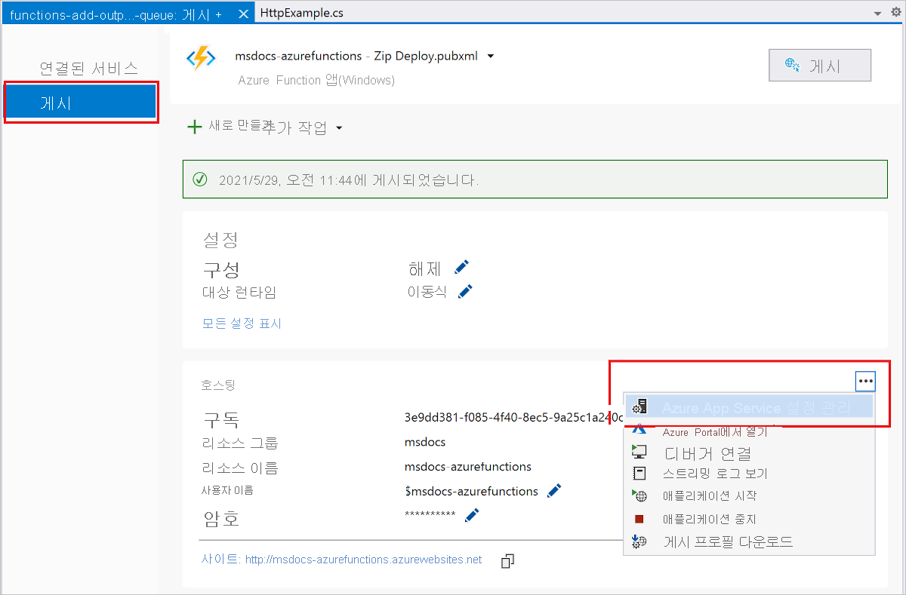

# <a name="connect-functions-to-azure-storage-using-visual-studio"></a>Visual Studio를 사용하여 Azure Storage에 함수 연결

[!INCLUDE [functions-add-storage-binding-intro](../../includes/functions-add-storage-binding-intro.md)]

이 문서에서는 Visual Studio를 사용하여 [이전 빠른 시작 문서]에서 만든 함수를 Azure Storage에 연결하는 방법을 보여 줍니다. 이 함수에 추가되는 출력 바인딩은 HTTP 요청의 데이터를 Azure Queue storage 큐의 메시지에 씁니다. 

대부분의 바인딩은 Functions에서 바인딩된 서비스에 액세스할 때 사용할 저장된 연결 문자열이 필요합니다. 이 부분을 간편하게 해결하려면 함수 앱으로 만든 Storage 계정을 사용합니다. 이 계정에 대한 연결은 이미 `AzureWebJobsStorage` 앱 설정에 저장되어 있습니다.  

## <a name="prerequisites"></a>사전 요구 사항

이 문서를 시작하기 전에 다음을 수행해야 합니다. 

 - [Visual Studio 빠른 시작의 1부](./functions-create-your-first-function-visual-studio.md)를 완료합니다. 

- Visual Studio에서 Azure 구독에 로그인합니다.

## <a name="download-the-function-app-settings"></a>함수 앱 설정 다운로드

[이전의 빠른 시작 문서](functions-create-first-function-vs-code.md)에서는 Azure에서 필요한 스토리지 계정과 함께 함수 앱을 만들었습니다. 이 계정의 연결 문자열은 Azure의 앱 설정에 안전하게 저장됩니다. 이 문서에서는 같은 계정의 Storage 큐에 메시지를 작성합니다. 함수를 로컬로 실행할 때 Storage 계정에 연결하려면 앱 설정을 *local.settings.json* 파일에 다운로드해야 합니다. 

1. **솔루션 탐색기**에서 프로젝트를 마우스 오른쪽 단추로 클릭하고 **게시**를 선택합니다. 

1. **작업** 아래에서 **Azure App Service 설정 편집**을 선택합니다. 

    

1. **AzureWebJobsStorage** 아래에서 **원격** 문자열 값을 **로컬**에 복사한 다음, **확인**을 선택합니다. 

이제 연결에 대한 `AzureWebJobsStorage` 설정을 사용하는 스토리지 바인딩에서 로컬로 실행할 때 Queue 스토리지에 연결할 수 있습니다.

## <a name="register-binding-extensions"></a>바인딩 확장 등록

Queue 스토리지 출력 바인딩을 사용하므로 먼저 Storage 바인딩 확장을 설치한 후에 프로젝트를 실행해야 합니다. HTTP 및 타이머 트리거를 제외하고는 바인딩이 확장 패키지로 구현됩니다. 

1. **도구** 메뉴에서 **NuGet 패키지 관리자** > **패키지 관리자 콘솔**을 선택합니다. 

1. 콘솔에서 다음 [Install-Package](/nuget/tools/ps-ref-install-package) 명령을 실행하여 Storage 확장을 설치합니다.

    ```Command
    Install-Package Microsoft.Azure.WebJobs.Extensions.Storage -Version 3.0.6
    ````

이제 프로젝트에 스토리지 출력 바인딩을 추가할 수 있습니다.

## <a name="add-an-output-binding"></a>출력 바인딩 추가

[!INCLUDE [functions-add-storage-binding-csharp-library](../../includes/functions-add-storage-binding-csharp-library.md)]

## <a name="add-code-that-uses-the-output-binding"></a>출력 바인딩을 사용하는 코드 추가

바인딩이 정의되면 바인딩의 `name`을 사용하여 함수 시그니처의 특성으로 액세스할 수 있습니다. 출력 바인딩을 사용하면 인증을 받거나 큐 참조를 가져오거나 데이터를 쓸 때 Azure Storage SDK 코드를 사용할 필요가 없습니다. Functions 런타임 및 큐 출력 바인딩이 이러한 작업을 알아서 처리합니다.

[!INCLUDE [functions-add-storage-binding-csharp-library-code](../../includes/functions-add-storage-binding-csharp-library-code.md)]

## <a name="run-the-function-locally"></a>로컬에서 함수 실행

[!INCLUDE [functions-run-function-test-local-vs](../../includes/functions-run-function-test-local-vs.md)]

출력 바인딩이 처음 사용되면 Functions 런타임에서 `outqueue`라는 새 큐가 스토리지 계정에 만들어집니다. 클라우드 탐색기를 사용하여 새 메시지와 함께 큐가 만들어졌는지 확인합니다.

## <a name="examine-the-output-queue"></a>출력 큐 검토

1. Visual Studio의 **보기** 메뉴에서 **클라우드 탐색기**를 선택합니다.

1. **클라우드 탐색기**에서 Azure 구독 및 **스토리지 계정**을 펼친 다음, 함수에서 사용하는 스토리지 계정을 펼칩니다. 스토리지 계정 이름을 기억할 수 없는 경우 *local.settings.json* 파일에서 `AzureWebJobsStorage` 연결 문자열 설정을 확인합니다.  

1. **큐** 노드를 펼친 다음, **outqueue**라는 큐를 두 번 클릭하여 Visual Studio에서 큐의 내용을 확인합니다. 

   이 큐에는 HTTP 트리거 함수를 실행했을 때 만들어진 큐 출력 바인딩 메시지가 포함되어 있습니다. 기본 `name` 값 *Azure*로 함수를 호출했다면 큐 메시지는 *함수에 전달된 이름: Azure*입니다.

    

1. 함수를 다시 실행한 다음, 다른 요청을 보내면 큐에 새 메시지가 표시되는 것을 알 수 있습니다.  

이제 업데이트된 함수 앱을 Azure에 다시 게시할 차례입니다.

## <a name="redeploy-and-verify-the-updated-app"></a>업데이트된 앱 다시 배포 및 확인

1. **솔루션 탐색기**에서 마우스 오른쪽 단추로 프로젝트를 클릭하고, **게시**를 선택한 다음, **게시**를 선택하여 해당 프로젝트를 Azure에 다시 게시합니다.

1. 배포가 완료되면 브라우저를 다시 사용하여 다시 배포된 함수를 테스트할 수 있습니다. 이전과 마찬가지로 `&name=<yourname>` 쿼리 문자열을 URL에 추가합니다.

1. 다시 [스토리지 큐의 메시지를 보고](#examine-the-output-queue) 출력 바인딩이 큐에 새 메시지를 다시 생성하는지 확인합니다.

## <a name="clean-up-resources"></a>리소스 정리

[!INCLUDE [Clean-up resources](../../includes/functions-quickstart-cleanup.md)]

## <a name="next-steps"></a>다음 단계

Storage 큐에 데이터를 쓰도록 HTTP 트리거 함수를 업데이트했습니다. Functions 개발에 대한 자세한 내용은 [Visual Studio를 사용하여 Azure Functions 개발](functions-develop-vs.md)을 참조하세요.

다음으로, 함수 앱에 Application Insights 모니터링을 사용하도록 설정해야 합니다.

> [!div class="nextstepaction"]
> [Application Insights 통합 사용](functions-monitoring.md#manually-connect-an-app-insights-resource)

[Azure Storage Explorer]: https://storageexplorer.com/
[이전 빠른 시작 문서]: functions-create-your-first-function-visual-studio.md
