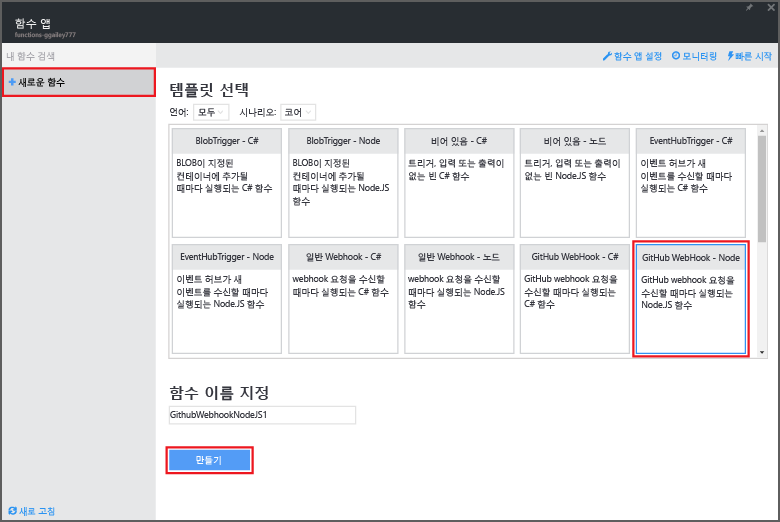
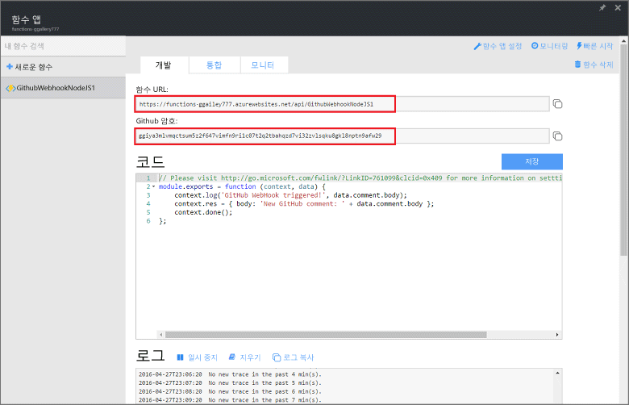
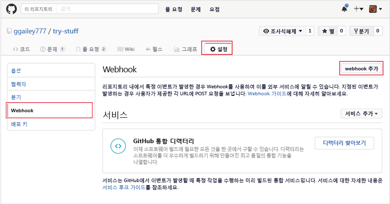
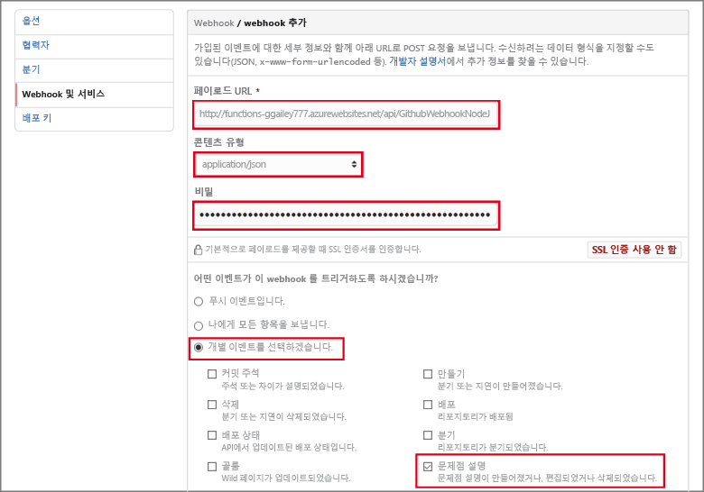

<properties
   pageTitle="API Azure Function용 웹후크 만들기 | Microsoft Azure"
   description="Azure Functions를 사용하여 웹후크 또는 API 호출에 의해 호출되는 함수를 만듭니다."
   services="azure-functions"
   documentationCenter="na"
   authors="ggailey777"
   manager="erikre"
   editor=""
   tags=""
   />

<tags
   ms.service="functions"
   ms.devlang="multiple"
   ms.topic="get-started-article"
   ms.tgt_pltfrm="multiple"
   ms.workload="na"
   ms.date="08/30/2016"
   ms.author="glenga"/>
   
# API Azure Function용 웹후크 만들기

Azure Functions은 이벤트 기반 주문형 계산 환경이며 이를 통해 다양한 프로그래밍 언어로 구현된 예약되거나 트리거된 코드 단위를 만들 수 있습니다. Azure Functions에 대해 자세히 알아보려면 [Azure Functions 개요](functions-overview.md)를 참조하세요.

이 항목에서는 GitHub 웹후크에서 호출되는 새 Node.js 함수를 만드는 방법을 보여 줍니다. 새 함수는 Azure Functions 포털에서 미리 정의된 템플릿을 기반으로 생성됩니다. 포털에서 이러한 단계는 수행하는 방법을 보여 주는 짧은 비디오를 시청할 수도 있습니다.

## 비디오 보기

다음 비디오는 이 자습서에서 기본 단계를 수행하는 방법을 보여 줍니다.

[AZURE.VIDEO create-a-web-hook-or-api-azure-function]

##템플릿에서 웹후크로 트리거된 함수 만들기

함수 앱은 Azure에서 함수 실행을 호스트합니다. 함수를 만들기 전에 활성 Azure 계정이 있어야 합니다. Azure 계정이 아직 없는 경우 [무료 계정을 사용](https://azure.microsoft.com/free/)할 수 있습니다.

1. [Azure Functions 포털](https://functions.azure.com/signin)로 이동하여 Azure 계정으로 로그인합니다.

2. 기존 함수 앱을 사용 하는 경우 **함수 앱**에서 선택하고 **열기**를 클릭합니다. 새 함수 앱을 만들려면 새 함수 앱에 대해 고유한 **이름**을 입력하거나 생성된 이름을 수락하거나 선호하는 **지역**을 선택한 후 **만들기 + 시작**을 클릭합니다.

3. 함수 앱에서 **+새 함수** > **GitHub 웹후크 - 노드** > **만들기**를 클릭합니다. 이렇게 하면 기본 이름을 가진 지정된 템플릿을 기반으로 하는 함수를 만듭니다.

	

4. **개발**의 **코드** 창에서 샘플 express.js 함수를 적어둡니다. 이 함수는 문제 주석 웹후크에서 GitHub 요청을 받고 문제 텍스트를 기록하며 웹후크에 `New GitHub comment: <Your issue comment text>`으로 응답을 보냅니다.

	

5. **함수 URL** 및 **GitHub 암호** 값을 복사합니다. GitHub에서 웹후크를 만들 경우에 필요합니다.

6. **실행** 아래로 스크롤하여 요청 본문에서 문제 주석의 미리 정의된 JSON 본문을 적어둔 다음 **실행**을 클릭합니다.
 
	예상되는 본문 JSON 데이터를 제공하고 **실행** 단추를 클릭하여 **개발** 탭에서 새 템플릿 기반 함수를 항상 바로 테스트할 수 있습니다. 이 경우에 템플릿에는 문제 주석에 대한 미리 정의된 본문이 있습니다.
 
다음으로 GitHub 리포지토리에 실제 웹후크를 만듭니다.

##웹후크 구성

1. GitHub에서 분기한 리포지토리를 포함하여 사용자가 소유한 리포지토리로 이동합니다.
 
2. **설정** > **웹후크 및 서비스** > **웹후크 추가**를 클릭합니다.

	

3. 함수의 URL 및 암호를 **페이로드 URL** 및 **비밀**에 붙여 넣은 다음 **개별 이벤트 선택**을 클릭하고 **문제 주석**을 선택한 다음 **웹후크 추가**를 클릭합니다.

	

이 시점에서 GitHub 웹후크는 새로운 문제 주석이 추가될 경우 함수를 트리거하도록 구성됩니다. 이제, 테스트하겠습니다.

##함수 테스트

1. GitHub 리포지토리의 새 브라우저 창에서 **문제** 탭을 열고 **새 문제**를 클릭하여 제목을 입력한 다음 **새 문제 제출**을 클릭합니다. 또한 기존 문제점을 열 수 있습니다.

2. 문제에 주석을 입력하고 **주석**을 클릭합니다. 이 시점에서 다시 GitHub의 웹후크로 이동하고 **최근 배달**에서 웹후크 요청을 보냈고 응답 본문이 `New GitHub comment: <Your issue comment text>`이라는 것을 확인합니다.

3. 함수 포털에 다시 돌아가서 로그 아래로 스크롤하여 함수를 트리거하고 값 `New GitHub comment: <Your issue comment text>`을 스트리밍 로그에 기록했음을 확인합니다.

##다음 단계

Azure Functions에 대한 자세한 내용은 다음 항목을 참조합니다.

+ [Azure Functions 개발자 참조](functions-reference.md) 함수를 코딩하는 프로그래머 참조입니다.
+ [Azure Functions 테스트](functions-test-a-function.md) 함수를 테스트하는 다양한 도구와 기법을 설명합니다.
+ [Azure Functions 크기 조정 방법](functions-scale.md) 동적 서비스 계획 등 Azure Functions에 사용할 수 있는 서비스 계획과 적절한 계획을 선택하는 방법을 설명합니다.

[AZURE.INCLUDE [시작 메모](../../includes/functions-get-help.md)]

<!---HONumber=AcomDC_0928_2016-->