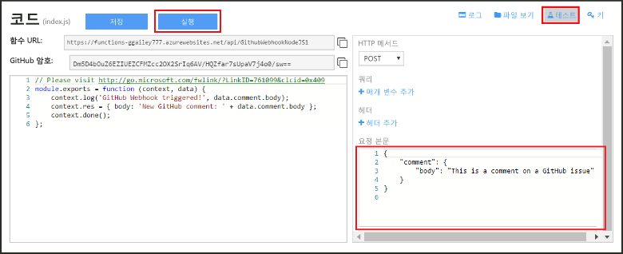

# API Azure Function용 웹후크 만들기
Azure Functions는 이벤트 기반 주문형 계산 환경이며 이를 통해 다양한 프로그래밍 언어로 구현된 예약되거나 트리거된 코드 단위를 만들 수 있습니다. Azure Functions에 대해 자세히 알아보려면 [Azure Functions 개요](functions-overview.md)를 참조하세요.

이 항목에서는 GitHub 웹후크에서 호출되는 JavaScript 함수를 만드는 방법을 보여 줍니다. 새 함수는 Azure Functions 포털에서 미리 정의된 템플릿을 기반으로 생성됩니다. 포털에서 이러한 단계는 수행하는 방법을 보여 주는 짧은 비디오를 시청할 수도 있습니다.

JavaScript가 아니라 C# 또는 F#으로 함수를 만드는 데 이 자습서의 일반 단계도 사용할 수 있습니다. 

## 비디오 보기
다음 비디오는 이 자습서의 기본 단계를 수행하는 방법을 보여 줍니다. 

>[!VIDEO https://channel9.msdn.com/Series/Windows-Azure-Web-Sites-Tutorials/Create-a-Web-Hook-or-API-Azure-Function/player]
>
>

## 필수 조건

이 자습서를 완료하려면 다음이 필요합니다.

+ 활성 Azure 계정. 아직 계정이 없는 경우 [무료 Azure 계정을 등록](https://azure.microsoft.com/free/)할 수 있습니다.  
 Azure 계정 없이 자습서를 완료하는 데 [Functions 사용](https://functions.azure.com/try) 환경을 사용할 수도 있습니다.
+ GitHub 계정. 아직 없는 경우 [무료 GitHub 계정을 등록](https://github.com/join)할 수 있습니다. 

## 템플릿에서 웹후크로 트리거된 함수 만들기
함수 앱은 Azure에서 함수 실행을 호스트합니다. 

1. [Azure Functions 포털](https://functions.azure.com/signin) 로 이동하여 Azure 계정으로 로그인합니다.

2. 기존 함수 앱을 사용하는 경우 **함수 앱**에서 선택하고 **열기**를 클릭합니다. 함수 앱을 만들려면 새 함수 앱에 대해 고유한 **이름**을 입력하거나 생성된 이름을 수락하거나 선호하는 **지역**을 선택한 후 **만들기 + 시작**을 클릭합니다. 

3. 함수 앱에서 **+새 함수** > **GitHub 웹후크 - JavaScript** > **만들기**를 클릭합니다. 이 단계에서는 기본 이름을 가진 지정된 템플릿을 기반으로 하는 함수를 만듭니다. 또는 C# 또는 F# 함수를 만들 수 있습니다.
   
     

4. **개발**의 **코드** 창에서 샘플 express.js 함수를 적어둡니다. 이 함수는 문제 주석 웹후크에서 GitHub 요청을 받고 문제 텍스트를 기록하며 웹후크에 `New GitHub comment: <Your issue comment text>`으로 응답을 보냅니다.

     

1. **함수 URL** 및 **GitHub 암호** 값을 복사 및 저장합니다. 다음 섹션에서 이러한 값을 사용하여 GitHub에서 웹후크를 구성합니다. 

2. **테스트**를 클릭하고 **요청 본문**에서 문제 주석의 미리 정의된 JSON 본문을 적어둔 다음 **실행**을 클릭합니다. 

    
   
    > [!NOTE]
    > 예상되는 본문 JSON 데이터를 제공하고 **실행** 단추를 클릭하여 **개발** 탭에서 새 템플릿 기반 함수를 항상 바로 테스트할 수 있습니다. 이 경우에 템플릿에는 문제 주석에 대한 미리 정의된 본문이 있습니다. 

다음으로 GitHub 리포지토리에 실제 웹후크를 만듭니다.

## 웹후크 구성
1. GitHub에서 소유한 리포지토리로 이동합니다. 분기된 모든 리포지토리를 사용할 수 있습니다.
 
2. **설정** > **웹후크 및 서비스** > **웹후크 추가**를 클릭합니다.
   
       

3. 함수의 URL 및 암호를 **페이로드 URL** 및 **암호**에 붙여 넣고 **콘텐츠 형식**에 **application/json**을 선택합니다.

4. **개별 이벤트 선택**을 클릭하고 **문제 주석**을 선택하고 **웹후크 추가**를 클릭합니다.
   
     

이 시점에서 GitHub 웹후크는 새로운 문제 주석이 추가될 경우 함수를 트리거하도록 구성됩니다.  
이제, 테스트하겠습니다.

## 함수 테스트
1. GitHub 리포지토리에서 새 브라우저 창에 **문제** 탭을 엽니다.

2. 새 창에서 **새 문제**를 클릭하고 제목을 입력한 다음 **새 문제 제출**을 클릭합니다. 또한 기존 문제점을 열 수 있습니다.

2. 문제에 주석을 입력하고 **주석**을 클릭합니다. 

3. 다른 GitHub 창에서 새 웹후크 옆의 **편집**을 클릭하고 **최근 배달**로 아래로 스크롤하고 웹후크 요청이 전송되었고 응답의 본문이 `New GitHub comment: <Your issue comment text>`인지 확인합니다.

3. 함수 포털에 다시 돌아가서 로그 아래로 스크롤하여 함수를 트리거하고 값 `New GitHub comment: <Your issue comment text>` 을 스트리밍 로그에 기록했음을 확인합니다.

## 다음 단계
Azure Functions에 대한 자세한 내용은 다음 항목을 참조합니다.

* [Azure Functions 개발자 참조](functions-reference.md)  
  함수를 코딩하는 프로그래머 참조입니다.
* [Azure Functions 테스트](functions-test-a-function.md)  
  함수를 테스트하는 다양한 도구와 기법을 설명합니다.
* [Azure Functions 크기 조정 방법](functions-scale.md)  
  소비 호스팅 요금제, 올바른 요금제 선택 방법을 포함하여 Azure Functions에서 사용 가능한 서비스 요금제에 대해 설명합니다.  

[!INCLUDE [Getting Started Note](../../includes/functions-get-help.md)]

<!--HONumber=Feb17_HO1-->

