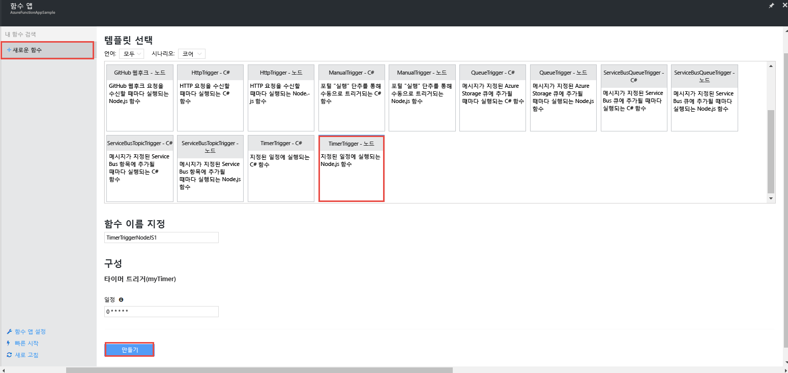
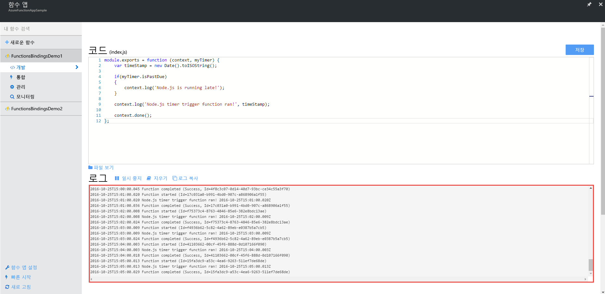
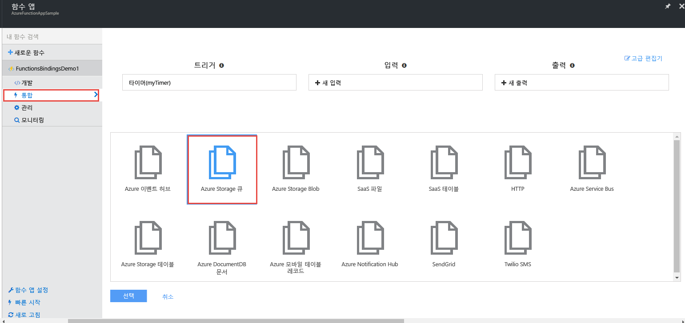
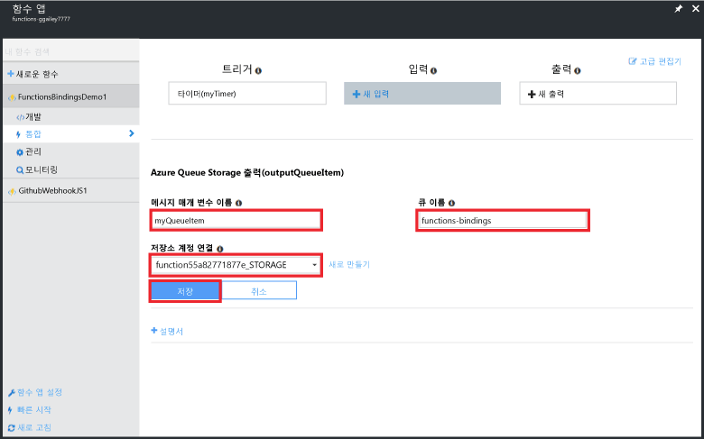
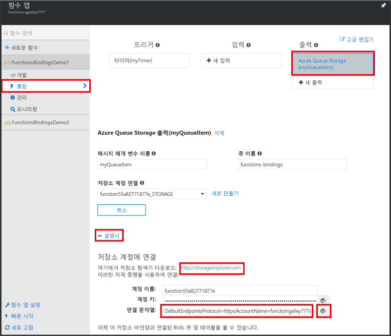
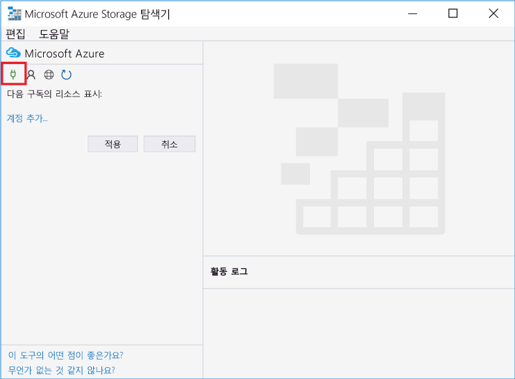
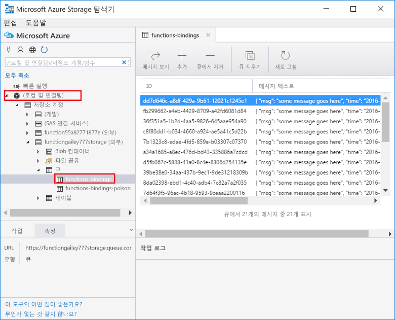
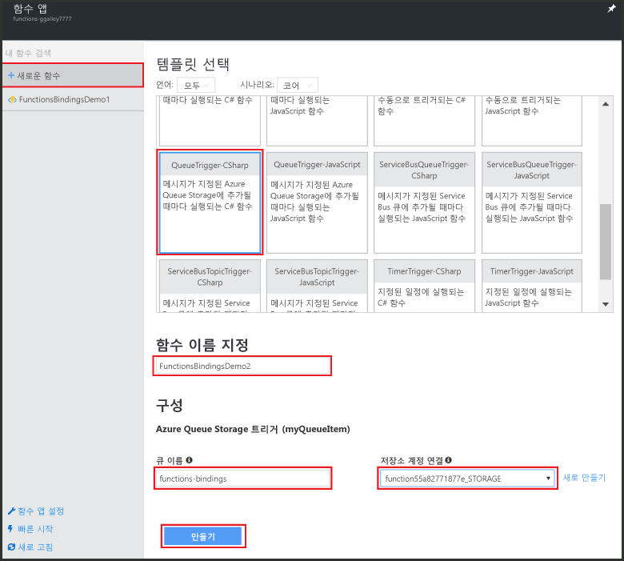
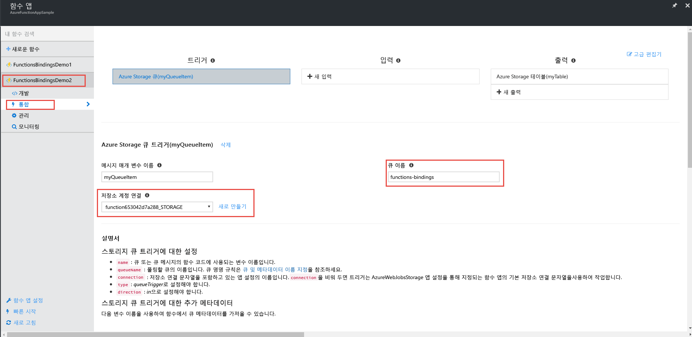
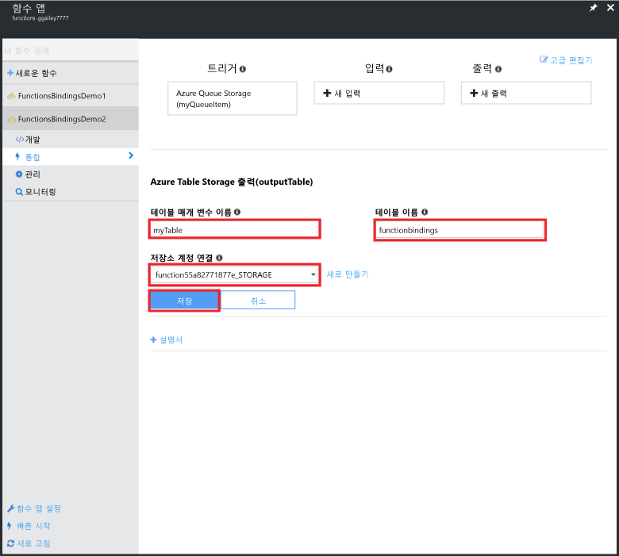

# <a name="use-azure-functions-to-create-a-function-that-connects-to-other-azure-services"></a>다른 Azure 서비스에 연결하는 함수를 만들려면 Azure Functions를 사용합니다.

이 항목에서는 Azure Storage 큐의 메시지를 수신 대기하고 Azure Storage 테이블에 그 메시지를 복사하는 Azure Functions에서 함수 만드는 방법에 대해 알아봅니다. 메시지를 큐에 로드하는 데 타이머 트리거 함수가 사용됩니다. 두 번째 함수는 큐에서 메시지를 읽어 와서 테이블에 씁니다. 바인딩 정의를 기반으로 Azure Functions가 사용자에 대한 큐와 테이블을 모두 생성합니다. 

좀더 흥미로운 학습을 위해 한 함수는 JavaScript로 다른 함수는 C# 스크립트로 작성합니다. 여기서는 함수 앱이 다양한 언어로 된 함수를 포함하는 방식을 보여 줍니다. 

[채널 9의 비디오](https://channel9.msdn.com/Series/Windows-Azure-Web-Sites-Tutorials/Create-an-Azure-Function-which-binds-to-an-Azure-service/player)에서 설명된 이 시나리오를 볼 수 있습니다.

## <a name="create-a-function-that-writes-to-the-queue"></a>큐에 기록할 함수 만들기

저장소 큐에 연결하려면 먼저 메시지 큐를 로드하는 함수를 만들어야 합니다. 이 JavaScript 함수는 10초마다 메시지를 큐에 기록하는 타이머 트리거를 사용합니다. Azure 계정이 없는 경우 [Azure Functions 사용](https://functions.azure.com/try) 환경을 확인하거나 [무료 Azure 계정을 만드세요](https://azure.microsoft.com/free/).

1. Azure Portal로 이동하여 함수 앱을 찾습니다.

2. **새 함수** > **TimerTrigger-JavaScript**를 클릭합니다. 

3. 함수의 이름을 **FunctionsBindingsDemo1**로 지정하고 **일정**에 대한 `0/10 * * * * *` 식 값을 입력한 후 **만들기**를 클릭합니다.
   
    

    이제 10초마다 실행되는 타이머 트리거 함수가 생성되었습니다.

5. **개발** 탭에서 **로그**를 클릭하고 로그에 있는 활동을 확인합니다. 10초마다 기록된 로그 항목이 표시됩니다.
   
    

## <a name="add-a-message-queue-output-binding"></a>메시지 큐 출력 바인딩 추가

1. **통합** 탭에서 **새 출력** > **Azure Queue Storage** > **선택**을 선택합니다.

    

2. **메시지 매개 변수 이름**에 대해 `myQueueItem`을, **큐 이름**에 대해 `functions-bindings`를 입력하고 기존 **Storage 계정 연결**을 선택하거나 **새로 만들기**를 클릭하여 저장소 계정 연결을 만든 후 **저장**을 클릭합니다.  

    

1. 다시 **개발** 탭으로 돌아가 함수에 다음 코드를 추가합니다.
   
    ```javascript
   
    function myQueueItem() 
    {
        return {
            msg: "some message goes here",
            time: "time goes here"
        }
    }
   
    ```
2. 함수의 줄 9 주위에서 *if* 문을 찾고 해당 문 뒤에 다음 코드를 삽입합니다.
   
    ```javascript
   
    var toBeQed = myQueueItem();
    toBeQed.time = timeStamp;
    context.bindings.myQueueItem = toBeQed;
   
    ```  
   
    이 코드는 **myQueueItem**을 만들고 **시간** 속성을 현재 timeStamp로 설정합니다. 그런 다음 새 큐 항목을 컨텍스트의 **myQueueItem** 바인딩에 추가합니다.

3. **저장 및 실행**을 클릭합니다.

## <a name="view-storage-updates-by-using-storage-explorer"></a>Storage 탐색기를 사용하여 저장소 업데이트 보기
생성한 큐에서 메시지를 확인하여 함수가 작동하는지 확인할 수 있습니다.  Visual Studio에서 클라우드 탐색기를 사용하여 저장소 큐에 연결할 수 있습니다. 그러나 포털에서 Microsoft Azure Storage 탐색기를 사용하면 저장소 계정에 쉽게 연결할 수 있습니다.

1. **통합** 탭에서 큐 출력 바인딩 > **설명서**를 클릭한 후 저장소 계정에 대한 연결 문자열을 표시하고 값을 복사합니다. 이 값을 사용하여 저장소 계정에 연결합니다.

    


2. 아직 설치하지 않은 경우 [Microsoft Azure Storage 탐색기](http://storageexplorer.com)를 다운로드하여 설치합니다. 
 
3. Storage 탐색기에서 Azure Storage에 연결 아이콘을 클릭하고 필드에 연결 문자열을 붙여 넣고 마법사를 완료합니다.

    

4. **로컬 및 연결된** 아래에서 **Storage 계정** > 저장소 계정 > **큐** > **functions-bindings**를 확장하고 해당 메시지가 큐에 기록되는지 확인합니다.

    

    큐가 존재하지 않거나 비어 있는 경우 함수 바인딩 또는 코드에 문제가 있을 가능성이 높습니다.

## <a name="create-a-function-that-reads-from-the-queue"></a>큐에서 읽어 오는 함수 만들기

이제 큐에 메시지가 추가되었고 큐에서 읽어 오는 다른 함수를 만들어 메시지를 Azure Storage 테이블에 영구적으로 기록할 수 있습니다.

1. **새 함수** > **QueueTrigger-CSharp**를 클릭합니다. 
 
2. 함수의 이름을 `FunctionsBindingsDemo2`로 지정하고 **큐 이름** 필드에 **functions-bindings**를 입력하고 기존의 저장소 계정을 선택하거나 만든 후 **만들기**를 클릭합니다.

     

3. (선택 사항) 이전처럼 Storage 탐색기에서 새로운 큐를 확인하여 새 함수가 작동하는지 확인할 수 있습니다. 또한 Visual Studio에서 클라우드 탐색기를 사용할 수도 있습니다.  

4. (선택 사항) **functions-bindings** 큐를 새로 고치고 큐에서 해당 항목이 제거되었는지 확인합니다. 입력 트리거 및 함수가 큐를 읽어 오면서 함수가 **functions-bindings** 큐에 바인딩되므로 제거가 발생합니다. 
 
## <a name="add-a-table-output-binding"></a>테이블 출력 바인딩 추가

1. FunctionsBindingsDemo2에서 **통합** > **새 출력** > **Azure Table Storage** > **선택**을 클릭합니다.

     

2. **테이블 이름**으로 `functionbindings`을, **테이블 매개 변수 이름**으로 `myTable`를 입력하고 **Storage 계정 연결**을 선택하거나 새로 만든 후 **저장**을 클릭합니다.

    
   
3. **개발** 탭에서 기존 함수 코드를 다음으로 바꿉니다.
   
    ```cs
    
    using System;
    
    public static void Run(QItem myQueueItem, ICollector<TableItem> myTable, TraceWriter log)
    {    
        TableItem myItem = new TableItem
        {
            PartitionKey = "key",
            RowKey = Guid.NewGuid().ToString(),
            Time = DateTime.Now.ToString("hh.mm.ss.ffffff"),
            Msg = myQueueItem.Msg,
            OriginalTime = myQueueItem.Time    
        };
        
        // Add the item to the table binding collection.
        myTable.Add(myItem);
    
        log.Verbose($"C# Queue trigger function processed: {myItem.RowKey} | {myItem.Msg} | {myItem.Time}");
    }
    
    public class TableItem
    {
        public string PartitionKey {get; set;}
        public string RowKey {get; set;}
        public string Time {get; set;}
        public string Msg {get; set;}
        public string OriginalTime {get; set;}
    }
    
    public class QItem
    {
        public string Msg { get; set;}
        public string Time { get; set;}
    }
    ```
    **TableItem** 클래스는 저장소 테이블에서 행을 나타내며 **TableItem** 개체의 `myTable` 컬렉션에 항목을 추가합니다. 테이블에 삽입할 수 있도록 **PartitionKey** 및 **RowKey** 속성을 설정해야 합니다.

4. **Save**를 클릭합니다.  마지막으로, Storage 탐색기 또는 Visual Studio 클라우드 탐색기에서 테이블을 확인하여 함수가 작동하는지 확인할 수 있습니다.

5. (선택 사항) 저장소 탐색기의 저장소 계정에서 **테이블** > **functionsbindings**를 확장하고 테이블에 행이 추가된 것을 확인합니다. Visual Studio의 클라우드 탐색기에서 동일한 작업을 수행할 수 있습니다.

    

    테이블이 존재하지 않거나 비어 있는 경우 함수 바인딩 또는 코드에 문제가 있을 가능성이 높습니다. 
 
[!INCLUDE [More binding information](../../includes/functions-bindings-next-steps.md)]

## <a name="next-steps"></a>다음 단계
Azure Functions에 대한 자세한 내용은 다음 항목을 참조하세요.

* [Azure Functions 개발자 참조](functions-reference.md)  
  함수를 코딩하고 트리거 및 바인딩을 정의하기 위한 프로그래머 참조입니다.
* [Azure Functions 테스트](functions-test-a-function.md)  
  함수를 테스트하는 다양한 도구와 기법을 설명합니다.
* [Azure Functions 크기 조정 방법](functions-scale.md)  
  소비 호스팅 요금제, 올바른 요금제 선택 방법을 포함하여 Azure Functions에서 사용 가능한 서비스 요금제에 대해 설명합니다. 

[!INCLUDE [Getting help note](../../includes/functions-get-help.md)]

